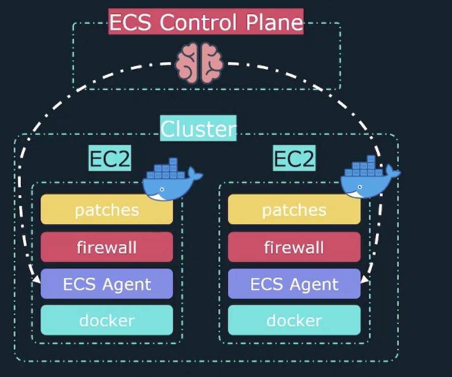
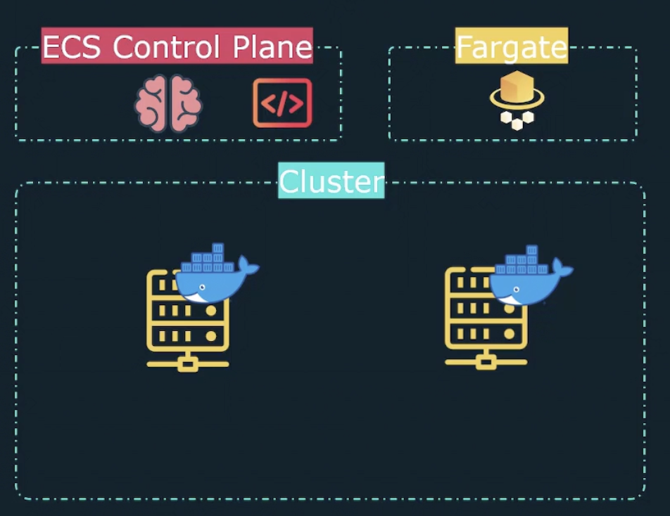
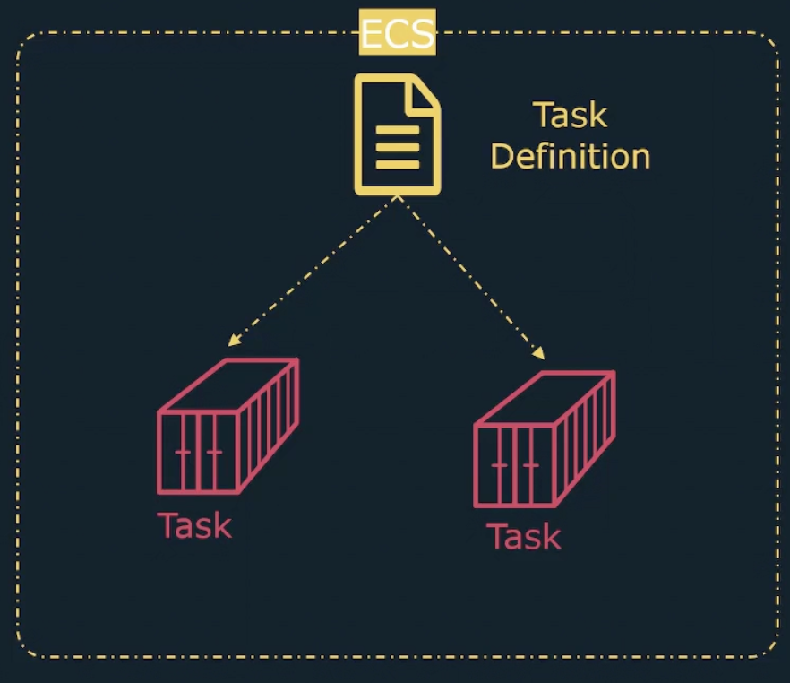
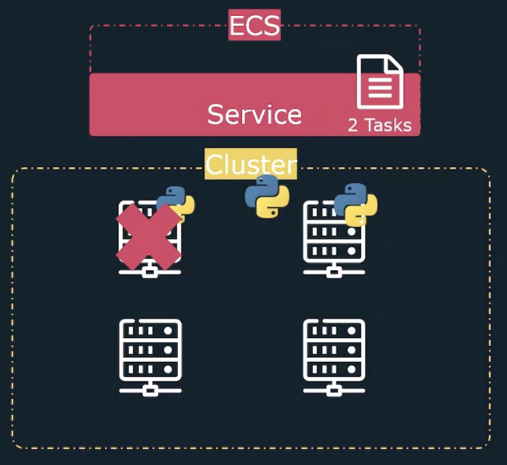
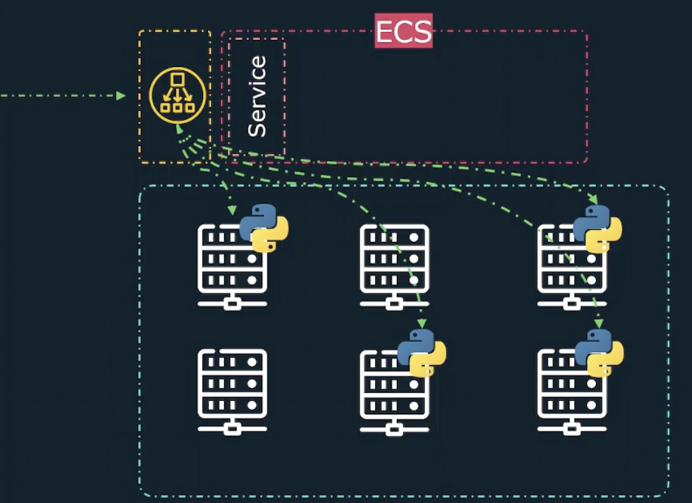

# Elastic Container Services (ECS)

ECS is nothing but a container orchestrator managed by AWS.
<mark>It will manage the container lifecycle such as creating the container, maintaining them and destroying them when needed.
ECS helps to deploy an application and load balancing between the servers.
It also helps to autoscale when the traffic is high.
Rollout of the application is also easy
(When we are updating our code and deploying the updated code without disturbing, the end user experience is straightforward via ECS).
</mark>

Let us assume that we build an application and created docker images for it.
In our environment, assume that there are three servers and our application needs to run in all these three servers.
In this case, if we run docker command to run our application, it will run only one server.
If we want to run our application in all three servers,
we need to copy the code, dockerfile and build an image in all these servers and run it.
However, they don't really know each other.
In a way, we are running our application in three different places, 
but none of the servers is aware the application runs in other servers too.

Hence, <mark>there is no orchestrator here, and if one server goes down, we need to manually up the server.
There is no way to do autoscaling when the traffic goes high.
To avoid these issues, we need an orchestrator who manages the container and monitors them.
Based on the events, it will decide what to do as the next steps and doesn't need any manual intervention.</mark>

<mark>Kubernetes, Hashicorp Nomad, Apache Mesos are such an orchestrator.
ECS is also one among them, but it is a simple version of it.</mark>

## Launch Types

There are two types of launch in ECS

1. EC2
2. Fargate

`Remember that EC2 always manage only container, NOT the actual infrastructure.`

To run the container, you need physical infrastructure like virtual machines/physical machines/docker etc.
However, ECS will not provide that infrastructure.

### EC2 Launch Type
You need a cluster which contains the virtual machines to run the containers.
It could be EC2 (Elastic compute cloud) instances as well.
However, it is your responsibility to manage all those EC2 instances.
It means you need to install the required patches, software, ECS agent, 
docker, and firewall configuration, etc. ECS will only manage the containers, and they don't do anything else.

ECS control panel is responsible to manage the container life cycle.
It will talk to ECS agent in the EC2 instance and plan the containers accordingly (create/manage/destroy containers).
You have full control as you are taking care of infrastructure.

| **Your Responsibility**                              | **ECS Responsibility**                   |
|------------------------------------------------------|------------------------------------------|
| Manage infrastructure                                | Manage containers                        |
| All installations of software, patches, firewall etc | ECS don't care anything for installation |

### Fargate Launch Type

In this launch type, we don't need to manage infrastructure. Instead, Fargate takes that responsibility. 
This is a serverless architecture that means there is no actual physical machine to run the container.
When we deploy the application in ECS,
ECS checks if there is any machine to deploy the container and there is no machine,
ECS will talk to Fargate and ask the infrastructure.
Then, Fargate will create a physical machine to deploy the container.
Hence, AWS manages the underlying resources (infrastructure).

| **Your responsibility**                  | **ECS Responsibility (AWS Fargate)**     |
|------------------------------------------|------------------------------------------|
| Create the application and deploy in ECS | Deploy the application as a container    |
| No need to manage infrastructure         | ECS/Fargate takes care of infrastructure |

Autoscaling will automatically take care of Fargate, and we need to pay as per use.

## ECS Task Definition

Task definition file is nothing but a collection of instructions
tell that how the containers should be deployed and what configuration a container should have like CPU, memory, etc. 
In short, it is a blueprint of the container.

Task is nothing but a running container created using this task definition file.
If we want to run three different instances (containers), you need to create three tasks using task definition file.

## ECS Services

ECS services ensure that the number of tasks is running all the time.This is the kind of orchestrator
who manages the tasks.
Also, it will monitor EC2 instances.
If any of the EC2 instances fails,
then it will create a task using task definition file and run it in working EC2 instance.

## ECS Load balancer

Load balancer will route the traffic to the containers via services.
This will help us to ensure all the containers are sharing the load and also autoscaling when the demand increases.

