# Deploy an app in ECS

Let us deploy a small python flask application in ECS.

The application is just printing the content in the browser.
We will build the docker image and push it to docker hub registry and run it in ECS.

`flask-app.py`
```html
from flask import Flask
app = Flask(__name__)

@app.route("/")
def hello():
    return "Hello Satheesh from flask app"

if __name__ == "__main__":
    app.run(host="0.0.0.0", port=5001)
```

`Dockerfile`

```html
# Use the official Python image from the Docker Hub
FROM --platform=linux/amd64 python:3.9-slim as build

# Set the working directory inside the container
WORKDIR /app

# Copy the current directory contents into the container at /app
COPY ./flask-app.py .

# Install Flask inside the container
RUN pip install Flask

# Expose the port the app runs on
EXPOSE 5001

# Run the application
CMD ["python", "flask-app.py"]
```

Let us build the docker image using `docker build -t satheeshpandianj/hello-flask:v1 .` command.

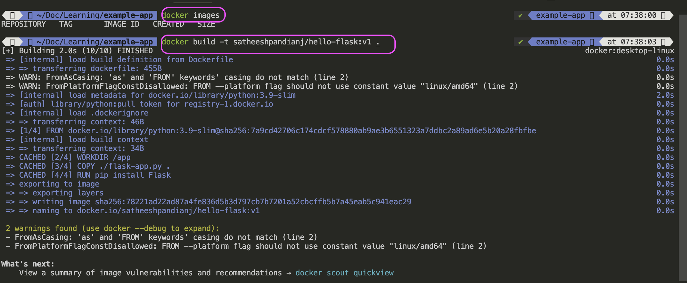


Let us
push the docker image into docker hub registry using `docker push docker.io/satheeshpandianj/hello-flask:v1` command.


Check the docker hub registry if the docker image is available.


Now it is the time to deploy the application image in ECS.

## Steps to deploy an application in ECS

1. Navigate to ECS in AWS console


2. Create a cluster. Click on the "Create cluster" button.

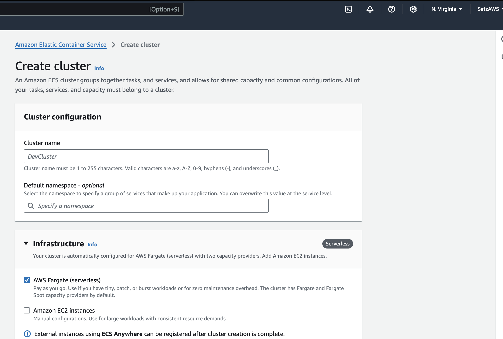

3. Fill the details in the section.  Under the infrastructure section, select "AWS Fargate (serverless)" option. 
Keep as it is for the other options.

4. Click on the "Create" button.


Now the cluster is created successfully. 

5. Let us create the task definition. Click on "Task definition" on the left side menu.


6. Click on "Create new task definition." Fill the form as per the below snapshots.

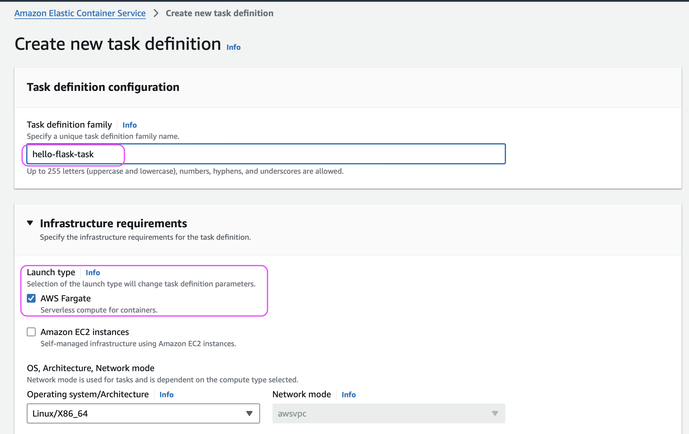

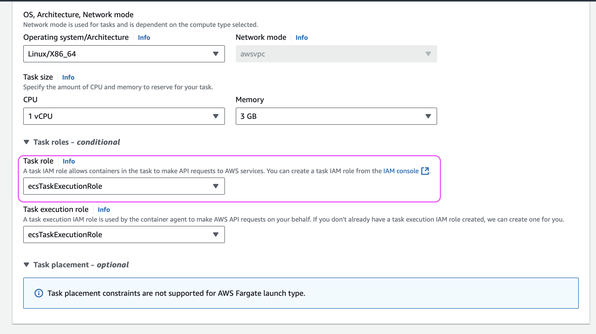

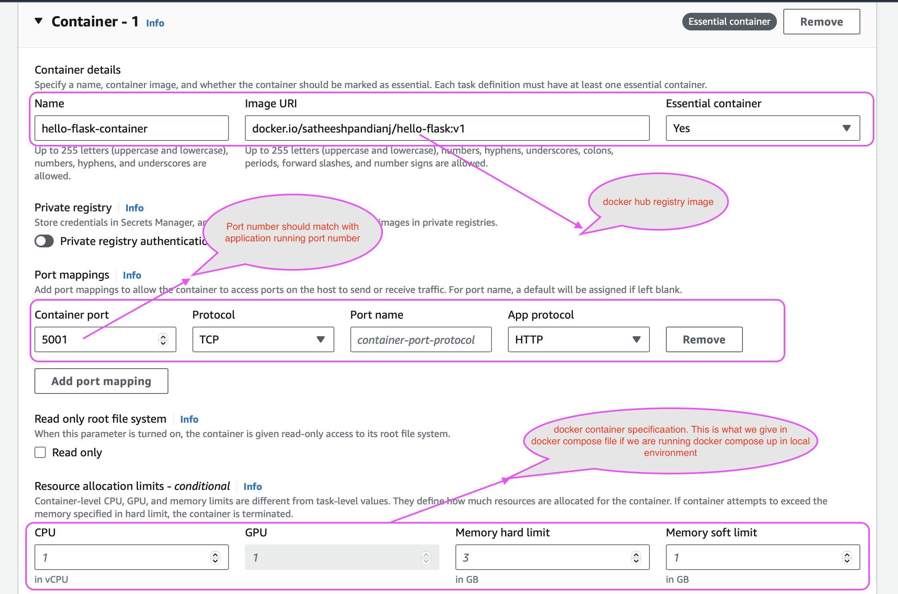

Then, click on the "Create" button. Now the task definition is created.

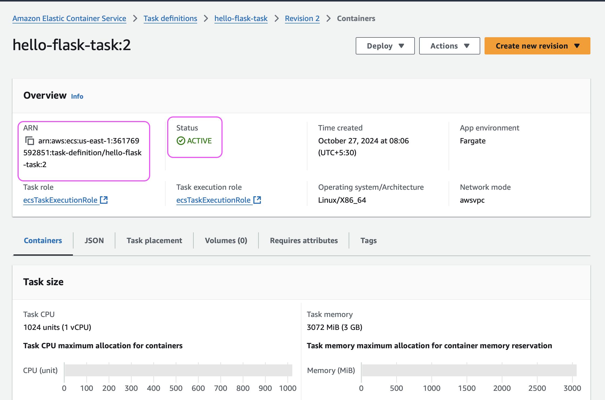

7. Run the task. Click on "Deploy" and select "Run task" 


8. Select the cluster (we created this at step # 4).

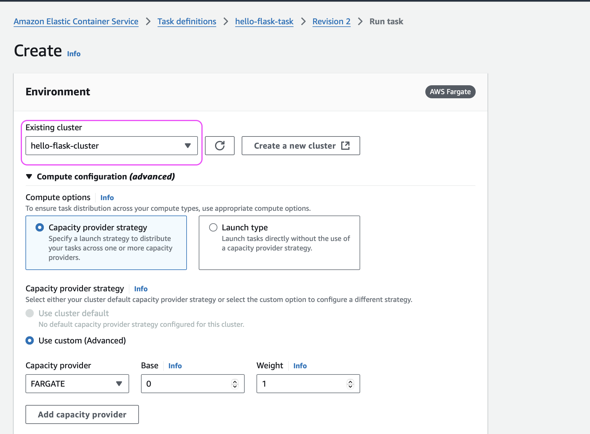

Select the VPC, Subnet, security group based on your needs.

`Remember that security group inbound rule should contain the container port configuration.`


9. Click on the "Create" button.

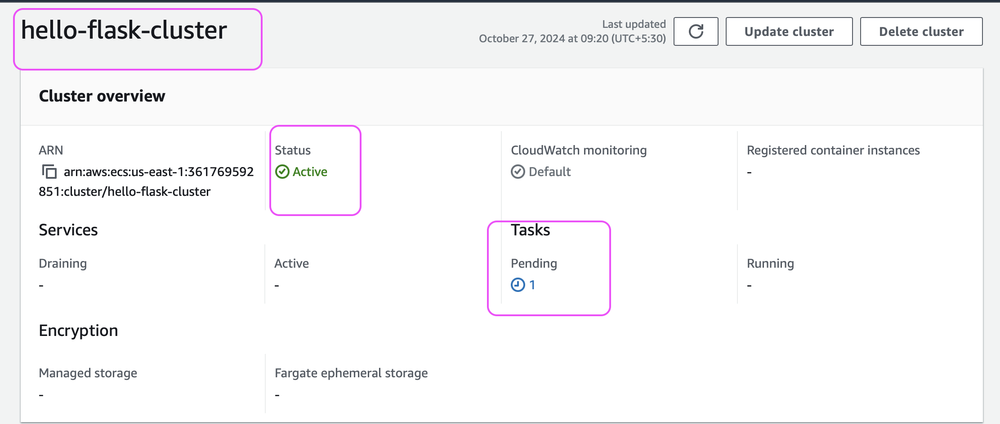

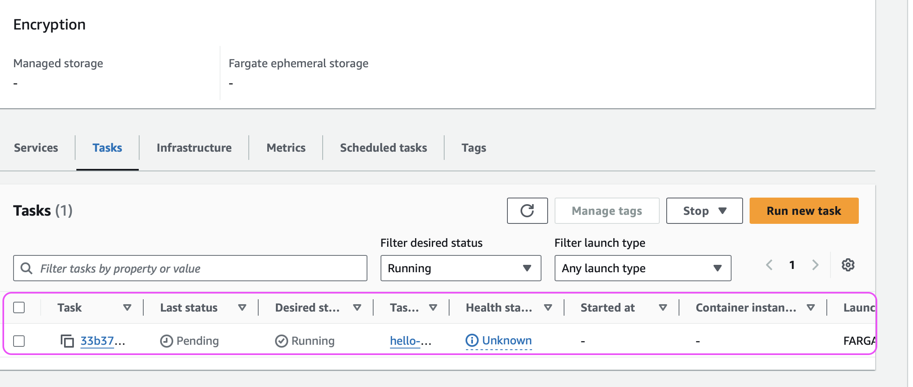

10. Click on the task. Note down the public IP address. This IP address changes every single time.

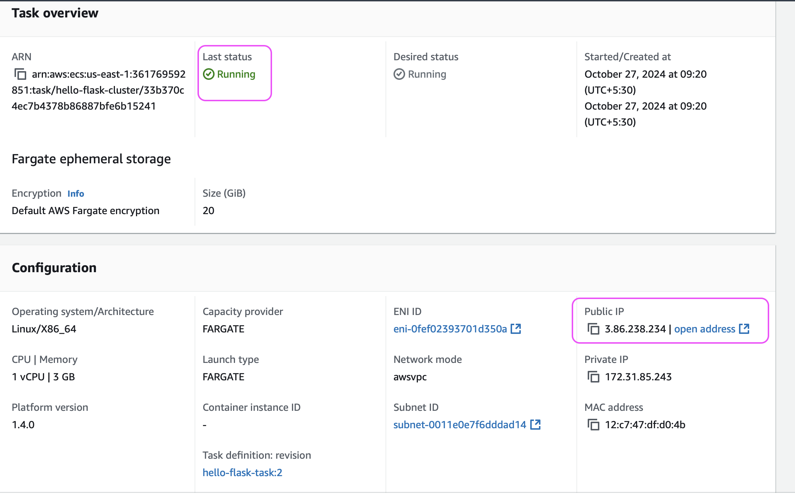

11. Open the browser and enter the public IP address along with container port number and hit enter button


**NOTE:** 

<mark>
In general, we need to create the service first and map the task under service.
We need to run the service instead of the task directly.
This is the right way to run the container.
</mark>

`Remember that if we are running multiple tasks under a service, each task has unique IP address`

## Update the code and deploy it without any disturbance of end user

Let us say that our application is already running in ECS containers, and we are updating the new feature in the 
current code. We want to deploy the updated code in ECS without stopping the running containers. 

`flask-app.py`

```html
from flask import Flask

app = Flask(__name__)

@app.route("/")
def hello():
    return "Hello, I am working in AWS ECS with my updated code"

if __name__ == "__main__":
    app.run(host="0.0.0.0", port=5001)
```

`Dockerfile` - There is no change in the Dockerfile.

```html
# Use the official Python image from the Docker Hub
FROM --platform=linux/amd64 python:3.9-slim as build

# Set the working directory inside the container
WORKDIR /app

# Copy the current directory contents into the container at /app
COPY ./flask-app.py .

# Install Flask inside the container
RUN pip install Flask

# Expose the port the app runs on
EXPOSE 5001

# Run the application
CMD ["python", "flask-app.py"]
```

1. Build the new docker image with updated code

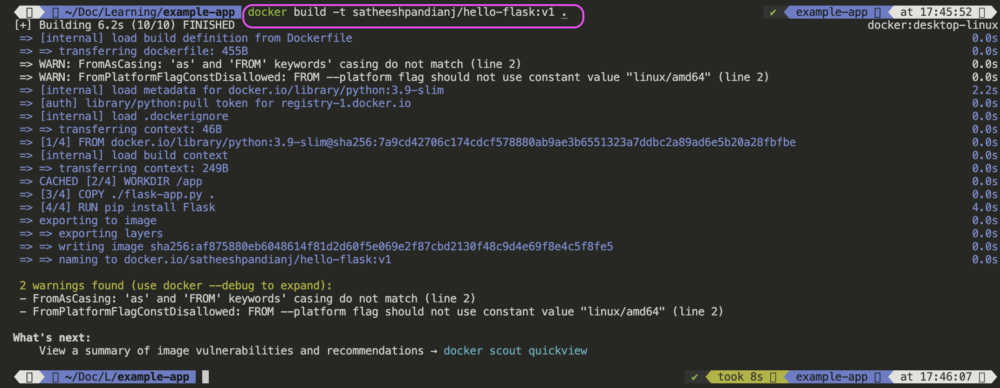

2. Push the docker image to the docker hub registry


3. Check if newly created image is available in docker hub registry.


4. Go to AWS console and open the cluster where ECS containers are running.

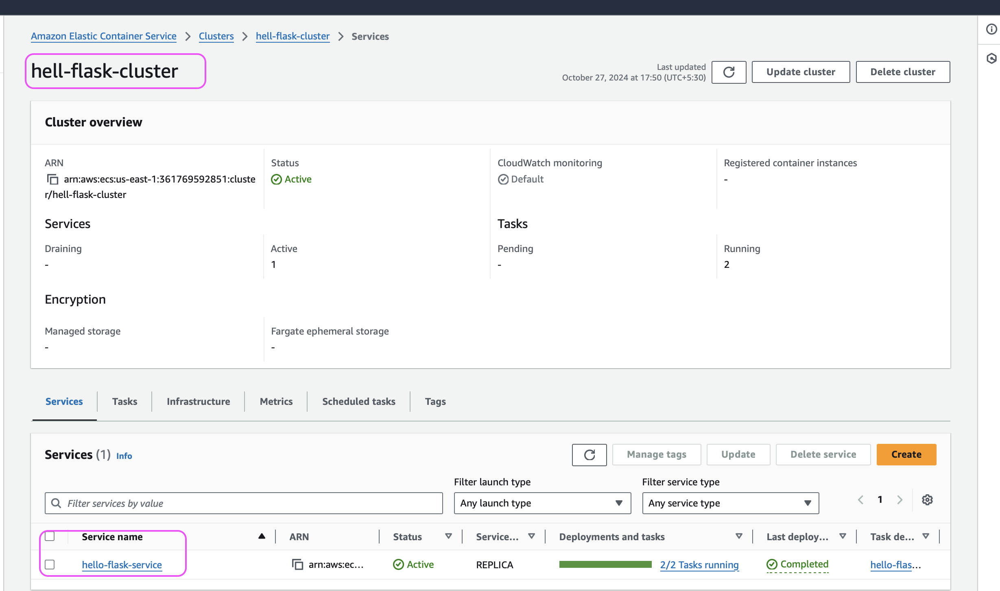

5. Select the service and click on the "Update" button


6. Check the "Force deployment" option. If there are any changes in the container setting, do update it. Else, keep it as it was.

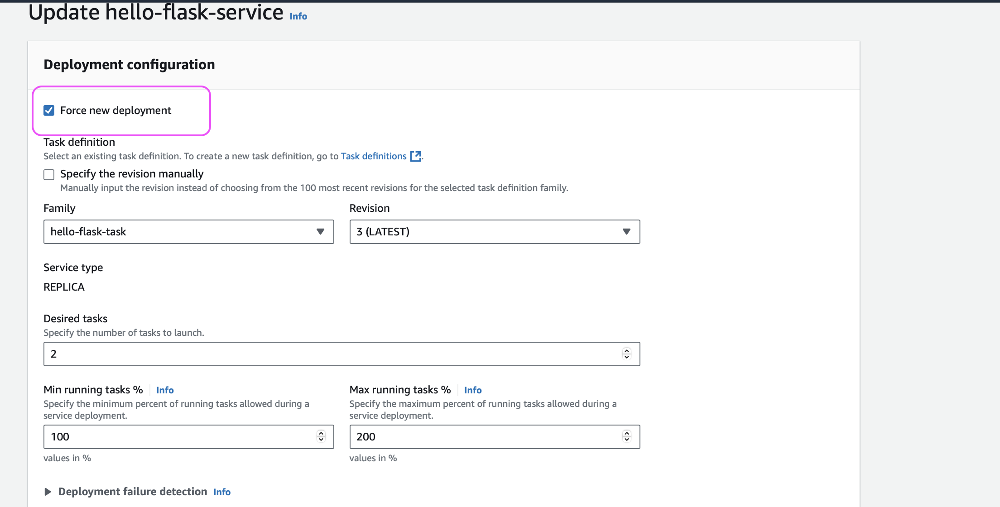

7. Click on the "Update" button. This will create different tasks under the task tab. 

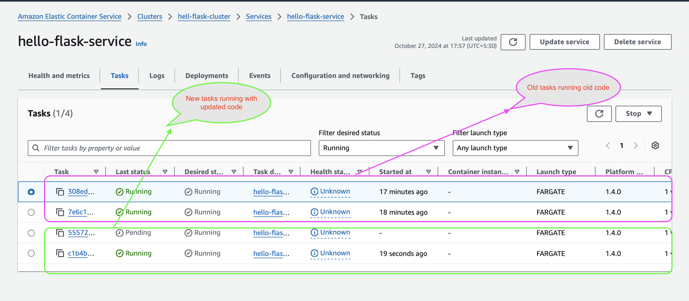

After the new tasks are created, old tasks will be deleted automatically

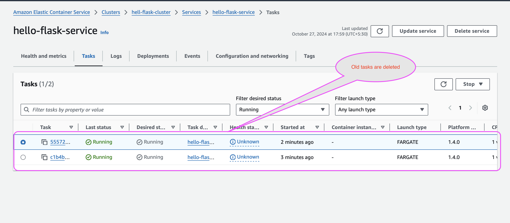

8. Open the task and note down the public IP address.

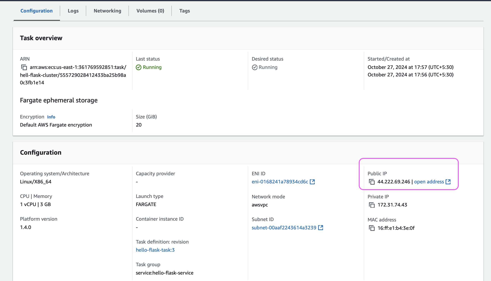

9. Open the browser and enter the public IP along with port number.


10. Step # 8 and 9 will repeat for another task (Remember we create two different tasks)


`If you look at the public IP address for both the tasks, they are different.`


