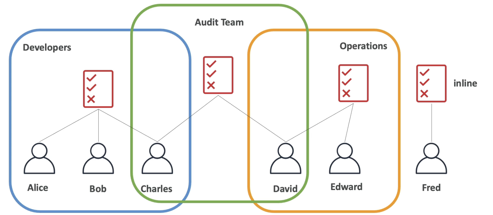

# IAM (Identity and Access Management)

IAM is a global service in AWS.
We can create users and these users can be grouped as well.
User can belong to the multiple groups, and the permission can be aggregated in this case.
At the same time, user cannot be part of any group either. 

`Group should have only users, not any other group.`

## Permission (Policy)

IAM permission is nothing but a policy document assigned to the user or group.
This is just a JSON document that describes what the user or group can do or cannot do.

`Remember that you have to follow least privileage to the user in AWS. Do not give more permissions to the user than what they really needed`


## Creating Group

1. Go to IAM service. Click on 'User Groups' menu.


2. Click on 'Create Group' button


3. Enter the group name and select the predefined policy based on your requirement. Here I am selecting administrator 
policy that has full access.


4. Click on 'Create Group' button


## Creating User

1. Go to IAM service. Click on 'Users' menu.


2. Click on 'Create User' button


3. Enter the username and click on 'Next' menu.


4. Here we are creating the new user and mapping the user with 'admin' group. It means that the new user has all 
the permissions provided to the group 'admin'

Select the permission option and choose the group. Click on 'Next' button.


5. Click on 'Add tag' button


6. Click on 'Create user' button


Now the user is created and this user is part of 'admin' group.


7. Create the password for newly created user. Click on the username and then click on 'Security Credential' tab.
Click on an 'Enable console access' button.


8. Select a custom password option and then enter the password. Click on an 'Enable console access' button.


`Now, the user is created and have a console access. This user can login using his/her IAM username and password`

## IAM Policy Inheritance


Assume that there are three different groups (Developers, Audit, Operations)
and six team members (Alice, Bob, Charles, David, Edward and Fred) are part of those groups. 



Each group has different policy and hence they have different access to the services.
User `Fred`  is not part of any group, and he has his own permission.
Users 'Charles and David' belong to two different groups, and they have both group policy access as well.

## IAM Policy Structure

Policy defines what action user can perform on the services.

| **Name**  | **Description**                                  |
|-----------|--------------------------------------------------|
| Version   | Always "2012-10-17"                              |
| Statement | One or more statements required                  |
| Sid       | Can be anything (optional)                       |
| Effect    | Either "Allow" or "Deny"                         |
| Principal | User/Group/Account to the policy applied to      |
| Action    | List of actions can be performed on the services |
| Resource  | What kind of actions applied to the resources    |
| Condition | Condition when the policy is effect              |


## Creating Policy

I am creating the new user, and this user is not part of any group. We can define the policy what this new user can do.


As of now, the user 'pandian' is created and there is no policy attached to this user.


Now I am trying to view the users created so far using the newly created user 'pandian'
It clearly shows that this new user 'pandian' doesn't have permission to view the user list (Access denied).


Now, let us give the permission to get and list the users for 'pandian'.
To do this, you need to log in with admin-privileged user.
Click on the username 'pandian' and click on 'Add permission' dropdown menu.


Click on 'Add permission' button


Choose 'Attach policies directly' option. Search 'IAMReadOnlyAccess' policy.


Click on 'Next' button. Review the details and Click on 'Add permission' button.


Now the newly created user 'pandian' has one policy attached to it.


User 'pandian' is able to view the user list now. But he cannot create any group or user.


## Create inline policy

Let us give the permission to get and list the users for 'pandian'.
To do this, you need to log in with admin-privileged user.
Click on the username 'pandian' and click on 'Add permission' dropdown menu.


Click on 'Create inline policy' button


Select the services from the dropdown.
Choose the access level (List/Read/Write/Permission Management/Tagging) for the service.


Enter the policy name, and click on 'create policy' button.


## Create User, Group, Policy in AWS CLI

**Prerequisite**

1. AWS cli should be installed.
2. AWS access key should be created.
2. AWS configure should be done. 


### Create Access Key

1. Create the access key for IAM user.

Let us create an access key for the user 'satheesh'.


2. Click on the 'create access' button.
3. Select 'CLI' option and click on 'Next' button.


4. Click on 'create access key' button


5. Note down the access key and secret key. This will be used for configuration.

### AWS Configuration Steps

1. AWS CLI installed already on my machine. Refer "https://docs.aws.amazon.com/cli/latest/userguide/getting-started-install.html" for the steps.


2. Execute `aws configure` command. Provide the required details like access key, secret key, region and output format.


Now, it is configured. We can run any aws command from the terminal.

### Create User

1. Run the command

```html

aws iam create-user --user-name <UserName>

```

```html
aws iam create-user --user-name praba

```


    

2. Attach the IAM policy to the user

```html
aws iam attach-user-policy --user-name <UserName> --policy-arn arn:aws:iam::aws:policy/<Policy name>
```

```html
aws iam attach-user-policy --user-name praba --policy-arn arn:aws:iam::aws:policy/IAMReadOnlyAccess
```


3. Verify the user

```html
aws iam list-users
```


### Create Group

1. Run the command

```html

aws iam create-group --group-name <GroupName>

```

```html
aws iam create-group --group-name sre-team-members

```


    

2. Attach the IAM policy to the group

```html
aws iam attach-group-policy --group-name <GroupName> --policy-arn arn:aws:iam::aws:policy/<Policy name>
```

```html
aws iam attach-group-policy --group-name sre-team-members --policy-arn arn:aws:iam::aws:policy/IAMFullAccess

```


3. Add the user to the group

```html
aws iam add-user-to-group --group-name <GroupName> --user-name <UserName>
```

```html
aws iam add-user-to-group --group-name sre-team-members --user-name praba
```


4. Verify the group

```html
aws iam list-groups
```


### Create Policy

1. Define the policy in the JSON format.  Below policy gives full access to IAM service

`policy.json`

```html
{
  "Version": "2012-10-17",
  "Statement": [
    {
      "Effect": "Allow",
      "Action": "iam:*",
      "Resource": "*"
    }
  ]
}
```


2. Create policy

```html
aws iam create-policy --policy-name my-iam-full-access-policy --policy-document file://policy.json

```


3. Verify the policy

```html
aws iam list-policies
```


## IAM Roles

If some of the AWS services want to perform some action on our behalf,
then we need to assign permission to those services.
This permission is called as 'Roles'.


### Create Role

1. Go to IAM service. Click on the 'Roles' menu.


2. Select the service and click on 'Next' button


3. Select the policy and click on 'Next' menu.


4. Enter the role name and click on 'Create role' button.


Now the role is created.

### Create Role using AWS CLI

1. Define policy

`policy.json`

```html
{
  "Version": "2012-10-17",
  "Statement": [
    {
      "Effect": "Allow",
      "Principal": {
        "Service": "ec2.amazonaws.com"
      },
      "Action": "sts:AssumeRole"
    }
  ]
}
```

2. Create the role

```html
aws iam create-role --role-name <RoleName> --assume-role-policy-document file://trust-policy.json
```

```html
aws iam create-role --role-name my-ec2-role --assume-role-policy-document file://policy.json
```


3. Attach a Policy to the Role

```html
aws iam attach-role-policy --role-name <RoleName> --policy-arn arn:aws:iam::aws:policy/AmazonS3FullAccess
```

```html
aws iam attach-role-policy --role-name my-ec2-role --policy-arn arn:aws:iam::aws:policy/AmazonS3FullAccess
```


4. Verify the Role

```html
aws iam get-role --role-name <RoleName>
```

```html
aws iam get-role --role-name my-ec2-role
```


## IAM Security Tools

1. IAM Credential Report (Account level) - Report the list of users and their current status in account level.
2. IAM Access Advisor (User level) - Shows the service permission for each user and when the user last accessed the service.

