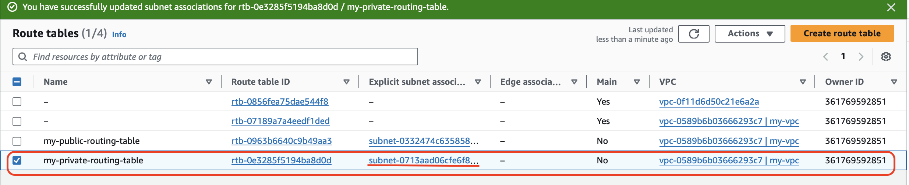

# Creating Virtual Private Cloud (VPC)

To create VPC in AWS, there are steps to follow.

1. Create VPC and assign the CIDR block 
2. Create two subnets (one for public and one for private) in two different availability zones and assign the CIDR block for both subnets
3. Create Internet Gateway and attach it to VPC
4. Create two routing tables (one for public and one for private) and attach them with respective subnets
5. Map routing table created for public subnet with Internet Gateway
6. Create two security groups (one for public and one for private).
7. Update the inbound rules for a public security group and allow access to `0.0.0.0/0` for SSH, HTTP, HTTPS, RDP. 
8. Update the inbound rules for a private security group and allow access to a public security group created at step # 4
9. Create two EC2 instances (one for public and one for private) and map the respective security group
10. Login into EC2 instance created in public subnet and check the internet connectivity. This should connect the internet
11. Login into EC2 instance created in private subnet
    (You cannot log in directly as it is private. You have to connect public EC2 instance and from there,
    you can connect private EC2 instance) and check the internet connectivity. This should not connect the internet
12. Create NAT Gateway and attach it private routing table
13. Check if Elastic IP created
14. Login into EC2 instance created in private subnet and check the internet connectivity. This should connect the internet

Let us explore the steps now.

## 1. Create VPC and assign the CIDR block 

To do so, open the VPC services and click on the "Create VPC" button

Update the fields as per snapshot. Then click on the "Create VPC" button.

 ## 2. Create two subnets (one for public and one for private) in two different availability zones and assign the CIDR block for both subnets

To do so, click on the "Subnets" menu and click on the "Create Subnet" button.

Update the fields as per snapshot. This is for public subnet

Click on the "Create Subnet" button

Update the fields as per snapshot. This is for private subnet

Click on the "Create Subnet" button

## 3. Create Internet Gateway and attach it to VPC

To do so, click on the "Internet gateways" menu and click on the "Create internet gateway" button.

Update the fields as per snapshot.

Click on the "Create internet gateway" button

Select the internet gateway created and click on the "Action" dropdown menu

Click on the "Attach to VPC" option

Select the VPC (we created in the step # 1) and click on the "Attach internet gateway" button

## 4. Create two routing tables (one for public and one for private) and attach them with respective subnets

To do so, click on the "Route tables" menu and click on the "Create route table" button.

Update the fields as per snapshot. This is for public subnet.

Click on the "Create route table" button

To do so, click on the "Route tables" menu and click on the "Create route table" button.

Update the fields as per snapshot. This is for private subnet.

Click on the "Create route table" button

#### Attach routing table with respective subnets

To do so, select the public routing table and click on the "Subnet Association" tab

Click on the "Edit subnet association" button

Select the public subnet created and click on the "Save association" button

Repeat the same steps for private routing table.

## 5. Map public routing table with Internet Gateway

To do so, click on the "Route tables" menu and select the public routing table

Click on the "Routes" tab

Click on the "Edit routes" button

Click on the "Add route" button, and the destination value is "0.0.0.0/0," select the "internet gateway"
and then select the internet gateway we created from the option.

Click on the "Save changes" button.

## 6. Create two security groups (one for public and one for private).

To do so, click on the "Security group" menu and click on the "Create security group" button

## 7. Update the inbound rules for a public security group and allow access to `0.0.0.0/0` for SSH, HTTP, HTTPS, RDP. 

Update the fields as per snapshot and click on the "Add rule" button for inbound rules.
This is for public security group.

Add the rules as per screenshot.

Click on the "Create security group" button

Click on the "Security group" menu and click on the "Create security group" button

## 8. Update the inbound rules for a private security group and allow access to a public security group created at step # 4

Update the fields as per snapshot and click on the "Add rule" button for inbound rules.
This is for private security group.

Add the rules as per snapshot.

Click on the "Create security group" button

## 9. Create two EC2 instances (one for public and one for private) and map the respective security group

To do so, open the "EC2" service. Click on the "Launch instance" button. This is for public instance

Update the fields as per snapshot. 

Create a new key pair for secured login.

Under network settings, click on the "Edit" button and update the details as per snapshot.

Click on the "Launch instance" button

Open the "EC2" service. Click on the "Launch instance" button. This is for private instance

Update the fields as per snapshot

Create a new key pair for secured login.

Under network settings, click on the "Edit" button and update the details as per snapshot.

Click on the "Launch instance" button

## 10. Login into EC2 instance created in public subnet and check the internet connectivity.

Connect the public EC2 instance via terminal.

Now, check if you are able to connect `google.com`. You are able to connect the `google.com` website.

## 11. Login into EC2 instance created in private subnet

You cannot log in directly as it is private. You have to connect public EC2 instance and from there, 
you can connect private EC2 instance

To do so, create the filename "my-private-ec2-instance-key.pem" in public EC2 instance.
Copy the content from key created for private EC2 instance to this above file.
Update the file permission.

Now, check if you are able to connect `google.com`. You are unable to connect the `google.com` website.

## 12. Create NAT Gateway and attach it private routing table

To do so, open "VPC" services, click on the "NAT gateway" menu. Click on the "Create NAT gateway" button

Update the fields as per snapshot.
Remember to choose public subnet because the internet will be provided from public to nat gateway.
Then click on "Allocate Elastic IP" button.

Click on the "Create NAT gateway" button.

## 13. Check if Elastic IP created

Elastic IP will be automatically created now. This IP address will act as frontend for private subnets.

### Attach NAT gateway with private routing table

Open the private routing table and click on "Route" tab. Then click on the "Edit routes" button.

Update the fields as per snapshot.

Click on the "Save changes" button

## 14. Login into EC2 instance created in private subnet and check the internet connectivity.

Connect public EC2 instance and check the internet connection

Connect private EC2 instance from public EC2 instance and check the internet connection

Now the internet is flowing from end use to public EC2 and from public EC2 to private EC2 instance.

