# Virtual Private Cloud (VPC)

Before knowing AWS VPC, we need some basic understanding of networking. Let us understand the OSI model now.

# OSI Model (Open Systems Interconnection)

There are seven different layers in the OSI model.

1. Physical layer

This is just a physical components such as ports where a plug connects, cable etc. 
You have network interface card (NIC) that connects the port via network adapter.
The communication happens using electronic signals and bits (0 and 1).

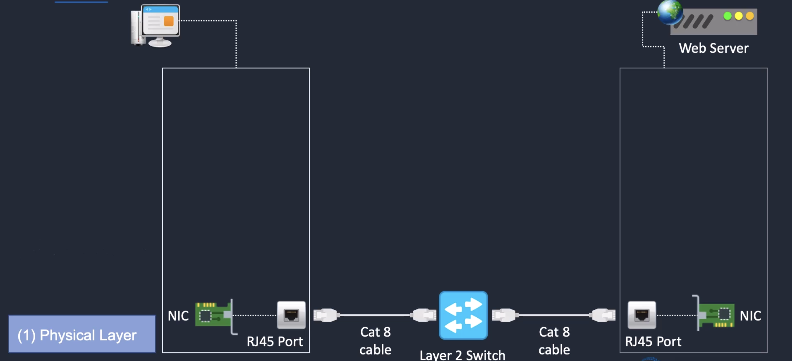

2. Data link layer

We have MAC address, switches, ethernet protocol in layer 2.
There is a unique address associated with NIC called as media access control (MAC) address.
Ethernet is the protocol used in layer 2 (DLL), and it is also referred as 802.1x. 
Switches is used to connect two different devices using its MAC address.
Switch creates MAC address table like below to know where the MAC address is and which port it is associated with.

| **Address** | **Port No** |
|-------------|-------------|
| MAC1        | Port1       |
| MAC2        | Port2       |

Based on the above details, the connection is made from one port to another port.

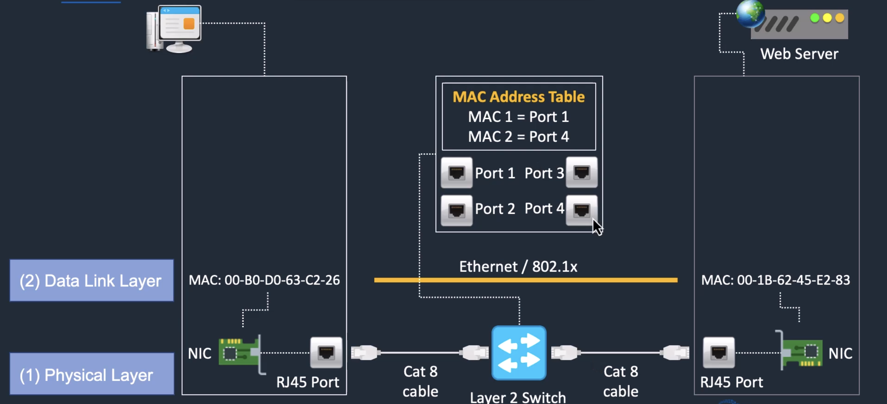

3. Network layer

We have IP address, routers and routing protocol (ICMP - Internet Control Message Protocol) in this layer. All the routing infrastructure available in layer 3. 
Routers route the traffic based on IP address and their associated interface.
Routers maintain the routing table like below

| **Destination** | **Interface** |
|-----------------|---------------|
| 10.0.0.1        | eth0          |
| 10.4.6.4        | eth1          |

Interfaces associated with different network and routers routing the traffic based on IP address and its interface.

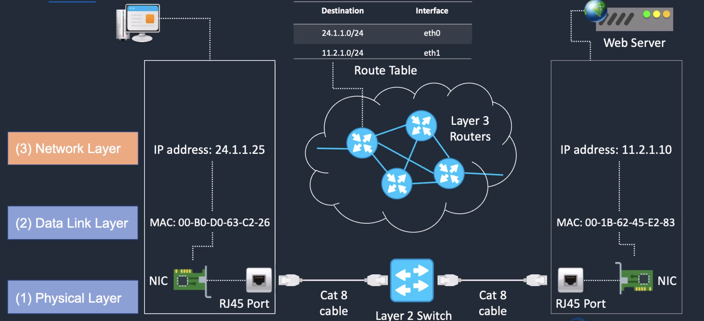

4. Transport layer

We have TCP (Transmission Control Protocol) protocol in this layer and is associated with IP address.
It is a connection oriented protocol.
It is a three-way handshake, and the connection is established in this layer.
Source sends a request named as "SYN" - synchronise your sequence bits
(first-way) and gets the acknowledgment back from destination named as "SYN-ACK.(second-way)"
Then the source sends the acknowledgment named as "ACK" (third-way) and the connection is made between source and destination.
This will constantly check the connection is working and run correctly. 

We have UDP (User Datagram Protocol) as well in this layer, and it is connectionless.
This is splits the data and sends them. There is no tracking of the data sent. But it will not be sure if it reaches in 
the destination.

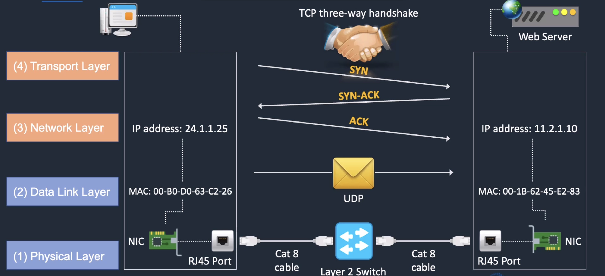

5. Session layer

We have TCP and RPC (Remote Procedure Call) in this layer, and the interhost communication happens in this layer.

6. Presentation layer

We have SSL (Single Socket Layer), SSH (Secure Shell), FTP (File Transfer Protocol) in this layer.
It is all about the data encryption and data representation in this layer.

7. Application layer

We have HTTP, FTP, SSH, DNS in this layer. It's all about the network services to the end user application.

| **Layer**    | **Component** | **Protocol/Components** | **Communication**                       |
|--------------|---------------|-------------------------|-----------------------------------------|
| Physical     | Bits          | Fiber, Cable, Wireless  | Media, signal, binary transmission      |
| Data link    | Frames        | Ethernet, 802.1x        | Physical addressing (MAC)               |
| Network      | Packets       | IP, IP security, ICMP   | Path determination (Routing)            |
| Transport    | Segments      | TCP, UDP, TLS           | End to end connection and reliability   |
| Session      | Data          | TCP, RPC                | Interhost communication                 |
| Presentation | Data          | SSL, FtP, HTML, SSH     | Data representation and encryption      |
| Application  | Data          | HTTP, FTP, DNS, SSH     | Network services to end use application |

## TCP Encapsulation

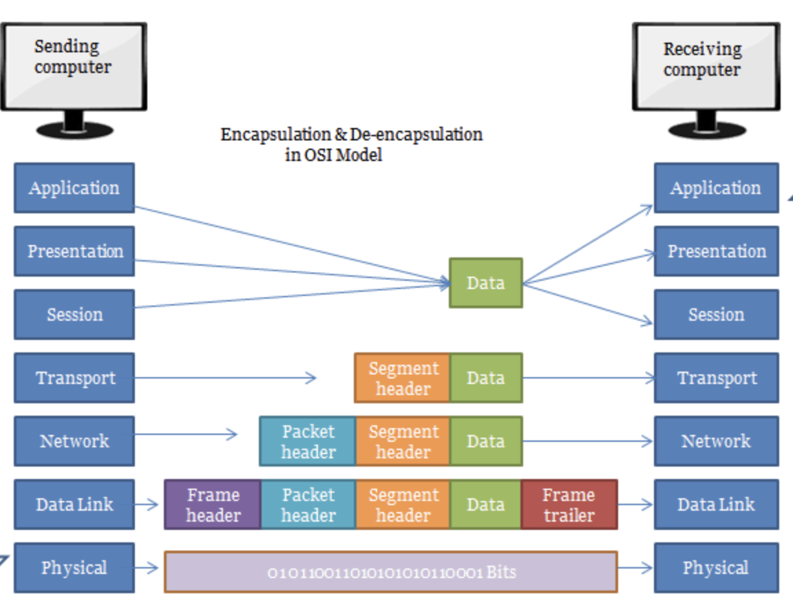

One computer wants to send some data to another computer.
The data is from layer 5–7 splits into chunks and put into layer 4 (Transport layer).
Transport layer added the TCP header which contains the port number to connect.
Then it goes to the network layer.
In the network layer, IP header is added to the data, and it forms the packets.
IP header has all the destination details.
Then it goes to the data link layer.
It adds an Ethernet header and puts it in to the network.
Then the data goes to the physical layer where it converts to bits,
and the process will be reversed once it reaches the destination.

## Routers, Switches and Firewall

Network is nothing but the connection between computers. Computers are connected via switches in the network.

If there are two different networks (IP address range is different), then they are connecting via routers.
Routers maintain the routing table associated with IP address and its interface.
Based on it, it will connect two different networks. 

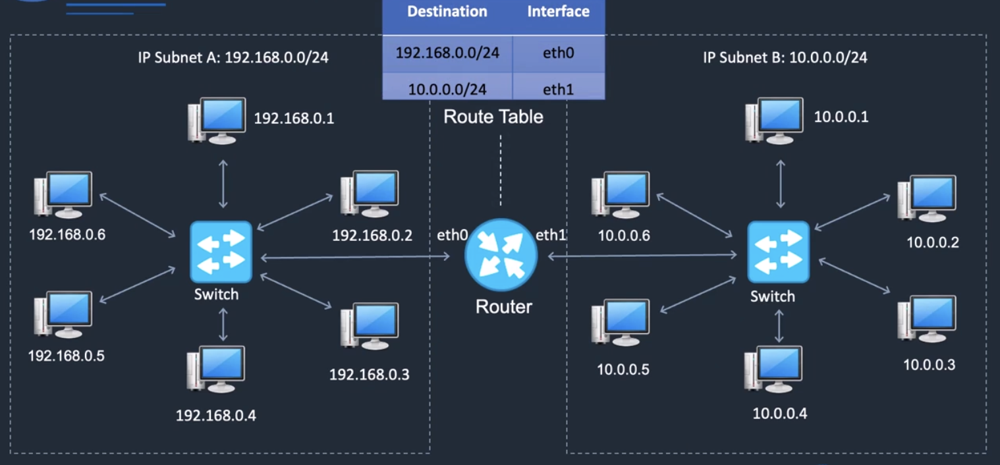

In the above picture, Subnet A and Subnet B have different IP address range.
Subnet A connects Subnet B using routers using its interface information maintained in the routing table.

Firewall is a security devices.
It checks the incoming and outgoing traffic in our network and filters them if it meets certain rules.
Firewall rules are maintained in a table, and that will decide if the traffic is allowed or denied based on the protocol,
source and destination.

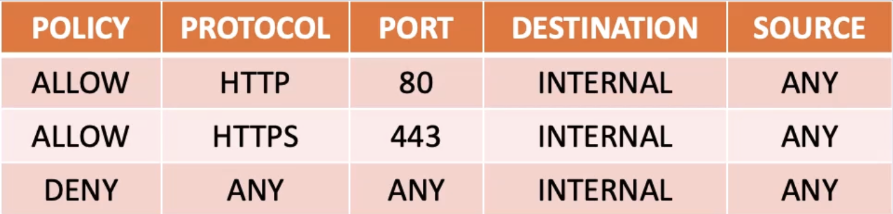

Firewall can be placed in different layers in the OSI model.
It can be placed in the server level such as EC2 instance security group. 

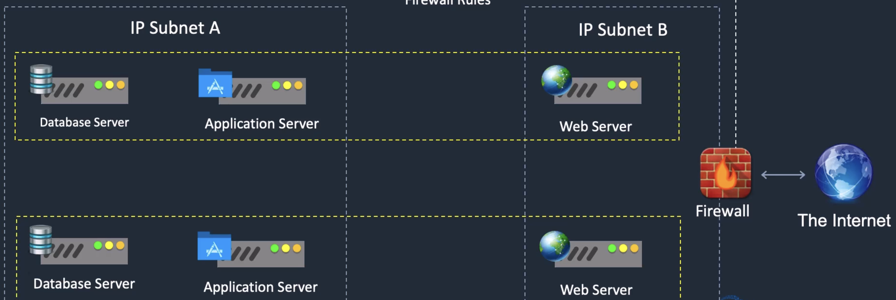

## Structure of IP Address

IP address written in dotted decimal notation. Each number is a binary octave, and it should be between 0 and 255.
IP address has network id and host id.
If the IP address is 193.5.6.93, then 193.5.6 is network id and 93 is host id.

**Example**

193.5.6.8 is correct IP. 10.245.344.53 is not correct IP as it has a binary octave value more than 255.

### CIDR - Classless Inter-Domain Routing 

It is a method of allocating IP address for IP routing.
Let us assume that there are 100 machines available in a network, and we want to assign IP address to all of them.
Remember, IP address is unique across the world.
In a network, network id is constant (unless its range is exceeded), and host id will vary based on the 
number of machines available in a network.
If we want to assign IP address from 195.8.4.0 to 195.8.4.99 to all 100 machines, then we can update like 195.8.4.0/`<value>`.

`value` decides the number of IP addresses. 

### How IP address (IPv4) forms

Let us understand how the IP address forms first. As we know, IP address is a binary octave, and its 32 bits.

`00110001.00100101.11011010.00001101` is actual IP address in the network (All are in 0 and 1 - binary).

Let us split the individual octave and form the number. Consider the first octave

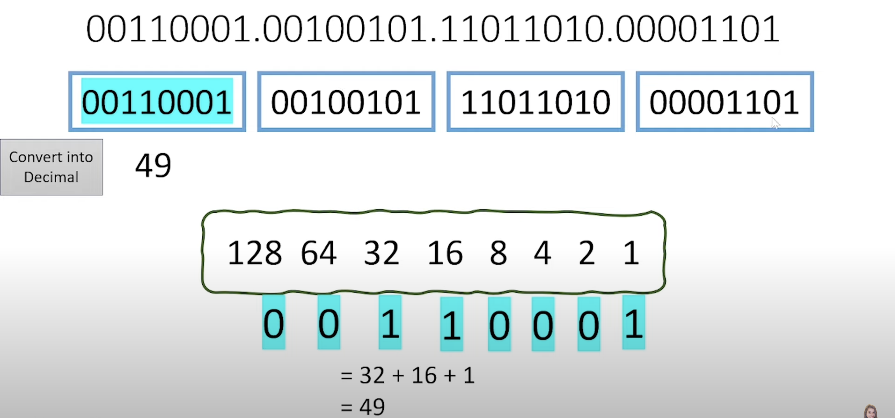

Similarly, we calculated for other three octaves as well.

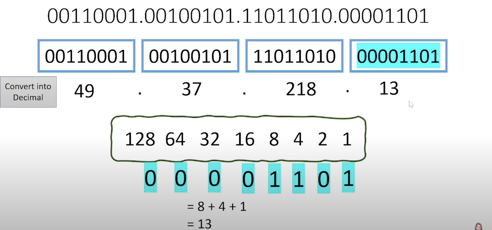

So the final IP address (IPv4) is `49.37.218.13`

### How many numbers of IP addresses (IPv4) decide in a network?

As it is an octave (eight digits), the bits are defined as 8 + 8 + 8 + 8 = 32 bits (Maximum value is 32).
So, if the IP address is mentioned as `49.37.218.0/32`, it means that there is only one IP address `49.37.218.0`
If the IP address is mentioned as `49.37.218.0/31`, it means that there are two IP addresses `49.37.218.0` and `49.37.218.1`.
`The pattern is 2 to the power of (32 - value after /).`

For example, the IP address is mentioned as `49.37.218.0/24`, then it is calculated as `32-24 = 8`.
The number of IP addresses is 2 to the power of 8 which is 256. So the IP address range is `49.37.218.0 to 49.37.218.255`

| **CIDR value** | **Number of IP Address** | **IP Address Range**                                                                               |
|----------------|--------------------------|:---------------------------------------------------------------------------------------------------|
| 49.37.218.0/32 | 1                        | 49.37.218.0                                                                                        |
| 49.37.218.0/31 | 2                        | 49.37.218.0 to  49.37.218.1                                                                        |
| 49.37.218.0/30 | 4                        | 49.37.218.0 to  49.37.218.3                                                                        |
| 49.37.218.0/29 | 8                        | 49.37.218.0 to  49.37.218.7                                                                        |
| 49.37.218.0/28 | 16                       | 49.37.218.0 to  49.37.218.15                                                                       |
| 49.37.218.0/27 | 32                       | 49.37.218.0 to  49.37.218.31                                                                       |
| 49.37.218.0/26 | 64                       | 49.37.218.0 to  49.37.218.63                                                                       |
| 49.37.218.0/25 | 128                      | 49.37.218.0 to  49.37.218.127                                                                      |
| 49.37.218.0/24 | 256                      | 49.37.218.0 to  49.37.218.255                                                                      |             
| 49.37.218.0/23 | 512                      | 49.37.218.0 to  49.37.218.255  49.37.<mark>**219.0**</mark> to  49.37.<mark>**219.255**</mark> |
| ...            | ...                      | ...                                                                                                |
| 49.37.218.0/1  | 2147483647               | This range is too long. Hence, it is not updated here                                              |

### How IP address (IPv6) forms

As you know, IPv4 is 32 bits in size. However, IPv6 is 128 bits in size.  

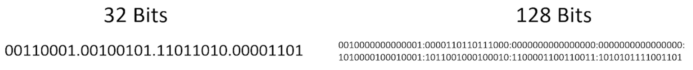

Hence, all the binary numbers need to be converted into hexadecimal to form an IP address.

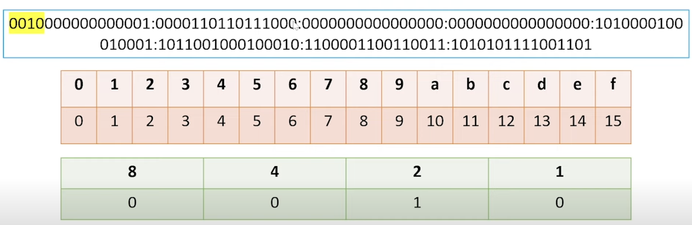

So in the above case, the ip address is `2001:0db8:0000:0000:a111:b222:c333:abcd`

There are rules to follow in IPv6.

1. If IP address has `0000:0000`, then it can be written as `::`
2. If IP address has `0000`, then it can be written as `0`

So the above IP address can be rewritten as `2001:0db8::a111:b222:c333:abcd`.

### Stateful Vs Stateless Firewall

Let us assume that client is sending a request to the webserver and web server is responding to the request.
We need to apply the inbound rule in web server to accept the request from the client machine.
If a web server is responding the request to the client without opening any outbound rule,
then it is a stateful firewall.

If a web server is responding the request to the client only if the outbound rule is created,
then it is a stateless firewall.

### Security Group (SG) Vs NACL (Network Access Control List)

Security group and NACL are two different firewall setups.
NACL is applied in the subnet level whereas SG is applied in the instance level.
The instances can be part of any subnet.
SG is a stateful firewall and NACL is a stateless firewall.

| **Security Group**             | **NACL**                                                                                                           |
|--------------------------------|--------------------------------------------------------------------------------------------------------------------|
| Applied at the instance level  | Applied at the subnet level (Subnet can have multiple instances and it applies all the instances within the subnet |
| Support allow rules only       | Support allow and deny rules                                                                                       |
| Stateful firewall              | Stateless firewall                                                                                                 |
| Evaluate all rules at one shot | Process the rule in the order and stop if any rule satisfies. After that it will not check subsequent rules        |

