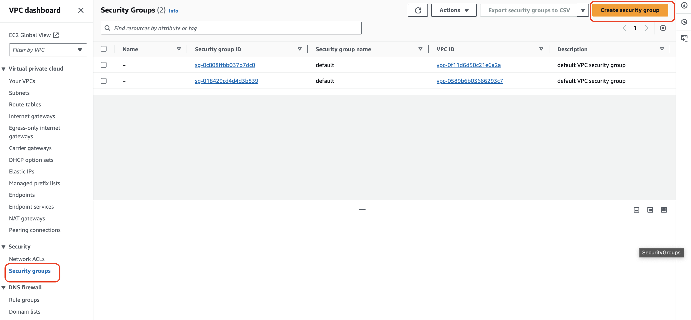

# VPC Peering

Let us assume that there are two VPCs created in two different regions (One in N.Virginia and one in Mumbai).
There are few EC2 instances running in both VPCs.
If EC2 instances running in one VPC need to talk communicate to other EC2 instances running in another VPC,
then we need VPC peering.

**Rules**

1. If one VPC from one region needs to talk to another VPC, VPC peering is needed.
2. Assume there are three VPCs (A, B, C). A is peering with B, B is peering with C. 
So, A cannot talk to C unless there is peering configured between A and C 
3. We can do VPC peering from VPC in one account to VPC in another account as well.

## Steps for VPC Peering

1. Create two VPCs in two different regions
2. Create subnets for each VPC
3. Create internet gateway for each VPC
4. Create route tables for each VPC
5. Create a security group for each VPC
6. Create EC2 instances for each VPC
7. Create VPC peering connection and associate them with VPC
8. Login and check connectivity

### Create two VPCs in two different regions

**For N.Virginia Region**

To do so, open the VPC services and click on the "Create VPC" button

Update the fields as per snapshot. Then click on the "Create VPC" button.

**For Mumbai Region**

To do so, open the VPC services and click on the "Create VPC" button

Update the fields as per snapshot. Then click on the "Create VPC" button.

### 2. Create subnets for each VPC

**For N.Virginia Region**

To do so, click on the "Subnets" menu and click on the "Create Subnet" button.

Update the fields as per snapshot. 

**For Mumbai Region**

To do so, click on the "Subnets" menu and click on the "Create Subnet" button.

Update the fields as per snapshot. 

## 3. Create internet gateway for each VPC and attach it with VPC

**For N.Virginia Region**

To do so, click on the "Internet gateways" menu and click on the "Create internet gateway" button.

Update the fields as per snapshot. 

Click on the "Create internet gateway" button

Select the internet gateway created and click on the "Action" dropdown menu

Update the fields as per snapshot. 

Click on the "Attach internet gateway" button

**For Mumbai Region**

To do so, click on the "Internet gateways" menu and click on the "Create internet gateway" button.

Update the fields as per snapshot. 

Click on the "Create internet gateway" button

Select the internet gateway created and click on the "Action" dropdown menu

Update the fields as per snapshot. 

Click on the "Attach internet gateway" button

### 4. Create route tables for each VPC

**For N.Virginia Region**

To do so, click on the "Route tables" menu and click on the "Create route table" button.

Update the fields as per snapshot

Click on the "Create route table" button

Click on the "Subnet association" tab. Click on the "Edit subnet association" button

Select subnet and click on the "Save association" button

Click on the "Routes" tab and click on the "Edit routes" button

Click on the "Add route" button and update the fields like below

Click on the "Save changes" button

**For Mumbai Region**

To do so, click on the "Route tables" menu and click on the "Create route table" button.

Update the fields as per snapshot

Click on the "Subnet association" tab. Click on the "Edit subnet association" button

Select subnet and click on the "Save association" button

Click on the "Routes" tab and click on the "Edit routes" button

Click on the "Add route" button and update the fields like below

Click on the "Save changes" button

### 5. Create a security group for each VPC

**For N.Virginia Region**

To do so, click on the "Security group" menu and click on the "Create security group" button

Update the fields as per snapshot

Click on the "Create security group" button

**For Mumbai Region**

To do so, click on the "Security group" menu and click on the "Create security group" button

Update the fields as per snapshot

Click on the "Create security group" button

### 6. Create EC2 instances for each VPC

**For N.Virginia Region**

To do so, open the "EC2" service. Click on the "Launch instance" button. 

Update the fields as per snapshot. 

Create a key pair

Update the fields as per snapshot. 

Click on the "Launch instance" button

**For Mumbai Region**

To do so, open the "EC2" service. Click on the "Launch instance" button. 

Follow the similar steps to launch EC2 instance like the Virginia region.

Create a key pair

Update the fields as per snapshot. 

Click on the "Launch instance" button

### 7. Create VPC peering connection (in only one region) and associate them with VPC (in another region)

To do so, click on the "Peering connection" menu and click on the "Create peering connection" button

Update the fields as per snapshot.

Now VPC peering connection is created in the N.Virginia region.

It needs to be accepted in the Mumbai region now.

### 8. Login and check connectivity

Connect the EC2 instance in the N.Virginia region

Pinging google.com works fine.

We will try to connect the EC2 instance created in the Mumbai region from here.

It is not able to connect.
So, VPC peering from N.Virginia region to the Mumbai region is not working.
The reason is that routing tables need to be modified to accept the subnet from both VPCs.

Update the routing table in the N.Virginia region. Add the subnet range of Mumbai region VPC.

Update the routing table in the Mumbai region. Add the subnet range of N.Virginia region VPC.

Now try to ping the EC2 instance from Virginia to Mumbai EC2 instance.
It works fine.

