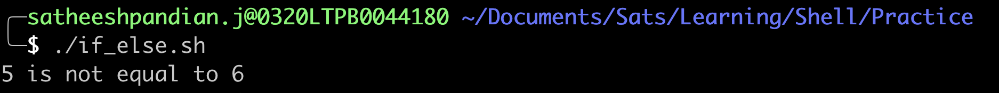
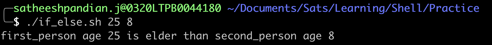
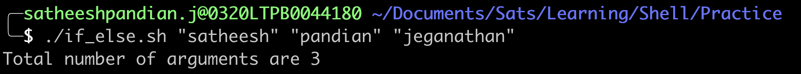
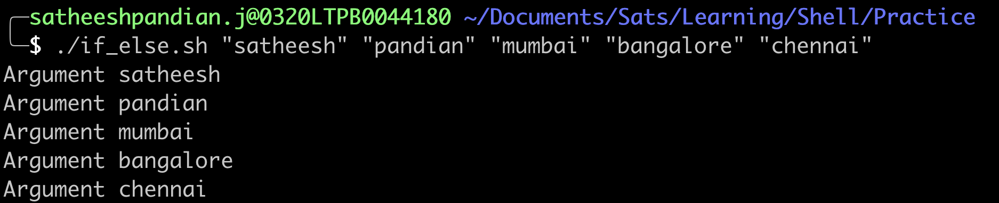
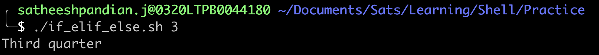
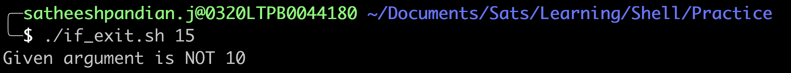

#Advanced if usage

##if/then/else constructs
This is used to take one course of action if the condition is true, and another if condition is false.

####Syntax
```bash
if [ condition ]
then
  statement belongs to condition is true
else
  statement belongs to condition is false
fi
```

**Example**
```bash
#!/bin/bash
number1=5
number2=6
if [ $number1 -eq $number2 ]
then
  echo "$number1 is equal to $number2"
else
  echo "$number1 is not equal to $number2"
fi
```


**Getting input from commandline in runtime**
```bash
first_person_age=$1
second_person_age=$2
if [ $first_person_age -gt $second_person_age ]
then
  echo "first_person age $first_person_age is elder than second_person age $second_person_age"
else
  echo "first_person age $first_person_age is younger than second_person age $second_person_age"
fi
```


>**NOTE**
> 
>$0 refers to the name of the script
> 
>$1, $2 ... $n refers to the positional parameters
> 
> $# refers to the number of command line arguments
> 
> $@ refers to all the positional parameters passed to a script as separate words
> 
> $* refers to all the positional parameters passed to a script as single words

**Examples**
```bash
#!/bin/bash
first_person_name=$1
second_person_name=$2
if [ $first_person_name = $second_person_name ]
then
  echo "$first_person_age is elder than $second_person_age"
else
  echo "$first_person_age is younger than $second_person_age"
fi
```
In below snapshot, $0 => if_else.sh, $1 => 25 and $2 => 8 (Positional parameters)
 

```bash
#!/bin/bash
echo "Total number of arguments are $number"
```
In below snapshot, $# counts the number of arguments passed to the shell script
 

```bash
#!/bin/bash
for number in "$@"
do
  echo "Argument $number"
done
```
In below snapshot, each argument is considered as separate word
 

```bash
#!/bin/bash
for number in "$*"
do
  echo "Argument $number"
done
```
In below snapshot, all arguments are considered as one word
 

##if/then/elif/else constructs

####Syntax
```bash
if [ condition ]
then
  statement belongs to condition is true
elif [ some_condition ]
then
  statement belongs to some_condition is true  
else
  statement belongs to condition is false
fi
```

**NOTE:**
_Multiple elif block can be possible_.

**Example**

```bash
#!bin/bash
month_number=$1

if [ $# -ne 2 ]
then
  echo "No month number given. Please enter a month number as a command line argument."
  echo "eg: ./print-month-number 5"
  exit
fi

if [[ $month_number -lt 1 ]] || [[ $month_number -gt 4 ]]
then
  echo "Invalid month number given. Please enter a valid number - 1 to 12."
  exit
fi

if [ $month_number -eq 1 ]
then
  echo "First quarter"
elif [ $month_number -eq 2 ]
then
  echo "Second quarter"
elif [ $month_number -eq 3 ]
then
  echo "Third quarter"
elif [ $month_number -eq 4 ]
then
  echo "Fourth quarter"
fi
```
 

##Nested if statements
####Syntax
```bash
if [ condition ]
then
  statement belongs to condition is true
elif [ some_condition ]
then
  statement belongs to some_condition is true
  if [ anothe_condition]
  then
    statement belongs to another_condition is true
  else
    statement belongs to another_condition is false
  fi
else
  statement belongs to condition is false
fi
```

**Example**

```bash
#!/bin/bash
year=`date +%Y`

if [ $[$year % 400] -eq "0" ]; then
  echo "This is a leap year.  February has 29 days."
elif [ $[$year % 4] -eq 0 ]; then
        if [ $[$year % 100] -ne 0 ]; then
          echo "This is a leap year, February has 29 days."
        else
          echo "This is not a leap year.  February has 28 days."
        fi
else
  echo "This is not a leap year.  February has 28 days."
fi
```
 

##Using the exit statement 

1. `exit` statement terminates execution of the entire script. It is used if the user input is incorrect, if a statement did not run successfully or if some other error occurred.

2. `exit` statement takes an optional argument. This argument is the integer (exit status code), which is passed back to the parent and stored in the $? variable.

3. A zero exit status code means that the script ran successfully

4. Any other exit status code may be used to pass back different messages to the parent, so that different actions can be taken according to failure or success of the child process

5. If no argument is given to the exit command, the parent shell uses the current value of the $? variable.

>**NOTE**
> 
> `exit` is different from `return`. `exit` is used to stop the script whereas `return` is used to stop the function.

**Example**


```bash
#!/bin/bash

if [ $# != 1 ]; then
  echo "Usage: $0 10"
  exit 1
fi
if [ $1 -eq 10 ] ; then
  echo "Given argument is 10"
else
  echo "Given argument is NOT 10"
  exit 10
fi
```
 

##Using case statements

case statement will be useful when you are working on menu-driven script.

####Syntax
In the below code snippet, if any of the "option" matches with "value", then the respect block of statements will be executed.
If none of the "option" matches with "value", then * block of statements will be executed.
```bash
case < value > in
  option) statement
    ;;
  option) statement
    ;;
  *) statement
    ;;
esac
```

>**NOTE**
> 
> If any of the block executed, then the rest will be omitted. In other words, at any point of time, ONLY ONE block will be executed (If * is included)

**Example**

```bash
#!/bin/bash
space=`df -h | awk '{print $5}' | grep % | grep -v Use | sort -n | head -1 | cut -d "%" -f1 -`

case $space in
[1-6]*)
  Message="All is quiet"
  ;;
[7-8]*)
  Message="Start thinking about cleaning out some stuff.  There's a partition that is $space % full"
  ;;
9[1-8])
  Message="Better hurry with that new disk...  One partition is $space % full"
  ;;
99)
  Message="I'm drowning here!  There's a partition at $space %!"
  ;;
*)
  Message="I seem to be running with an nonexistent amount of disk space"
  ;;
esac

echo $Message as $space disk is used
```
 
