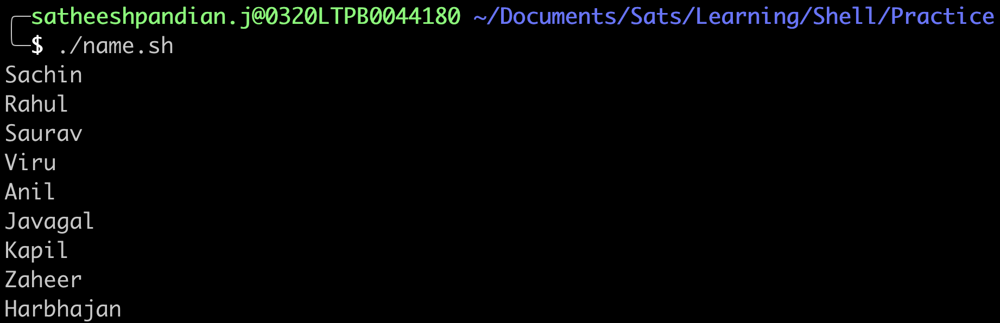
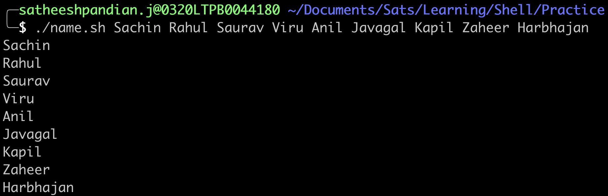
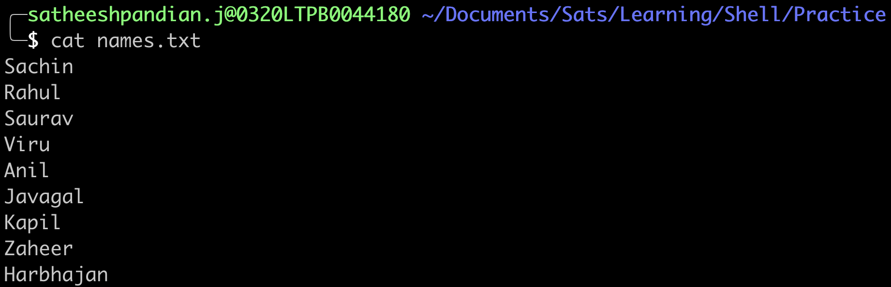
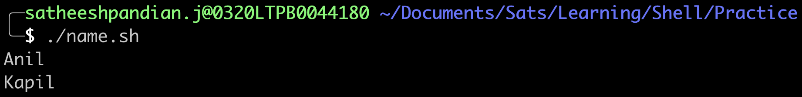
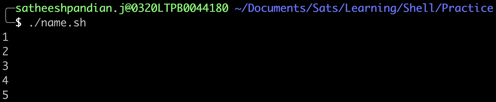
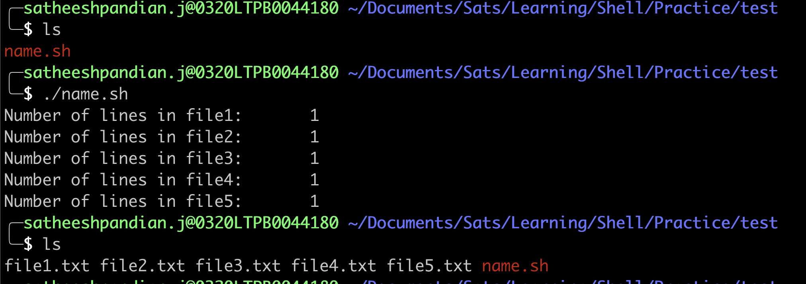

#The for loop
In general, for loop can be used in the below scenarios.
* Executes a command or set of commands many times
* Iterate through files
* Iterate through lines within the file
* Iterate through output of the command 
##How does it work?
This loop allows for specification of a list of values. A list of commands is executed for each value in the list.
####Syntax
```bash
for <variable> in [ LIST ] 
do 
    COMMANDS/statements; 
done
```
whereas,
LIST can be any list of words, strings or numbers or generated by any command. 

The first time through the loop, "variable" is set to the first item in LIST. 
The second time, its value is set to the second item in the list, and so on. 

The loop terminates when no items are left in LIST. The return status is the exit status of the last command that executes in the for loop. 
If no commands are executed, the return status is zero.

###With Strings

#### Example
```bash
#!/bin/bash
for name in Sachin Rahul Saurav Viru Anil Javagal Kapil Zaheer Harbhajan
do
  echo "${name}"
done
```


###NOTE:
* When [ LIST ] is empty and number of arguments are passed through runtime as environmental variable, then
[ LIST] is replaced with in $@ 

#### Example
Assume below code snippet saved as shell script and while executing this shell script, we need to pass the input list as an arguments.
```bash
for name in $@
do
  echo "${name}"
done
```


* We can pass the list from the file as well. We can use backquotes to pass the input file as shown below. This is one way of passing the input list.
```bash
for name in `cat names.txt`
do
  echo "${name}"
done
```

#### Output


* Another way of passing the input list is within parenthesis. This is the best practice to follow. The reason is that you can pass multiple commands within parenthesis.
```bash
for name in $(cat names.txt | grep -i il)
do
  echo "${name}"
done
```

#### Output


#### REMEMBER: 
* You can pass multiple commands within backquotes too (like below). But that is not a suggestible way.
```bash
for name in `cat names.txt | grep -i il`
do
  echo "${name}"
done
```

###With Numbers
```bash
for number in 1 2 3 4 5
do
  echo "${number}"
done
```


The same code can be little modified with {starting_number..ending_number} instead of individual number.
```bash
for number in {1..5}
do
  echo "${number}"
done
```
> **Note**
> 
> There is no space within the curly braces. If there is any space, then that will be considered as separate string
>
> ```bash
> for number in { 1..5 }
> do
>  echo "${number}"
> done
> ```
> 
> Output will be
> 
> ```bash
> {
> 1..5
> }
> ```

#### C style for loop with numbers
```bash
for((index=1; index<=5; index++))
do
  touch file${index}.txt
  echo "${index}" > file"${index}.txt"
  echo "Number of lines in file${index}:$(cat file${index}.txt |wc -l)"
done
```

