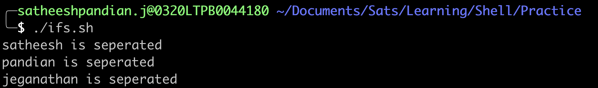
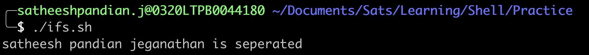
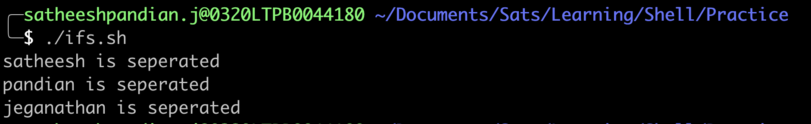
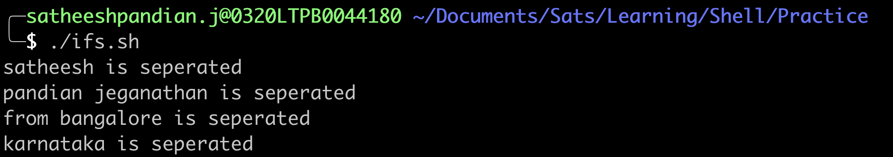
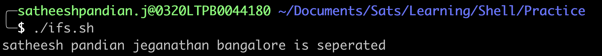
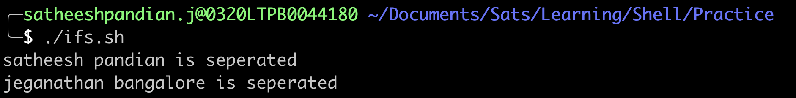

#IFS (Internal Field Separator)
- IFS is used to split the word, array, list by using a delimiter. 
- By default, IFS is set to space, tab, or new line.
- If the string/word has any of the above values (space/tab/new line), Shell uses IFS implicitly to split and manipulate. Example is below. We don't need to mention IFS in our coding.
```bash
#!/usr/bin/env bash
elements="satheesh pandian jeganathan"
for element in ${elements}
do
  echo ${element} is seperated
done 
```


`NOTE: In the above example, elements in for loop is not surronded by quote. If it is surrounded, then all the values considered as one word. Example, refer below`
```bash
#!/usr/bin/env bash
elements="satheesh pandian jeganathan"
for element in "${elements}"
do
  echo ${element} is seperated
done 
```

- We can also overwrite the default value by specifying custom IFS i.e
  `IFS=","`. Comma is a separator in this case. In the below example, ":" is used as a separator
```bash
#!/usr/bin/env bash
IFS=":"
elements="satheesh:pandian:jeganathan"
for element in ${elements}
do
  echo ${element} is seperated
done 
```


In case of mixed list (spaces and custom IF values), the priority goes to custom IFS value.
```bash
#!/usr/bin/env bash
IFS=":"
elements="satheesh:pandian jeganathan:from bangalore:karnataka"
for element in ${elements}
do
  echo ${element} is seperated
done 
```


####So far, we have assigned a value into the variable and used the variable in for loop. Instead, we can use the value directly in for loop without assigning them into variable. Let us see some examples.
```bash
#!/usr/bin/env bash
IFS=":"
for element in "satheesh:pandian jeganathan:from bangalore:karnataka"
do
  echo ${element} is seperated
done 
```

```bash
#!/usr/bin/env bash
IFS=":"
for element in satheesh:pandian jeganathan:from bangalore:karnataka
do
  echo ${element} is seperated
done 
```

`NOTE: If we are passing the value directly in for loop without quotes surrounded, then the priority goes to default, NOT custom IFS. In the above example, ":" is NOT priority. Instead, space(" ") is the priority`

####<mark>Remember that IFS ONLY takes effect on expanded values. If we want to override the values of IFS to something custom inside the script (":","," etc) then $@/$* must go through expansion process</mark>