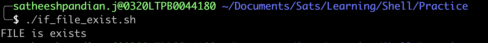
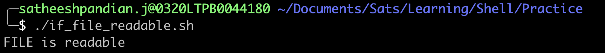
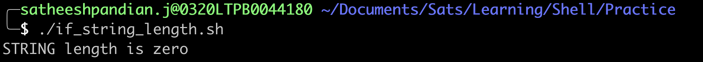
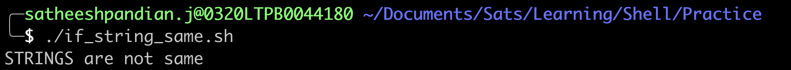
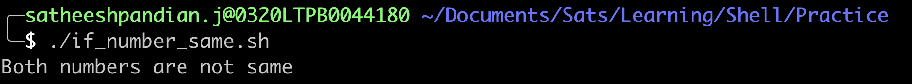

# Primary expressions with If condition

| Primary Expression       | Meaning                                                                          |
|--------------------------|----------------------------------------------------------------------------------|
| `[ -a FILE ]`            | True if FILE exists                                                              |
| `[ -b FILE ]`            | True if FILE exists and is a block-special file                                  |
| `[ -c FILE ]`            | True if FILE exists and is a character-special file                              |
| `[ -d FILE ]`            | True if FILE exists and is a directory                                           |
| `[ -e FILE ]`            | True if FILE exists                                                              |
| `[ -f FILE ]`            | True if FILE exists and is a regular file                                        |
| `[ -h FILE ]`            | True if FILE exists and is a symbolic link                                       |
| `[ -p FILE ]`            | True if FILE exists and is a named pipe (FIFO)                                   |
| `[ -r FILE ]`            | True if FILE exists and is readable                                              |
| `[ -s FILE ]`            | True if FILE exists and has a size greater than zero                             |
| `[ -w FILE ]`            | True if FILE exists and is writable                                              |
| `[ -x FILE ]`            | True if FILE exists and is executable                                            |
| `[ -z STRING ]`          | True of the length if "STRING" is zero                                           |
| `[ -n STRING]`           | True if the length of "STRING" is non-zero                                       |
| `[ STRING1 == STRING2 ]` | True if the strings are equal. "=" may be used instead of "=="                   |
| `[ STRING1 != STRING2 ]` | True if the strings are not equal                                                |
| `[ ARG1 OP ARG2 ]`       | "ARG1" and "ARG2" are integers. Based on arithmetic binary operators return true |

**`[ -a FILE ]`**

Assume that you are working in your home directory, and you would like to check if a file exists in your home directory.
If a file exists, then you would like to print a message "FILE is exists". Else, you need to print an error message.
In such scenario, you can use the following code snippet
```bash
if [ -a <path of the file> ]
then
    echo "FILE is exists"
else
    echo "No such file"
fi
```
####Example
I have a file ***"mkdocs.yml"*** in the below location. Now, I will check if the file exists or not


```bash
#!bin/bash

if [ -a "/Users/satheeshpandian.j/Documents/Sats/Learning/makedocs/mkdocs.yml" ]
then
    echo "FILE is exists"
else
    echo "No such file"
fi
```


**`[ -r FILE ]`**

Assume that you are working in your home directory, and you would like to check if a file is readable in your home directory.
If a file exists, then you would like to print a message "FILE is readable". Else, you need to print an error message.
In such scenario, you can use the following code snippet
```bash
if [ -r <path of the file> ]
then
    echo "FILE is readable"
else
    echo "FILE is not readable"
fi
```
####Example
I have a file ***"mkdocs.yml"*** in the below location. Now, I will check if the file is readable or not


```bash
#!bin/bash

if [ -r "/Users/satheeshpandian.j/Documents/Sats/Learning/makedocs/mkdocs.yml" ]
then
    echo "FILE is readable"
else
    echo "FILE is not readable"
fi

```


**`[ -z STRING ]`**

Assume that you have string variable, and you would like to check string variable length.
In such scenario, you can use the following code snippet
```bash
if [ -z <STRING> ]
then
    echo "STRING length is zero"
else
    echo "STRING length is not zero"
fi
```
####Example
In the below code snippet, variable name is empty. We are checking if the variable is empty (length).
```bash
#!bin/bash
name=""
if [ -z "$name" ]
then
    echo "STRING length is zero"
else
    echo "STRING length is not zero"
fi
```



**`[ STRING1 == STRING2 ]`**

Assume that you have two string variables, and you would like to check if both string variables are same.
In such scenario, you can use the following code snippet
```bash
if [ STRING1 == STRING2 ]
then
    echo "STRINGS are same"
else
    echo "STRINGS are not same"
fi
```
####Example
In the below code snippet, variables first_name and last_name are defined. We are checking if two names are same.
```bash
#!bin/bash
first_name="Satheesh"
last_name="Pandian"
if [ $first_name == $last_name ]
then
    echo "STRINGS are same"
else
    echo "STRINGS are not same"
fi
```


####NOTE:
1. if [ $first_name = $last_name ] => Also works
2. if [[ $first_name == $last_name ]] => Also works


`[ ARG1 OP ARG2 ]` 

In general, ARG1 and ARG2 are numbers. OP is nothing but an arithmatic operator.

| Arithmatic Operator | Meaning                  |
|---------------------|--------------------------|
| `eq`                | is equal to              |
| `ne`                | not equal to             |
| `lt`                | less than                |
| `le`                | less than or equal to    |
| `gt`                | greater than             |
| `ge`                | greater than or equal to |


```bash
if [ ARG1 -eq ARG2 ]
then
    echo "Both numbers are same"
else
    echo "Both numbers are not same"
fi
```
####Example
In the below code snippet, two numbers are compared to see if both numbers are same or not.
```bash
#!bin/bash

if [ 10 -eq 7 ]
then
    echo "Both numbers are same"
else
    echo "Both numbers are not same"
fi
```


###High Level Summary
| Expression       | Expression         | Result                            |
|------------------|--------------------|-----------------------------------|
| `[ xyz = xyz ]`  | `[[ xyz = xyz ]]`  | true (both strings are equal)     |
| `[ xyz != xyz ]` | `[[ xyz != xyz ]]` | false (both strings are equal)    |
| `[ 10 -lt 15 ]`  | `[[ 10 -lt 15 ]]`  | true (10 is less than 15)         |
| `[ 10 -gt 15 ]`  | `[[ 10 -gt 15 ]]`  | false (10 is not greater than 15) |
| `[ 10 -ne 15 ]`  | `[[ 10 -ne 15 ]]`  | true (10 is not equal to 15)      |

####NOTE
1. [[ condition ]] is preferred when there are patterns involved
   
    **Example**

```bash
        #!bin/bash
        name="Shelling"
        if [[ $name == *hell* ]]
        then
          echo " name contains the pattern"
        fi
```

| Expression               | Meaning                                                                                                            |
|--------------------------|--------------------------------------------------------------------------------------------------------------------|
| `[[ "xyz" = *y* ]]`      | true (string xyz contains y)                                                                                       |
| `[[ "xyz" = xy[az] ]]`   | true (string xyz contains z after xy)<br/>This can be considered as<br/>`[[ xyz = xy[az] ]] or [[ xya = xy[az] ]]` |
| `[[ "xyz" = "xy[ab]" ]]` | false (string xyz does not contain z after xy)                                                                     |
| `[[ "xyz" > "abc" ]]`    | true (x comes after  a when sorted alphabetically)                                                                 |
| `[[ "xyz" < "abc" ]]`    | false (z does not come after  x when sorted alphabetically)                                                        |

2. `[[` prevents word splitting of variable values. So, if VAR="var with spaces", you do not need to double quote $VAR in the condition.
```bash
name="Satheesh Pandian" # name has a value with space. So, quote matters in condition
if [[ $name = "Sats" ]] # $name is not required to be surrounded by quotes as it is in double square brackets
then
  echo "$name is Sats"
else
  echo "$name is NOT Sats"
fi

if [ "$name" = "Sats" ] # $name is required to be surrounded by quotes as it is in single square bracket
then
  echo "$name is Sats"
else
  echo "$name is NOT Sats"
fi
```
##Combining expressions with If condition

| Expression                                                                                                                                   | Meaning                                                                                                                                                                               |
|----------------------------------------------------------------------------------------------------------------------------------------------|---------------------------------------------------------------------------------------------------------------------------------------------------------------------------------------|
| [ condition1 ] &#124;&#124; [ condition2 ] <br/> or<br/> [[ condition1 &#124;&#124; condition2 ]] <br/>or <br/> [ condition1 -o condition2 ] | True if any one condition is success<br/><br/>**NOTE:**<br/>[[ condition1 -o condition2 ]] will not work. Double square brackets with flag (-o) for multiple conditions will not work |
| [ condition1 ] && [ condition2 ] <br/> or<br/> [[ condition1 && condition2 ]] <br/>or <br/> [ condition1 -a condition2 ]                     | True if both conditions are success<br/><br/>**NOTE:**<br/>[[ condition1 -a condition2 ]] will not work. Double square brackets with flag (-a) for multiple conditions will not work  |


**Example**

<table>
   <tr>
     <td colspan="2"><b>Expression</b></td>
    <th>Meaning</th>
  </tr>
  <tr>
    <td colspan="2">[ 5 -gt 3 ] && [ 5 -lt 10 ]</td>
    <td>true (Both conditions are true)</td>
  </tr>
  <tr>
    <td colspan="2">[ 5 -gt 13 ] || [ 5 -lt 10 ]</td>
    <td>true (Second condition is true)</td>
  </tr>
  <tr>
    <td colspan="2">[ 5 -gt 3 -a 5 -lt 10 ]</td>
    <td>true (Both conditions are true)</td>
  </tr>
  <tr>
    <td colspan="2">[[ 5 -gt 3 && 5 -lt 10 ]]</td>
    <td>true (Both conditions are true)</td>
  </tr>
  <tr>
    <td colspan="2">[[ 5 -gt 13 || 5 -lt 10 ]]</td>
    <td>true (Second condition is true)</td>
  </tr>
  <tr>
    <td colspan="2">[ 5 -gt 13 -o 5 -lt 1 ]</td>
    <td>false (None of conditions are true)</td>
  </tr>
</table>


> **Note**
> 
> Most programmers will prefer to use the test built-in command, which is equivalent to using square brackets for comparison

**Example**
``` bash
name="satheesh"
test "$(name)" != 'satheesh' && (echo Hey $name; exit 1)
```
