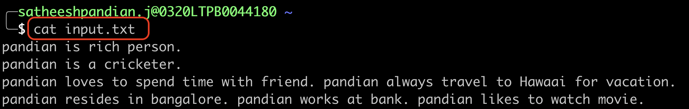
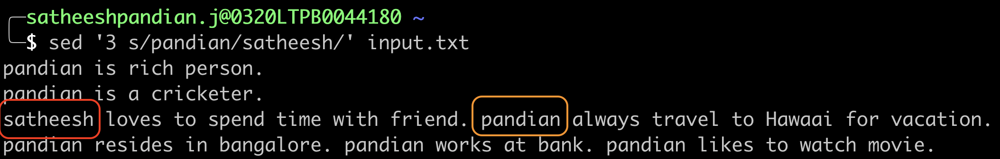

#Introduction to sed
`sed` is a stream editor. It is used to perform basic text transformation.

**Syntax**
```bash
sed SCRIPT INPUTFILE
```

###Substitution

**Replace first occurrence in each the lines with new value**
```bash
sed 's/<OLD_VALUE>/<NEW_VALUE>/' <INPUT_FILE>
```
**Example**


To replace first occurrences of ‘pandian’ to ‘satheesh’ in each lines in the file input.txt

**Output**


`pandian` is replaced by `satheesh` in each line ONLY in the first occurrence. If you see the input snapshot, third line has `pandian` in two places. The `sed` command just replaces in the first occurrence. In the second occurrence, it is still showing `pandian`.

**Replace n<sup>th</sup> occurrence in each line with new value**
```bash
sed 's/<OLD_VALUE>/<NEW_VALUE>/<OCCURRENCE_NUMNBER>' <INPUT_FILE>
```
**Example**


To replace specific occurrence of ‘pandian’ to ‘satheesh’ in each lines in the file input.txt

**Output**


`pandian` is replaced by `satheesh` in each line ONLY in the second occurrence. If you see the input snapshot, third line has `pandian` in two places. The `sed` command just replaces in the second occurrence. In the fist occurrence, it is still showing `pandian` and also other lines still show `pandian` in the first occurrence.

**Replace all occurrences in entire file with new value**
```bash
sed 's/<OLD_VALUE>/<NEW_VALUE>/g' <INPUT_FILE>
```
**Example**


To replace all occurrences of ‘pandian’ to ‘satheesh’ in the file input.txt

**Output**


`pandian` is replaced by `satheesh` in every single place in the file.


**Replace from n<sup>th</sup> occurrences in each line with new value**
```bash
sed 's/<OLD_VALUE>/<NEW_VALUE>/<OCCURRENCE_NUMNBER>g' <INPUT_FILE>
```
**Example**


To replace 2nd occurrences onwards of ‘pandian’ to ‘satheesh’ in each of the file input.txt

**Output**


`pandian` is replaced by `satheesh` from 2nd occurrence in each line. If you look at first two lines, there is only ONE `pandian` value. Hence, these lines are not impacted. However, if you look at third and fourth lines, `pandian` occurrences more than once. Hence, from second occurrence onwards, `pandian` is replaced by `satheesh`.


**Replace the first occurrences in specific line with new value**
```bash
sed '<OCCURRENCE_NUMNBER> s/<OLD_VALUE>/<NEW_VALUE>/' <INPUT_FILE>
```
**Example**


To replace first occurrences of ‘pandian’ to ‘satheesh’ in third line of the file input.txt

**Output**


First occurrence of `pandian` is replaced by `satheesh` in the third line and NO OTHER CHANGE in the file.


**Replace from n<sup>th</sup> occurrences onwards in specific line with new value**
```bash
sed '<OCCURRENCE_NUMNBER> s/<OLD_VALUE>/<NEW_VALUE>/g' <INPUT_FILE>
```
**Example**


To replace second occurrences onwards of ‘pandian’ to ‘satheesh’ in fourth line of the file input.txt

**Output**


Second occurrences onwards of `pandian` is replaced by `satheesh` in the fourth line and NO OTHER CHANGE in the file.


**Replace all the occurrences in specific line with new value**
```bash
sed '<OCCURRENCE_NUMNBER> s/<OLD_VALUE>/<NEW_VALUE>/g' <INPUT_FILE>
```
**Example**


To replace all the occurrences of ‘pandian’ to ‘satheesh’ in third line of the file input.txt

**Output**


All the occurrence of `pandian` is replaced by `satheesh` in the third line and NO OTHER CHANGE in the file.


