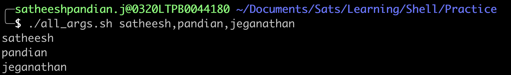

#Special Parameters ($@ and $*)

- `$@` is used to manipulate all the arguments passed to the shell while running as each item considered as SEPARATE item.
- `$*` is used to manipulate all the arguments passed to the shell while running as each item considered as ONE item.

##$@ without quotes
This will loop through all the items individually like below
```bash
#!/bin/bash
for item in $@
do
  echo "${item}"
done
```


##$@ with quotes
This will loop through all the items individually like below
```bash
#!/bin/bash
for item in "$@"
do
  echo "${item}"
done
```


`$@ behaves same with quotes or without quotes. Remember there is NO custom IFS`

##$@ without quotes along with IFS(Custom Separator)
This will loop through all the items individually like below
```bash
#!/bin/bash
IFS=","
for item in $@
do
  echo "${item}"
done
```


##$@ with quotes along with IFS
This will loop through all the items at once like below
```bash
#!/bin/bash
IFS=","
for item in "$@"
do
  echo "${item}"
done
```

`$@ behaves differently with quotes or without quotes when custom IFS involves.`

`- With quotes + custom IFS, it considered as ONE word`

`- Without quotes  + custom IFS, it is considered as SEPARATE word`

##CONCLUSION for $@
###`Without quotes`
<mark>- $@ will split the item INDIVIDUALLY, Doesn't matter if custom IFS is there or not</mark>

###`With quotes`
<mark>- $@ will split the item INDIVIDUALLY when if custom IFS is not involved</mark>

<mark>- $@ will NOT split the item INDIVIDUALLY when if custom IFS is involved</mark>


##$* without quotes
This will loop through all the items individually like below
```bash
#!/bin/bash
for item in $*
do
  echo "${item}"
done
```


##$* with quotes
This will loop through all the items individually like below
```bash
#!/bin/bash
for item in "$*"
do
  echo "${item}"
done
```


####$* behaves differently with quotes or without quotes. 
- With quotes, it considered as ONE word
- Without quotes, it is considered as SEPARATE word

##$* without quotes along with IFS(Custom Separator)
```bash
#!/bin/bash
IFS=","
for item in $*
do
  echo "${item}"
done
```


##$* with quotes along with IFS
This will loop through all the items at once like below
```bash
#!/bin/bash
IFS=","
for item in "$*"
do
  echo "${item}"
done
```


`$* behaves differently with quotes or without quotes when custom IFS involves.`

`- With quotes + custom IFS, it considered as ONE word`

`- Without quotes  + custom IFS, it is considered as SEPARATE word`

##CONCLUSION for $*
###`Without quotes`
<mark>- $* will split the item INDIVIDUALLY, Doesn't matter if custom IFS is there or not</mark>

###`With quotes`
<mark>- $* will NOT split the item, Doesn't matter if custom IFS is there or not</mark>

