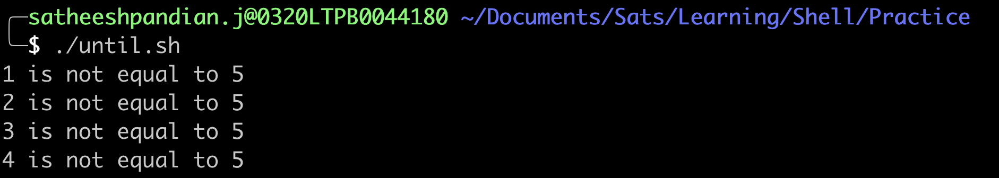

#The until loop
In general, until loop can be used similarly like while loop.

##How does it work?
The until allows for repetitive execution of a list of commands, as long as the condition defined in the until loop is met.

####Syntax
```bash
until <condition> 
do 
  COMMANDS/Statements
done
```
Whereas,
***condition*** can be any command(s) that can exit with a success or failure status. The COMMANDS/Statements can be any program or script.

As soon as the ***condition*** met, the loop exits. In a script, the command following the done statement is executed.

The return status is the exit status of the last COMMANDS/Statement, or zero if none was executed.

####Example
```bash
#!/bin/bash
## This script is to just print the numbers until it reaches 5.
number=1
until [[ "${number}" -eq 5 ]]
do
    echo "${number} is not equal to 5"
    number=$((number+1))
done
```


