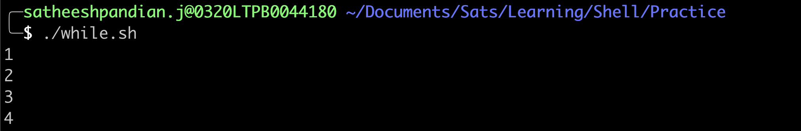
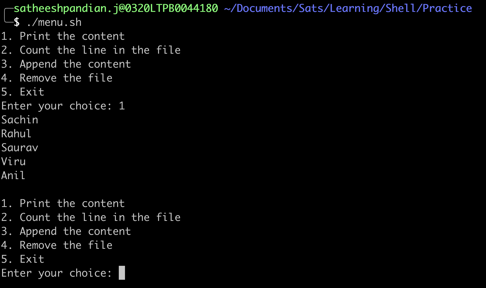

#The while loop
In general, while loop can be used in the below scenarios.

* Executes a command or set of commands many times, but you are not sure how many times
* Executes a command or set of commands until specific condition occurs 
* Create an infinite loop
* Menu driven programs 

##How does it work?
The while allows for repetitive execution of a list of commands, as long as the condition defined in the while loop executes successfully (exit status of zero).

####Syntax
```bash
while <condition> 
do 
  COMMANDS/Statements
done
```
Whereas,
***condition*** can be any command(s) that can exit with a success or failure status. The COMMANDS/Statements can be any program or script.

As soon as the ***condition*** fails, the loop exits. In a script, the command following the done statement is executed.

The return status is the exit status of the last COMMANDS/Statement, or zero if none was executed.

####Example
```bash
#!/bin/bash
# This script is to just print the given number if it is less than 4.
i="0" # we can define i=0 as well. Both works
while [ $i -lt 4 ]
do
  i=$[$i+1]
  echo $i
done
```


##Menu Driven Program Example

```bash
#!/bin/bash
## This script is to show how the menu driven program works in while loop

while true
do
  echo "1. Print the content"
  echo "2. Count the line in the file"
  echo "3. Append the content"
  echo "4. Remove the file"
  echo "5. Exit"

  read -p "Enter your choice: " choice

  if [[ "${choice}" -eq 1 ]]
  then
    cat names.txt
  elif [[ "${choice}" -eq 2 ]]
  then
    cat names.txt | wc -l
  elif [[ "${choice}" -eq 3 ]]
  then
    echo "${choice}" >> names.txt
  elif [[ "${choice}" -eq 4 ]]
  then
    rm -rf names.txt
  else
    exit 0
  fi
done
```



