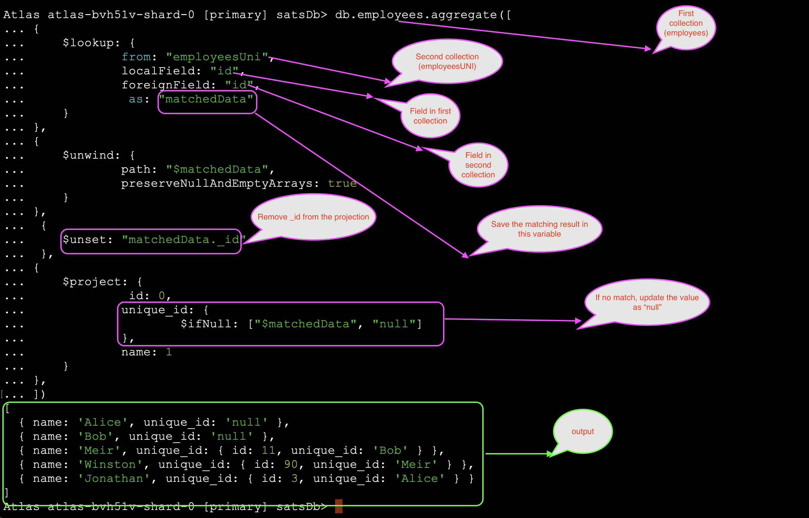
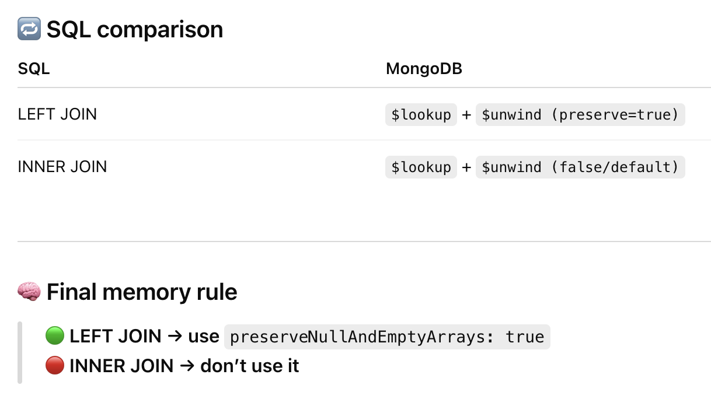
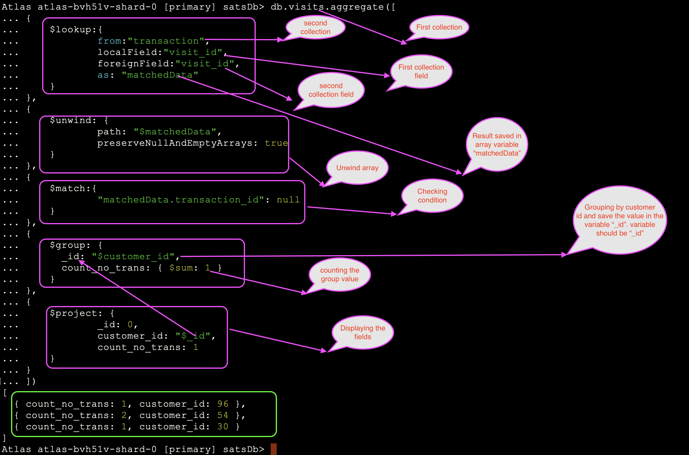

# Exercises from Leetcode - MongoDB


### Exercise # 1

Collection: Products

| Field      | Data type |
|------------|-----------|
| product_id | int       |
| low_fats   | enum      |
| recyclable | enum      |


low_fats is an ENUM (category) of type ('Y', 'N') where 'Y' means this product is low fat and 'N' means it is not.
recyclable is an ENUM (category) of types ('Y', 'N') where 'Y' means this product is recyclable and 'N' means it is not.
 
#### Question 
Write a solution to find the ids of products that are both low fat and recyclable.
Return the result table in any order.
The result format is in the following example.

**Example 1:**

**Input:** 
Products collection:

| product_id | low_fats | recyclable |
|------------|----------|------------|
| 0          | Y        | N          |
| 1          | Y        | Y          |
| 2          | N        | Y          |
| 3          | Y        | Y          |
| 4          | N        | N          |


**Output:** 

| product_id |
|------------|
| 1          |
| 3          |


### Solution  # 1

```MongoDB
db.practice.find({low_fats: 'Y', recyclable: 'Y'},{_id:0, product_id: 1}).sort({product_id: 1})
```


**Explanation:** 
Only products 1 and 3 are both low fat and recyclable.


### Exercise # 2

Collections: Customer

| Field      | Data type |
|------------|-----------|
| id         | int       |
| name       | string    |
| referee_id | int       |


In collection, id is the primary key column for this table.
Each document of this collection indicates the id of a customer,
their name, and the id of the customer who referred them.
 

#### Question 
Find the names of the customer that are either:

1. referred by any customer with id != 2.
2. not referred by any customer.

Return the result in any order.

The result format is in the following example.

**Input:** 

Collections: Customer

| id | name | referee_id |
|----|------|------------|
| 1  | Will | null       |
| 2  | Jane | null       |
| 3  | Alex | 2          |
| 4  | Bill | null       |
| 5  | Zack | 1          |
| 6  | Mark | 2          |


Output:

| name |
|------|
| Will |
| Jane |
| Bill |
| Zack |

### Solution  # 2

```MongoDB
db.practice.find({$or: [{referee_id: {$ne: 2}},{referee_id: null}]},{_id:0, name: 1})
```


### Exercise # 3

Table: World

| Column Name | Type    |
|-------------|---------|
| name        | varchar |
| continent   | varchar |
| area        | int     |
| population  | int     |
| gdp         | bigint  |

"name" is the primary key (column with unique values) for this table.
Each row of this table gives information about the name of a country, 
the continent to which it belongs, its area, the population, and its GDP value.
 
#### Question 

A country is big if:

1. It has an area of at least three million (i.e., 3,000,000 km2), or
2. It has a population of at least twenty-five million (i.e., 25,000,000).

Write a solution to find the name, population, and area of the big countries.

Return the result table in any order.

The result format is in the following example.

Input: 

Collection: world

| name        | continent | area    | population | gdp          |
|-------------|-----------|---------|------------|--------------|
| Afghanistan | Asia      | 652230  | 25500100   | 20343000000  |
| Albania     | Europe    | 28748   | 2831741    | 12960000000  |
| Algeria     | Africa    | 2381741 | 37100000   | 188681000000 |
| Andorra     | Europe    | 468     | 78115      | 3712000000   |
| Angola      | Africa    | 1246700 | 20609294   | 100990000000 |


Output: 

| name        | population | area    |
|-------------|------------|---------|
| Afghanistan | 25500100   | 652230  |
| Algeria     | 37100000   | 2381741 |


###  Solution # 3


```MongoDB
db.world.find({$or: [{country: {$gt: 3000000}}, {population: {$gt: 25000000}}]},{name: 1, population: 1, area: 1, _id: 0})
```


### Exercise # 4

Collections: Views

| Column Name | Type |
|-------------|------|
| article_id  | int  |
| author_id   | int  |
| viewer_id   | int  |
| view_date   | date |

There is no primary key (column with unique values) for this table, the table may have duplicate rows.
Each row of this table indicates that some viewer viewed an article (written by some author) on some date. 
Note that equal author_id and viewer_id indicate the same person.

#### Question 

1. Write a solution to find all the authors that viewed at least one of their own articles.

2. Return the result table sorted by id in ascending order.

The result format is in the following example.

**Input:** 

Collections: Views

| article_id | author_id | viewer_id | view_date  |
|------------|-----------|-----------|------------|
| 1          | 3         | 5         | 2019-08-01 |
| 1          | 3         | 6         | 2019-08-02 |
| 2          | 7         | 7         | 2019-08-01 |
| 2          | 7         | 6         | 2019-08-02 |
| 4          | 7         | 1         | 2019-07-22 |
| 3          | 4         | 4         | 2019-07-21 |
| 3          | 4         | 4         | 2019-07-21 |


**Output:** 

| id |
|----|
| 4  |
| 7  |


###  Solution # 4


```SQL
db.views.aggregate([
{
	$match: {
		$expr: { 
			$eq: ["$author_id", "$viewer_id"] 
		}
	}
},
{
	$group: {
		_id: "$viewer_id",
	}
},
{
	$project: {
		_id: 0,
		id: "$_id"
	}
},
{
	$sort: {
		id: -1
	}
}
])
```


### Exercise # 5

Collection: Tweets

| Column Name | Type    |
|-------------|---------|
| tweet_id    | int     |
| content     | varchar |


Tweet_id is the primary key (column with unique values) for this table.
Content consists of alphanumeric characters, '!', or ' ' and no other special characters.
This table contains all the tweets in a social media app.

#### Question 

1. Write a solution to find the IDs of the invalid tweets. The tweet is invalid if the number of characters used in the content of the tweet is strictly greater than 15.

2. Return the result table in any order

The result format is in the following example.

**Input:** 

Collection: Tweets

| tweet_id | content                           |
|----------|-----------------------------------|
| 1        | Let us Code                       |
| 2        | More than fifteen chars are here! |


**Output:** 

| tweet_id |
|----------|
| 2        |


###  Solution # 5

```SQL
db.tweets.aggregate([
{
	$match: {
		$expr: {
			$gt:
			[
				{
					$strLenCP: "$content"
				}, 15 
			]
		}
	}
},
{
	$project: {
		_id: 0, 
		tweet_id: 1
	}
}
])
```


### Exercise # 6 - Replace Employee ID With The Unique Identifier

Collection: Employees

| Column Name | Type    |
|-------------|---------|
| id          | int     |
| name        | varchar |


id is the primary key (column with unique values) for this collection.
Each row of this collection contains the id and the name of an employee in a company.


Collection: EmployeesUNI

| Column Name | Type |
|-------------|------|
| id          | int  |
| unique_id   | int  |

(id, unique_id) is the primary key (combination of columns with unique values) for this collection.
Each row of this collection contains the id and the corresponding unique id of an employee in the company.

#### Question 

1. Write a solution to show the unique ID of each user, If a user does not have a unique ID replace just show null.

2. Return the result collection in any order

The result format is in the following example.

**Input:** 

Collection: Employees

| id | name     |
|----|----------|
| 1  | Alice    |
| 7  | Bob      |
| 11 | Meir     |
| 90 | Winston  |
| 3  | Jonathan |

Collection: EmployeesUNI

| id | unique_id |
|----|-----------|
| 3  | 1         |
| 11 | 2         |
| 90 | 3         |

**Output:** 

| unique_id | name     |
|-----------|----------|
| null      | Alice    |
| null      | Bob      |
| 2         | Meir     |
| 3         | Winston  |
| 1         | Jonathan |


###  Solution # 6


```MongoDB
db.employees.aggregate([
{
	$lookup: {
		from: "employeesUni",
		localField: "id",
		foreignField: "id",
		 as: "matchedData"
	}
},
{
	$unwind: {
		path: "$matchedData",
		preserveNullAndEmptyArrays: true
	}
},
 {
    $unset: "matchedData._id"
 },
{
	$project: {
		_id: 0,
		unique_id: {
			$ifNull: ["$matchedData", "null"]
		},
		name: 1
	}
},
])
```




### Lesson Learnt

1. $lookup ALWAYS returns an array, even if there is only one match. That’s why $unwind is needed.
2. $unwind will produce multiple output documents (one per match).
3. You DON’T need $unwind when
   * You want the joined data as an array
   * You don’t need to access individual fields.
   * You don’t care about NULL handling


### Exercise # 7 - Product Sales Analysis I

Collection: sales

| Column Name | Type |
|-------------|------|
| sale_id     | int  |
| product_id  | int  |
| year        | int  |
| quantity    | int  |
| price       | int  |


(sale_id, year) is the primary key (combination of columns with unique values) of this collection.
product_id is a foreign key (reference column) to Product collection.
Each row of this collection shows a sale on the product product_id in a certain year.
Note that the price is per unit.


Collection: product

| Column Name  | Type    |
|--------------|---------|
| product_id   | int     |
| product_name | varchar |

product_id is the primary key (column with unique values) of this collection.
Each row of this collection indicates the product name of each product.

#### Question 

1. Write a solution to report the product_name, year, and price for each sale_id in the Sales collection.

2. Return the result collection in any order

The result format is in the following example.

**Input:** 

Collection: sales

| sale_id | product_id | year | quantity | price |
|---------|------------|------|----------|-------|
| 1       | 100        | 2008 | 10       | 5000  |
| 2       | 100        | 2009 | 12       | 5000  |
| 7       | 200        | 2011 | 15       | 9000  |

Collection: product

| product_id | product_name |
|------------|--------------|
| 100        | Nokia        |
| 200        | Apple        |
| 300        | Samsung      |

**Output:** 

| product_name | name | year |
|--------------|------|------|
| Nokia        | 2008 | 5000 |
| Nokia        | 2009 | 5000 |
| Apple        | 2011 | 9000 |


###  Solution # 7


```MongoDB
db.sales.aggregate([
{
	$lookup: {
		from: "product",
		localField: "product_id",
		foreignField:"product_id",
		as: "matchedData"
	}
},
{
	$unwind: {
		path: "$matchedData",
		preserveNullAndEmptyArrays: false
	}
},
{
	$unset: "matchedData._id"
},
{
	$project: {
		_id: 0,
		product_name: "$matchedData.product_name",
		year: 1,
		price: 1
	}
},
{
    $sort: {
      product_name: -1   
    }
 }
])
```


### Lesson Learnt

1. $lookup ALWAYS returns an array, even if there is only one match. That’s why $unwind is needed.
2. $unwind will produce multiple output documents (one per match).
3. You DON’T need $unwind when
   * You want the joined data as an array
   * You don’t need to access individual fields.
   * You don’t care about NULL handling
4. preserveNullAndEmptyArrays - false ⇒ even if there is NO data to unwind, drop the document.
5. preserveNullAndEmptyArrays - true ⇒ even if there is NO data to unwind, keep the document.





### Exercise # 8 - Customer Who Visited but Did Not Make Any Transactions

Collection: Visits

| Column Name | Type |
|-------------|------|
| visit_id    | int  |
| customer_id | int  |


visit_id is the column with unique values for this collection.
This collection contains information about the customers who visited the mall.


Collection: Transactions

| Column Name    | Type |
|----------------|------|
| transaction_id | int  |
| visit_id       | int  |
| amount         | int  |

transaction_id is a column with unique values for this collection.
This collection contains information about the transactions made during the visit_id.


#### Question 

1. Write a solution to find the IDs of the users who visited without making any transactions,
and the number of times they made these types of visits.

2. Return the result collection in any order

The result format is in the following example.

**Input:** 

Collection: Visits

| visit_id | customer_id |
|----------|-------------|
| 1        | 23          |
| 2        | 9           |
| 4        | 30          |
| 5        | 54          |
| 6        | 96          |
| 7        | 54          |
| 8        | 54          |

Collection: Transactions

| transaction_id | visit_id | amount |
|----------------|----------|--------|
| 2              | 5        | 310    |
| 3              | 5        | 300    |
| 9              | 5        | 200    |
| 12             | 1        | 910    |
| 13             | 2        | 970    |

**Output:** 

| customer_id | count_no_trans |
|-------------|----------------|
| 54          | 2              |
| 30          | 1              |
| 96          | 1              |

**Explanation:** 

Customer with id = 23 visited the mall once and made one transaction during the visit with id = 12.
Customer with id = 9 visited the mall once and made one transaction during the visit with id = 13.
Customer with id = 30 visited the mall once and did not make any transactions.
Customers with id = 54 visited the mall three times.During 2 visits they did not make any transactions, 
and during one visit they made 3 transactions.
Customer with id = 96 visited the mall once and did not make any transactions.
As we can see, users with IDs 30 and 96 visited the mall one time without making any transactions. 
Also, user 54 visited the mall twice and did not make any transactions.

###  Solution # 8


```MongoDB
db.visits.aggregate([
{
	$lookup:{
		from:"transaction",
		localField:"visit_id",
		foreignField:"visit_id",
		as: "matchedData"
	}
},
{
	$unwind: {
		path: "$matchedData",
		preserveNullAndEmptyArrays: true
	}
},
{
	$match:{
		"matchedData.transaction_id": null 
	}
},
{
    $group: {
      _id: "$customer_id",
      count_no_trans: { $sum: 1 }
    }
},
{
	$project: {
		_id: 0,
		customer_id: "$_id",
		count_no_trans: 1
	}
}
])
```



### Lesson Learnt

1. You have to use group function and _id should be the variable to use for grouping field.
2. _id should be used while projecting the values.


