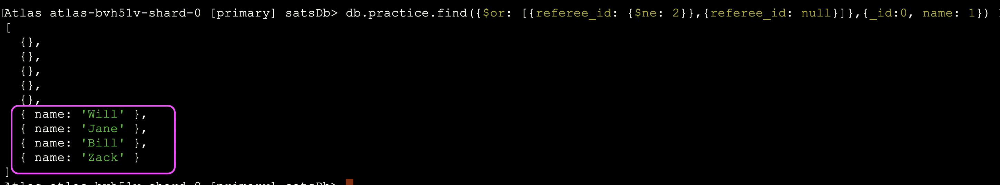

# Exercises from Leetcode - MongoDB


### Exercise # 1

Collection: Products

| Field      | Data type |
|------------|-----------|
| product_id | int       |
| low_fats   | enum      |
| recyclable | enum      |


low_fats is an ENUM (category) of type ('Y', 'N') where 'Y' means this product is low fat and 'N' means it is not.
recyclable is an ENUM (category) of types ('Y', 'N') where 'Y' means this product is recyclable and 'N' means it is not.
 
#### Question 
Write a solution to find the ids of products that are both low fat and recyclable.
Return the result table in any order.
The result format is in the following example.

**Example 1:**

**Input:** 
Products collection:

| product_id | low_fats | recyclable |
|------------|----------|------------|
| 0          | Y        | N          |
| 1          | Y        | Y          |
| 2          | N        | Y          |
| 3          | Y        | Y          |
| 4          | N        | N          |


**Output:** 

| product_id |
|------------|
| 1          |
| 3          |


### Solution  # 1

```MongoDB
db.practice.find({low_fats: 'Y', recyclable: 'Y'},{_id:0, product_id: 1}).sort({product_id: 1})
```


**Explanation:** 
Only products 1 and 3 are both low fat and recyclable.


### Exercise # 2

Collections: Customer

| Field      | Data type |
|------------|-----------|
| id         | int       |
| name       | string    |
| referee_id | int       |


In collection, id is the primary key column for this table.
Each document of this collection indicates the id of a customer,
their name, and the id of the customer who referred them.
 

#### Question 
Find the names of the customer that are either:

1. referred by any customer with id != 2.
2. not referred by any customer.

Return the result in any order.

The result format is in the following example.

**Input:** 

Collections: Customer

| id | name | referee_id |
|----|------|------------|
| 1  | Will | null       |
| 2  | Jane | null       |
| 3  | Alex | 2          |
| 4  | Bill | null       |
| 5  | Zack | 1          |
| 6  | Mark | 2          |


Output:

| name |
|------|
| Will |
| Jane |
| Bill |
| Zack |

### Solution  # 2

```MongoDB
db.practice.find({$or: [{referee_id: {$ne: 2}},{referee_id: null}]},{_id:0, name: 1})
```




### Exercise # 3

Table: World

| Column Name | Type    |
|-------------|---------|
| name        | varchar |
| continent   | varchar |
| area        | int     |
| population  | int     |
| gdp         | bigint  |

"name" is the primary key (column with unique values) for this table.
Each row of this table gives information about the name of a country, 
the continent to which it belongs, its area, the population, and its GDP value.
 
#### Question 

A country is big if:

1. It has an area of at least three million (i.e., 3,000,000 km2), or
2. It has a population of at least twenty-five million (i.e., 25,000,000).

Write a solution to find the name, population, and area of the big countries.

Return the result table in any order.

The result format is in the following example.

Input: 

Collection: world

| name        | continent | area    | population | gdp          |
|-------------|-----------|---------|------------|--------------|
| Afghanistan | Asia      | 652230  | 25500100   | 20343000000  |
| Albania     | Europe    | 28748   | 2831741    | 12960000000  |
| Algeria     | Africa    | 2381741 | 37100000   | 188681000000 |
| Andorra     | Europe    | 468     | 78115      | 3712000000   |
| Angola      | Africa    | 1246700 | 20609294   | 100990000000 |


Output: 

| name        | population | area    |
|-------------|------------|---------|
| Afghanistan | 25500100   | 652230  |
| Algeria     | 37100000   | 2381741 |


###  Solution # 3


```MongoDB
db.world.find({$or: [{country: {$gt: 3000000}}, {population: {$gt: 25000000}}]},{name: 1, population: 1, area: 1, _id: 0})
```


