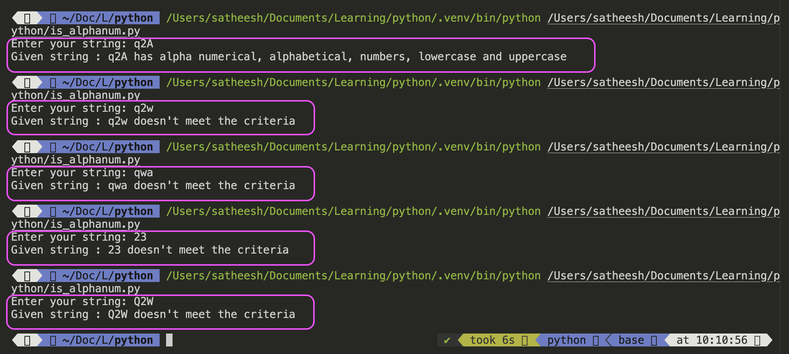
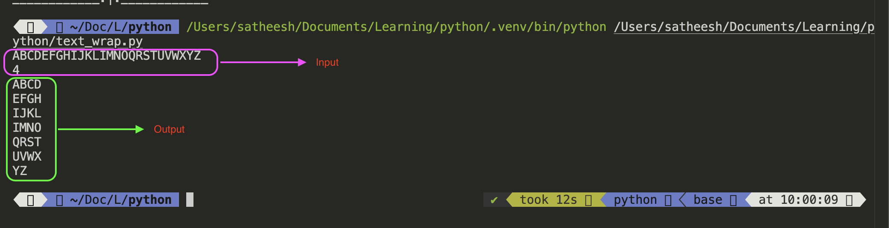
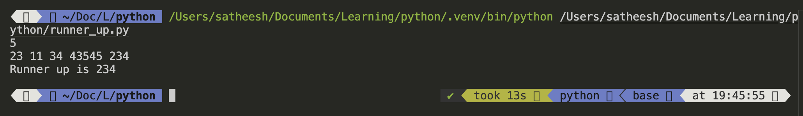

# Exercises from Hackerrank - Python


### Exercise # 1

In this challenge, the user enters a string and a substring. 
You have to print the number of times that the substring occurs in the given string. 
String traversal will take place from left to right, not from right to left.

**NOTE:** String letters are case-sensitive.

**Input Format**


The first line of input contains the original string. The next line contains the substring.

**Constraints**

```Python
1 <= len(string) <= 200
```
Each character in the string is an ascii character.

**Output Format**

Output the integer number indicating the total number of occurrences of the substring in the original string.

**Sample Input**

```Python
ABCDCDC
CDC
```

**Sample Output**

```Python
2
```

### Solution  # 1

```Python
#######################################################################################################################################
# LOGIC: 
# You need to slice the given string with the length of substring from starting and compare the sliced string with given substring.
# If it matches, increase the count. Else, move the next position of the string and start slicing until it reaches the difference of both string length

# TO DO:
# 1. Initiate occurance count as 0. Get the length of both strings
# 2. Find out the difference of these length. You need to loop from 0 to this length
# 3. Slice the string from 0 to length of the substring.
# 4. Compare it with substring. If matches, increase the occurance count. Else, run the loop again
# 5. Now, get the slice from position 1 to length of the substring and do the step 4. This will continue until the loop ends
# 6. Return the occurance count.

#######################################################################################################################################

#######################################################################################################################################
# Function name: count_substring
# Arguments: given_string, given_sub_string
# Return: number_of_occurrance
# Description : Slice / Compare / Return

#######################################################################################################################################

def count_substring(given_string, given_sub_string):
	number_of_occurrance = 0
	# Find the length of the given inputs
	length_of_string = len(given_string) # 7
	length_of_sub_string = len(given_sub_string) # 3

	# Find the difference of length of the given inputs
	difference = length_of_string - length_of_sub_string # 4
	
	# Loop through
	for position in range(0, difference + 1): # 0 1 2 3 4
		# Slice the string with length of the substring
		# print(f"{given_string[position : position + (difference - 1)]}")
		# Compare the slice with substring
		if (given_string[position : position + (difference - 1)] == given_sub_string): # 0:3 => 012 , 1:4=>123 .. so on
			number_of_occurrance += 1 # Increase the count
	
	return number_of_occurrance # return the count


#######################
# Program starts here
#######################

if __name__ == "__main__":
	# Get the strings
	given_string = input(f"Enter your string : " ) # ABCDCDC
	given_sub_string = input(f"Enter your substring to find : ") # CDC

	# Call the function
	count = count_substring(given_string, given_sub_string)

	# Print the result
	print(f"Give substring : {given_sub_string} is occurred {count} times in the given string : {given_string}")

#######################
# Program ends here
#######################

```


### Exercise # 2

You are given a string.
Your task is to find out if the string contains: alphanumeric characters,
alphabetical characters, digits, lowercase and uppercase characters.

**Input Format**

A single line containing a string.

**Constraints**

```Python
0 < len(S) < 1000
```


**Output Format**

In the first line, print True if it has any alphanumeric characters.
Otherwise, print False.
In the second line, print True if it has any alphabetical characters.
Otherwise, print False.
In the third line, print True if it has any digits.
Otherwise, print False.
In the fourth line, print True if it has any lowercase characters.
Otherwise, print False.
In the fifth line, print True if it has any uppercase characters.
Otherwise, print False.

**Sample Input**

```Python
q2A
```

**Sample Output**

```Python
True
True
True
True
True
```


### Solution  # 2

```Python
#######################################################################################################################################
# LOGIC: 
# Use the string built in methods to check if the characters of the string is either alphanumerical, alphabets, digits, lower case and upper case characters
# If all the charactrs meet any one of the category, then return it as True. 

# TO DO:
# 1. Get the input string
# 2. Loop through each character of the string
# 3. Check if the character is either alphanumerical, alphabets, digits, lower case and upper case characters
# 4. If so, make the category is True
# 5. Check if all the category changes to True. If so, return string validation as True. Else, return as False.
# 6. Return string validation

#######################################################################################################################################

#######################################################################################################################################
# Function name: check_string_validator
# Arguments: given_string
# Return: String validation as boolean value
# Description : Check if the string has alphanumerical, alphabets, digits, lower case and upper case characters 

#######################################################################################################################################


def check_string_validator(given_string):
  string_validation = False
  alnum_validation = False
  alpha_validation = False
  digit_validation = False
  lower_validation = False
  upper_validation = False

  for char in given_string: # Get each character of the string
    if char.isalnum(): # Check if the character is alphanumerical
      alnum_validation = True
    if char.isalpha(): # Check if the character is alphabets
      alpha_validation = True
    if char.isdigit(): # Check if the character is digits
      digit_validation = True
    if char.islower(): # Check if the character is lower case letter
      lower_validation = True
    if char.isupper():# Check if the character is upper case letter 
      upper_validation = True   

  # Check if all conditions met or not
  if (alnum_validation == True and alpha_validation == True and digit_validation == True and lower_validation == True and upper_validation == True):
    string_validation = True

  return string_validation

#######################
# Program starts here
#######################

if __name__ == '__main__':
  given_string = input("Enter your string: ") # Get the input string
  if check_string_validator(given_string) == True: # validate if it meets the condition
    print(f"Given string : {given_string} has alpha numerical, alphabetical, numbers, lowercase and uppercase")
  else:
    print(f"Given string : {given_string} doesn't meet the criteria")

#######################
# Program ends here
#######################
```



### Lessons Learnt

1. char.isalnum()
```
This method will check if the character is alphanumerical
```
2. char.isalpha()
```
This method will check if the character is alphabets
```
3. char.isdigit()
```
This method will check if the character is digits
```
4. char.islower()
```
This method will check if the character is lower case letter
```
5. char.isupper()
```
This method will check if the character is upper case letter
```


### Exercise # 3

**Task**

You are given a partial code that is used for generating the HackerRank Logo of variable thickness.
Your task is to replace the blank (______) with rjust, ljust or center.

**Input Format**

A single line containing the thickness value for the logo.

**Constraints**

```Python
0 < thickness < 50
```
The thickness must be an odd number.

**Output Format**

Output the desired logo.

**Sample Input**

```Python
5
```
**Sample Output**

```Python
    H    
   HHH   
  HHHHH  
 HHHHHHH 
HHHHHHHHH
  HHHHH               HHHHH             
  HHHHH               HHHHH             
  HHHHH               HHHHH             
  HHHHH               HHHHH             
  HHHHH               HHHHH             
  HHHHH               HHHHH             
  HHHHHHHHHHHHHHHHHHHHHHHHH   
  HHHHHHHHHHHHHHHHHHHHHHHHH   
  HHHHHHHHHHHHHHHHHHHHHHHHH   
  HHHHH               HHHHH             
  HHHHH               HHHHH             
  HHHHH               HHHHH             
  HHHHH               HHHHH             
  HHHHH               HHHHH             
  HHHHH               HHHHH             
                    HHHHHHHHH 
                     HHHHHHH  
                      HHHHH   
                       HHH    
                        H 
```

### Solution  # 3

```Python
#######################################################################################################################################
# LOGIC: 
# 
# 
# TO DO:
# 1. Get the input number for the pillar thickness
# 2. Divide the logo into 5 different layers (Top Cone, Top Pillar, Middle Pillar, Lower Pilar, Bottom Cone)
# 3. Top Cone should loop through till thickness to form the Cone (first line 1 char, 2nd line 3 char and so on)
# 4. To form top pillar, loop through the thickness and place them in center with the gap. 
# 5. To form middle pillar, loop through the half of thickness and place them in center without the gap. 
# 6. To form bottome pillar, loop through the thickness and place them in center with the gap.
# 7. To form bottom cone, loop through the thickness and do the reverse order (first line 7 char, 2nd line 5 char and so on)

#######################################################################################################################################

#######################
# Program starts here
#######################

thickness = int(input()) #This must be an odd number
c = 'H'

#Top Cone
for i in range(thickness):
    print((c*i).rjust(thickness-1)+c+(c*i).ljust(thickness-1))

#Top Pillars
for i in range(thickness+1):
    print((c*thickness).center(thickness*2)+(c*thickness).center(thickness*6))

#Middle Belt
for i in range((thickness+1)//2):
    print((c*thickness*5).center(thickness*6))    

#Bottom Pillars
for i in range(thickness+1):
    print((c*thickness).center(thickness*2)+(c*thickness).center(thickness*6))    

#Bottom Cone
for i in range(thickness):
    print(((c*(thickness-i-1)).rjust(thickness)+c+(c*(thickness-i-1)).ljust(thickness)).rjust(thickness*6))

#######################
# Program ends here
#######################
```


### Lessons Learnt

1. string.center(width)
```
This method will place the string in the center. 
Before and after string, space will be there
```
2. string.ljust(width, character)
```
This method will place the string in the left. 
After string, mentioned character will be there
```
3. string.rjust(width, character)
```
This method will place the string in the right. 
Before string, mentioned character will be there
```

### Exercise # 4

**Task**

You are given a string and width w.
Your task is to wrap the string into a paragraph of width w.

**Function Description**

Complete the wrap function in the editor below.
wrap has the following parameters:

string string: a long string
int max_width: the width to wrap to

**Returns**

string: a single string with newline characters ('\n') where the breaks should be

**Input Format**

The first line contains a string, string.

The second line contains the width, maxwidth.

**Constraints**

```Python
0 < len(string) < 1000

0 < max width < len(string)
```


**Sample Input**

```Python
ABCDEFGHIJKLIMNOQRSTUVWXYZ
4
```
**Sample Output**

```Python
ABCD
EFGH
IJKL
IMNO
QRST
UVWX
YZ
```

### Solution  # 4

```Python
#######################################################################################################################################
# LOGIC: 
# 
# 
# TO DO:
# 1. Get the input string and width to use to split the string
# 2. use the built-in method textwrap.fill to split the string
# 3. Return the output string

#######################################################################################################################################

#######################
# Program starts here
#######################

import textwrap


#######################################################################################################################################
# Function name: wrap
# Arguments: given_string and the length to be wrapped
# Return: String 
# Description : Get the string and splits the string with the number of characters given by the width as an input

#######################################################################################################################################

def wrap(string, max_width):
    return textwrap.fill(string, max_width) # This will wrap the given string 
   # return textwrap.wrap(string, max_width) # This will split the string and save it as a list

if __name__ == '__main__':
    string, max_width = input(), int(input())
    result = wrap(string, max_width)
    print(result)

#######################
# Program ends here
#######################
```


### Lessons Learnt

1. textwrap.fill(string, max_width)
```
This method will wrap the given string.
This will wrap the string with the given max_width
```
2. textwrap.fill(string, max_width)
```
This method will wrap the given string.
This will wrap the string as a list of array with the given max_width
```

### Exercise # 5

**Task**

Mr. Vincent works in a door mat manufacturing company.
One day, he designed a new door mat with the following specifications:
1. Mat size must be N x M. (N is an odd natural number, and M is 3 times N.)
2. The design should have 'WELCOME' written in the center.
3. The design pattern should only use |, . and - characters.


**Sample Designs**

'''
Size: 7 x 21 
    ---------.|.---------
    ------.|..|..|.------
    ---.|..|..|..|..|.---
    -------WELCOME-------
    ---.|..|..|..|..|.---
    ------.|..|..|.------
    ---------.|.---------
'''

**Input Format**

A single line containing the space separated values of N and M.


**Constraints**

```Python
5 < N < 101

15 < M < 303
```

**Output Format**

Output the design pattern.

**Sample Input**

```Python
9 27
```
**Sample Output**

```Python
------------.|.------------
---------.|..|..|.---------
------.|..|..|..|..|.------
---.|..|..|..|..|..|..|.---
----------WELCOME----------
---.|..|..|..|..|..|..|.---
------.|..|..|..|..|.------
---------.|..|..|.---------
------------.|.------------
```

### Solution  # 5

```Python
#######################################################################################################################################
# LOGIC: 
# You need to split three different portions
#         1. Top Portion where design starts from 1 to mid of the height
#         2. Middle Portion where design prints WELCOME in the center
#         3. Bottom Portion where design starts from mid of the height to end of the height
#
# TO DO:
# Top Portion
#         1. Find out the middle of the height (height // 2)
#         2. Loop through till width (0 to width - 1)
#         3. Check the loop value is greater than middle of the height. If not, print the design
#         4. If the loop value is greater than middle of the height. Don't do anything
#
# Middle Portion
#         1. Just print WELCOME design as it is only one row. So we took reminder of the value and print it
#
# Bottom Portion
#         1. Find out the middle of the height (height // 2)
#         2. Loop through till width (width to 0)
#         3. Check the loop value is greater than middle of the height. If so, don't do anything
#         4. If the loop value is greater than middle of the height. If not, print design
#
#######################################################################################################################################

#######################
# Program starts here
#######################

if __name__ == '__main__':
    height, width = input().split() # 9 27
    width = int(width) # 27
    height = int(height) # 9
    char ='.|.' # Height character
    another_char = '_' # Width character
    welcome_note = 'WELCOME' # Middle portion string
    
  ############################################################################################
  # It should be 4 rows as height (height // 2)
  # 1st row should have only one '.|.' character. 2nd row should have three '.|.' characters. 
  # This will increase 2 chracters from there till end of the height // 2.
  ############################################################################################
    # top portion
    for numberOfTimesToPrint in range(width): # 0..26
      if numberOfTimesToPrint < height//2: # 0 < 4 .. 3 < 4
        print((char * ((2 * numberOfTimesToPrint) + 1)).center(width, another_char)) 
    
    # middle portion
    for numberOfTimesToPrint in range(height % 2 ):
        print(("WELCOME").center(width, another_char))

  ############################################################################################
  # It should be 4 rows as height (height // 2)
  # 1st row should have (4 * 2) - 1 => 7 '.|.' characters. 2nd row should have five '.|.' characters. 
  # This will decrease 2 chracters from there till end of the height.
  ############################################################################################
    # botom portion
    for numberOfTimesToPrint in range(width, 0, -1): # 0..26
      if numberOfTimesToPrint <= height//2: # 4 <= 4 .. 1 <= 4 # 0 will not go as it is excluded in range loop
        print((char * ((2 * numberOfTimesToPrint) -1)).center(width, another_char))     


#######################
# Program ends here
#######################

```


### Lessons Learnt

1. string.center(width)
```
This method will place the string in the center. 
Before and after string, space will be there
```
2. string.center(width, character)
```
This method will place the string in the center. 
Before and after string, mentioned character will be there
```
3. When you run the loop to form design, divide the design into multiple portions
4. The Top portion is always incremental way in the loop
5. The Bottom portion is always decremental way in the loop


### Exercise # 6

Given an integer, print the following values for each integer i from 1 to n:

1. Decimal
2. Octal
3. Hexadecimal (capitalized)
4. Binary

**Function Description**

Complete the print_formatted function in the editor below.

print_formatted has the following parameters:

int number: the maximum value to print
Prints

The four values must be printed on a single line in the order specified above for each i from 1 to number. 
Each value should be space-padded to match the width of the binary value of number,
and the values should be separated by a single space.

**Input Format**

A single integer denoting n.

**Constraints**

1 <= n <= 99

**Sample Input**

```Python
17
```
**Sample Output**

```Python
    1     1     1     1
    2     2     2    10
    3     3     3    11
    4     4     4   100
    5     5     5   101
    6     6     6   110
    7     7     7   111
    8    10     8  1000
    9    11     9  1001
   10    12     A  1010
   11    13     B  1011
   12    14     C  1100
   13    15     D  1101
   14    16     E  1110
   15    17     F  1111
   16    20    10 10000
   17    21    11 10001
```

### Solution  # 6

```Python
#######################################################################################################################################
# LOGIC: 
# 1. Get the binary format length
# 2. Loop through till the given number
# 3. Format each number in the required format
#
#######################################################################################################################################


#######################################################################################################################################
# Function name: print_formatted
# Arguments: number
# Return: string
# Description : Get the number and loop through the until the number and print each number < given number in different formats

#######################################################################################################################################

def print_formatted(number):
    binary_number = f"{number:b}"
    width_of_binary_number = len(binary_number)

    for num in range(1, number + 1):
        result = f"{num:d}".rjust(width) + " " + f"{num:o}".rjust(width) + " " + f"{num:X}".rjust(width) + " " + f"{num:b}".rjust(width) + " "
        print(result)
        
#######################
# Program starts here
#######################

if __name__ == '__main__':
  given_input = int(input())
  print_formatted(given_input)

#######################
# Program ends here
#######################

```


### Lessons Learnt

1. To convert the number in to decimal format ⇒ number:d
2. To convert the number in to octal format ⇒ number:o
3. To convert the number in to hexa format ⇒ number:x. For capital hexa format ⇒ number:X
4. To convert the number in to binary format ⇒ number:b


 
### Exercise # 7: Find the Runner-Up Score!

Given the participants' score sheet for your University Sports Day, you are required to find the runner-up score. 
You are given scores.Store them in a list and find the score of the runner-up.

**Input Format**

The first line contains n. The second line contains an array A[] of n integers each separated by a space.


**Constraints**

2 <= n <= 10

-100 <= A[i] <= 100

**Output Format**

Print the runner-up score.

**Sample Input**

```Python
5
2 3 6 6 5
```
**Sample Output**

```Python
5
```

### Solution  # 7

```Python
#######################################################################################################################################
# LOGIC: 
# 1. Get the input numbers
# 2. Convert them into a list
# 3. Sort the list
# 4. Loop through from last number to first number of the list.
# 5. Compare first two values and if it is not equal, then second last number is the runner up. Else, continue the loop
#
#######################################################################################################################################
        
#######################
# Program starts here
#######################

if __name__ == '__main__':
    n = int(input())
    arr = map(int, input().split())
    arr = list(arr)
    sorted_list = sorted(arr)
    for num in range((len(sorted_list) - 1), -1, -1):
        if sorted_list[num] != sorted_list[num - 1]:
            print(sorted_list[num - 1])
            break

#######################
# Program ends here
#######################

```



### Lessons Learnt

1. map function is used to read multiple numbers from one line.
2. input().split() ⇒ Splits the string by spaces
3. sorted(list) ⇒ Sorts the array in ascending order
4. sorted (list, reverse=True)⇒ Sorts the array in descending order


