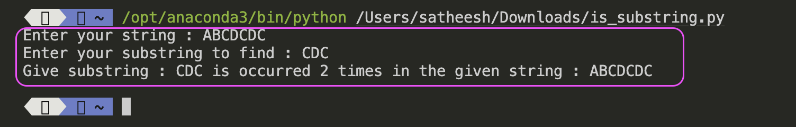

# Exercises from Hackerrank - Python


### Exercise # 1

In this challenge, the user enters a string and a substring. 
You have to print the number of times that the substring occurs in the given string. 
String traversal will take place from left to right, not from right to left.

**NOTE:** String letters are case-sensitive.

**Input Format**


The first line of input contains the original string. The next line contains the substring.

**Constraints**

```Python
1 <= len(string) <= 200
```
Each character in the string is an ascii character.

**Output Format**

Output the integer number indicating the total number of occurrences of the substring in the original string.

**Sample Input**

```Python
ABCDCDC
CDC
```

**Sample Output**

```Python
2
```

### Solution  # 1

```Python
#######################################################################################################################################
# LOGIC: 
# You need to slice the given string with the length of substring from starting and compare the sliced string with given substring.
# If it matches, increase the count. Else, move the next position of the string and start slicing until it reaches the difference of both string length

# TO DO:
# 1. Initiate occurance count as 0. Get the length of both strings
# 2. Find out the difference of these length. You need to loop from 0 to this length
# 3. Slice the string from 0 to length of the substring.
# 4. Compare it with substring. If matches, increase the occurance count. Else, run the loop again
# 5. Now, get the slice from position 1 to length of the substring and do the step 4. This will continue until the loop ends
# 6. Return the occurance count.

#######################################################################################################################################

#######################################################################################################################################
# Function name: count_substring
# Arguments: given_string, given_sub_string
# Return: number_of_occurrance
# Description : Slice / Compare / Return

#######################################################################################################################################

def count_substring(given_string, given_sub_string):
	number_of_occurrance = 0
	# Find the length of the given inputs
	length_of_string = len(given_string) # 7
	length_of_sub_string = len(given_sub_string) # 3

	# Find the difference of length of the given inputs
	difference = length_of_string - length_of_sub_string # 4
	
	# Loop through
	for position in range(0, difference + 1): # 0 1 2 3 
		# Slice the string with length of the substring
		# print(f"{given_string[position : position + (difference - 1)]}")
		# Compare the slice with substring
		if (given_string[position : position + (difference - 1)] == given_sub_string): # 
			number_of_occurrance += 1 # Increase the count
	
	return number_of_occurrance # return the count


#######################
# Program starts here
#######################

if __name__ == "__main__":
	# Get the strings
	given_string = input(f"Enter your string : " ) # ABCDCDC
	given_sub_string = input(f"Enter your substring to find : ") # CDC

	# Call the function
	count = count_substring(given_string, given_sub_string)

	# Print the result
	print(f"Give substring : {given_sub_string} is occurred {count} times in the given string : {given_string}")

#######################
# Program ends here
#######################

```




### Exercise # 2

You are given a string.
Your task is to find out if the string contains: alphanumeric characters,
alphabetical characters, digits, lowercase and uppercase characters.

**Input Format**

A single line containing a string.

**Constraints**

```Python
0 < len(S) < 1000
```


**Output Format**

In the first line, print True if it has any alphanumeric characters.
Otherwise, print False.
In the second line, print True if it has any alphabetical characters.
Otherwise, print False.
In the third line, print True if it has any digits.
Otherwise, print False.
In the fourth line, print True if it has any lowercase characters.
Otherwise, print False.
In the fifth line, print True if it has any uppercase characters.
Otherwise, print False.

**Sample Input**

```Python
q2A
```

**Sample Output**

```Python
True
True
True
True
True
```


### Solution  # 2

```Python
#######################################################################################################################################
# LOGIC: 
# Use the string built in methods to check if the characters of the string is either alphanumerical, alphabets, digits, lower case and upper case characters
# If all the charactrs meet any one of the category, then return it as True. 

# TO DO:
# 1. Get the input string
# 2. Loop through each character of the string
# 3. Check if the character is either alphanumerical, alphabets, digits, lower case and upper case characters
# 4. If so, make the category is True
# 5. Check if all the category changes to True. If so, return string validation as True. Else, return as False.
# 6. Return string validation

#######################################################################################################################################

#######################################################################################################################################
# Function name: check_string_validator
# Arguments: given_string
# Return: String validation as boolean value
# Description : Check if the string has alphanumerical, alphabets, digits, lower case and upper case characters 

#######################################################################################################################################


def check_string_validator(given_string):
  string_validation = False
  alnum_validation = False
  alpha_validation = False
  digit_validation = False
  lower_validation = False
  upper_validation = False

  for char in given_string: # Get each character of the string
    if char.isalnum(): # Check if the character is alphanumerical
      alnum_validation = True
    if char.isalpha(): # Check if the character is alphabets
      alpha_validation = True
    if char.isdigit(): # Check if the character is digits
      digit_validation = True
    if char.islower(): # Check if the character is lower case letter
      lower_validation = True
    if char.isupper():# Check if the character is upper case letter 
      upper_validation = True   

  # Check if all conditions met or not
  if (alnum_validation == True and alpha_validation == True and digit_validation == True and lower_validation == True and upper_validation == True):
    string_validation = True

  return string_validation

#######################
# Program starts here
#######################

if __name__ == '__main__':
  given_string = input("Enter your string: ") # Get the input string
  if check_string_validator(given_string) == True: # validate if it meets the condition
    print(f"Given string : {given_string} has alpha numerical, alphabetical, numbers, lowercase and uppercase")
  else:
    print(f"Given string : {given_string} doesn't meet the criteria")

#######################
# Program ends here
#######################
```

### Exercise # 3

**Task**

You are given a partial code that is used for generating the HackerRank Logo of variable thickness.
Your task is to replace the blank (______) with rjust, ljust or center.

**Input Format**

A single line containing the thickness value for the logo.

**Constraints**

```Python
0 < thickness < 50
```
The thickness must be an odd number.

**Output Format**

Output the desired logo.

**Sample Input**

```Python
5
```
**Sample Output**

```Python
    H    
   HHH   
  HHHHH  
 HHHHHHH 
HHHHHHHHH
  HHHHH               HHHHH             
  HHHHH               HHHHH             
  HHHHH               HHHHH             
  HHHHH               HHHHH             
  HHHHH               HHHHH             
  HHHHH               HHHHH             
  HHHHHHHHHHHHHHHHHHHHHHHHH   
  HHHHHHHHHHHHHHHHHHHHHHHHH   
  HHHHHHHHHHHHHHHHHHHHHHHHH   
  HHHHH               HHHHH             
  HHHHH               HHHHH             
  HHHHH               HHHHH             
  HHHHH               HHHHH             
  HHHHH               HHHHH             
  HHHHH               HHHHH             
                    HHHHHHHHH 
                     HHHHHHH  
                      HHHHH   
                       HHH    
                        H 
```


```Python
#######################################################################################################################################
# LOGIC: 
# 
# 
# TO DO:
# 1. Get the input number for the pillar thickness
# 2. Divide the logo into 5 different layers (Top Cone, Top Pillar, Middle Pillar, Lower Pilar, Bottom Cone)
# 3. Top Cone should loop through till thickness to form the Cone (first line 1 char, 2nd line 3 char and so on)
# 4. To form top pillar, loop through the thickness and place them in center with the gap. 
# 5. To form middle pillar, loop through the half of thickness and place them in center without the gap. 
# 6. To form bottome pillar, loop through the thickness and place them in center with the gap.
# 7. To form bottom cone, loop through the thickness and do the reverse order (first line 7 char, 2nd line 5 char and so on)

#######################################################################################################################################

#######################
# Program starts here
#######################

thickness = int(input()) #This must be an odd number
c = 'H'

#Top Cone
for i in range(thickness):
    print((c*i).rjust(thickness-1)+c+(c*i).ljust(thickness-1))

#Top Pillars
for i in range(thickness+1):
    print((c*thickness).center(thickness*2)+(c*thickness).center(thickness*6))

#Middle Belt
for i in range((thickness+1)//2):
    print((c*thickness*5).center(thickness*6))    

#Bottom Pillars
for i in range(thickness+1):
    print((c*thickness).center(thickness*2)+(c*thickness).center(thickness*6))    

#Bottom Cone
for i in range(thickness):
    print(((c*(thickness-i-1)).rjust(thickness)+c+(c*(thickness-i-1)).ljust(thickness)).rjust(thickness*6))

#######################
# Program ends here
#######################
```