# Box Model

Most of the website HTML elements are layed out as a box. Box surrounds each HTML element.

### Height HTML Element

```html
  <body>
    <p>Bangalore</p>
    <br />
    <p id="sats">Satheesh</p>
    <br />
    <p>Pandian</p>
  </body>
```

```html
#sats{
    height: 100px
}
```

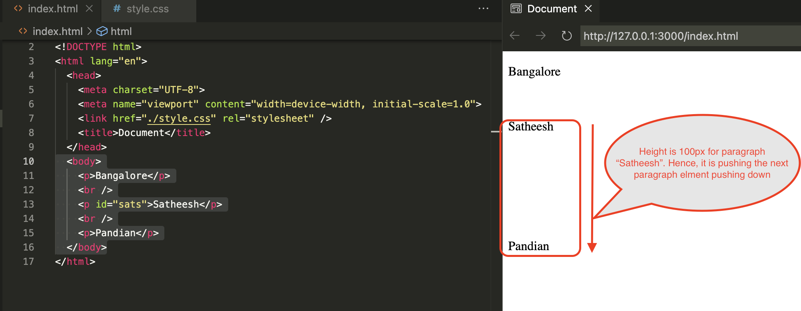

### Width HTML Element

```html
  <body>
    
    <p>Satheesh Pandian</p>
  </body>
```

```html
#app-image{
    width: 200px
}
```

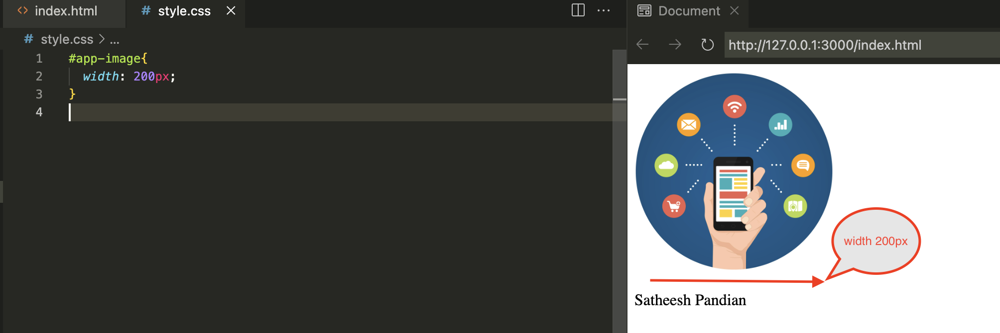

```html
#app-image{
    width: 50px
}
```

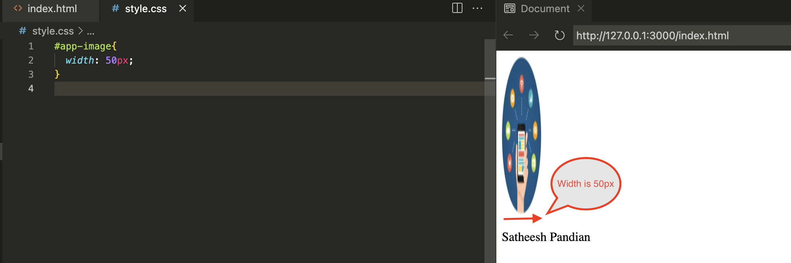

Remember
***
- Height and width properties can be mentioned as pixel values (px) or percentage (%).

Ex: 
```html
#app-image{
    width: 50px;
    height: 200px;
}
```
```html
#app-image{
    width: 60%;
    height: 70%;
}
```
***

### Border HTML Element

```html
  <body>
    <p>Bangalore</p>
    <p id="sats">Satheesh</p> 
    <p>Pandian</p>
  </body>
```
```html
#sats{
    border: 10px solid black
}
```

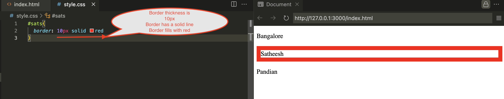

`
If border property value is increased, it will extend outwwards only. It will not affect height and width of the element inside in it.
`

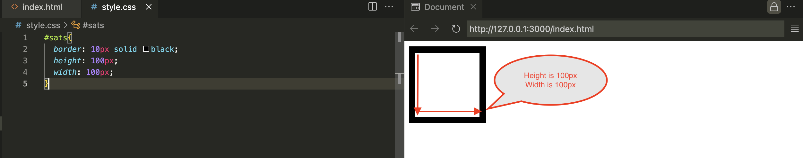

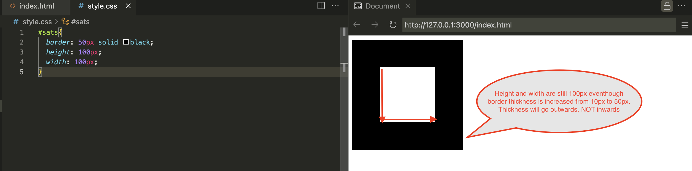

We can change or remove any border line thickness 

```html
  <body>
   <div id="sats"></div>
  </body>
```

```html
#sats{
  border: 50px solid black;
  border-bottom: 0px;
  height: 100px;
  width: 100px;
  background-color: red;
}
```
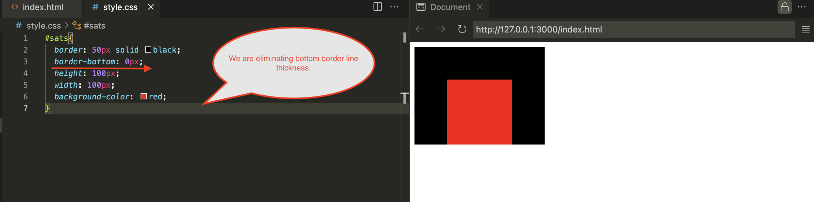

Border width property is working clockwise.

```html

```html
  <body>
   <div id="sats"></div>
  </body>
```

```html
#sats{
  border: 50px solid black;
  border-width: 10px 20px 30px 40px;
  height: 100px;
  width: 100px;
  background-color: red;
}
```

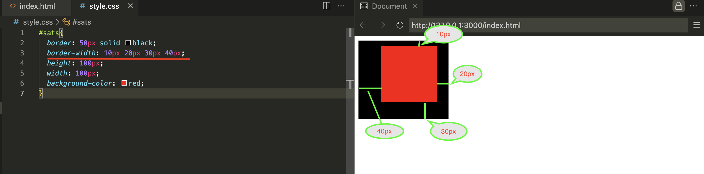

Border width property may have two values alone.

```html

```html
  <body>
   <div id="sats"></div>
  </body>
```

```html
#sats{
  border: 50px solid black;
  border-width: 30px 60px;
  height: 100px;
  width: 100px;
  background-color: red;
}
```

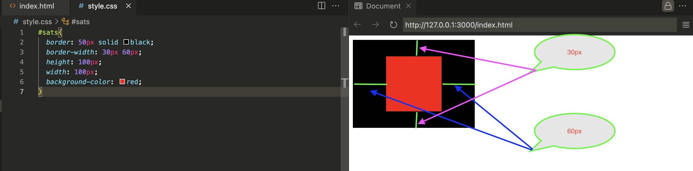

### Padding HTML Element

Padding element is the space between border and HTML element inside in it.
It pushes the border with padding property value.
However, it does not impact the height and width of an element inside in it.

```html
  <body>
   <div id="sats">
       <p>Satheesh Pandian Jeganathan</p>
   </div>
  </body>
```
```html
#sats{
  border: 5px solid black;
  height: 100px;
  width: 100px;
  background-color: red;
  padding: 10px;
}
```

In this example, padding pushes the border to 10px outwards.

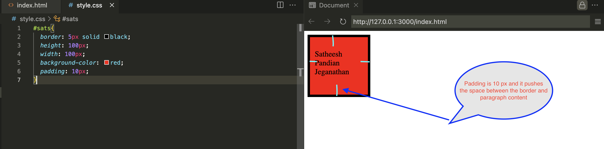

In this example, padding pushes the border to 100px outwards.

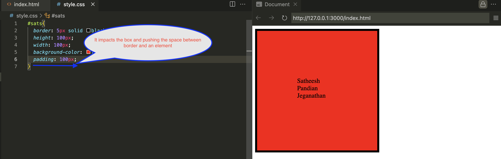

### Margin HTML Element

Margin is the space between the body and the border of the element. 

```html
  <body>
   <div id="sats">
    <p id="app">Satheesh Pandian Jeganathan</p>
   </div>
  </body>
```
```html
#sats{
  margin: 80px;
  border: 30px solid black;
  height: 100px;
  width: 100px;
  background-color: red;
  padding: 100px;
}

#app{
  border: 5px solid blue;
}
```

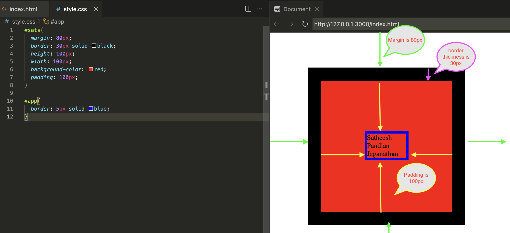

Remember
***
All three properties
(border, padding, and margin can have 4 values or 2 values. It will be clockwise, and it starts from the top.)

**4 values**
```html
border: 10px 20px 30px 40px
margin: 10px 20px 30px 40px
padding: 10px 20px 30px 40px
```

**2 values**

Top and bottom are grouped and right/left are grouped
```html
border: 10px 20px
margin: 10px 20px
padding: 10px 20px
```
***

### Content Division Element

We can group the boxes using the div element. This element is invisible in the website.

```html
  <body>
   <div id="art">
    <p class="app">Satheesh Pandian Jeganathan</p>
   </div>
   <div class="sats">
    <p class="app">SRE</p>
   </div>
  </body>
```

```html
.sats{
  border: 30px solid black;
  height: 100px;
  width: 100px;
  background-color: red;
  padding: 10px;
}

#art{
  border: 30px solid orange;
  background-color: blue;
  height: 100px;
  width: 100px;
  padding: 10px;
}

```

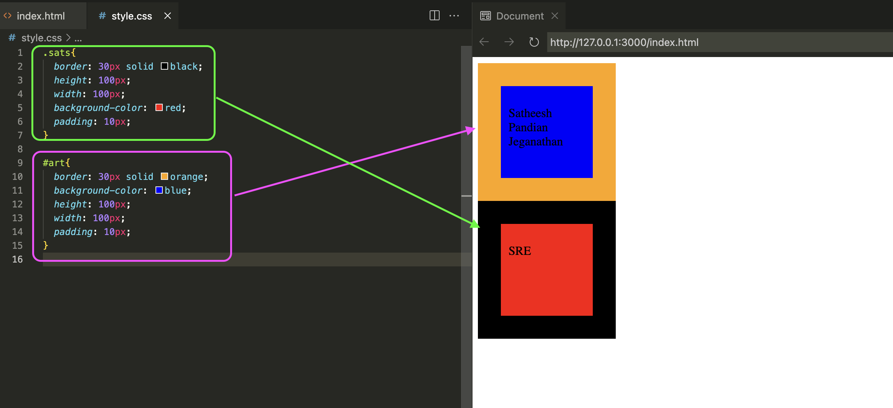

