# Order of Style

Let's say, if there are two CSS implementations mentioned for one HTML document, 
then which CSS rule will be applied to that HTML element. 
The order of style implementation matters when you work with CSS.
There are four other important rules to implement CSS rules in the HTML document.

**1. Position**

The position where the rule defines matter. The latest CSS rule will be applied in the HTML document.

```html
<html>
<head>
    <link rel="stylesheet" href="./style.css">
    <style>
        li {
            color: blue;
            color:yellowgreen
        }
    </style>
</head>

<body>
    <ul>
        <li style="color:red">Satheesh</li>
        <li>Pandian</li>
        <li>Jeganathan</li>
    </ul>
</body>
</html>
```

In the above case, text color is two different colors (blue and yellow-green).
When we implement this rule, yellow-green will be implemented as it is the latest rule (from TOP to BOTTOM approach)

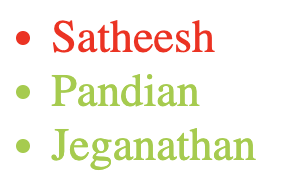

Let us assume it, if there are two rules created for same `li` component like below

```html
    <style>
        li {
            color: blue;
            color: yellowgreen
        }

        li {
            color: brown;
            color: orangered
        }
    </style>
```
In the above case, orangered is the latest color (from TOP to BOTTOM), and it will be implemented in `li` HTML element.

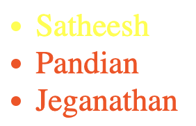

**Summary:**

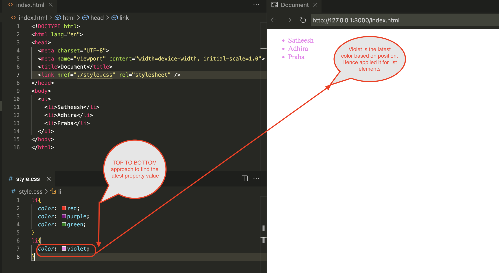

**2. Specificity** 

Based on how specific a selector is applied CSS rule.

**Priority order**

1. ID
2. Attribute
3. Class
4. HTML element

**Example**

```html
<html>
<head>
    <link rel="stylesheet" href="./style.css">
</head>
<body>
    <ul>
        <li id="satheesh" draggable="true" class="satheesh-class">Satheesh</li>
        <li>Pandian</li>
        <li>Jeganathan</li>
    </ul>
</body>
</html>
```

```css
li {
  color: green;
}
li[draggable] {
  color: yellow;
}
#satheesh {
  color: red;
}
.satheesh-class {
  color: blue;
}
```
In the above example, there are four rules applied in the list # 1 component. 
Out of these four rules, ID takes high priority. 
Hence, it is displayed in red color.

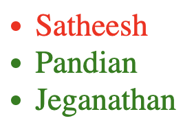

```html
<html>
<head>
    <link rel="stylesheet" href="./style.css">
</head>
<body>
    <ul>
        <li draggable="true" class="satheesh-class">Satheesh</li>
        <li>Pandian</li>
        <li>Jeganathan</li>
    </ul>
</body>
</html>
```

In the above example, there are three rules applied in the list # 1 component. 
Out of these three rules, Attribute (draggable) takes high priority. 
Hence, it is displayed in yellow color.

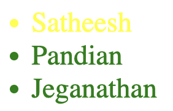


```html
<html>
<head>
    <link rel="stylesheet" href="./style.css">
</head>
<body>
    <ul>
        <li class="satheesh-class">Satheesh</li>
        <li>Pandian</li>
        <li>Jeganathan</li>
    </ul>
</body>
</html>
```
In the above example, there are two rules applied in the list # 1 component. 
Out of these two rules, class takes high priority. 
Hence, it is displayed in blue color.

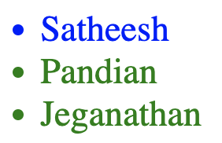


**Summary**

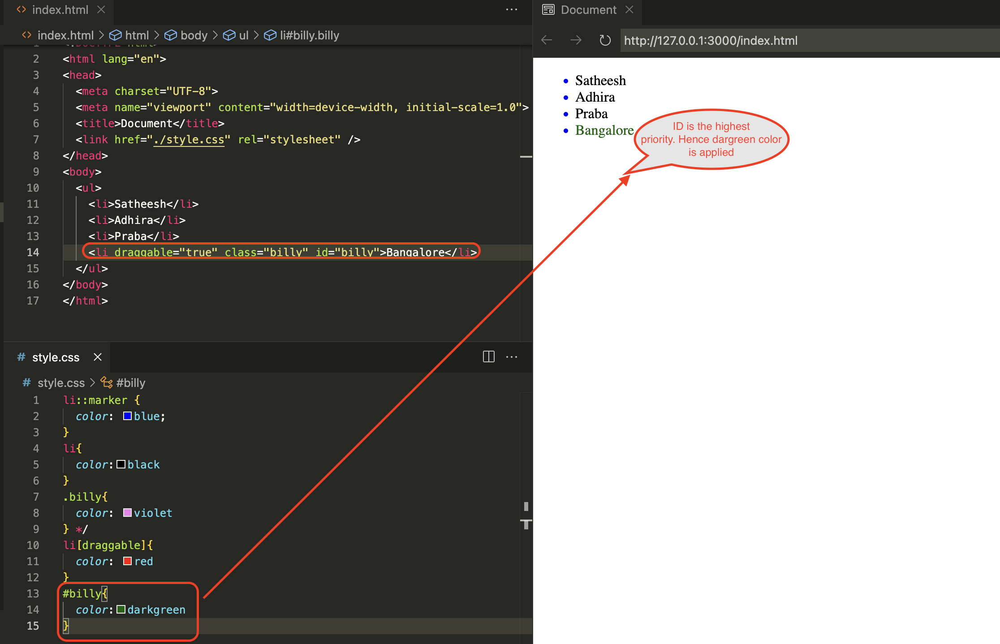

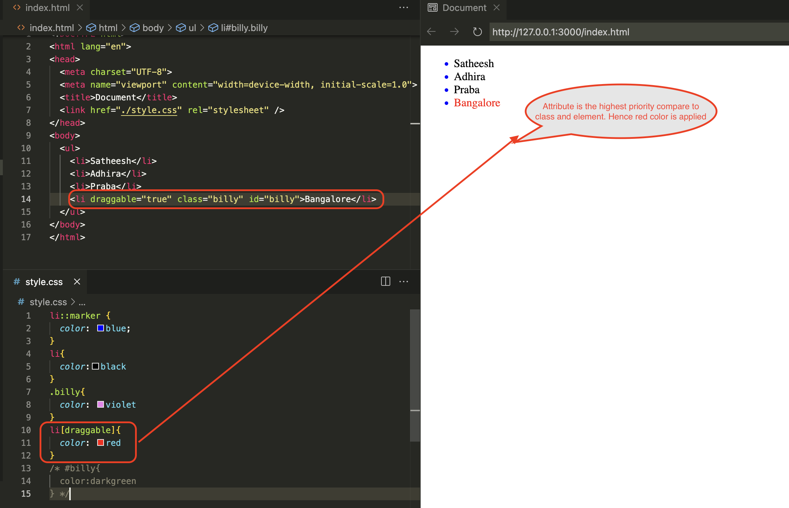

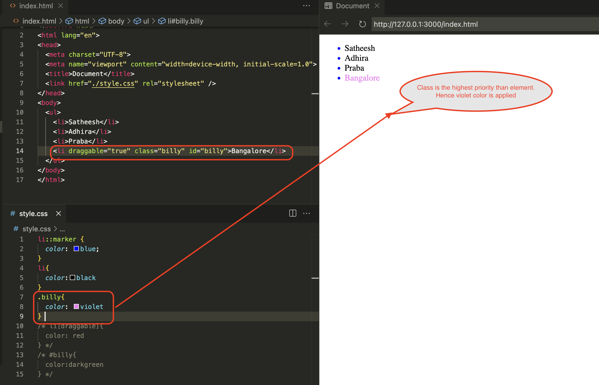


**3. Type of the style**

* Inline style takes the highest priority
* Internal style takes next place
* External style takes the least priority out of these three.


**Example**

```html
<html>

<head>
    <link rel="stylesheet" href="./style.css">
    <style>
        li {
            color: blue
        }
    </style>
</head>

<body>
    <ul>
        <li style="color:red">Satheesh</li>
        <li>Pandian</li>
        <li>Jeganathan</li>
    </ul>
</body>

</html>
```

```html
li {
  color: green;
}
```
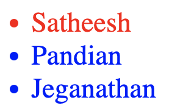

**Explanation**

Though external CSS style rule for `li` component color is green, internal CSS style rule is applied for list # 2 and 3. 
This is because internal style takes more priority than external style.
At the same time,
list # 1 color is red because it takes inline style rule which is higher priority than internal and external style.

**Summary**

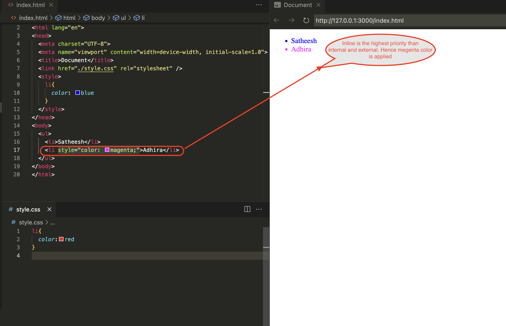

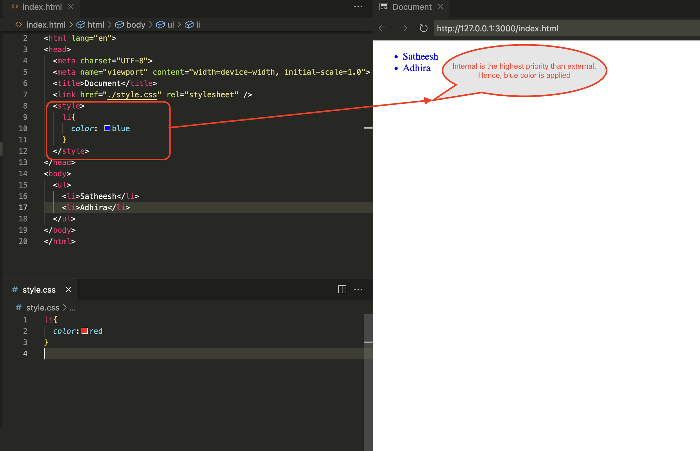

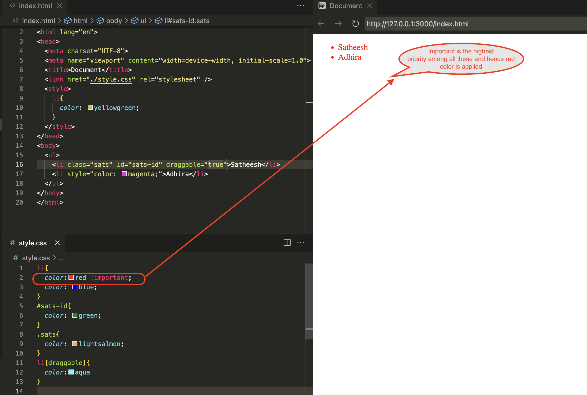

**4. Importance**

When `important` keyword mentioned in the property, this takes the highest priority compared to all other cases.

```css
li[draggable] {
  color: yellow;
}
#satheesh {
  color: red;
}
.satheesh-class {
  color: blue;
}
li {
  color: brown;
  color:#17fa07a3 !important;
}
```

```html
<html>
<head>
    <link rel="stylesheet" href="./style.css">
</head>
<body>
    <ul>
        <li id="satheesh" class="satheesh-class" draggable="true">Satheesh</li>
        <li>Pandian</li>
        <li>Jeganathan</li>
    </ul>
</body>
</html>
```

In the above example, all the rules applied in the list are #1 component.
Out of all these rules, `important` takes high priority. 
Hence, it is displayed in green color. 
Note, as `important` keyword applied in the list component, it applies all the list values.


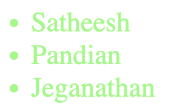


Remember

***
If all the rules are applied in the HTML element, the priority order is

1. Importance
2. Type
3. Specificity
4. Position

***

# Combining CSS selectors

We can select multiple selectors and apply the rule in a single HTML element or group of elements.

**1. Group Selector** 

Apply both the selectors

**Syntax**
```css
 selector1, selector2 {
    color: firebrick;
}
```

```html
<!DOCTYPE html>
<html lang="en">
<head>
  <meta charset="UTF-8">
  <title>Combining CSS Selectors</title>
  <link rel="stylesheet" href="./style.css">
</head>
<body>
  <h1>To Do List</h1>
  <h2>Monday</h2>
  <div class="box">
    <p class="done">Do these things today!</p>
    <ul class="list">
      <li>Wash Clothes</li>
      <li class="done">Read</li>
      <li class="done">Maths Questions</li>
    </ul>
  </div>
  <ul>
    <p class="done">Other items</p>
  </ul>
  <p>The best preparation for tomorrow is doing your best today.</p>
</body>
</html>
```

If I want to apply different colors ONLY to h1 and h2. Note, you can select `n` number of selectors and group them.

```css
h1,h2 {
    color: blueviolet;
}
```

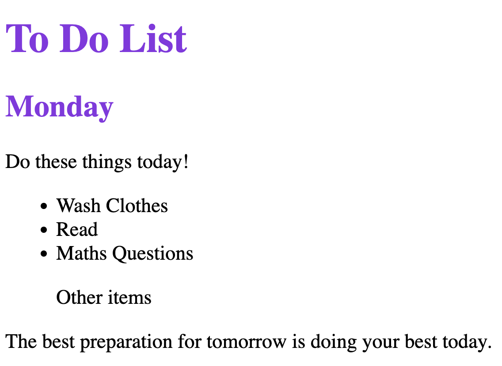

**Summary**

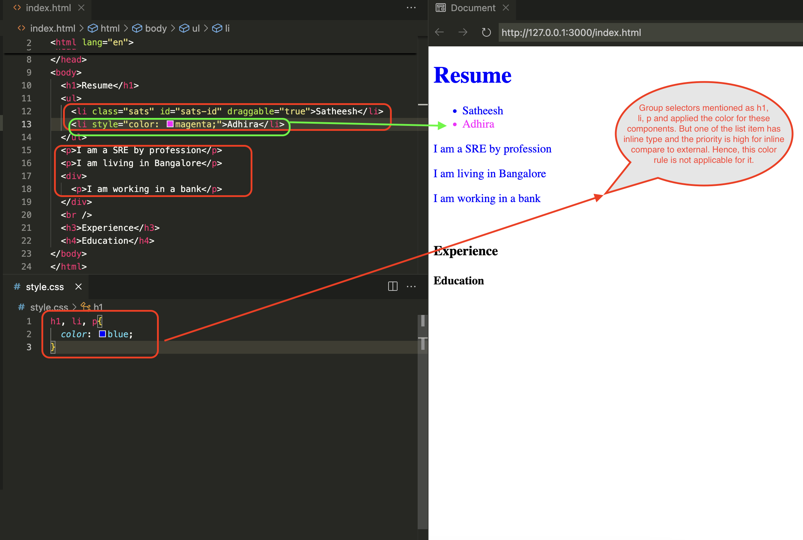

**2. Child** 

This will apply the CSS rule to the direct child element (only one level nested inside means first generation only)

**Syntax**
```css
 Parent > Child {
    color: firebrick;
}
```

```html
<!DOCTYPE html>
<html lang="en">
<head>
  <meta charset="UTF-8">
  <title>Combining CSS Selectors</title>
  <link rel="stylesheet" href="./style.css">
</head>
<body>
  <h1>To Do List</h1>
  <h2>Monday</h2>
  <div class="box">
    <p class="done">Do these things today!</p>
    <ul class="list">
      <li>Wash Clothes</li>
      <li class="done">Read</li>
      <li class="done">Maths Questions</li>
    </ul>
  </div>
  <ul>
    <p class="done">Other items</p>
  </ul>
  <p>The best preparation for tomorrow is doing your best today.</p>
</body>
</html>
```
If I want to apply different color ONLY to `p` which is under `div`. 

**Example**
```css
.box > .done {
  color: firebrick;
}
```

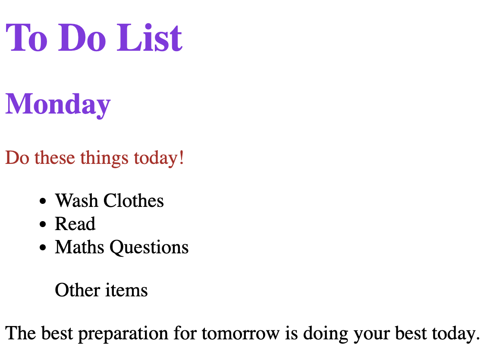


**Summary**

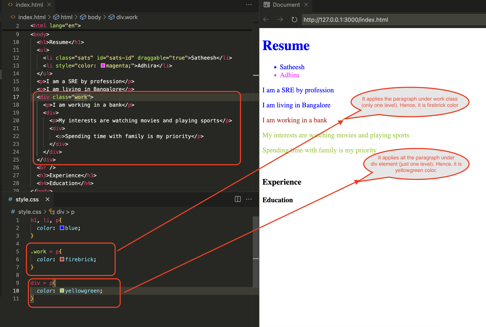


**3. Descendant:** 

This will apply the CSS rule to the all child elements under parent selector (As long as a child element 
comes under parent in any nested level inside)

**Syntax**
```css
 Parent Child {
    color: blue;
}
```

```html
<!DOCTYPE html>
<html lang="en">
<head>
  <meta charset="UTF-8">
  <title>Combining CSS Selectors</title>
  <link rel="stylesheet" href="./style.css">
</head>
<body>
  <h1>To Do List</h1>
  <h2>Monday</h2>
  <div class="box">
    <p class="done">Do these things today!</p>
    <ul class="list">
      <li>Wash Clothes</li>
      <li class="done">Read</li>
      <li class="done">Maths Questions</li>
    </ul>
  </div>
  <ul>
    <p class="done">Other items</p>
  </ul>
  <p>The best preparation for tomorrow is doing your best today.</p>
</body>
</html>
```
If I want to apply different color ONLY to `li` under `div`.

**Example**
```css
.box li{
    color: blue;
}
```
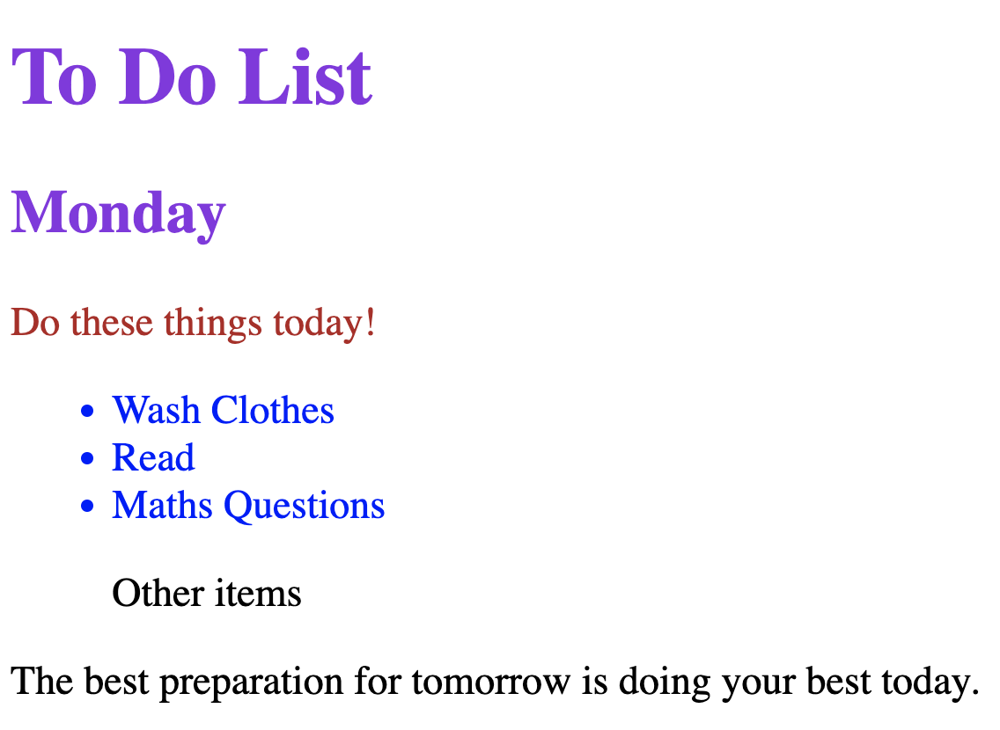

**Summary:**

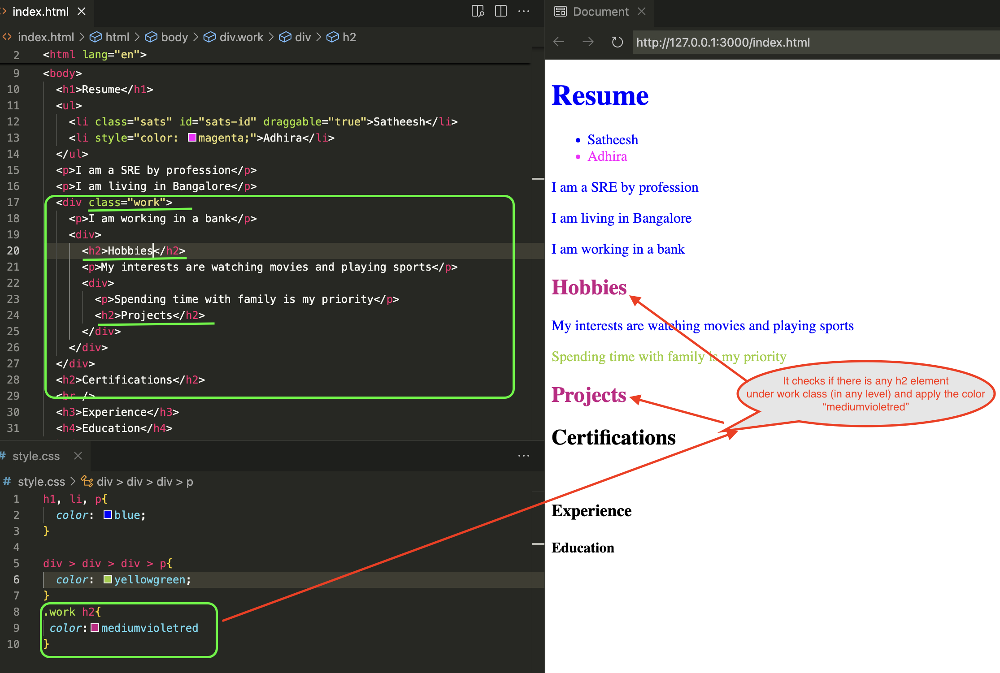


**4. Chaining** 

This will apply the CSS rule to the all selectors are TRUE. 
We can pick a specific element using this selector.
If the content has class, id and element, then the selector rule always starts with an element.

Example:

```html
<h1 id="name" class="sats pan">Satheesh</h1>
<h1 class="sats pan">Pandian</h1>

```
Then if we want to select `Satheesh`, then the CSS rule is

```html
h1#name.sats.pan{
  color: red
}
```

As you see the above CSS code snippets, it starts with h1 element instead of id or class name.


**Syntax**
```css
 selector1selector2 {
    color: seagreen;
}
```

```html
<!DOCTYPE html>
<html lang="en">
<head>
  <meta charset="UTF-8">
  <title>Combining CSS Selectors</title>
  <link rel="stylesheet" href="./style.css">
</head>
<body>
  <h1>To Do List</h1>
  <h2>Monday</h2>
  <div class="box">
    <p class="done">Do these things today!</p>
    <ul class="list">
      <li>Wash Clothes</li>
      <li class="done">Read</li>
      <li class="done">Maths Questions</li>
    </ul>
  </div>
  <ul>
    <p class="done">Other items</p>
  </ul>
  <p>The best preparation for tomorrow is doing your best today.</p>
</body>
</html>
```
If I want to apply different color ONLY to `li` (last two items) under `div`. 

**Example**
```css
.box li{
    color: seagreen;
}
```
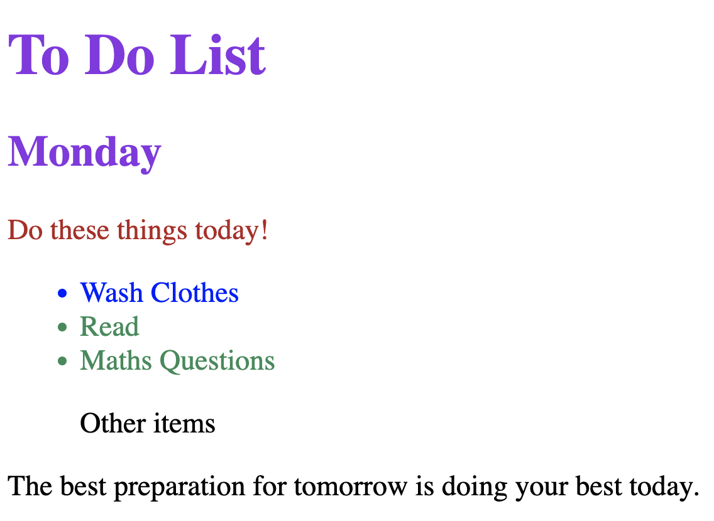

**Summary** 

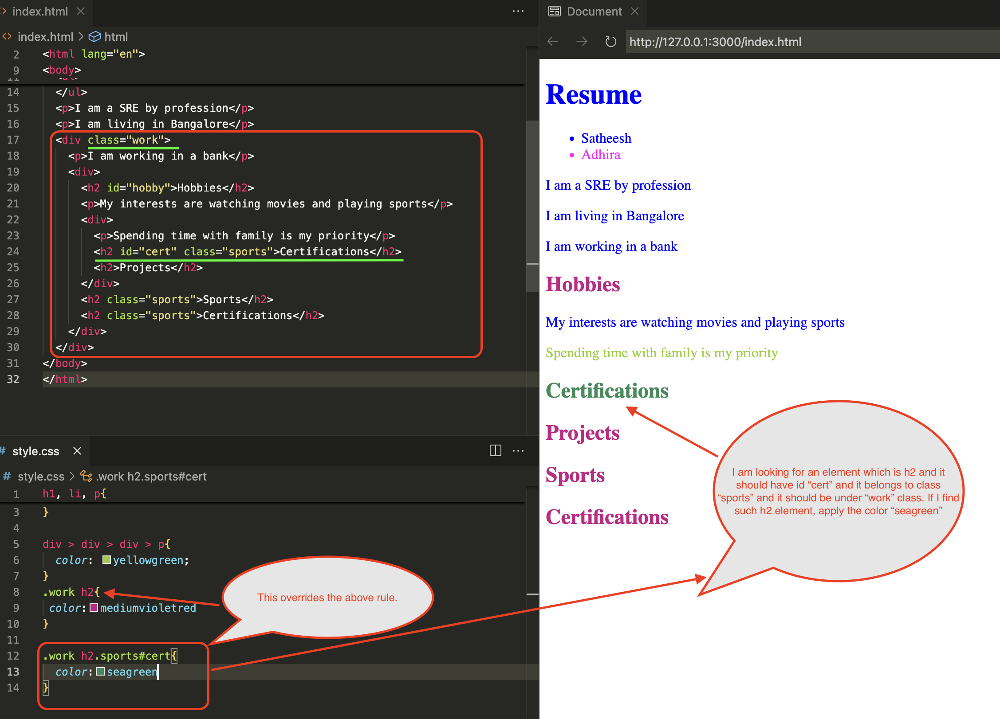

**5. Combine combiners** 

This is similar to descendant. 
However, the first one is ancestor(parent) and the second one is chaining selector

**Syntax**

```css
 selector1 selector2selector3 {
    font-size: 0.5rem;
}
```

```html
<!DOCTYPE html>
<html lang="en">
<head>
  <meta charset="UTF-8">
  <title>Combining CSS Selectors</title>
  <link rel="stylesheet" href="./style.css">
</head>
<body>
  <h1>To Do List</h1>
  <h2>Monday</h2>
  <div class="box">
    <p class="done">Do these things today!</p>
    <ul class="list">
      <li>Wash Clothes</li>
      <li class="done">Read</li>
      <li class="done">Maths Questions</li>
    </ul>
  </div>
  <ul>
    <p class="done">Other items</p>
  </ul>
  <p>The best preparation for tomorrow is doing your best today.</p>
</body>
</html>
```

If I want to apply different font size for `p` and class is `done`

**Example**
```css
ul p.done{
    font-size: 0.5rem;
}
```
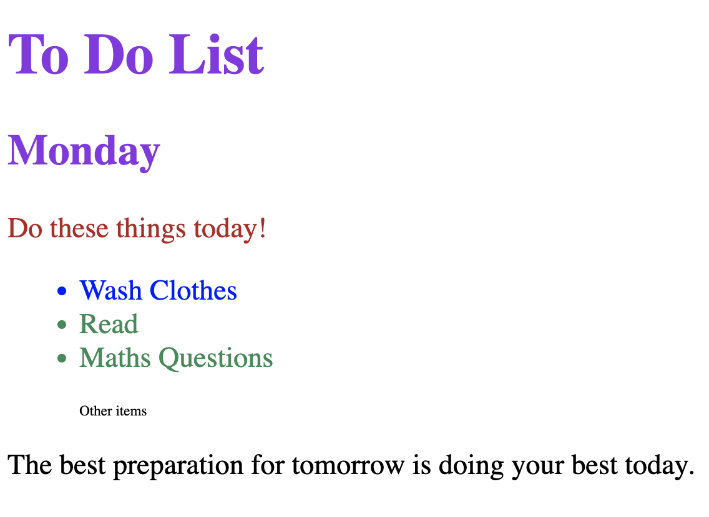

**Summary:**


