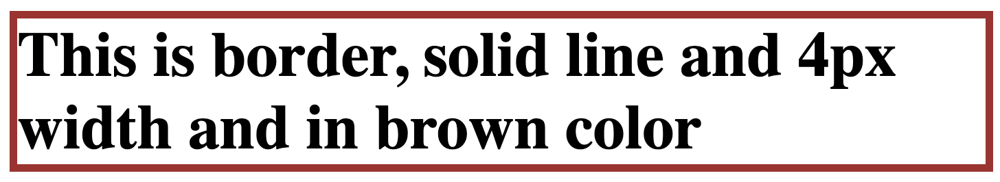
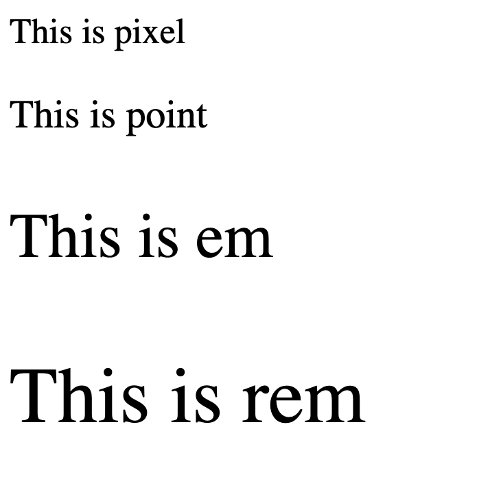
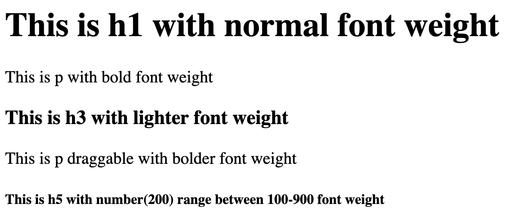

#CSS Colors
In CSS, Colors are specified using predefined color names, HEX, or RGB.

###Color Names
Color can be specified by using a predefined color name. CSS supports 14o color names.
```html
<html>
    <body>
        <h1 style="background-color:blue;">This is blue</h1>
    </body>
</html>
```

There are few commonly used color properties in CSS.
1. `background-color` This is to set the background color of the HTML element
   You can refer the above example for how to set background for h1 element.
2. `color` This is to set the text color of the HTML element
```html
<html>
    <body>
        <h1 style="color:darkgreen;">This is dark green</h1>
    </body>
</html>
```


3. `border` This is use to set the color for the border
```html
<html>
    <body>
        <h1 style="border:4px solid brown;">This is border, solid line and 4px width and in brown color</h1>
    </body>
</html>
```


###Color Values
Colors can also be specified using RGB values, HEX values
####RGB 
```html
<html>
    <body>
        <h1 style="color:rgb(255, 99, 71);">This is RGB color value</h1>
    </body>
</html>
```


####HEX 
```html
<html>
    <body>
        <h1 style="color:#3cb371;">This is HEX color value</h1>
    </body>
</html>
```


##Font Properties
###Font size
Font size is used to define the size of the text.

- 1px (pixel) = 1/96 th of inch
- 1pt (point) = 1/72nd of inch (12pt is equal to MS Word size is 12. In MS Word, pt is mentioned)
- 1em (M) = 100% of the parent size. In below code, 2em means (2 x medium) as `body` is parent of `p`
- 1rem = 100% of the root size (html). In below code, 2rem means (2 x 20px) as `html` is root of `p`
- Named font size is also application such as xx-large, small, medium, and large.
```css
#pixel {
  font-size: 18px;
}
#point {
  font-size: 15pt;
}
#em {
  font-size: 2em;
}
#rem {
  font-size: 2rem;
}
body {
  font-size: medium;
}
html {
  font-size: 20px;
}
```
```html
<html>
   <head>
       <link rel="stylesheet" href="./style.css">
   </head>
   <body>
       <p id="pixel">This is pixel</p>
       <p id="point">This is point</p>
       <p id="em">This is em</p>
       <p id="rem">This is rem</p>
   </body>
</html>
```

###Font weight
Font weight is like bold, normal, lighter (-100), bolder(+100), 100-900
```html
<body>
    <h1>This is h1 with normal font weight</h1>
    <p>This is p with bold font weight</p>
    <h3>This is h3 with lighter font weight</h3>
    <p draggable="true">This is p draggable with bolder font weight</p>
    <h5>This is h5 with number(200) range between 100-900 font weight</h5>
</body>
```
```css
p[draggable] {
  font-weight: bolder;
}
p {
  font-weight: bold;
}
h1 {
  font-weight: normal;
}
h3 {
  font-weight: lighter;
}
h5 {
  font-weight: 200;
}
```


###Font family
This determines how your text look like. There are two values passed to `font-family`. First value is the primary font. In case, if the first font is not available in the system, second font will be picked automatically and second font type is generic type.
```css
h1{
   font-family: "Verdana","sans-serif"
}
```
```html
<body>
    <h1>
       This is h1 with font family of Verdana
    </h1>
</body>
```

###Text align
This determines where your text should be placed. 
```css
h1{
   text-align: "center"
}
```
```html
<body>
    <h1>
       This is h1 aligning at center
    </h1>
</body>
```
