# CSS Display

By default, all the element display property is block scope. It means that it occupies the entire row space.

```html
<p>Satheesh</p><p>Pandian</p>
```

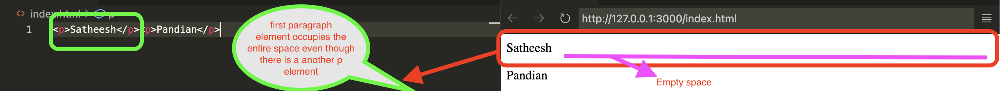

`Span` element is different and by default the display scope of a span element is inline. 

```html
<p>Satheesh Pandian is a <span>SRE professional from</span></p><p>Bangalore</p>
```
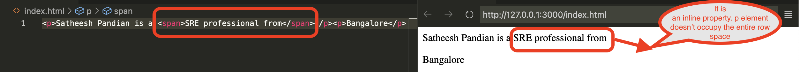

There are three commonly used display properties even though there are many display properties.

1. block
2. inline
3. inline-block

**block**

By default, almost all elements have block display scope.
It means it occupies the entire row space.
You cannot increase the width of property

**inline** 

The elements go in the same line next to each other.
It cannot increase width and height properties.
You cannot set the size for the element.
It just fits the element size.

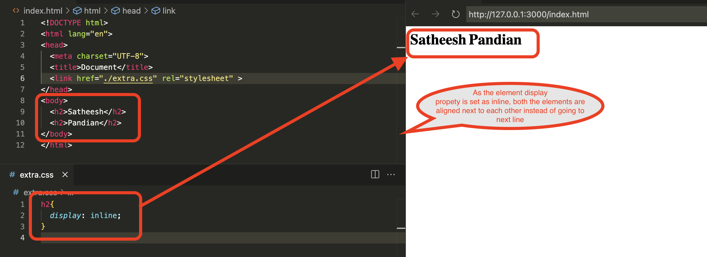

**inline-block** 

The elements go in the same line next to each other,
and at the same time it can increase height and width properties as well.

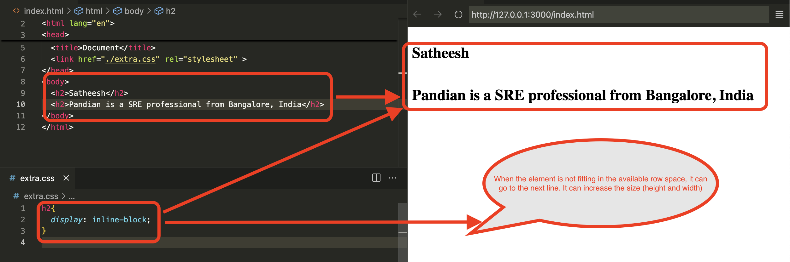

`If display property sets as none, then the element will be disappeared from the website.`

## CSS Float

When you have an image element and another element,
another element will go down or up based on the place where it is defined.
Another element never wraps around the image element.
If we wanted to wrap around the image, we need to use `float` property to the image element.

```html
<!DOCTYPE html>
<html lang="en">
<head>
  <meta charset="UTF-8">
  <title>Document</title>
  <link href="./extra.css" rel="stylesheet" >
</head>
<body>
  
  <p>Lorem Ipsum is simply dummy text of the printing and typesetting industry. 
    Lorem Ipsum has been the industry's standard dummy text ever since the 1500s, 
    when an unknown printer took a galley of type and scrambled it to make a type specimen book. 
    It has survived not only five centuries, but also the leap into electronic typesetting, remaining essentially unchanged. 
    It was popularised in the 1960s with the release of Letraset sheets containing 
    Lorem Ipsum passages, and more recently with desktop publishing software like Aldus 
    PageMaker including versions of Lorem Ipsum.</p>
</body>
</html>
```

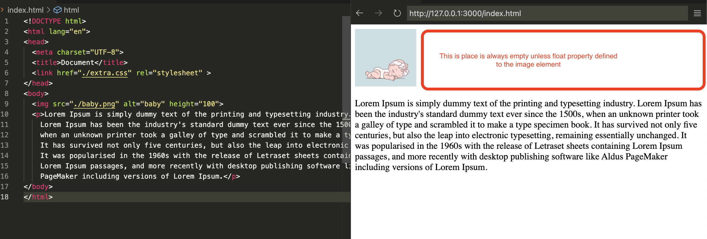

```html
img{
    float: left;
}
```

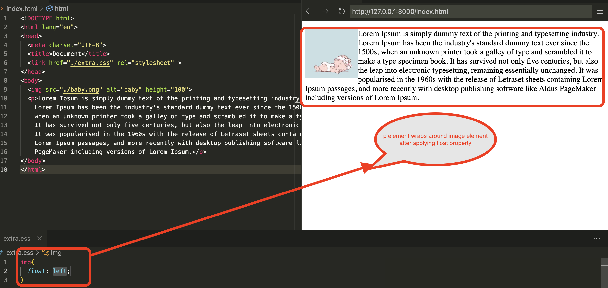


Let us assume that we have a footer element paced around image.

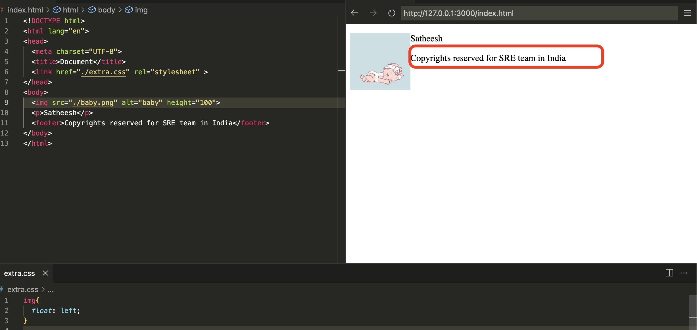

However, a footer element should be placed across the page.
In order to achieve this, we need to use `clear` property to the footer element.

```html
footer{
clear: left;  /* Based on the image alignment, the value will change (left/right/both) /*
}
```

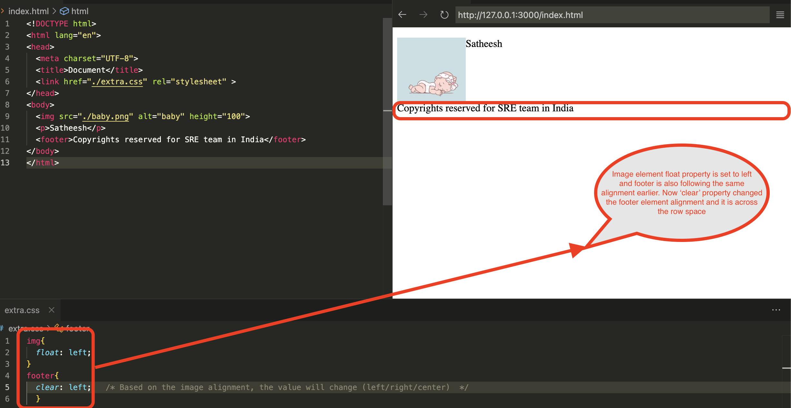

`Remember that we can apply float property to any element to place them in the website`


## Create Responsive Websites

Below are the main ways to create a responsive websites.

1. Media Queries
2. CSS Grid
3. CSS Flexbox
4. Bootstrap


### Media Queries

This is working based on the screensize.
If we set the screensize and if the screensize goes below to the size,
then we need to provide another CSS configuration to refer for that screensize.
We can use min width as well.

```html
 @media (max-width: 600px) {

      /* CSS for screens below or equal to 600px wide */
      div {
        height: 200px;
        width: 200px;
      }
    }
```

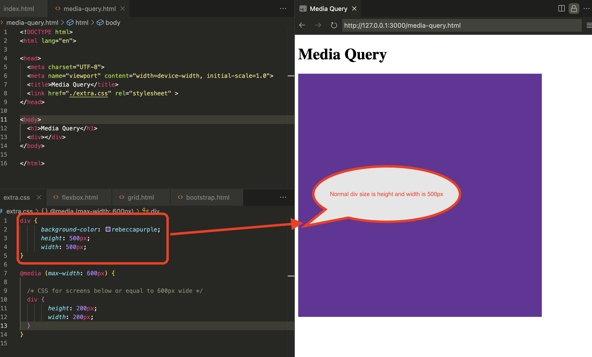

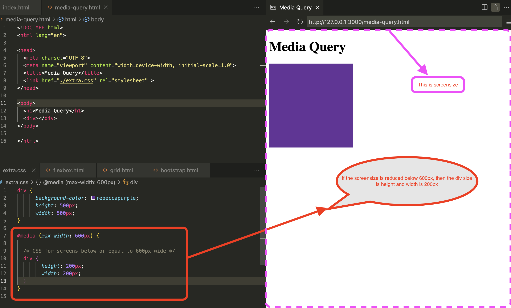


### CSS Grid

CSS Grid will divide the screen in 2D format (Horizontally and Vertically). The screen is divided into columns and rows.
Then elements will be placed in those columns and rows.
When the screensize reduces, the website automatically reduces the column and row values.

```html
.grid-container {
  display: grid; /* This is what defines the website is GRID */ 
  grid-template-columns: 1fr 1fr; /*1fr means 1 fraction */
  grid-template-rows: 100px 200px 200px;
  gap: 30px;
}

```

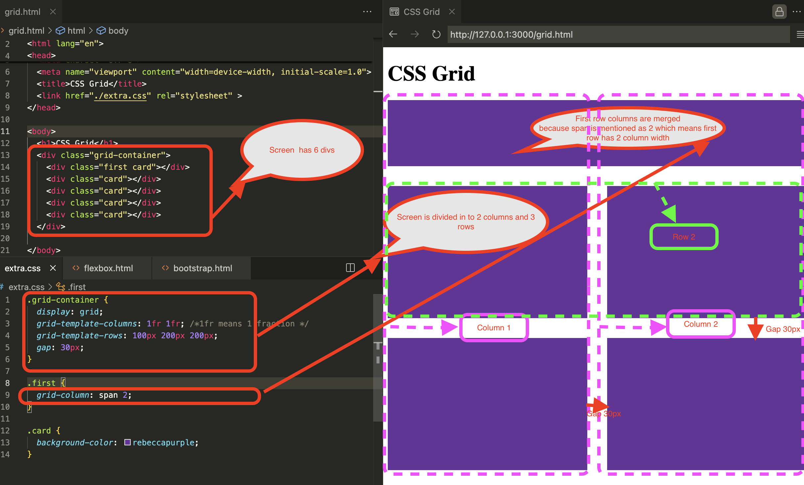


### CSS Flexbox

CSS Flexbox will divide the screen either horizontally or vertically (Basically 1D layout).
The screen is divided into boxes. Then elements will be placed in those boxes.
When the screensize reduces, the website automatically reduces the boxes.

```html
.card {
  display: flex
  background: rebeccapurple;
  border: 30px solid black;
  height: 100px;
  flex: 1;
}
```

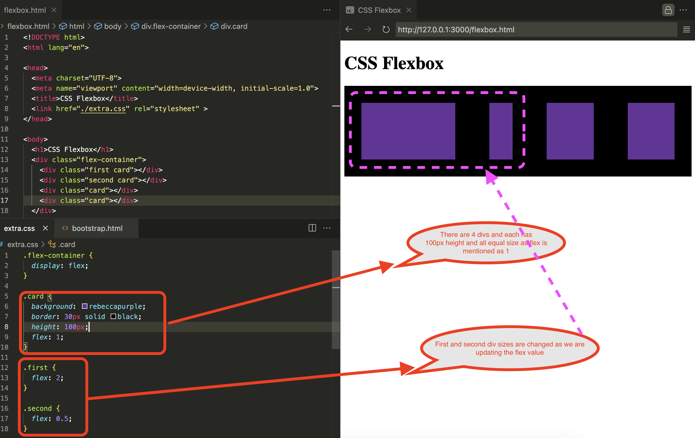


### Bootstrap Framework

The Website is divided 12 different columns, and the code has already been written for those columns.
As it is an external framework, all the code is already packaged, and we are just using them to build the layout.

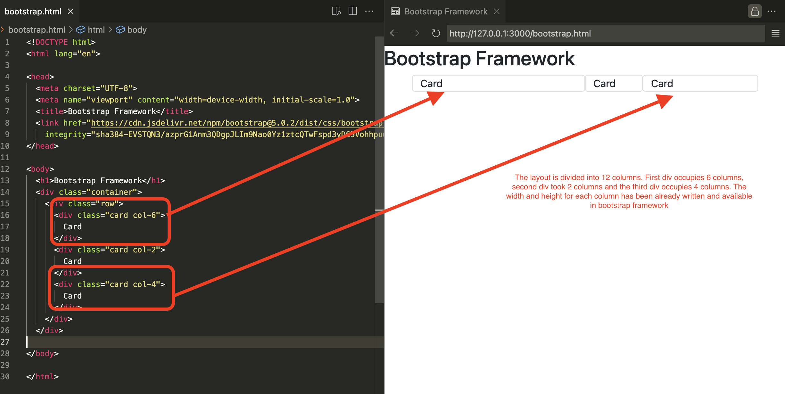