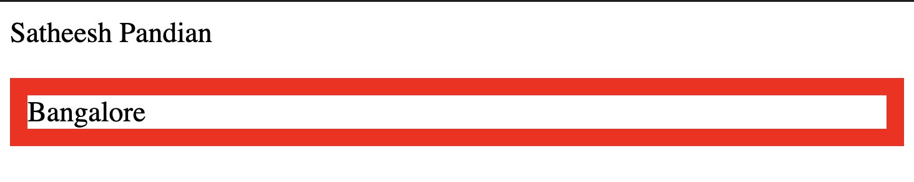
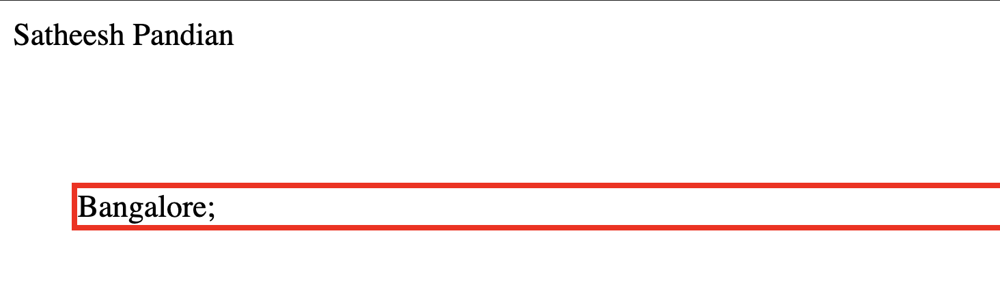
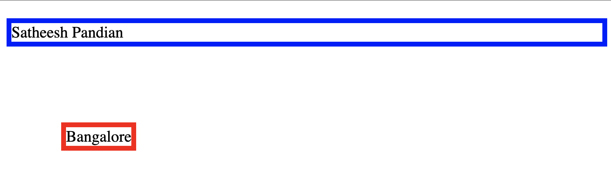
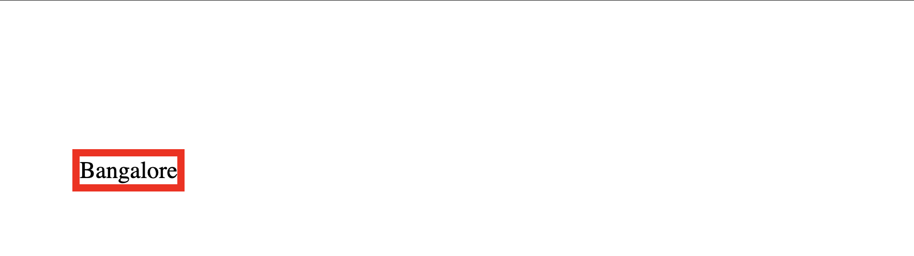
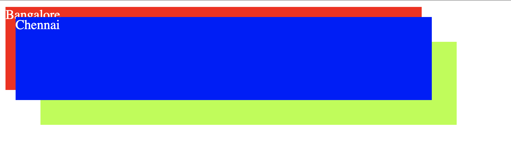

#CSS Positioning
The position property specifies the type of positioning method used for an element. 
Elements are then positioned using the top, bottom, left, and right properties. However, these properties will not work unless the position property is set first. They also work differently depending on the position value.


`1. Static Positioning` This is HTML default view. Static positioned elements are not affected by the top, bottom, left, and right properties.
```html
<html>
    <head>
        <style>
            div.static {
              position: static;
              border: 3px solid red;
            }
        </style>
    </head>
    <body>
        <p>Satheesh Pandian</p>
        <div class="static">
            Bangalore;
        </div>
    </body>
</html>

```
In the above example, `Bangalore` element is placed in default position which is top left corner of the browser.



`2. Relative Positioning` An element is positioned relative to its normal position.
```html
<html>
    <head>
        <style>
            div.static {
              position: relative;
              border: 3px solid red;
              left: 30px;
              top: 50px;
              right: 100px;
            }
        </style>
    </head>
    <body>
        <p>Satheesh Pandian</p>
        <div class="static">
            Bangalore;
        </div>
    </body>
</html>

```
In the above example, `Bangalore` element is placed in relative position to its default position. Also, the relative position is 30px from left and 50px from top.



`3. Absolute Positioning` An element is positioned relative to the nearest positioned ancestor, or it uses top left corner of the web page (When there is no ancestor).
```html
<html>
    <head>
        <style>
            div.static {
              position: absolute;
              border: 5px solid red;
              left: 50px;
              top: 100px;
            }
            .para-clss {
                position: relative;
                border: 5px solid blue;
                top: 10px;
            }
        </style>
    </head>
    <body>
        <div class="para-clss">Satheesh Pandian
            <div class="static">
                Bangalore
            </div>
        </div>
    </body>
</html>

```
In the above example, `Bangalore` element is placed based on its ancestor `para-class` element. Also, 50px from left and 110px from top (10px from its ancestor and 100px from this element class).



`4. Fixed Positioning` An element is positioned from top left corner of the web page. When you scroll the page, this fixed HTML element also displayed along with scroll (which means this element will display all the time in the screen in the same position).
```html
<html>
    <head>
        <style>
            div.static {
                position: fixed;
                border: 5px solid red;
                left: 50px;
                top: 100px;
            }
        </style>
    </head>
    <body>
        <div class="para-clss">
        <div class="static">
            Bangalore
        </div>
        </div>
    </body>
</html>

```
In the above example, `Bangalore` element is placed 50px from left and 100px from top.



####Z index
When elements are positioned, they can overlap other elements. `z-index` property specifies which element should be placed in front of, or behind, the others. It can be  positive or negative. If two positioned elements overlap each other without a z-index specified,
the element defined last in the HTML code will be shown on top.
```html
<html>

<head>
    <style>
        .bangalore {
            position: absolute;
            background: red;
            color: white;;
            height: 100px;
            width: 500px;
            z-index: 1;
        }

        .chennai {
            position: absolute;
            color: white;
            background: blue;
            height: 100px;
            width: 500px;
            top: 20px;
            left: 20px;
            z-index: 2;
        }

        .mumbai {
            position: absolute;
            background: greenyellow;
            height: 100px;
            width: 500px;
            top: 50px;
            left: 50px;
            z-index: -1;
        }
    </style>
</head>

<body>
    <div class="para-clss">
        <div class="bangalore">Bangalore</div>
        <div class="chennai">Chennai</div>
        <div class="mumbai">Mumbai</div>
    </div>
</body>

</html>
```
In the above example, class `chennai` has highest `z-index` value and hence it is displayed top of all other components. class `mumbai` has the least `z-index` value than other elements. Hence, it is behind than all other elements.



