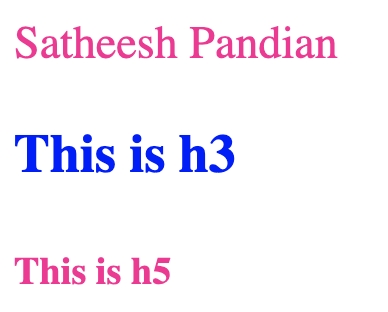
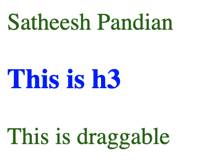
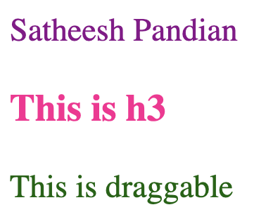

#CSS Selectors
###Normal selector
```html
<head>
    <link href="./style.css" rel="stylesheet">
</head>

<body>
    <h3>This is h3</h3>
    <p>Satheesh Pandian</p>
</body>
```
```css
h3 {
  color: blue;
}
p {
  color: red;
}
```
In the above example, h3 and p are called as selectors as they are updated in CSS file and changing the property based on the value mentioned in CSS file. 


###Class selector(.)
<mark>You can select any HTML element as a normal selector</mark>
```html linenums="1"
<head>
    <link href="./style.css" rel="stylesheet">
</head>

<body>
    <h3>This is h3</h3>
    <p class="class-name">Satheesh Pandian</p>
</body>
```
```css 
h3 {
  color: blue;
}
p {
  color: red;
}
.class-name{
    color: violet
}
```


In the above example, though `p` element is defined in CSS file, `class-name` value has been applied due to high priority.

class selector starts with `.` in the CSS file. <mark>You can apply class name to multiple HTML elements.</mark>
```html
<head>
    <link href="./style.css" rel="stylesheet">
</head>

<body>
    <p class="class-name">Satheesh Pandian</p>
    <h3>This is h3</h3>
    <h5 class="class-name">This is h5</h5>
</body>
```
```css 
h3 {
  color: blue;
}
p {
  color: red;
}
.class-name{
    color: deeppink
}
```


###ID selector (#)
```html linenums="1"
<head>
    <link href="./style.css" rel="stylesheet">
</head>

<body>
    <h3>This is h3</h3>
    <p id="satheesh-id">Satheesh Pandian</p>
</body>
```
```css 
h3 {
  color: blue;
}
p {
  color: red;
}
#satheesh-id{
    color: darkorange
}
```
ID selector starts with `#` in the CSS file. This is unique, and <mark>you CANNOT apply id more than one HTML element.</mark>

###Attribute selector
```html linenums="1"
<head>
    <link href="./style.css" rel="stylesheet">
</head>

<body>
    <p class="class-name" draggable="true">Satheesh Pandian</p>
    <h3>This is h3</h3>
    <p draggable="true">This is draggable</p>
</body>
```
```css 
p {
  color: red;
}
p[draggable] {
  color: darkgreen;
}
.class-name {
  color: deeppink;
}
```
Here, draggable is an attribute. <mark>You can select any attribute</mark>


###All selector (*)
```html linenums="1"
<head>
    <link href="./style.css" rel="stylesheet">
</head>

<body>
    <p>Satheesh Pandian</p>
    <h3>This is h3</h3>
    <p draggable="true">This is draggable</p>
</body>
```
```css 
* {
  color: darkmagenta;
}
p[draggable] {
  color: darkgreen;
}
h3 {
  color: deeppink;
}
```
