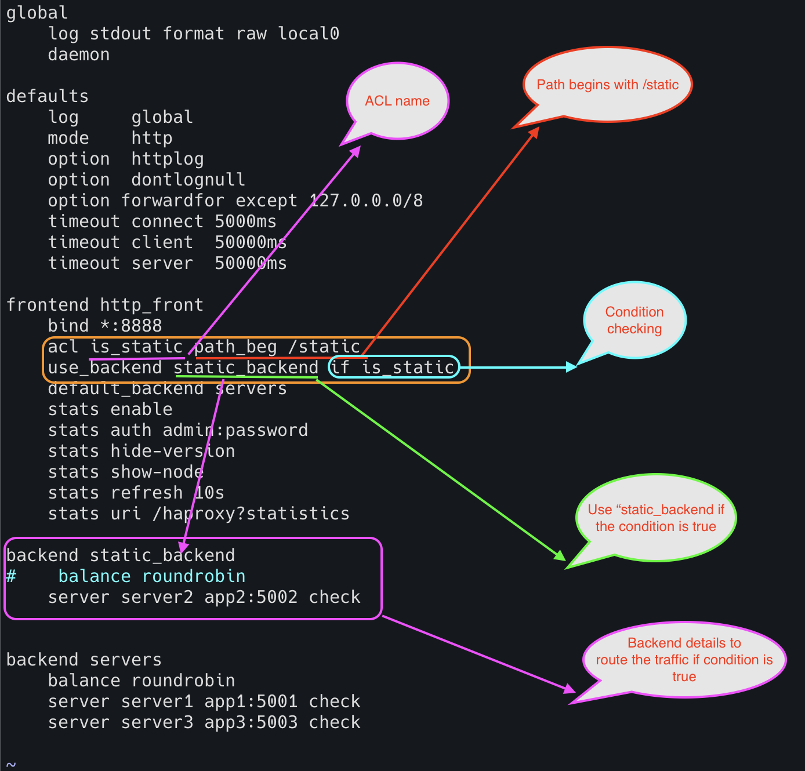
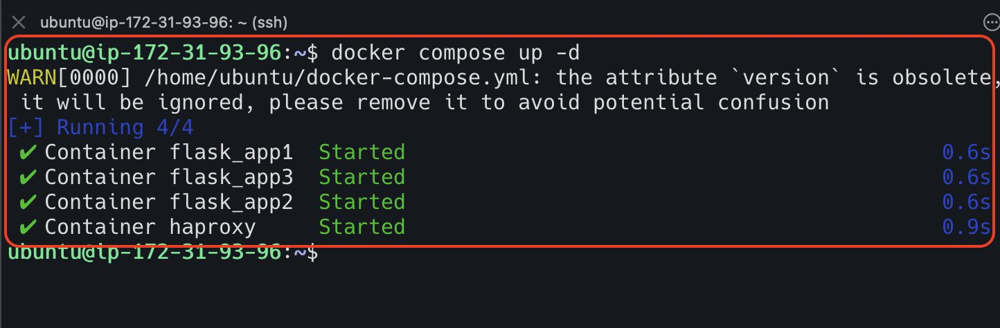
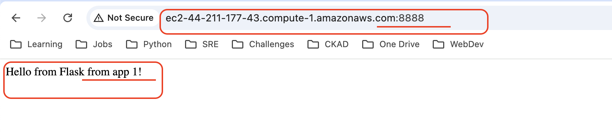
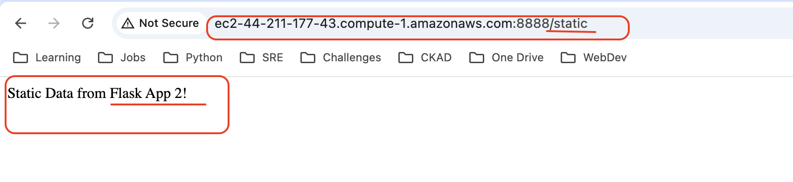
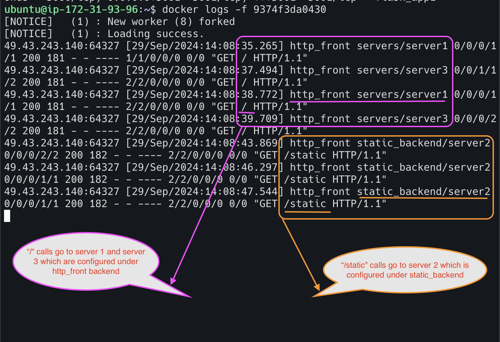
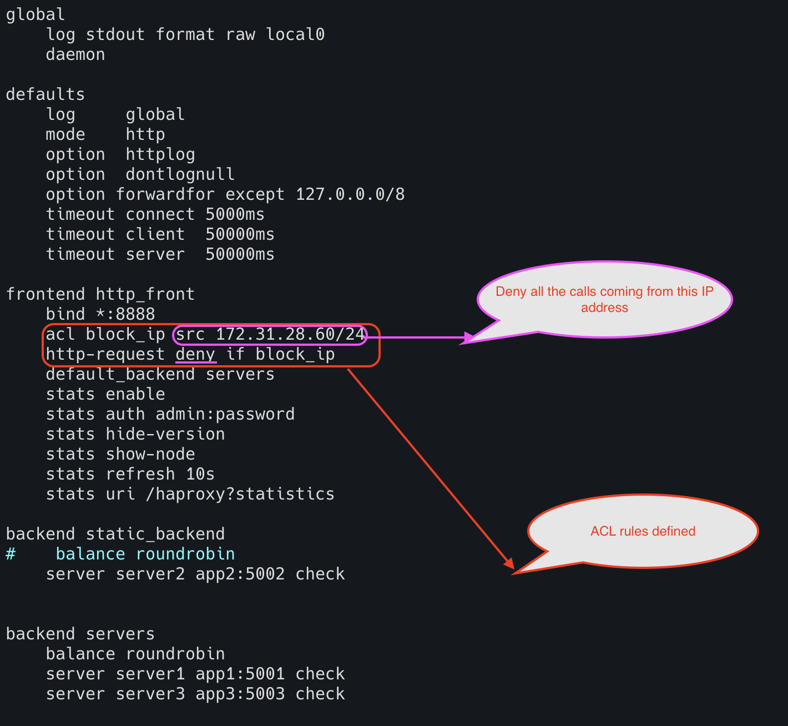
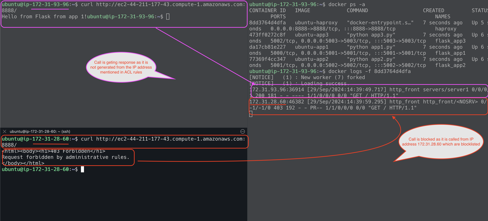
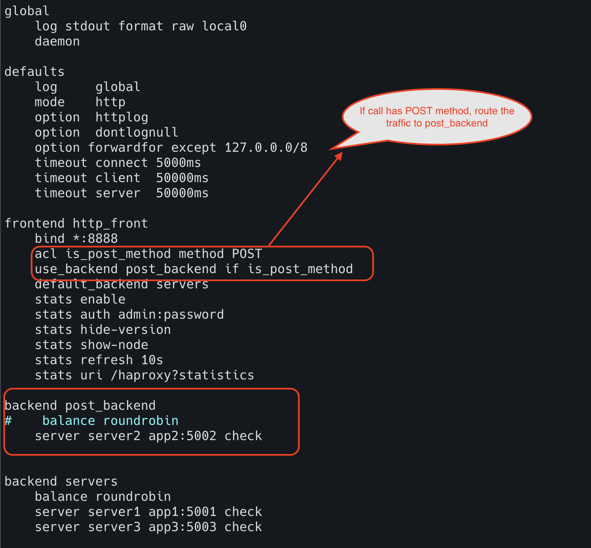
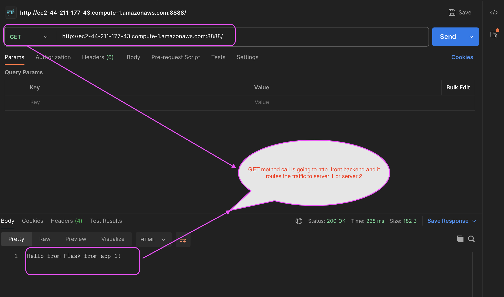
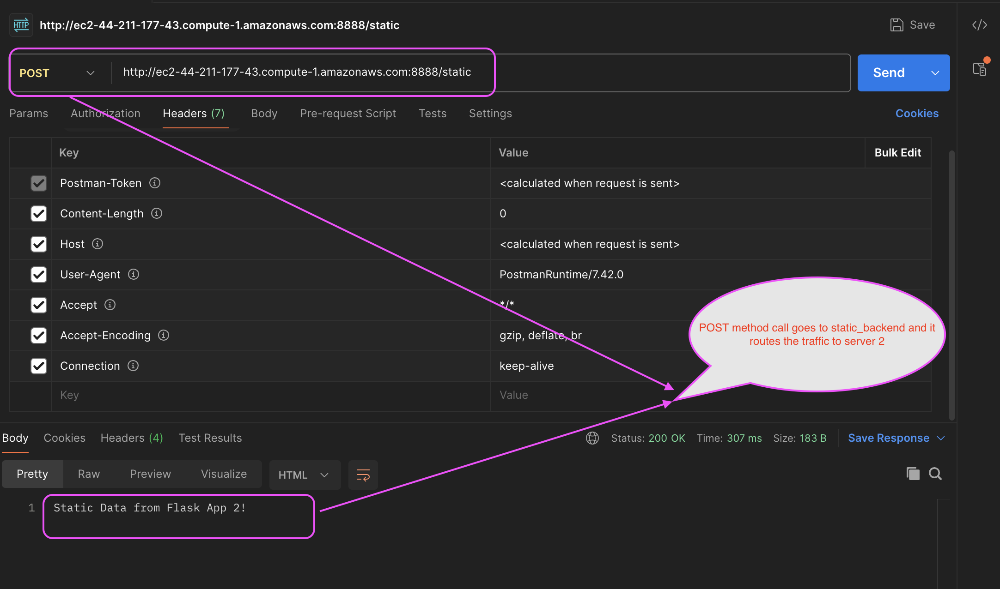

# Access Control List (ACL)

Let us assume that we are traveling on national highway,
and sometimes we see the sign board saying that heavy vehicle lane.
It means that heavy vehicles go in that lane and other vehicles are not allowed to go in that lane.
Similarly, we can route our incoming traffic to specific server based on conditions. 
This is called access control list. 

ACL in HA Proxy are rules or conditions that allow you to define patterns to match incoming requests. 
These rules help you make decisions about how to route or manage traffic within your infrastructure.
It will read all the http request information and take a decision based on that information.
Here decision is nothing but to divert the request to different servers.

### Use of ACL

**1. Security** : Using ACL, we can allow or deny the request. This helps to avoid DDos attack. 

**2. Control over traffic** : Using ACL, we can filter and route the traffic based on specific criteria. 
This will help to avoid an unnecessary load on a specific server.
Also, this will help to improve performance of the system as we segregate static data in one server 
and dynamic data in different server.

**Syntax**

```html
acl <acl name> <condition>
use_backend <specific backend name> if <acl name>
```

### Routing Traffic Based on URL Path

I am running HA proxy in EC2 ubuntu machine.
I am also creating three APIs running on different ports using Flask application.
I created docker images for these three APIs and created docker image for HA proxy configuration as well.
I am running everything in docker compose file.

**HAproxy.cfg**

```html
global
    log stdout format raw local0
    daemon

defaults
    log     global
    mode    http
    option  httplog
    option  dontlognull
    timeout connect 5000ms
    timeout client  50000ms
    timeout server  50000ms

frontend http_front
    bind *:8888
    acl is_static path_beg /static
    use_backend static_backend if is_static
    default_backend servers

backend static_backend
    server server2 app2:5002 check

backend servers
    balance roundrobin
    server server1 app1:5001 check
    server server3 app3:5003 check

```



**app1.py**

```html
from flask import Flask, request

app = Flask(__name__)

@app.route('/', methods=['GET'])
def home():
    return "Hello from Flask from app 1!"

@app.route("/static")
def data():
    return "Static Data from Flask App 1!"

if __name__ == "__main__":
    app.run(host='0.0.0.0', port=5001)  # Run the app on port 5001
```
**app2.py**

```html
from flask import Flask, request

app = Flask(__name__)

@app.route('/', methods=['GET'])
def home():
    return "Hello from Flask from app 2!"

@app.route("/static")
def data():
    return "Static Data from Flask App 2!"

if __name__ == "__main__":
    app.run(host='0.0.0.0', port=5002)  # Run the app on port 5002
```

**app3.py**

```html
from flask import Flask, request

app = Flask(__name__)

@app.route('/', methods=['GET'])
def home():
    return "Hello from Flask from app 3!"

@app.route("/static")
def data():
    return "Static Data from Flask App 3!"

if __name__ == "__main__":
    app.run(host='0.0.0.0', port=5003)  # Run the app on port 5003
```

**docker-compose.yaml**

```html
version: '3'

services:
  app1:
    build:
      context: .
      dockerfile: Dockerfile.app1
    container_name: flask_app1
    ports:
      - "5001:5001"

  app2:
    build:
      context: .
      dockerfile: Dockerfile.app2
    container_name: flask_app2
    ports:
      - "5002:5002"

  app3:
    build:
      context: .
      dockerfile: Dockerfile.app3
    container_name: flask_app3
    ports:
      - "5003:5003"

  haproxy:
    build:
      context: .
      dockerfile: Dockerfile.haproxy
    container_name: haproxy
    ports:
      - "8888:8888"
    depends_on:
      - app1
      - app2
      - app3
```

Let us create the containers using `docker compose up -d` command



Hit the URL in the browser with just "/" and after that hit the url with "/static"






Check the logs




### Block the traffic from specific IP

I am running HA proxy in EC2 ubuntu machine. 
I am also creating three APIs running on different ports using Flask application.
I created docker images for these three APIs and created docker image for HA proxy configuration as well.
I am running everything in docker compose file.

**HAproxy.cfg**

```html
global
    log stdout format raw local0
    daemon

defaults
    log     global
    mode    http
    option  httplog
    option  dontlognull
    timeout connect 5000ms
    timeout client  50000ms
    timeout server  50000ms

frontend http_front
    bind *:8888
    acl block_ip src 172.31.28.60/24
    http-request deny if block_ip
    default_backend servers

backend servers
    balance roundrobin
    server server1 app1:5001 check
    server server3 app3:5003 check

```



**app1.py**

```html
from flask import Flask, request

app = Flask(__name__)

@app.route('/', methods=['GET'])
def home():
    return "Hello from Flask from app 1!"

@app.route("/static")
def data():
    return "Static Data from Flask App 1!"

if __name__ == "__main__":
    app.run(host='0.0.0.0', port=5001)  # Run the app on port 5001
```
**app2.py**

```html
from flask import Flask, request

app = Flask(__name__)

@app.route('/', methods=['GET'])
def home():
    return "Hello from Flask from app 2!"

@app.route("/static")
def data():
    return "Static Data from Flask App 2!"

if __name__ == "__main__":
    app.run(host='0.0.0.0', port=5002)  # Run the app on port 5002
```

**app3.py**

```html
from flask import Flask, request

app = Flask(__name__)

@app.route('/', methods=['GET'])
def home():
    return "Hello from Flask from app 3!"

@app.route("/static")
def data():
    return "Static Data from Flask App 3!"

if __name__ == "__main__":
    app.run(host='0.0.0.0', port=5003)  # Run the app on port 5003
```

**docker-compose.yaml**

```html
version: '3'

services:
  app1:
    build:
      context: .
      dockerfile: Dockerfile.app1
    container_name: flask_app1
    ports:
      - "5001:5001"

  app2:
    build:
      context: .
      dockerfile: Dockerfile.app2
    container_name: flask_app2
    ports:
      - "5002:5002"

  app3:
    build:
      context: .
      dockerfile: Dockerfile.app3
    container_name: flask_app3
    ports:
      - "5003:5003"

  haproxy:
    build:
      context: .
      dockerfile: Dockerfile.haproxy
    container_name: haproxy
    ports:
      - "8888:8888"
    depends_on:
      - app1
      - app2
      - app3
```

Let us create the containers using `docker compose up -d` command


Hit url from another machine whose IP address is `172.31.28.60`




### Route Traffic Based on HTTP method

I am running HA proxy in EC2 ubuntu machine. 
I am also creating three APIs running on different ports using Flask application.
I created docker images for these three APIs and created docker image for HA proxy configuration as well.
I am running everything in docker compose file.

**HAproxy.cfg**

```html
global
    log stdout format raw local0
    daemon

defaults
    log     global
    mode    http
    option  httplog
    option  dontlognull
    timeout connect 5000ms
    timeout client  50000ms
    timeout server  50000ms

frontend http_front
    bind *:8888
    acl is_post_method method POST
    use_backend static_backend if is_post_method
    default_backend servers

backend static_backend
    server server2 app2:5002 check

backend servers
    balance roundrobin
    server server1 app1:5001 check
    server server3 app3:5003 check

```



**app1.py**

```html
from flask import Flask, request

app = Flask(__name__)

@app.route('/', methods=['GET'])
def home():
    return "Hello from Flask from app 1!"

@app.route("/static", methods=['POST'])
def data():
    return "Static Data from Flask App 1!"

if __name__ == "__main__":
    app.run(host='0.0.0.0', port=5001)  # Run the app on port 5001
```
**app2.py**

```html
from flask import Flask, request

app = Flask(__name__)

@app.route('/', methods=['GET'])
def home():
    return "Hello from Flask from app 2!"

@app.route("/static", methods=['POST'])
def data():
    return "Static Data from Flask App 2!"

if __name__ == "__main__":
    app.run(host='0.0.0.0', port=5002)  # Run the app on port 5002
```

**app3.py**

```html
from flask import Flask, request

app = Flask(__name__)

@app.route('/', methods=['GET'])
def home():
    return "Hello from Flask from app 3!"

@app.route("/static", methods=['POST'])
def data():
    return "Static Data from Flask App 3!"

if __name__ == "__main__":
    app.run(host='0.0.0.0', port=5003)  # Run the app on port 5003
```

**docker-compose.yaml**

```html
version: '3'

services:
  app1:
    build:
      context: .
      dockerfile: Dockerfile.app1
    container_name: flask_app1
    ports:
      - "5001:5001"

  app2:
    build:
      context: .
      dockerfile: Dockerfile.app2
    container_name: flask_app2
    ports:
      - "5002:5002"

  app3:
    build:
      context: .
      dockerfile: Dockerfile.app3
    container_name: flask_app3
    ports:
      - "5003:5003"

  haproxy:
    build:
      context: .
      dockerfile: Dockerfile.haproxy
    container_name: haproxy
    ports:
      - "8888:8888"
    depends_on:
      - app1
      - app2
      - app3
```

Let us create the containers using `docker compose up -d` command


Hit url using postman for GET method call



Hit url using postman for POST method call

