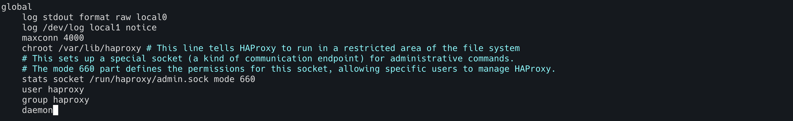
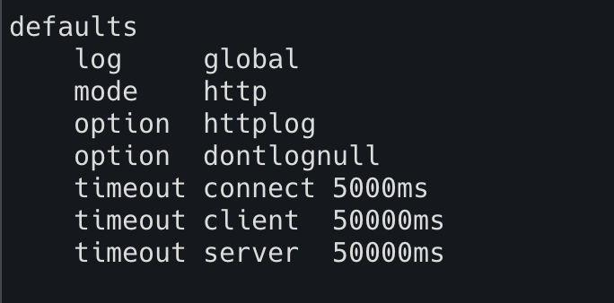
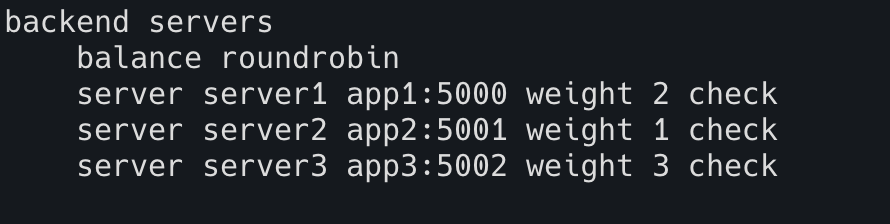

# HA Proxy Configuration

HA Proxy configuration is the place where you define all the servers are involved,
the application running port, log setting, load balancing algorithm, etc. This is written in the file located at 
`/etc/haproxy/haproxy.cfg`

HA Proxy configuration has four main parts

1. Global
2. Defaults
3. Frontend
4. Backend

## Global

The parameters defined under global are applicable to the process and OS.
Once you defined them, you don't need to change often.

```html
global
    log <IP address of the machine where logs stores> <storage drive>
    log <log file path> <storage drive> <log level>
    maxconn <number of connections>
    chroot /var/lib/haproxy # This line tells HAProxy to run in a restricted area of the file system
    # This sets up a special socket (a kind of communication endpoint) for administrative commands. 
    # The mode 660 part defines the permissions for this socket, allowing specific users to manage HAProxy.
    stats socket /run/haproxy/admin.sock mode 660 
    user haproxy
    group haproxy
    daemon
```



## Defaults

This is the place where you define all default settings for HAProxy.
It applies to both frontend and backend as well unless it is overridden 

```html
defaults
    # log specifies the sys log entry location
    log global

    # mode specifies the protocol. If http request, mode is http. Else, it is tcp
    mode http

    # Option httplog tells enable logging for http request, response, header, session, etc
    option  httplog

    # dontlognull tells do not log any null values (means if there is no data transfered)
    option  dontlognull

    # Number of connection attempts to be made when the server is refused the connection or times out.
    retries <number of retries allowed>
    
    # Client request should be completed before this time. Else, it will get timeout.
    timeout http-request <time in ms>
    
    # Time to wait before a connection is dropped and a client receives a 503 or "Service Unavailable" error
    timeout queue <time in ms>
    
     # Time to wait to make a successful connection
    timeout connect <time in ms>
    
    # Time to wait for a client remain inactive (it neither accepts nor sends data).
    timeout client  <time in ms>
    
    # Time to wait for a server to accept or send data before timeout occurs
    timeout server  <time in ms>
```



## Frontend

It is a configuration where the server listens to sockets for a client connection requests.

```html
frontend <Name of the front end>
    bind <IP Address>:<port>
    default_backend <Name of the backt end where front end requests redirect to>
```


## Backend

It is the place where we specify the real server IP addresses as well as the load balancer scheduling algorithm.

```html
backend <Name of the backt end where front end requests redirect to>
    balance <Algorithm Type>
    server <application/service name 1> <IP address of the service/app1 running>:<port> check
    server <application/service name 2> <IP address of the service/app2 running>:<port> check inter <time> rise 4 fall 3
    server <application/service name 3> <IP address of the service/app3 running>:<port> check
    server <application/service name 4> <IP address of the service/app4 running>:<port> backup
```

`check` ensures the server is up and running (health check), and it checks the server periodically. If the server is down, 
then it will ensure that no requests are redirected to that server

`inter` is the health check interval.

`rise` is the number of consecutive valid health checks before considering the server is up and running

`fall` is the number of consecutive valid health checks before considering the server is down

