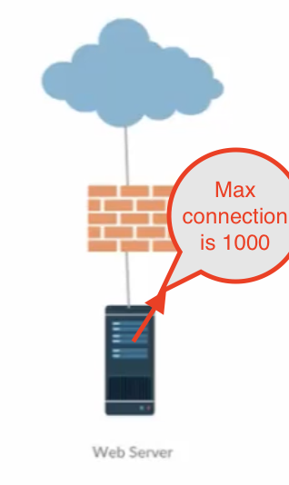
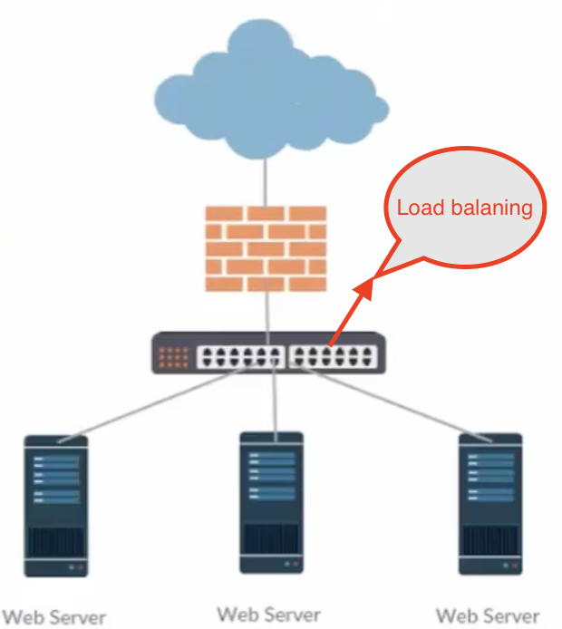
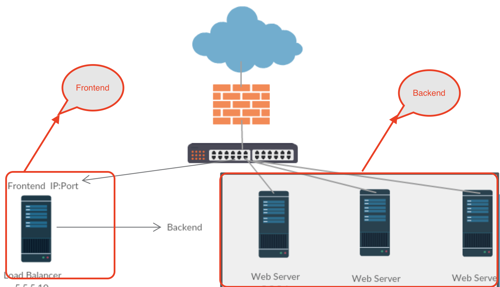

# Introduction of Load Balancing and HA Proxy

## Load Balancer

Let us
assume that you are running your application in three-tier architecture,
and you configure the webserver to allow up to 1000 connections.
When it exceeds 1000 connections, you have to increase the connections to accommodate more.

However, at one point of time,
your web server can reach the threshold limit, and it cannot accommodate anymore connections.
In that situation, your option is to increase the number of web servers and balance the load.

All the incoming requests go to load balancer,
and that will distribute the requests to the web servers based on the algorithm configured.

## HA Proxy

1. **TCP proxy:** It can accept a TCP connection by listening socket, and connect the server by attaching 
the socket to allow the traffic in both directions.
2. **HTTP reverse proxy:** It can act as a server and receive HTTP connections over listening to a socket and 
send the request to the different servers using different connections.
3. **SSL terminator:** It ensures the connection is secured.
4. **TCP normalizer:** It drops the pockets or incomplete connections when the abnormal traffic happens.
5. **HTTP normalizer:** It also drops HTTP request which is invalid. 
6. **Load balance:** It acts as a load balance and accepts TCP mode and HTTP mode.

| **Mode** | **Description**                                                  |
|----------|------------------------------------------------------------------|
| TCP      | Whole connection can be affected due to load balancing technique |
| HTTP     | Connection can be affected based on the HTTP request             |

7. **Traffic regulator:** It is helpful to set the rate limiting for the server.

**Why HA Proxy**

* Reliable
* Fast
* Load balancer
* Statistics and monitoring
* Open source

**HA Proxy Tasks**

It mainly performs two different tasks.

1. Processing the incoming request
2. Check the health of the servers periodically. So, it will pass the request to the servers that are up and running.

### HA Proxy Components

1. Frontend component: It defines the IP address and port where the socket/proxy is listening to.
2. Backend component: It has all the server details and algorithm details.

