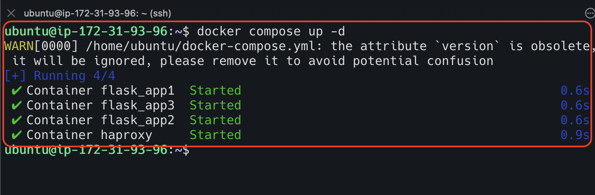

# HA Proxy Monitoring

We can enable the statistics of HA proxy to monitor the server status.
To do so, we need to update the haproxy configuration file.
Add the below content in the configuration file under frontend section.

```html
    stats enable
    stats auth admin:password
    stats hide-version
    stats show-node
    stats refresh 10s
    stats uri /haproxy?statistics
```


Let us create the containers using `docker compose up -d` command



Hit the URL in the browser


Enter the user credential, and you will be able to see the monitoring page.


As you have seen, all three backend servers are up and running. Let us shutdown one server from these list.


Now, refresh the browser where you are monitoring.


## TCP Vs HTTP Mode

When you are working on HA Proxy configuration, you need to choose mode. There are two modes supported by HA Proxy.

1. TCP
2. HTTP

We can choose any one of them and update the configuration.

### TCP Mode

1. It works on the transport layer in the OSI model. 
2. Actually, TCP protocol carries the HTTP data.
3. TCP Protocol has general information about
   * Source and destination ports
   * Specific flags such as an acknowledgement, sync to guarantee to receive data ordering data.

`Whenever we use round-robin algorithm, we need to use TCP mode.
Also, if we are not using scheduling algorithm, we need to use TCP mode.`


### HTTP Mode

1. It is more specific to the HTTP request.
2. Basically, it works reading the http header information such as User-agent, URI path, etc.

`Whenever we use scheduling algorithm that needs information from http header or access list that reads http header, 
then we need to use HTTP mode.`


## Forward For Option

As we know, a client makes a request goes to load balancer,
and load balancer redirects the request to the backend server based on the algorithm configured. 


However, backend server doesn't know the actual client who made the request.
It has the visibility till the load balancer.
So if you check the server logs, the ip address always HA proxy machine IP address. 


If we want to know the real client who made the actual request,
then we need to use `forwardfor` option in the configuration.
Also, add `%{X-Forwarded-For}i` in the log configuration of the application.


