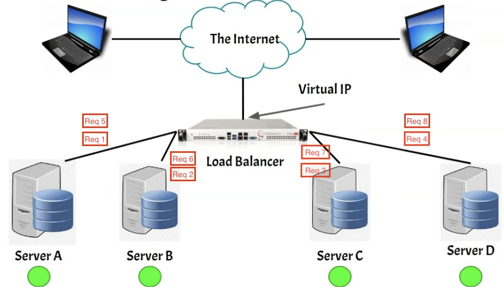
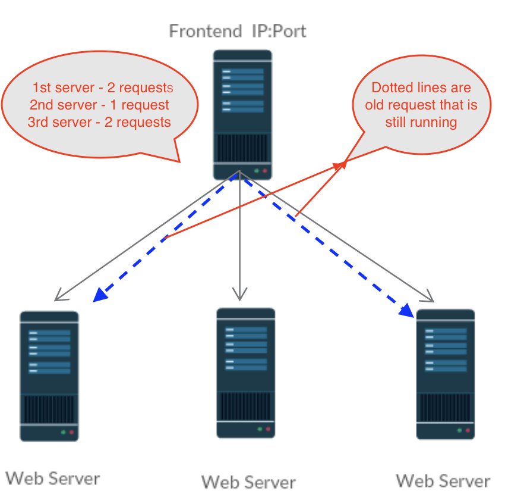
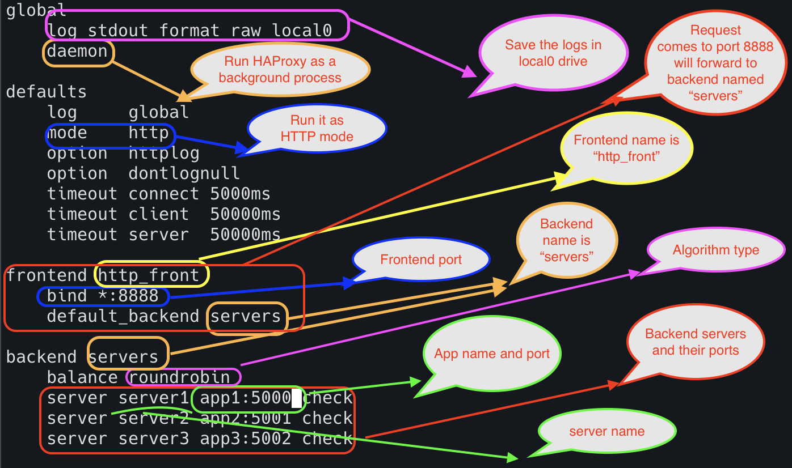
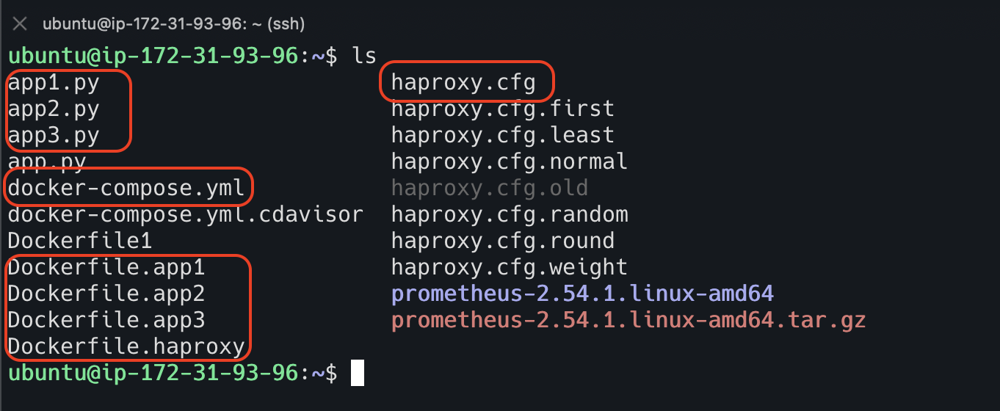
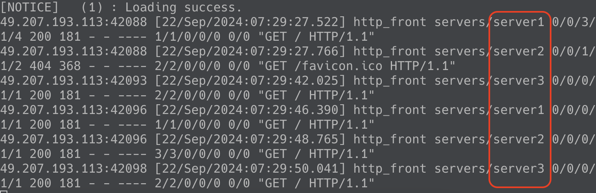

# Round-Robin Algorithm

It distributes the requests to the servers sequentially one by one. It doesn't consider the server capacity or load.



Let us assume that there are three servers running in the cluster,
and the incoming requests are distributed among these three servers
and the scheduling algorithm is configured as `round-robin` algorithm. 

There are three incoming requests to the load balancer.
The First request is going to first server, 
 and the second request is going to second server and the third request is going to third server.

Let us assume that the first request is taking 10 seconds to process.
The Second request is taking 8 seconds to process, and the third request is taking 3 seconds to process.

After three seconds,
we are getting some another three incoming requests, and these requests are assigned to the respective servers.
At this point, the first and third servers are serving two requests, and the second server is serving only one request.
It is clearly visible that two of the servers are overloaded and one server is not overloaded.



## HA Proxy configuration for round-robin

I am running HA proxy in EC2 ubuntu machine.
I am also creating three APIs running on different ports using Flask application.
I created docker images for these three APIs and created docker image for HA proxy configuration as well.
I am running everything in docker compose file.

**HAproxy.cfg**

```html
global
    log stdout format raw local0
    daemon

defaults
    log     global
    mode    http
    option  httplog
    option  dontlognull
    timeout connect 5000ms
    timeout client  50000ms
    timeout server  50000ms

frontend http_front
    bind *:8888
    default_backend servers

backend servers
    balance roundrobin
    server server1 app1:5001 check
    server server2 app2:5002 check
    server server3 app3:5003 check

```



**app1.py**

```html
from flask import Flask, request

app = Flask(__name__)

@app.route('/', methods=['GET'])
def home():
    return "Hello from Flask from app 1!"

@app.route("/data")
def data():
    return "Data from Flask app 1!"

if __name__ == "__main__":
    app.run(host='0.0.0.0', port=5000)

```

**app2.py**

```html
from flask import Flask, request

app = Flask(__name__)

@app.route('/', methods=['GET'])
def home():
    return "Hello from Flask from app 2!"

@app.route("/data")
def data():
    return "Data from Flask app 2!"

if __name__ == "__main__":
    app.run(host='0.0.0.0', port=5001)

```

**app3.py**

```html
from flask import Flask, request

app = Flask(__name__)

@app.route('/', methods=['GET'])
def home():
    return "Hello from Flask from app 3!"

@app.route("/data")
def data():
    return "Data from Flask app 3!"

if __name__ == "__main__":
    app.run(host='0.0.0.0', port=5002)

```

**Dockerfile.app1**

```html
# Use an official Python runtime as a parent image
FROM python:3.9-slim

# Set the working directory
WORKDIR /app

# Copy the current directory contents into the container at /app
COPY app1.py .

# Install any needed packages specified in requirements.txt
RUN pip install flask

# Make port 5000 available to the world outside this container
EXPOSE 5000

# Run app.py when the container launches
CMD ["python", "app1.py"]
```

**Dockerfile.app2**

```html
# Use an official Python runtime as a parent image
FROM python:3.9-slim

# Set the working directory
WORKDIR /app

# Copy the current directory contents into the container at /app
COPY app2.py .

# Install any needed packages specified in requirements.txt
RUN pip install flask

# Make port 5001 available to the world outside this container
EXPOSE 5001

# Run app.py when the container launches
CMD ["python", "app2.py"]
```
**Dockerfile.app3**

```html
# Use an official Python runtime as a parent image
FROM python:3.9-slim

# Set the working directory
WORKDIR /app

# Copy the current directory contents into the container at /app
COPY app3.py .

# Install any needed packages specified in requirements.txt
RUN pip install flask

# Make port 5002 available to the world outside this container
EXPOSE 5002

# Run app.py when the container launches
CMD ["python", "app3.py"]
```

**Dockerfile.haproxy**

```html
# Use the official HAProxy image from Docker Hub
FROM haproxy:latest

# Copy the custom HAProxy configuration file into the container
COPY haproxy.cfg /usr/local/etc/haproxy/haproxy.cfg

# Expose the port for HAProxy
EXPOSE 8888
```

**docker-compose.yml**

```html
version: '3'

services:
  app1:
    build:
      context: .
      dockerfile: Dockerfile.app1
    container_name: flask_app1
    ports:
      - "5000:5000"

  app2:
    build:
      context: .
      dockerfile: Dockerfile.app2
    container_name: flask_app2
    ports:
      - "5001:5001"

  app3:
    build:
      context: .
      dockerfile: Dockerfile.app3
    container_name: flask_app3
    ports:
      - "5002:5002"

  haproxy:
    build:
      context: .
      dockerfile: Dockerfile.haproxy
    container_name: haproxy
    ports:
      - "8888:8888"
    depends_on:
      - app1
      - app2
      - app3
```

Now, we have all the configurations are in place. 



Let us create the containers using `docker compose up -d` command


Hit the load balance url a couple of times. Each time the request goes to different server.


Check the logs of the ha proxy container




