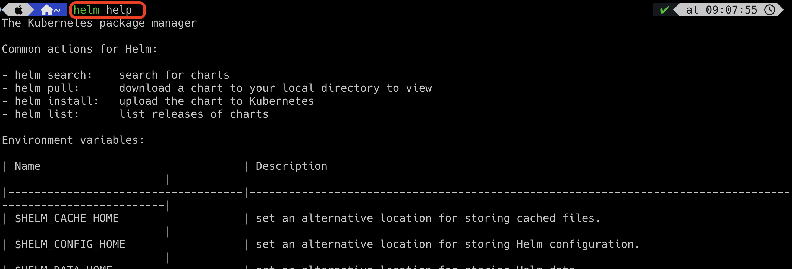

# Basic Helm Commands

All the helm commands are executed in command line interface (helm cli).

### 1. helm help
This is the command that helps you find out the right command to do something.




### 2. helm search

There are two ways to search the chart.

2.1. Search in the artifacthub.io - ```helm search hub <chart name>```


2.2. Search in the repository - ```helm search repo <chart name>```


But before run `helm search repo <chart name>` command, you must ensure that the repo has been added in your machine.
To do so, run the command `helm repo add <repository url>`


### 3. helm install

Before installing any chart, you must need to ensure that the repository is added locally. To do so, 
run the command `helm repo add <repository url>`


To verify if the repo is added or not, use `helm repo list` command


Now, install the chart using `helm install <release name> <repo name>/<chart name>`


In the above snapshot, my-prometheus is the release name, prometheus-community is the repo name, and prometheus is the 
chart name. After installing the chart, validate the resources created in the k8s cluster.


To install a specific version, run the below command
`helm install <release name> <repo name>/<chart name> --version <version number>`


### 4. helm list
This is the command that helps you list all the releases in your k8s cluster.


### 5. helm uninstall
This is the command that helps you uninstall the releases in your k8s cluster.


After uninstalling the chart, validate the resources deleted in the k8s cluster.


## Sub Commands

You can find the sub commands using `helm <command> help`


### 6. helm repo list
This command lists all the repository added in your local machine.


### 7. helm repo remove
This command lists all the repository removed in your local machine.


`Remember that when you install any chart, default values will be picked and created k8s objects in the cluster.
You cannot modify that during the installation of the chart`

If you want to override the default values, there are three ways.

**First approach**

Overrides the values through runtime arguments like below

```html
helm install --set <variable name>=<value to override> <repo name>/<chart name>

Example:
helm install --set replicaCount=3 prometheus-community/prometheus

helm install --set replicaCount=3 --set maintainer="satheeshpandianj@gmail.com" prometheus-community/prometheus
```

**Second approach**

Keep all the values to be overridden in a separate YAML file and pass that file during installation.

```html
custom-file.yaml

replicaCount: 1
maintainer: "satheeshpandianj@gmail.com"
```

```html
helm install --values <YAML file name including the path> <repo name>/<chart name>

Example:
helm install --values ~/custom-file.yaml prometheus-community/prometheus

```
**Third approach**

Download the chart directory locally and update `values.yaml` file with updated values.
To do so, use the below command

`helm pull <repo name> or helm pull --untar <repo name>`


Then install the chart from locally. To do so, use the below command
`helm install <release name> <local repo directory path>`


### 8. helm history

This command helps to see all the revisions for a particular release.
`helm history <release name>`


### 9. helm rollback

This command helps to roll back to a previous version for a particular release.
`helm rollback <release name>`


