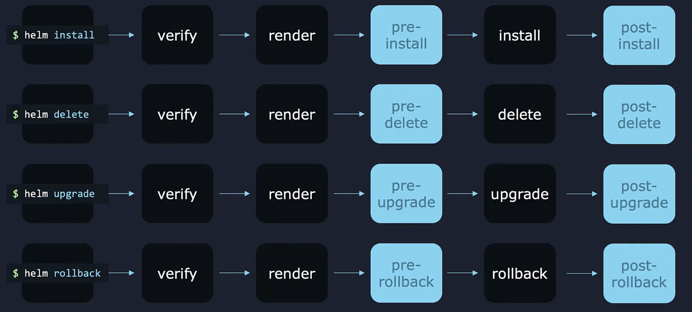
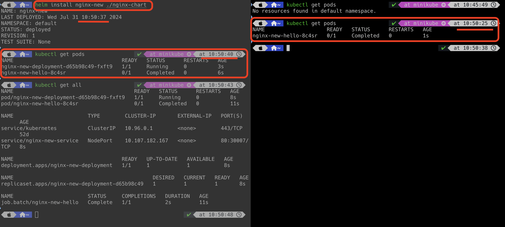
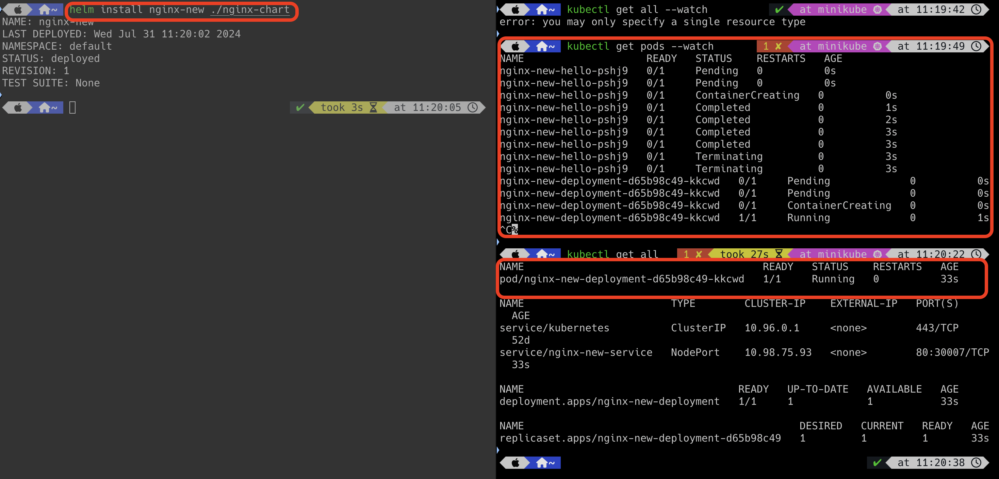

# Chart Hooks

Helm chart will do some extra actions beside creating k8s objects.
For example, helm chart can send email before upgrading and after upgrading.
These extra actions called as hooks.

Helm Life cycle is "helm install -> verify -> render -> install"

Hooks are in two categories.
1. Pre
2. Post

| **Annotations** | **Description**                                                                                       |
|-----------------|-------------------------------------------------------------------------------------------------------|
| pre-install     | Executes after templates are rendered and before any k8s resources are created                        |
| pre-upgrade     | Executes on an upgrade request after templates are rendered, but before any resources are updated     |
| pre-delete      | Executes on a deletion request before any resources are deleted from Kubernetes                       |
| pre-rollback    | Executes on a rollback request after templates are rendered, but before any resources are rolled back |
| post-install    | Executes after all resources are loaded into Kubernetes                                               |
| post-upgrade    | Executes on an upgrade request after all resources have been upgraded                                 |
| post-delete     | Executes on a deletion request after all of the release's resources have been deleted                 |
| post-rollback   | Executes on a rollback request after all resources have been modified                                 |





`job.yaml`

```html
apiVersion: batch/v1
kind: Job
metadata:
  name: hello
  annotations:
    # This is what defines this resource as a hook. Without this line, the
    # job is considered part of the release.
    "helm.sh/hook": pre-install
spec:
  template:
    spec:
      containers:
      - name: hello
        image: busybox:1.28
        command: 
        - /bin/sh
        - -c
        - date; echo Pre-install hook is successful
      restartPolicy: OnFailure
```

The above resource will be executed before all k8s objects are created because the above resource file has pre-install hook.



`Remember that we can have multiple hook in the manifest file.` 
```html
annotations:
  "helm.sh/hook": post-install,post-upgrade
```
If we are having multiple hooks, then their order of execution is defined based on weight.
Weight must be a string and it can be negative or positive values.
Order of execution is always in ascending order.

```html
annotations:
  "helm.sh/hook-weight": "5"
```


## Hook Deletion Policy

```html
annotations:
  "helm.sh/hook-delete-policy": before-hook-creation,hook-succeeded
```

| **Annotations**      | **Description**                                                      |
|----------------------|----------------------------------------------------------------------|
| before-hook-creation | Delete the previous resource before a new hook is launched (default) |
| hook-succeeded       | Delete the resource after the hook is successfully executed          |
| hook-failed          | Delete the resource if the hook failed during execution              |


`job.yaml`

```html
apiVersion: batch/v1
kind: Job
metadata:
  name: hello
  annotations:
    # This is what defines this resource as a hook. Without this line, the
    # job is considered part of the release.
    "helm.sh/hook": pre-install
    "helm.sh/hook-deletion-policy": hook-succeeded
spec:
  template:
    spec:
      containers:
      - name: hello
        image: busybox:1.28
        command: 
        - /bin/sh
        - -c
        - date; echo Pre-install hook is successful
      restartPolicy: OnFailure
```

hook is configured as pre-install and hook deletion policy is as hook-succeeded. 



In the above snapshot,
job pod is created before all k8s resources are created, and once it is successful,
it is automatically deleted as the hook deletion policy is defined as hook-succeeded.


