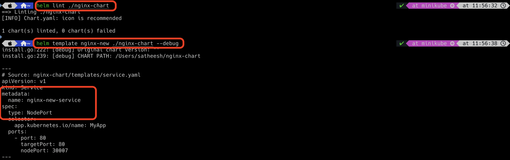

# Conditions

In helm, conditions are the same as other languages. This will help us to evaluate the conditions, and based on the output,
we can take the decision.

Example: If conditions.

In helm, if the value is available in the `values.yaml` file, then it will update it in the manifest files. In case, 
if the value is not available in the `values.yaml`, we can ignore that field and create the manifest files without that field.
To do so, we can use if conditions.

Let us assume that in our nginx chart, we have a service manifest file which has labels. This label needs to be picked up 
from `values.yaml`.

`values.yaml`


`service.yaml`

```html

apiVersion: v1
kind: Service
metadata:
  name: {{ .Release.Name }}-service
  labels:
    environment: {{ .Values.environment }}
spec:
  type: {{ .Values.service.type }}
  selector:
    app.kubernetes.io/name: MyApp
  ports:
    - port: {{ .Values.service.port }}
      targetPort: {{ .Values.service.port }}
      nodePort: 30007
```

Let us install the helm chart now.


Now, let us assume that environment label is not present in the `values.yaml` file. As we know, this field is optional.
Hence, it should be ignored when creating manifest file. To implement that logic, we are using if conditions.

`service.yaml`

```html

apiVersion: v1
kind: Service
metadata:
  name: {{ .Release.Name }}-service
  {{ if .Values.environment }}
  labels:
    environment: {{ .Values.environment }}
  {{ end }}
spec:
  type: {{ .Values.service.type }}
  selector:
    app.kubernetes.io/name: MyApp
  ports:
    - port: {{ .Values.service.port }}
      targetPort: {{ .Values.service.port }}
      nodePort: 30007
```

Now, let us try to dry run using template command and see the result.


As you see in the above snapshot, you don't find `label` field in the `service.yaml` manifest file because environment 
label is not present in the `values.yaml`.

However, if you notice closely the manifest file, you will be able to identify the empty line in the metadata section
where `labels` field comes. This is because helm expects a field, but it is not available and hence helm leaves the entire
line as empty. We can trim this empty line as well. To do so, we need to include "-" in the if conditional block.


`service.yaml`

```html

apiVersion: v1
kind: Service
metadata:
  name: {{ .Release.Name }}-service
  {{- if .Values.environment }}
  labels:
    environment: {{ .Values.environment }}
  {{- end }}
spec:
  type: {{ .Values.service.type }}
  selector:
    app.kubernetes.io/name: MyApp
  ports:
    - port: {{ .Values.service.port }}
      targetPort: {{ .Values.service.port }}
      nodePort: 30007
```



## Create Manifest Files Based On Conditions

In case, if you want to create the manifest file only if certain conditions are met. Else, you don't need to create them.
To do so, you have to update the entire YAML file in the if condition itself. Also add the required field in the `values.yaml`
file.

`service.yaml`

```html

{{- if .Values.required }}
apiVersion: v1
kind: Service
metadata:
  name: {{ .Release.Name }}-service
  {{- if .Values.environment }}
  labels:
    environment: {{ .Values.environment }}
  {{- end }}
spec:
  type: {{ .Values.service.type }}
  selector:
    app.kubernetes.io/name: MyApp
  ports:
    - port: {{ .Values.service.port }}
      targetPort: {{ .Values.service.port }}
      nodePort: 30007
{{- end }}
```
`Remember that if condition should not have compared conditions such as eq, gt, and lt etc.`


When you run the template command, you will be able to see service.yaml file because `required` value is set to `true` in 
the `values.yaml` file.


Let's change `required` value is as `false` and verify now.


When you run the template command, you will be not able to see service.yaml file because `required` value is set to `false` in 
the `values.yaml` file.


## Scope of the elements (using with statement)

By default, all the elements have root scope. It will start with `.` and then their absolute object path. We can reduce
to write the entire object path by using `with` statement.

Let us assume that `values.yaml` file have the following properties.


Update the `service.yaml` file.

`service.yaml`

```html
apiVersion: v1
kind: Service
metadata:
  name: {{ .Release.Name }}-service
  labels:
    environment: {{ .Values.environment }}
    {{- with .Values.web }}
    name: {{ .tier.name }}
    numberOfServers: {{ .tier.numberOfServers }}
    {{- end }}
    {{- with .Values.db }}
    name: {{ .tier.name }}
    numberOfServers: {{ .tier.numberOfServers }}
    {{- end }}    
spec:
  type: {{ .Values.service.type }}
  selector:
    app.kubernetes.io/name: MyApp
  ports:
    - port: {{ .Values.service.port }}
      targetPort: {{ .Values.service.port }}
      nodePort: 30007
```


When you run the template command, you will be able to see all the values. However, we didn't mention a full object path 
for all the label properties.


If we want to include the root scope element within `with` statement block, then we must use `$` in the properties.

`service.yaml`

```html
apiVersion: v1
kind: Service
metadata:
  name: {{ .Release.Name }}-service
  labels:
    environment: {{ .Values.environment }}
    {{- with .Values.web }}
    name: {{ .tier.name }}
    numberOfServers: {{ .tier.numberOfServers }}
    {{- end }}
    {{- with .Values.db }}
    name: {{ .tier.name }}
    numberOfServers: {{ .tier.numberOfServers }}
    release: {{ $.Release.Name }}
    {{- end }}    
spec:
  type: {{ .Values.service.type }}
  selector:
    app.kubernetes.io/name: MyApp
  ports:
    - port: {{ .Values.service.port }}
      targetPort: {{ .Values.service.port }}
      nodePort: 30007
```


## Using range statement

If the properties are too many, and you don't need to include one by one as it is a tedious job. Instead, you can use 
`range` statement.

### List of data updated in manifest file

`values.yaml`


`configmap.yaml`


### Dictionary of data updated in manifest file

`values.yaml`


`service.yaml`

```html
apiVersion: v1
kind: Service
metadata:
  name: {{ .Release.Name }}-service
  labels:
    environment: {{ .Values.environment }}
    {{- range $key, $value := $.Values.web.tier }}
    {{ $key }}: {{ $value }}
    {{- end }}
    {{- range $key, $value := $.Values.db.tier }}
    {{ $key }}: {{ $value }}
    release: {{ $.Release.Name }} 
    {{- end }}
spec:
  type: {{ .Values.service.type }}
  selector:
    app.kubernetes.io/name: MyApp
  ports:
    - port: {{ .Values.service.port }}
      targetPort: {{ .Values.service.port }}
      nodePort: 30007
```


When you run the template command, you will be able to see the below 

