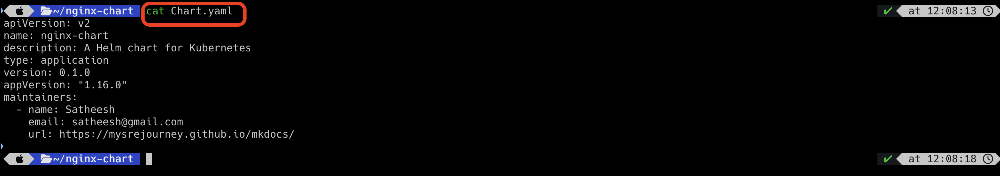

# Writing Helm Chart

To create a helm chart, we need to create a few manifest files like deployment.yaml etc. We can do that manually, and also
can create using helm command. 

`helm create <chart name>`

The above command will create a directory structure and the files required to create the chart.


We can modify the chart as per our needs now.

## Create Chart for Nginx 

Let us create a deployment and service for nginx. Then we can use them to create a helm chart.

`deployment.yaml`

```html
apiVersion: apps/v1
kind: Deployment
metadata:
  name: nginx-deployment
  labels:
    app: nginx
spec:
  replicas: 1
  selector:
    matchLabels:
      app: nginx
  template:
    metadata:
      labels:
        app: nginx
    spec:
      containers:
      - name: nginx
        image: nginx:1.14.2
        ports:
        - containerPort: 80
```

`service.yaml`

```html
apiVersion: v1
kind: Service
metadata:
  name: my-service
spec:
  type: NodePort
  selector:
    app.kubernetes.io/name: MyApp
  ports:
    - port: 80
      targetPort: 80
      nodePort: 30007
```

The above manifest files are basic ones and still not implemented helm templating. Before, we do helm templating, we can
review the files created by the `helm create` command

`Chart.yaml`



`values.yaml`


Let us make some changes in `values.yaml` file. Let us increase the replica to 3 from 1 and service type should be NodePort.


Now, let us make changes the manifest files to update the values based on `values.yaml` file.

`deployment.yaml`

```html
apiVersion: apps/v1
kind: Deployment
metadata:
  name: {{ .Release.Name }}-deployment
  labels:
    app: nginx
spec:
  replicas: {{ .Values.replicaCount }}
  selector:
    matchLabels:
      app: nginx
  template:
    metadata:
      labels:
        app: nginx
    spec:
      containers:
      - name: {{ .Values.image.repository }}
        image: "{{ .Values.image.repository }}:{{ .Values.image.tag }}"
        ports:
        - containerPort: {{ .Values.service.port }}
```

`service.yaml`

```html
apiVersion: v1
kind: Service
metadata:
  name: {{ .Release.Name }}-service
spec:
  type: {{ .Values.service.type }}
  selector:
    app.kubernetes.io/name: MyApp
  ports:
    - port: {{ .Values.service.port }}
      targetPort: {{ .Values.service.port }}
      nodePort: 30007
```


Now, let us install the chart using `helm install` command. 


As you see, there are three pods are running, and a service type is NodePort. So, the helm is picking up the right configuration
from` `values.yaml` and `Chart.yaml` files.

On top of it, we ran a few commands before installing the chart.

`helm lint` -> It helps to validate the YAML files format.


`helm template` -> It helps to check if the values are picking from values.yaml and Chart.yaml files. However, it will not
install the chart. This is just a dry run command.


Let us create another release with the same chart we developed. However, this time we are going to pass the values 
through command line as an arguments to override the existing values in `values.yaml` and `Chart.yaml` files.

