# Introduction to Helm

Let us assume that you have an application hosted in kubernetes. This application is required to run the database, firewall
rules, load balancer, and services to expose the outside world, etc., As it needs a database, it requires persistent
volume, persistent volume claim and storage class. <mark>Basically this application is a collection of objects that need 
to interconnect to make everything work as expected.</mark>

<mark>All these are created using YAML file in kubernetes cluster. However, kubernetes doesn't know our application as a 
whole. Instead, it understands that we created various objects and kubernetes make sure it exists in the cluster. 
This makes it a little difficult to maintain when it comes to a big application which has multiple YAML files.</mark>

Helm will solve this problem. It is a package manager for kubernetes. Helm looks all the objects as a group in a package.
So, you need to tell Helm that what package it should modify. Helm will automatically take care of the objects it 
needs to modify based on the package name. We DO NOT instruct that to helm.

For example, a car has multiple components inside, and we don't need to know each component to drive the vehicle. We just 
 press the accelerator and hold the steering wheel. The Rest will be taken care automatically. Similarly, we just need to 
instruct package name to Helm and Helm will do the magic automatically in kubernetes cluster.

<mark>If we want to customize the object, we DO NOT need to go to YAML file of the specific object. Instead, we just need to 
update the details in values.yaml file (Just one place). It is easy to upgrade the application with one single command.
Helm always tracks the files which changed for each time. Hence, rolling back is again easy with one single command. 
Even, we can uninstall the application with simple command.</mark>

## Prerequisites

1. Kubernetes cluster
2. `kubectl` should be configured

If the above two conditions are mandatory to install Helm.

You can verify helm installation using 

`helm version`

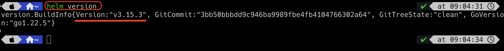

You can use help command for addition command details.

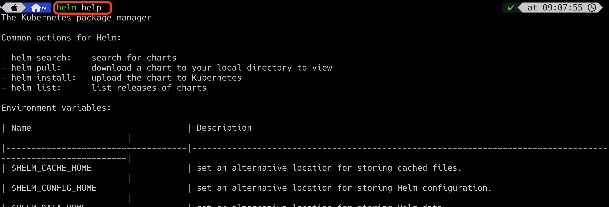


## Difference Between Helm2 and Helm3

### High level

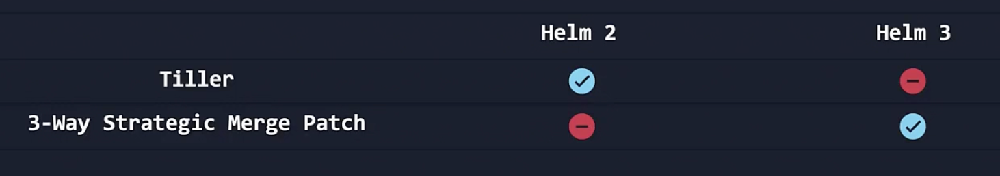


In general, when you install helm in the machine, `helm cli` is automatically installed. `helm cli` client helps to perform
the action in kubernetes cluster. It reads the command from the user and takes the action in kubernetes cluster.

<mark>In Helm2, RBAC and CRD are not available. Hence, an extra component is installed in the kubernetes cluster and the component 
is called tiller. Whenever we run the command in helm cli, it is talking to tiller and tiller communicates with kubernetes 
cluster to perform the action whatever requested.</mark> By default, tiller has full privileges in k8s cluster. Any user who have 
access to tiller can do anything in k8s cluster, which is really a security concern.

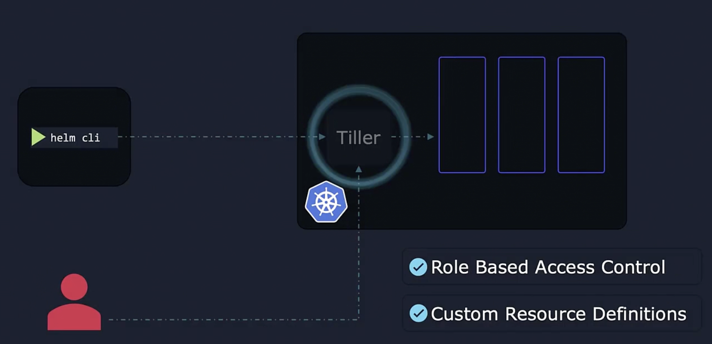

<mark>In Helm3, Tiller was removed.</mark> Helm cli directly communicates with kubernetes cluster and RBAC will take 
care of the security.

In Helm2, it tracks all the changes as a snapshot. Whenever we issue the command, it checks the current chart and 
finds the differences with the previous version and apply the changes. 

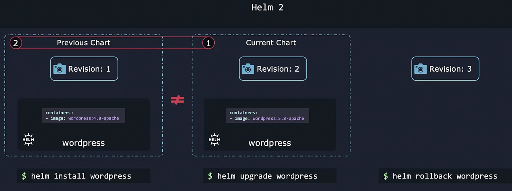

Let us assume it, we installed an initial version of a chart using Helm. Then, we are upgrading it using `kubectl` command 
manually. After that if we issue `helm rollback` command, helm will NOT find any differences with previous version of 
chart as the current k8s objects are upgraded manually and NOT via helm.

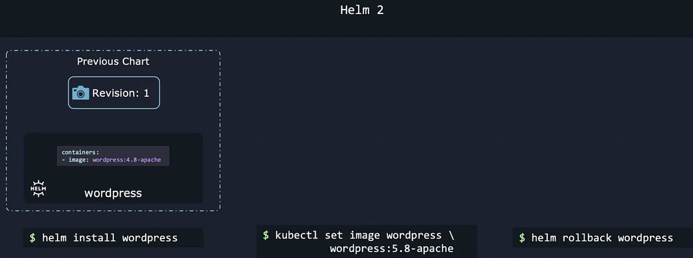

<mark>In Helm3, whenever we issue `helm rollback` command, helm will try to check the live objects in k8s cluster and compare it 
with the previous version of chart and if it finds any differences, then the changes will be deployed.</mark> Even though, upgrades
are done manually and helm is not tracking the changes, it is intelligent enough to check live objects and previous chart and
take the decision accordingly. <mark>This is called `3 way stratefic merge patch`.</mark>

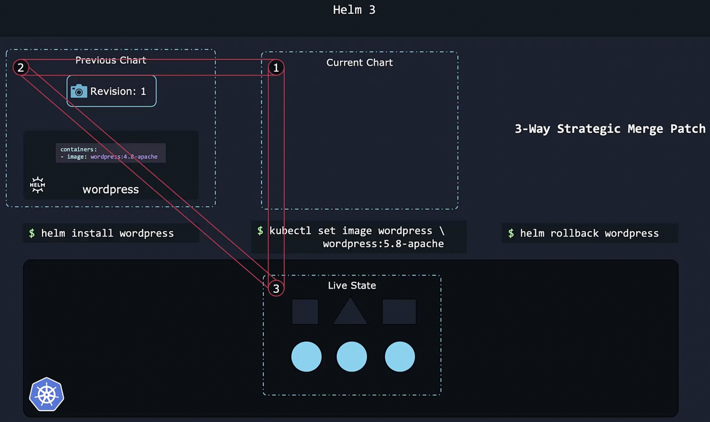


## Helm Components

`helm cli` used to interact with k8s cluster. This is where you execute all the commands to perform actions in k8s cluster.


`charts` is nothing but a collection of files, and it contains all the instructions that helm needs to be performed (Create/
upgrade/uninstall all the objects in k8s cluster). It contains all the resource definitions necessary to run the application
inside k8s cluster.


`release` - When the chart is applied in your cluster, release is created. It is nothing but a single instance of your 
application. Once chart can be installed multiple times in the same k8s cluster. Each time it is installed, 
a new release will be created.

For example, httpd server chart. If you want two httpd servers run in your k8s cluster, you can install this chart twice. 
Each one will have its own release and in turn own release name.

```Remember each release has multiple revisions. revision is nothing but the snapshot of the current state of the k8s cluster. ```

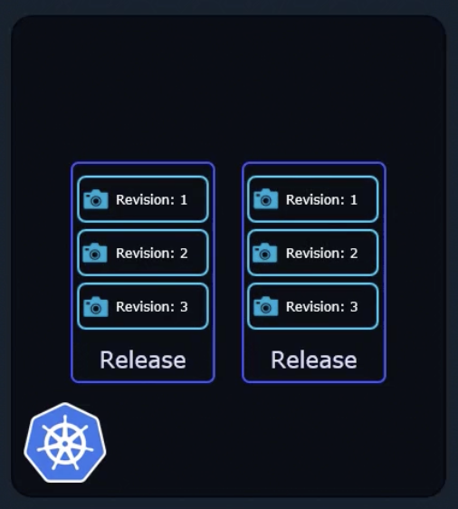

`repository` is a place where all the charts can be collected and shared with public (only for k8s packages). 
This is similar to docker hub. `artifacthub.io` is the place where almost all the charts are stored.

`metadata` - Helm needs to track all the chart that is installed, all the releases names and their revision state. All 
these data is saved in the k8s cluster itself. This data is called metadata (data about data). So it can be shared among
 the team members as long as k8s cluster is available.

`values.yaml` - This is the place where all the customized properties updated. Based on this file, helm will create the 
objects in the k8s cluster. The actual value will be taken from this file and replace it in the template specified in the 
configuration (YAML files).

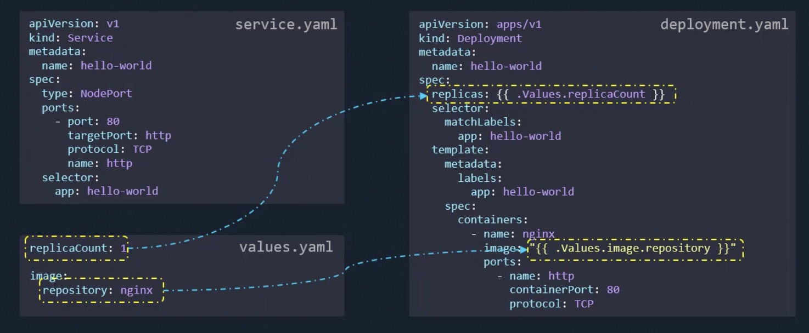

#### Why do we need release?

When you install helm chart, you should provide the release name. The reason for this, each release considers as a 
separate entity. Each release has its own revisions. To understand better, there are two releases created for your application
in the k8s cluster. One for the customer and one for the developer. So, a developer can deploy the new features and do the 
testing without touching customer release, and this will not impact any customer experience.

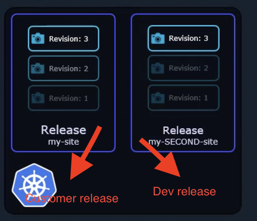

### Helm Charts


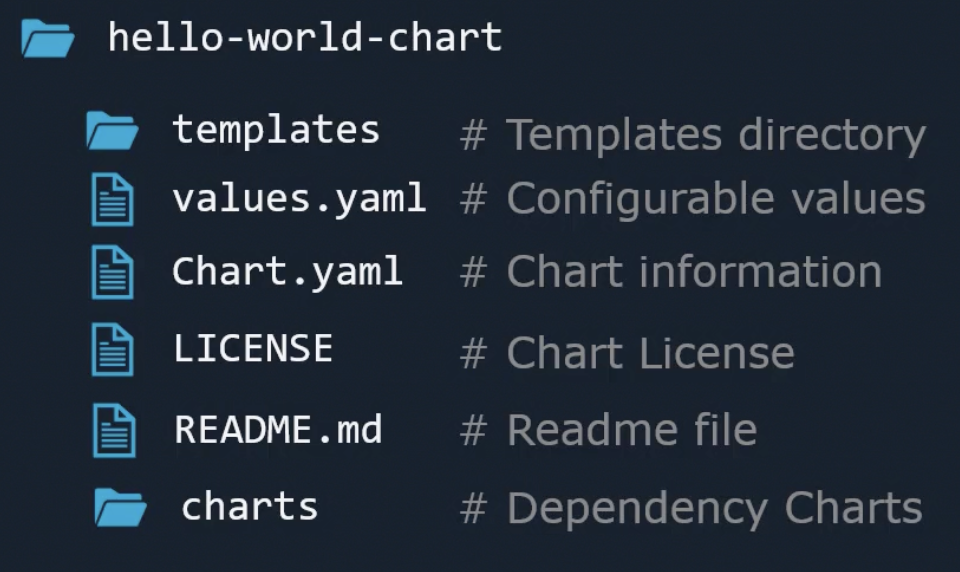

In any helm chart directory, two files are mandatory.
1. value.yaml - This is the place where we define the configuration of our k8s objects
2. chart.yaml - This is the place where we provide all the information about the charts.

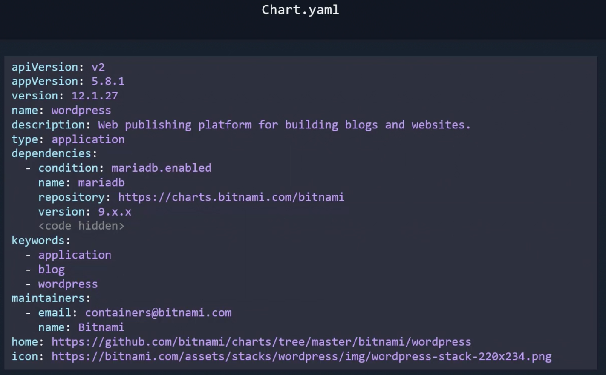

```chart.yaml```


In the above snapshot, 
apiVersion -> Either v1 or v2. V1 is for Helm2 and v2 for Helm3. Remember that this field may NOT be available in Helm2 charts.
Those charts were created long back. Now if you want to create a chart for Helm2, then this field should be v1.
Let's say you are creating a chart for Helm3 and you update apiVersion as v1. Then, some fields described in the chart.yaml file
may not be available because the v1 version belongs to Helm2 and Helm2 don't have those fields (Example: type, dependencies).


appVersion -> This is an application version, and it can be anything but your input. This is for information purpose.

Version -> This is a chart version. This helps to track the changes in the chart itself.

type -> Either application or library. application -> for any application. library -> For utilities to build chart.

dependencies -> Your chart depends on another chart. However, you don't need to maintain the dependency chart. Instead,
 you are instructing helm to maintain dependency chart manifest files. These charts are placed under `charts` directory.

keywords -> Helps when searching the chart in the public repository.


