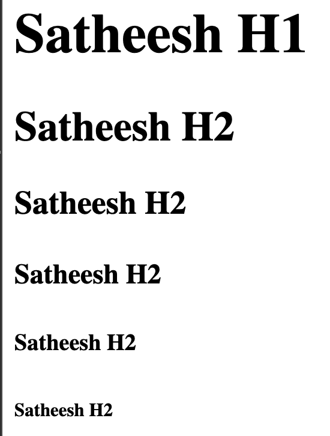
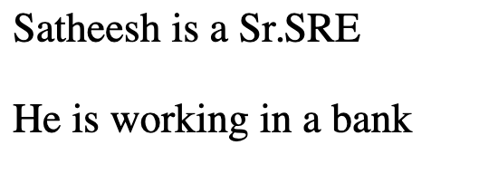
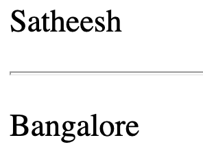
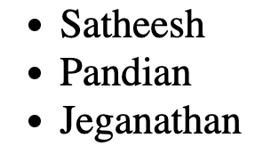
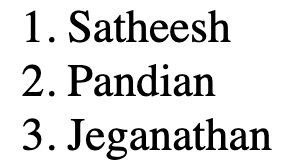
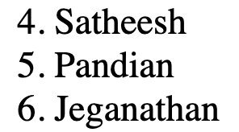
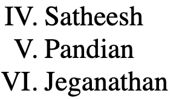
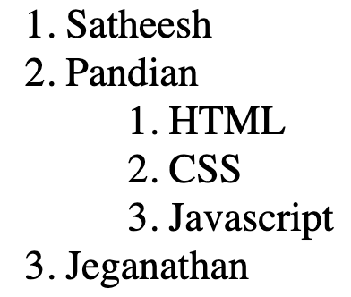
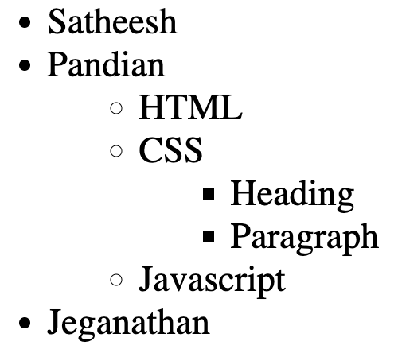

# HTML Elements 

Below tags are crucial in HTML

## HTML
Represents the top level element of the HTML document.
Hence, It is called as a root element.

## HEAD
Should contain the metadata about the document such as title, scripts, style sheet.
    
| Tags    | Definition                                                                                                          |
|---------|---------------------------------------------------------------------------------------------------------------------|
| `title` | It displays the title of the document in the browser's page                                                         |
| `link`  | Specifies the relationship between the current document and external document. Generally, used to link CSS document |
| `style` | Contains the style information of the document. Mostly CSS file details                                             |
| `meta`  | Represent meta data such as base, link etc                                                                          |


### Header tags (h1 to h6)
```html
<h1>Satheesh</h1>
<h2>Satheesh</h2>
<h3>Satheesh</h3>
<h4>Satheesh</h4>
<h5>Satheesh</h5>
<h6>Satheesh</h6>
```


```Remember

- header tags are ONLY from h1 to h6.
- Keep only ONE h1 in your document as a best practice. Use another header tag for sub headers.
- DO NOT skip header level tags. 
  - Example: Assume, you are using h1 and h2 already in your document. For next level title, you need to use h3. DO NOT go to h4 by skipping h3.
```


## BODY
Should contain the content of the document along with their structure

### Paragraph tags (p)

```html
<p>Satheesh is a Sr.SRE</p>
<p>He is working in a bank</p>
```


### Void Elements (hr and br)
<mark>Void elements don't have content and closing tags.
Instead, they have just starting tags with forward slash.
They are known as self-closing tag.</mark>

`hr` = Horizontal Rule
```html
<hr /> 
```

```html
<p>Satheesh</p>
<hr/>
<p>Bangalore</p>
```



`br` = Break  

```html
<p>Satheesh
<br/>
Bangalore</p>
```


### Unordered List 

```html
<ul>
  <li>Satheesh</li>
  <li>Pandian</li>
  <li>Jeganathan</li>
</ul>
```



### Ordered List 

```html
<ol>
  <li>Satheesh</li>
  <li>Pandian</li>
  <li>Jeganathan</li>
</ol>
```



### Ordered List with different starting number

```html
<ol start="4">
  <li>Satheesh</li>
  <li>Pandian</li>
  <li>Jeganathan</li>
</ol>
```



### Ordered List with different starting number and type 

```html
<ol start="4" type="I">
  <li>Satheesh</li>
  <li>Pandian</li>
  <li>Jeganathan</li>
</ol>
```



### Nested Ordered List

```html
<ol>
  <li>Satheesh</li>
  <li>Pandian
      <ol>
          <li>HTML</li>
          <li>CSS</li>
          <li>Javascript</li>
      </ol>
  </li>  
  <li>Jeganathan</li>
</ol>
```



### Nested Unordered List 

```html
<ul>
  <li>Satheesh</li>
  <li>Pandian
      <ul>
          <li>HTML</li>
          <li>CSS
              <ul>
                    <li>Heading</li>  
                    <li>Paragraph</li>  
              </ul>
          </li>
          <li>Javascript</li>
      </ul>
  </li>  
  <li>Jeganathan</li>
</ul>
```



### HTML attribute element 

```html
<TAG attribute1="value" attribute2="value">Content</TAG>
```

### Anchor element

```html
Click <a href="https://mysrejourney.github.io/mkdocs/" draggable="true">here</a> to go to my website
```


### Image element

```html

```


