#Basics of K8s
####Pods
Our goal is to deploy the application container in the worker nodes available k8s clusters and make sure it is up and 
running all the time. But, k8s doesn't deploy containers directly in the worker nodes. Instead, k8s wrapped the container 
by a k8s object known as pods.

Pod is the single instance of an application, and it is the smallest unit in k8s.

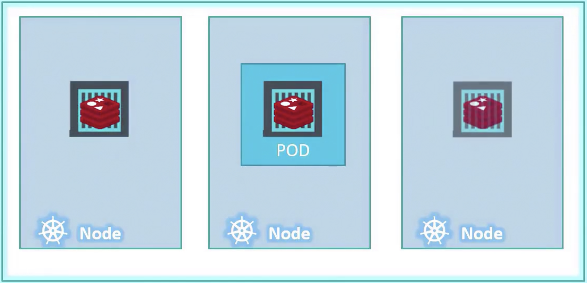

If the load is increasing in the application, and you want to scale the containers. In this case, you need to create a pod. 
You should NOT create a container in the existing pod.

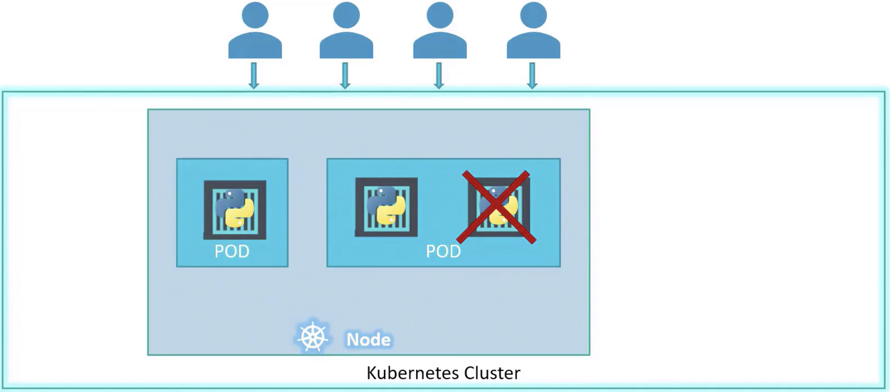

In case of too many calls to the application and current node doesn't have sufficient resources to support the load, then 
we can create a new node in the k8s cluster and create a pod to run the application in the new node.

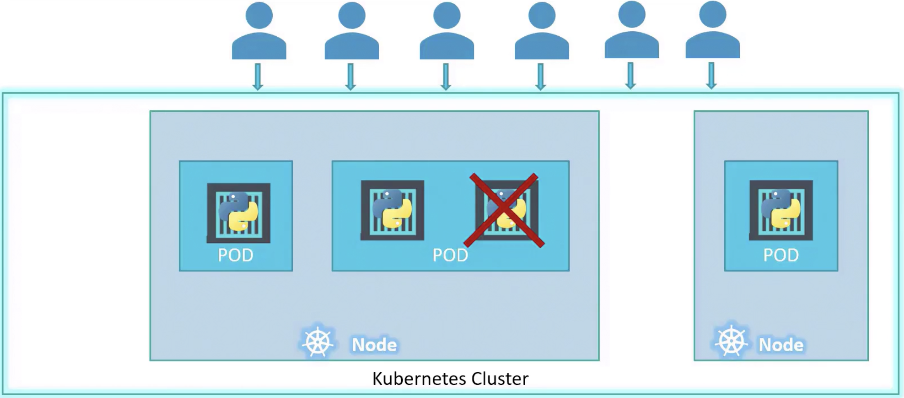

Remember,
```html
pod should be one to one mapping with container. When you scale up, you need to create a pod, not a container.
When you scale down, you delete a pod which interns delete the container.
```

<b>Does a pod not have many containers?</b>

The answer is NO. Pod can have multiple containers, but not the same kind.
For example, <mark>a pod can have different containers like nginx container, redis container, postgres container.
But a pod can not have the same type of containers like two nginx containers.</mark>

<b>Multi container pods</b><br>
If the pod has more than one container, then it is known as multi container pod.
The containers within the pod can communicate each other through localhost as both containers are in the same network.

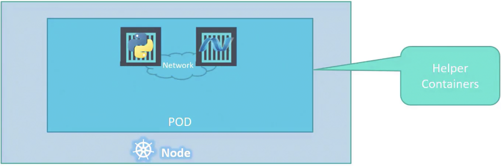

<b>To create a pod</b>
```html
kubectl run <pod name> --image=<image name>
```
**Example**
```html
kubectl run nginx-pod --image=nginx
```
When you run the above command, pod is created first and then pull the image from repository and run it as a container.

Remember,
```html
When pod is running, external user cannot connect the application as there was no network connection established.
You can only connect the pod within the node in k8s cluster using `localhost`.
```

**How to create a pod using YAML in k8s?**

Below are the mandatory top level/root level properties in any of k8s object such as pod, replicaset, deployment etc.,
```html
apiVersion:
kind: 
metadata:
Spec:
```

**apiVersion & kind:**

| Kind               | apiVersion |
|--------------------|------------|
| Pod                | v1         |
| Service            | v1         |
| Replication Controller | v1     |
| ReplicaSet         | apps/v1    |
| ReplicaSet         | apps/v1    |
| Deployment         | apps/v1    | 

**metadata**
This is where we need to define the pod properties such as name, labels etc.,
Pod should have a name which is a mandatory field. You can identify the pod based on this field only.
labels are list of dictionary which is optional field.

**spec**
This is where we need to define the container related properties such as name, image which is going to be used, how many 
containers need to be run etc.,

Pod definition file should have below

```html
apiVersion: v1 -----------------> Based on k8s object, you can update this
kind: Pod ----------------------> k8s object
metadata: ----------------------> Pod properties need to be updated under this
    name: my-pod ---------------> Pod name (mandatory)
    labels: --------------------> used to group pods (optional)
        apps: sats
spec:  -------------------------> container properties need to be updated under these
    containers: 
    -   image: nginx -----------> container image
        name: nginx-container --> container name
```

If it is multi container pod, then the spec needs to be updated.
```
spec:  -------------------------> container properties need to be updated under this
    containers: 
    -   image: nginx -----------> first container image
        name: nginx-container --> first container name
    -   image: redis -----------> second container image
        name: redis-container --> second container name        
```
**Example**

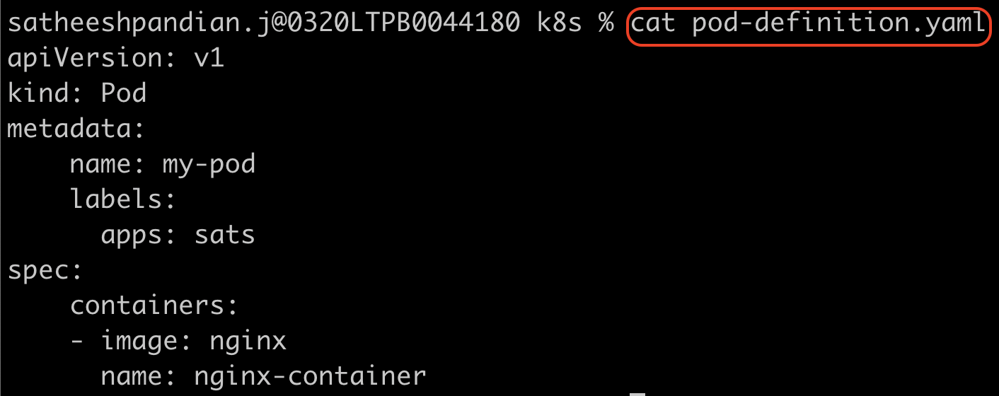

To create a pod
```html
kubectl create -f <pod definition YAML file>
```
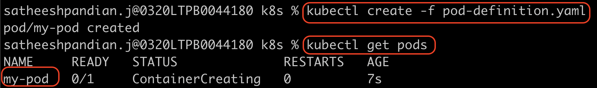

To view the list of pods created

```html
kubectl get pods
```


The READY column in the output of the kubectl get pods command
```
Running containers in the pod/Total containers in the pod
```
To check the pod related details (pod starting time, which node it is running, what are the containers are running inside pods, 
what are events associated with this pod etc.)

```html
kubectl describe pods <pod name>
```
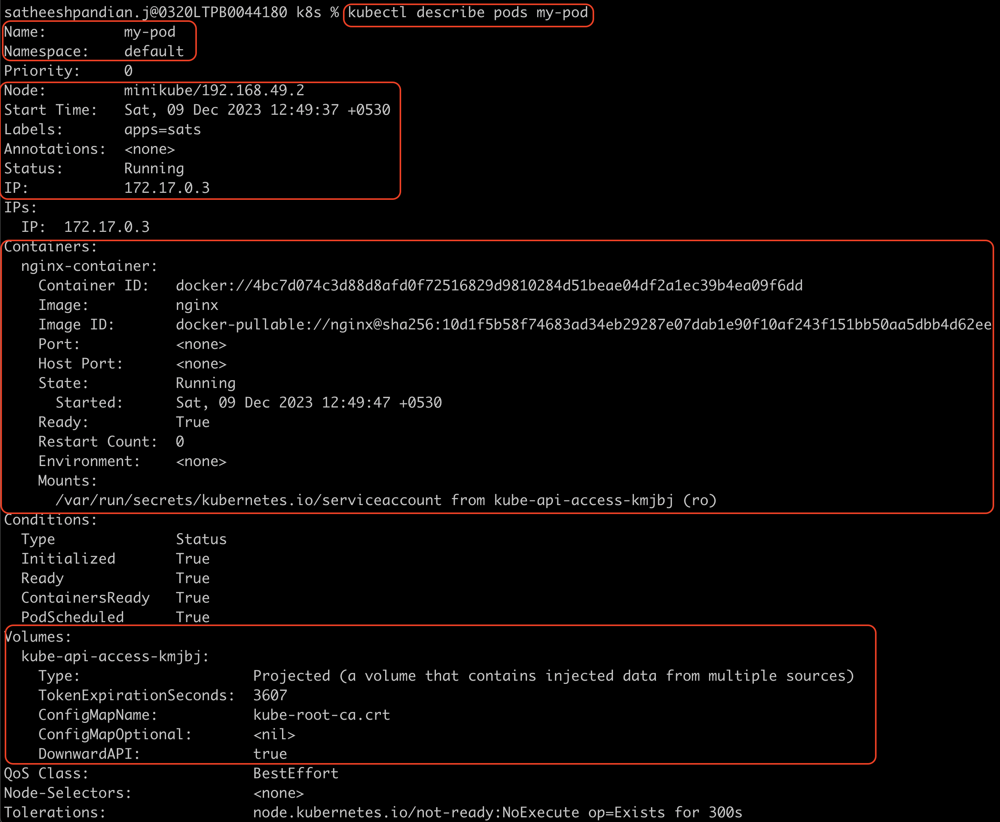

To delete the pod

```html
kubectl delete pods <pod name>
```
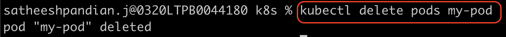

If the container is up and running, and you want to make some changes, then you need to use the below command
```html
kubectl edit pods <pod name>
```
Please note that only the properties listed below are editable.
spec.containers[*].image
spec.initContainers[*].image
spec.activeDeadlineSeconds
spec. tolerations
spec.terminationGracePeriodSeconds


To create the pod definition YAML file using imperative command
```html
kubectl run <pod name> --image=<image name> --dry-run=client -o yaml > pod-definition.yaml
```
If you are not given a pod definition file, you may extract the definition to a file for the pod which is running now using the below command:
```html
kubectl get pod <pod name> -o yaml > pod-definition.yaml
```

####ReplicaSets
Assume that our application is not running because the pod is crashing. So, our end users cannot access your application.
To avoid such scenario, we need to run our application more than one pod. So, even one pod is failed, other pods can 
support the users and make sure the application is highly available. Replication controller will help us to run the multiple 
instances of a single pod in k8s cluster. This will ensure the high availability.

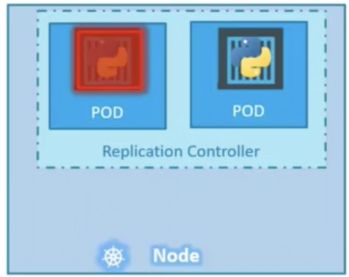

Even if you run your application with only one pod, replication controller will make sure your application always run even 
your current pod crashes for some reason. RC will create a new pod automatically when the existing pod crashes.
Basically, RC will run the number of pods specified in the replicas in RC definition file. Also, RC helps load balancing and scaling.

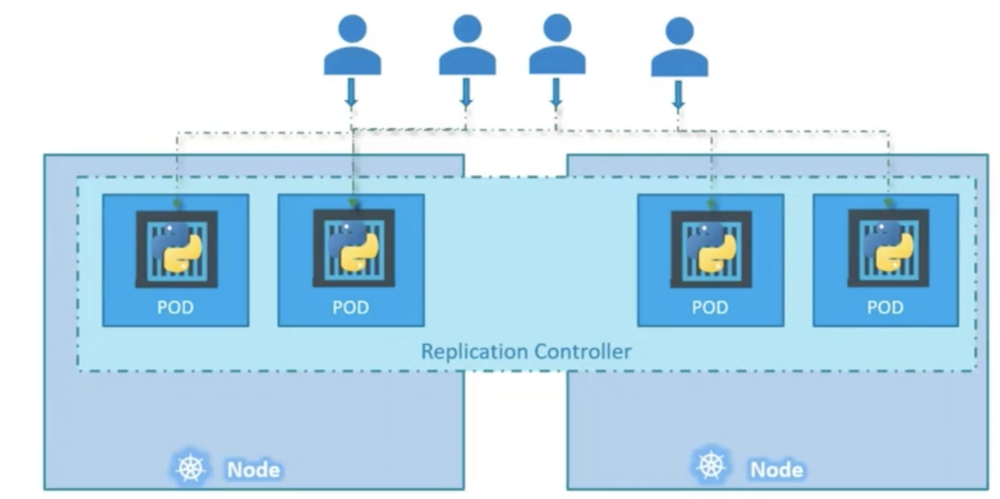

```html
apiVersion: v1 -----------------> Based on k8s object, you can update this
kind: ReplicationController ----------------------> k8s object
metadata: ----------------------> RC properties need to be updated under this
    name: my-pod ---------------> RC name (mandatory)
    labels: --------------------> used to group RCs (optional)
        apps: sats
spec:  -------------------------> RC properties need to be updated under this
    template: ------------------> Under this, pod details need to be updated
        metadata:
            name: my-pod
            labels:
                name: my-pod-label
        spec: -------------------------> Pods specification which can be created 
            containers: 
            -   image: nginx -----------> container image
                name: nginx-container --> container name
    replicas: 4 ----------------> Number of pods to be created
```

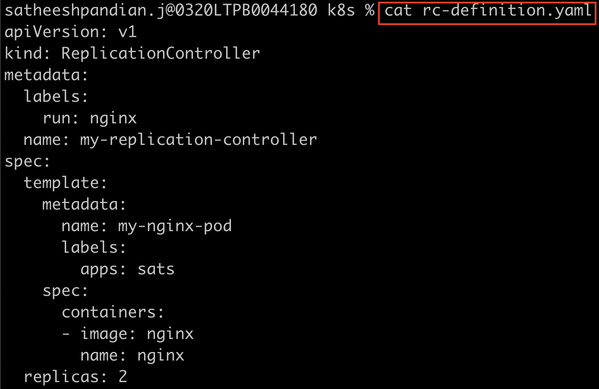

To create an RC and view the list of RC created
```html
kubectl create -f <RC definition YAML file>

kubectl get rc
```
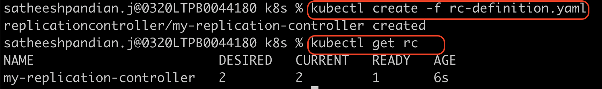
When you create replica controller, the pod name is also start with replication controller name specified in YAML file, 
but NOT with pod name specified in YAML file.
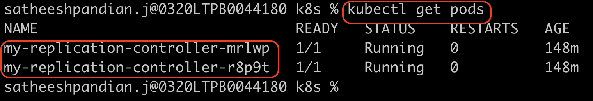

Replica set and replica controller purposes are same. The only difference is `selector` field. For RS, it is mandatory field
and for RC, it is optional. 

```html
apiVersion: v1 -----------------> Based on k8s object, you can update this
kind: ReplicaSet ----------------------> k8s object
metadata: ----------------------> RC properties need to be updated under this
    name: my-pod ---------------> RC name (mandatory)
    labels: --------------------> used to group RCs (optional)
        apps: sats
spec:  -------------------------> RC properties need to be updated under this
    template: ------------------> Under this, pod details need to be updated
        metadata:
            name: my-pod
            labels:
                name: my-pod-label
        spec: -------------------------> Pods specification which can be created 
            containers: 
            -   image: nginx -----------> container image
                name: nginx-container --> container name
    replicas: 4 ----------------> Number of pods to be created
    selectors: -----------------> To group the pods and monitor
        matchLabels: -----------> To select the pod using label
            name: my-pod-label
```

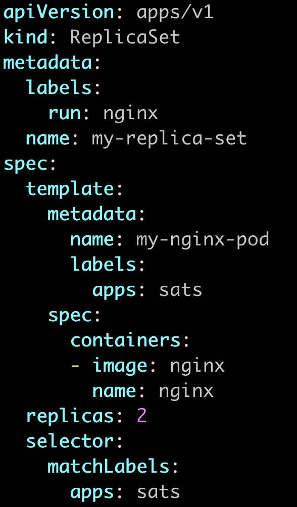


To create an RS and view the list of RS created
```html
kubectl create -f <RS definition YAML file>

kubectl get rs
```
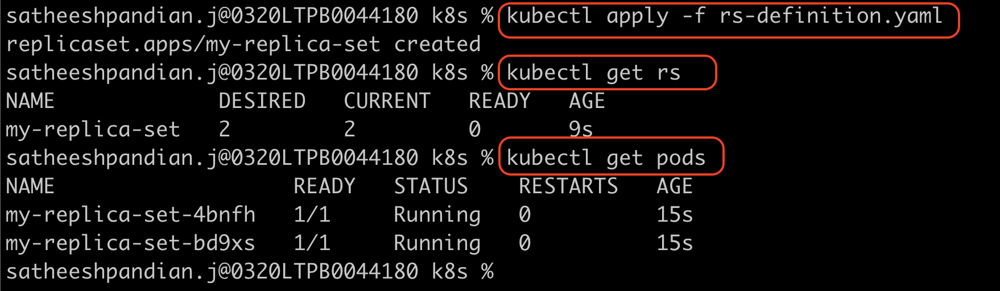
When you create replica set, the pod name is also start with replication set name specified in YAML file (mentioned as "my-replica-set"), 
but NOT with pod name specified in YAML file (mentioned as "nginx").

Assume that, there are already 3 pods already running and their label is "apps:sats". Now, you are trying to create RS and this RS
spec has matchLabels field is "apps:sats" and replica is "3". In that case, RS won't create any new pods because there are 3 pods 
with same labels are already running. In case, if any one of the pod is failed due to some reason, then RS will create a new pod 
and make sure the pod replicas are maintained.

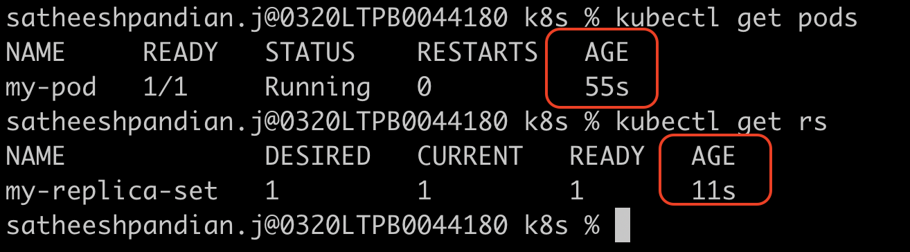

In the above snapshot, pod is already running for 55s and then RS with replica "1" is created. But RS is not created any 
pods (Age is 11s for RS).

**Scale**

To scale the pods, we can use any of the below commands
```html
kubectl replace -f <RS definition YAML file> => Before running the command, you need to update replicas field manually in YAML file
kubectl scale --replicas=6 -f <RS definition YAML file> => This will scale the pods, but NOT update in the YAML file
kubectl scale --replicas=6 replicaset <replicaset name>
kubectl edit replicaset <replicaset name> => manually edit and save
```


