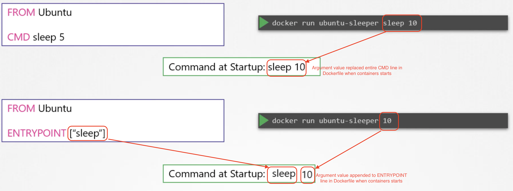
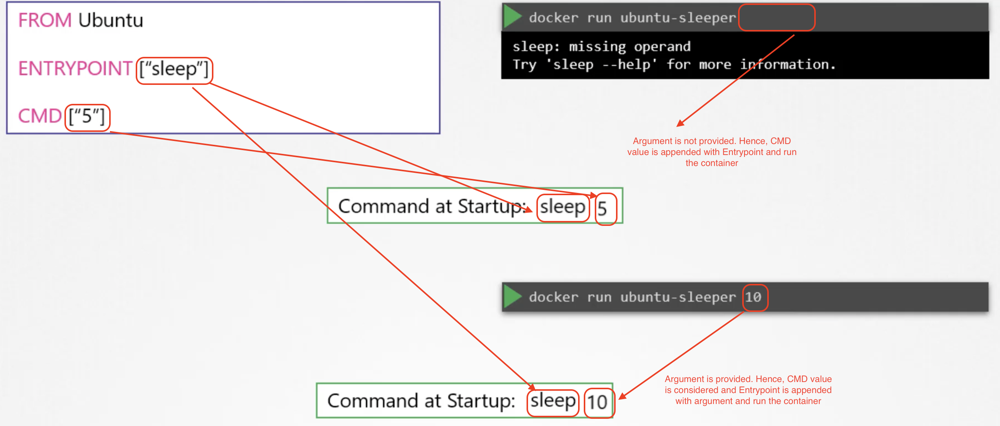
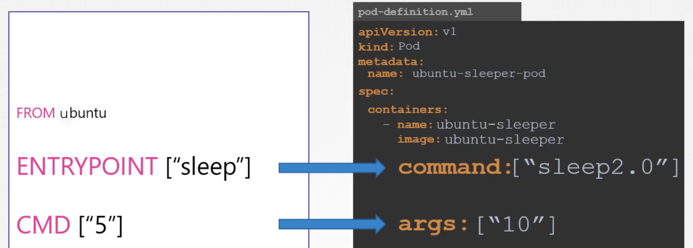

#Configuration
#### Command Vs Entrypoint in Docker
Entrypoint is nothing but the program that will be run when the container starts. Command is nothing but the arguments passed to entrypoint.



If the argument is missed while running the container, then we need to pick the default argument and run. To do so,
we need to include both entrypoint and CMD in the dockerfile. 

`Remember that both Entrypoint and CMD should be in JSON format => ["<VALUE or COMMAND>"]`



If you want to replace entrypoint itself, then you need to run 
```html
docker run --entrypoint <entrypoint command> <image> <argument>
```

#### Command Vs Entrypoint in K8s
```html
apiVersion: v1
kind: Pod
metadata:
    name:
    labels:
        apps: sats
spec:
    containers: 
    -   image: nginx
        name: nginx-container
        command: ["sleep", "50"] => Option 1
        command:  => Option 2
        - "sleep"
        - "50"
        command: ["sleep"] => Option 3
        args: ["50]
```



####Environment Values
Environment values are passed to pod in three different ways.
1. Via Pod definition
2. Via Config Maps
3. Via Secrets 
```html
apiVersion: v1
kind: Pod
metadata:
    name:
    labels:
        apps: sats
spec:
    containers: 
    -   image: nginx
        name: nginx-container
        env: => Option 1
        - name: color
          value: pink
        env: => Option 2
        - name: color
          valueFrom: 
            configMapKeyRef:
        env: => Option 3
        - name: color
          valueFrom: 
            secretKeyRef:
```

**1. Via Pod definition**
All environment values are passed under `env` section as a key value pair. 
```html
apiVersion: v1
kind: Pod
metadata:
    name:
    labels:
        apps: sats
spec:
    containers: 
    -   image: nginx
        name: nginx-container
        env: 
        - name: color
          value: pink
```

**2. Via Config Maps
Suppose there are many environment values need to be passed in the pod definition file, then adding them under `env` section
is not good idea. Instead, we can create a config map and use them in pod definition is a good approach.

There are two steps.

    1. Creating config map.
    2. Injecting the config map into pod definition file.

**Creating Config Map**
1. Imperative way

```
kubectl create configmap <config map name> --from-literal=<key1>=<value1> --from-literal=<key2>=<value2> 
or
kubectl create configmap <config map name> --from-file=<file path>
```
File should have all the environment values in key value format.

2. Declarative way

First create a data in a file
```
name: color
value: pink
```
Second, create a config map YAML file.
```html
apiVersion: v1
kind: ConfigMap
metadata:
    name:
data:
    name: color
    value: pink
```
```
kubectl create -f <config map YAML file> 
```
Now, we need to inject the config map into pod.

```html
apiVersion: v1
kind: Pod
metadata:
    name:
    labels:
        apps: sats
spec:
    containers: 
    -   image: nginx
        name: nginx-container
        envFrom:
        - configMapKeyRef:
            name: <config map name created in the above step>
```
In case, we would like to pass only one or two environment values into the pod, then
```html
apiVersion: v1
kind: Pod
metadata:
    name:
    labels:
        apps: sats
spec:
    containers: 
    -   image: nginx
        name: nginx-container
        env:
        - name: <KEY NAME>
          valueFrom:
            - configMapKeyRef:
                name: <config map name created in the above step>
                key: <Key name>
```

To View Config Map
```
kubectl get configmaps 
```
