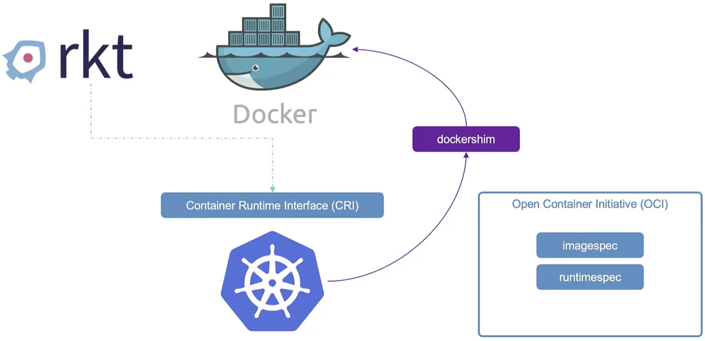
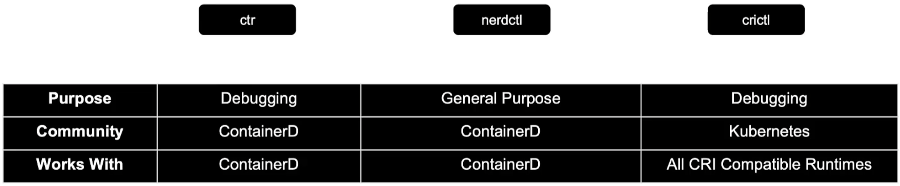

# Docker vs Containerd

Earlier, k8s tightly coupled with docker and k8s supports only docker (container solution) even though other docker 
solution such as rkt available in the market. Over the period, k8s wants to support other container solution and introduced
an interface called <mark>Container runtime (CRI).</mark>. If any vendor adheres to OCI (Open Container Initiative) standards, 
they can be worked as container runtime in k8s.

<mark>OCI consists of an Image spec and runtime spec. Image spec defines how the image should be build and runtime spec defines how 
any container runtime should be developed. RKT adheres OCI standards and now it is supported by k8s via CRI.</mark> However, docker 
doesn't have CRI and k8s still need to support docker without CRI. Hence, <mark>k8s introduced dockershim to support docker without CRI.</mark>
However, it is a temporary one.



<mark>Docker consists of multiple tools such as CLI, API, Auth, Volumes, Run C etc., Run C is called container run time and it 
is managed by containerd</mark>. Containerd is CRI compatible and can work with k8s directly without dockershim. It is similar
like other container runtime solution (RKT). Now k8s can support docker via containerd and no need to maintain dockershim 
as containerd follows OCI standards. <mark>Hence, from k8s version 1.24 onwards, dockershim was removed and support for docker 
is also removed as containerd is in place to support docker.</mark>

##Containerd
You can install containerd alone without docker if you don't need any other docker features.
After installing containerd, <mark>there is CL tool called CTR is installed as part of containerd installation. This is unfriendly 
tool and supports very limited features. It is used only for debugging purpose.</mark>

<mark>NertCtl tool is another useful CL tool which supports almost all the docker features. While running the command, you just 
need to replace docker.</mark>

```html
nertctl run nginx
nertctl pull nginx
etc.,
```
<mark>CTR and NerdCTL are only for containerd.</mark>

<mark>CRICTL is another CL tool which supports all the container runtime solution such as RKT. This is developed by k8s community.</mark>
Again, it is only for debugging purposes. Commands are similar to docker commands except ```crictl pods``` which is not there in docker.

```html
crictl run nginx
crictl pull nginx
etc.,
```

###Summary



