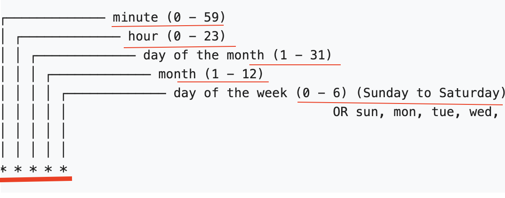
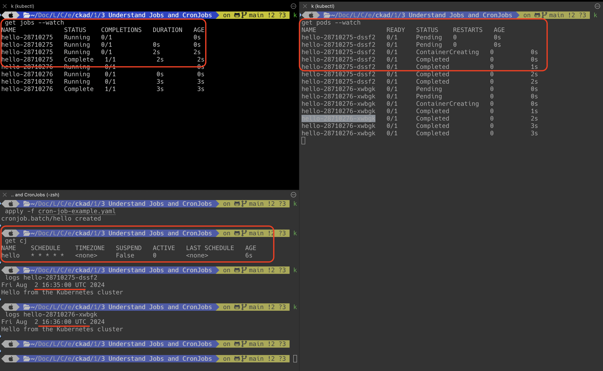
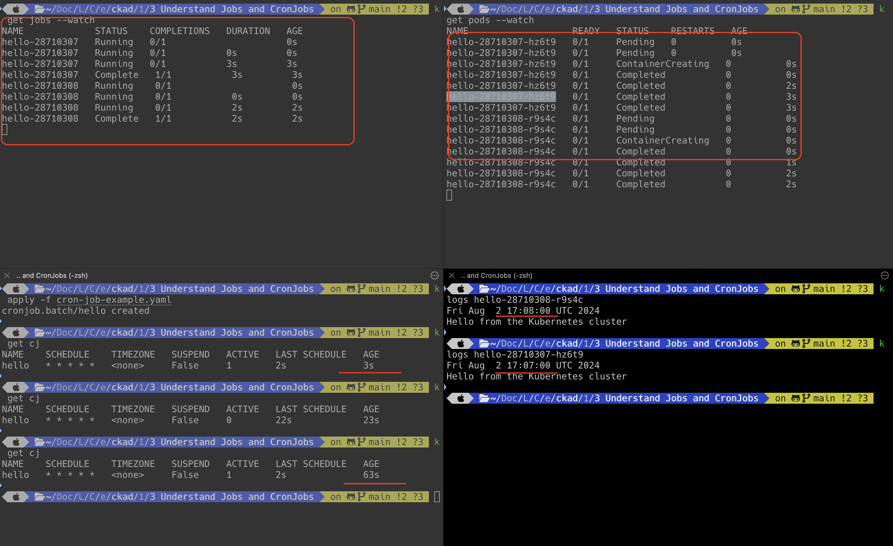

# Cron Jobs

Cron jobs are built on top of the jobs which runs the job periodically against on schedule. 
Schedule is the field where you can specify when the job needs to run repeatedly.



`cron-job.yaml`

```html
apiVersion: batch/v1
kind: CronJob
metadata:
  name: hello
spec:
  schedule: "* * * * *"
  jobTemplate:
    spec:
      template:
        spec:
          containers:
          - name: hello
            image: busybox:1.28
            imagePullPolicy: IfNotPresent
            command:
            - /bin/sh
            - -c
            - date; echo Hello from the Kubernetes cluster
          restartPolicy: OnFailure

```


In case if you want to run the job in every two minutes on every day, then the schedule is

`schedule: "*/2 * * * *"`

**Points to remember**

1. Cron job works on the time zone set on your k8s control plane
2. Cron job controller checks every 10 seconds to verify if any job is missed
3. If 100 jobs are missed by job controller (maybe due to downtime), then the controller won't try anymore 
   to run the cron job. 
   `startingDeadlineSeconds` field holds the value for this.
   If we update this value as 10,
   then the job controller will check every 10 seconds to see if 100 jobs are missed or not.
   If the job is not started within 10 seconds, then the job is going to be killed.


`cron-job.yaml`

```html
apiVersion: batch/v1
kind: CronJob
metadata:
  name: hello
spec:
  schedule: "* * * * *"
  startingDeadlineSeconds: 10
  concurrentPolicy: Allow
  jobTemplate:
    spec:
      template:
        spec:
          containers:
          - name: hello
            image: busybox:1.28
            imagePullPolicy: IfNotPresent
            command:
            - /bin/sh
            - -c
            - date; echo Hello from the Kubernetes cluster
          restartPolicy: OnFailure

```



#### Concurrency Policy

| Options | Description                                                                                                          |
|---------|----------------------------------------------------------------------------------------------------------------------|
| Allow   | If the previous job is still running, this will allow us to create the new jobs without disturbing the existing job  |
| Forbid  | If the previous job is still running, this will not allow us to create the new jobs until the existing job completes |
| Replace | If the previous job is still running, this will delete the existing job and replace them by creating a new job       |


