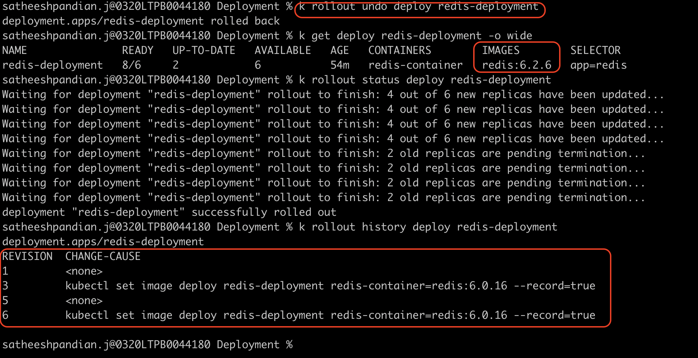

###Recreate Strategy
All pods are killed at once and recreated with new pods at once. For example, assume there are 4 pods are running the application
with v1 features in the production environment. Now, we are ready with v2 features, and it needs to be moved to production.
If we are following recreate strategy for deployment, then all existing 4 pods with v1 features will be destroyed together.
Then, new pods with v2 features will be created together.


```html
# Strategy should be updated as 'Recreate'. By default, it is RollingUpdate 
spec:
  replicas: 3
  strategy:
    type: Recreate
	
```
```html
apiVersion: apps/v1
kind: Deployment
metadata:
  name: nginx-deployment
  labels:
    app: nginx
spec:
  replicas: 3
  strategy:
    type: Recreate
  selector:
    matchLabels:
      name: nginx-pod
  template:
    metadata:
      labels:
        name: nginx-pod
    spec:
      containers:
        - name: nginx
          image: nginx:1.14.2
          ports:
            - containerPort: 80

```


Now we are updating the image to nginx:latest from nginx:1.14.2


All pods are terminating at once and recreated at once.
**Pros**

When it comes to easy setup, Recreate is a good option.

Application state entirely renewed.

**Cons**

High impact on the user, expect downtime that depends on both shutdown and boot duration of the application.

###Rolling Update Strategy
This is the by default strategy in kubernetes. Only one pod is killed and recreated with new pod and continue so until all the required pods are created.
For example, assume there are 4 pods are running the application with v1 features in the production environment. Now, we are ready with v2 features, and it needs to be moved to production.
If we are following rolling update strategy for deployment, then one pod with v1 features will be destroyed first. Then, one pod with v2 features will be created. Then it will continue until
all 4 pods with v2 features are in place.


```html
apiVersion: apps/v1
kind: Deployment
metadata:
  name: nginx-deployment
  labels:
    app: nginx
spec:
  replicas: 3
  strategy:
    type: RollingUpdate
    rollingUpdate:
      maxSurge: 2
      maxAvailable: 0
  selector:
    matchLabels:
      name: nginx-pod
  template:
    metadata:
      labels:
        name: nginx-pod
    spec:
      containers:
        - name: nginx
          image: nginx:1.14.2
          ports:
            - containerPort: 80

```


Now we are updating the image to nginx:latest from nginx:1.14.2


`Note: In Rolling Update, when maxSurge is mentioned, first new pod will create and once it is moved to running state, then the existing pod will be deleted.`

**Pros**

Slow-release of version across instances.

Useful for stateful applications that can handle the data.

**Cons**

In this strategy, rollout and rollback take time.

There is no control over the traffic.

###Rolling Update and Rolling back

```html
apiVersion: apps/v1
kind: Deployment
metadata:
  name: redis-deployment
  labels:
    app: redis

spec:
  replicas: 15
  selector:
    matchLabels:
      app: redis-pod
  strategy:
    type: RollingUpdate
    rollingUpdate:
      maxSurge: 2
      maxUnavailable: 0
  minReadySeconds: 10 #After pod created, it will wait for 10 seconds and route the traffic
  template:
    metadata:
      labels:
        app: redis-pod
    spec:
      containers:
        - name: redis-container
          image: redis:6.0 # Upgrade from 6.0 to 5.0 --> 6.0.16 --> 6.2.6
```


Now we are updating the image to redis:6.0 from redis:5.0


`NOTE: We are not seeing any revision change-cause because we are not recording any revision changes`

Now we are updating the image to redis:5.0 from redis:6.0.16 using CLI. This time we are recording the changes.


`NOTE: Now we are seeing revision change-cause because we are recording the changes`

Now we are updating the image to redis:6.0.16 from redis:6.2.6. Along with we made replica changes to 6 and maxSurge is as 2.


### Rolling Back to particular revision

Now let us move revision 2 which is image changes to redis:5.0. Remember, in revision 2, the image is redis:5.0, replicas is 15. maxSurge is 4.
But when we roll back the current revision 4 to revision 2, this will update only image. It CANNOT update replicas, maxSurge etc.,


<mark>If you look at the revision history, there is no revision 2 because it is updated as revision 5.</mark>

### Rolling Back to previous revision

Now let us move previous revision which is image changes to redis:6.2.6.  But when we roll back the current revision 5 to previous revision (which is 4), this will update only image. It CANNOT update replicas, maxSurge etc.,
After rolling back, the current version is 6 and there is no revision 4. Because revision 4 is updated to revision 6.




### Canary Deployment Strategy


