### Create the pods with below configuration

```html
#### without label
apiVersion: v1
kind: Pod
metadata:
  name: no-label-demo
spec:
  containers:
    - name: nginx
      image: nginx:latest
      ports:
        - containerPort: 80
```
```html
#### with one label
apiVersion: v1
kind: Pod
metadata:
  name: single-label-demo
  labels:
    app: nginx
spec:
  containers:
    - name: nginx
      image: nginx:latest
      ports:
        - containerPort: 80
```
```html
#### with multiple labels
apiVersion: v1
kind: Pod
metadata:
  name: multi-labels-demo
  labels:
    app: nginx
    env: dev
spec:
  containers:
    - name: nginx
      image: nginx:latest
      ports:
        - containerPort: 80
```
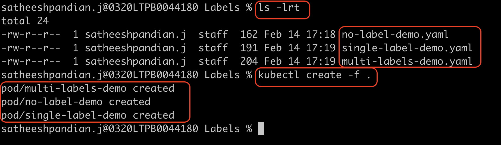

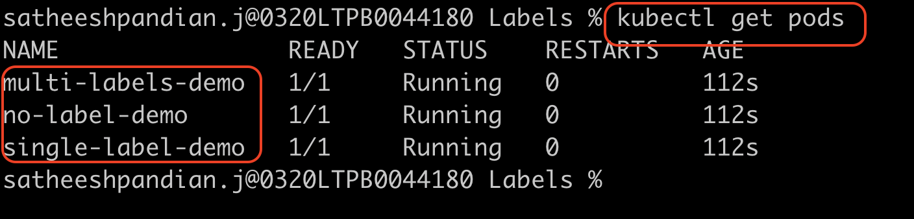
### Display the pod label
`kubectl get pods --show-labels`

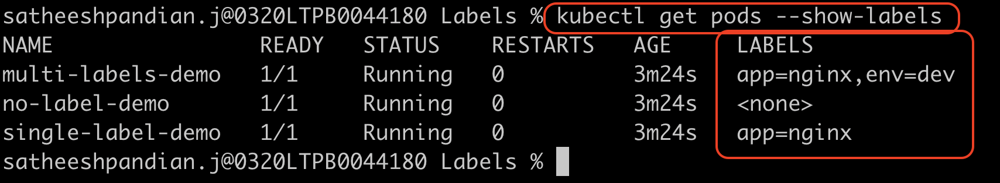

### Filtering the pods based on the label
`kubectl get pods -l <key=value>`

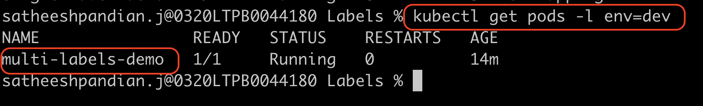

### Adding the labels to the pods
`kubectl label pods <podname> <key=value>`

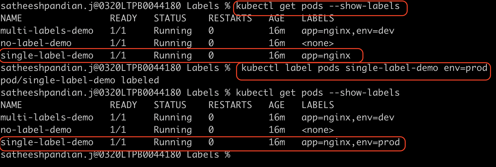

### Overwrite existing labels in the pods
`kubectl label pods <podname> <key=value> --overwrite`

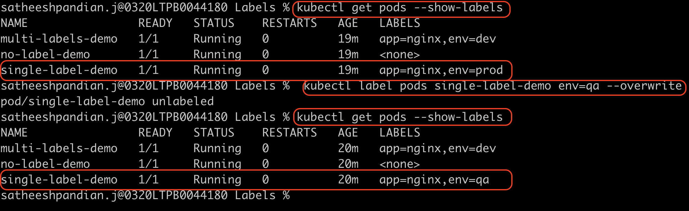

###Remove the labels from the pods
`kubectl label pods <podname> key-`

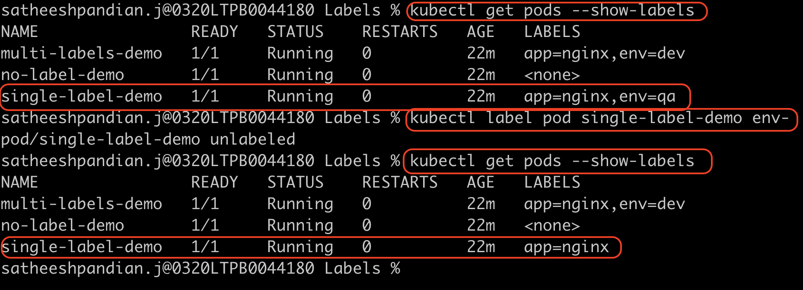

###Destroy the pods based on label
`kubectl delete pods -l <key=value>`

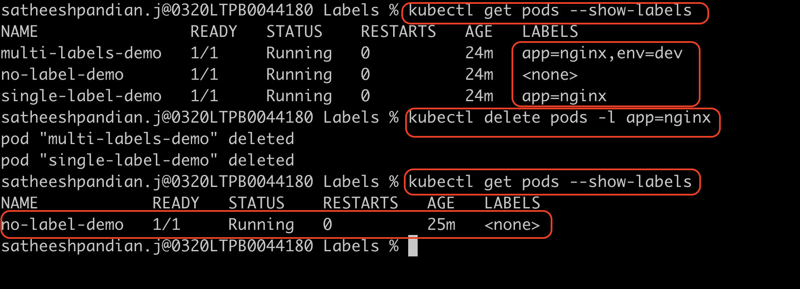
`Note: When deleting the pod based on the label, it will delete all the pods if the label exists in the pod configuration.`

 <mark>For example, Assume the pod contains 3 labels.Out of 3 labels, only 1 label matches while executing delete command, 
 then this pod will be deleted. </mark>
 
###Label selector - Highlevel

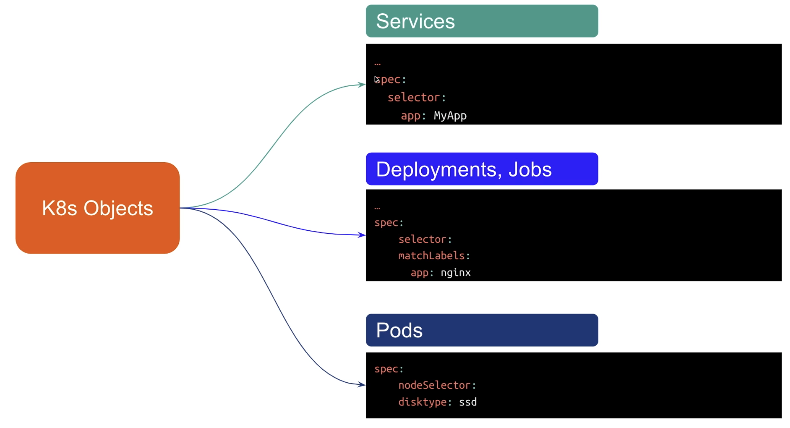

###Create Deployment
`kubectl create deployment <deployment name> --image=<image name>`

`kubectl create deployment <deployment name> --image=<image name> --replicas=<number of pods>`

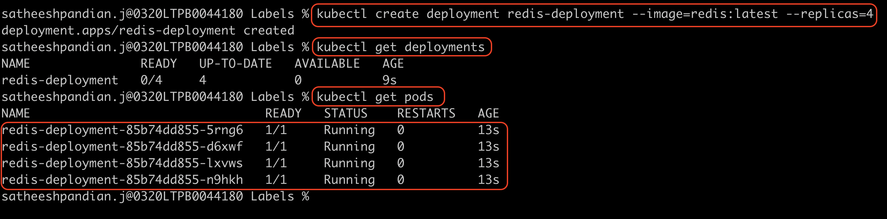

Below two commands will not create deployment. Instead, it will evaluate if this command can create deployment. If it creates, what would be the yaml file content
`kubectl create deployment <deployment name> --image=<image name> --replicas=<number of pods> --dry-run=client`

`kubectl create deployment <deployment name> --image=<image name> --replicas=<number of pods> --dry-run=client -o yaml`

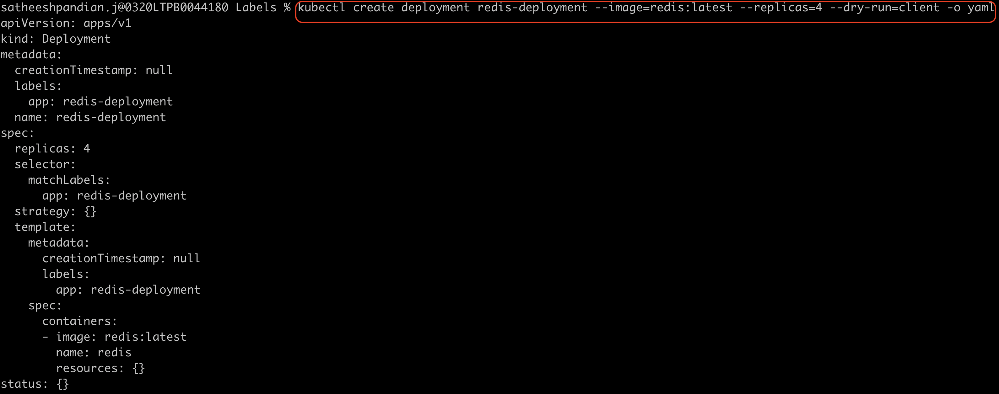

###Change the image in the existing deployment
`kubectl set image deployment <deployment name> <container-name>>=<image name>`

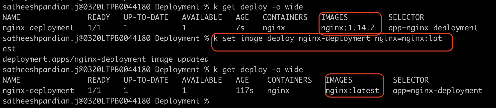

###Rolling Status for a deployment and rolling history for a deployment
`kubectl rollout status deployment <deployment name>`

`kubectl rollout history deployment <deployment name>`

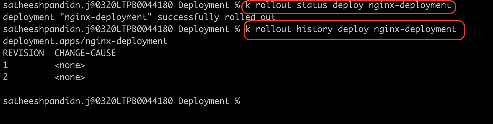

###Rolling Back  to previous deployment

`kubectl rollout undo deployment <deployment name>`

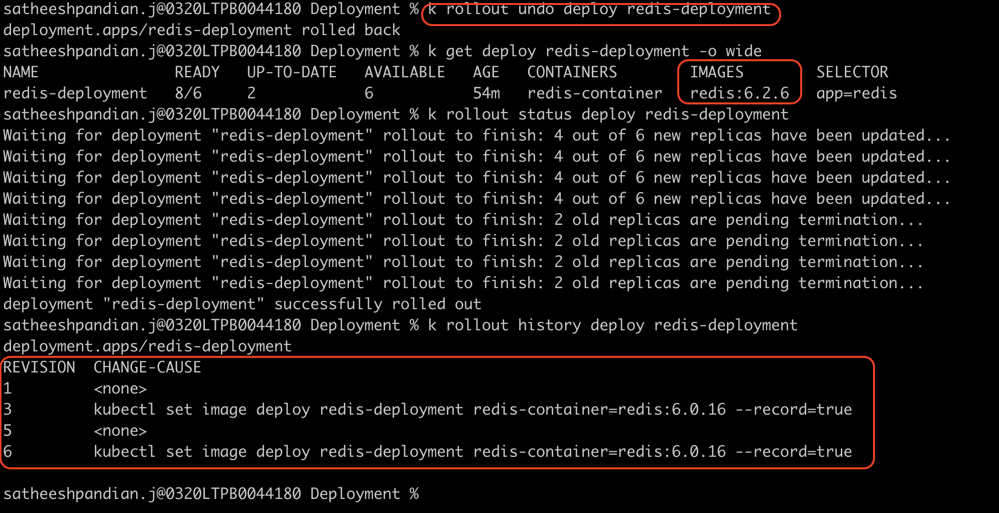

### Rolling Back to particular revision

`kubectl rollout undo deployment <deployment name> --to-revision=<revision number>`

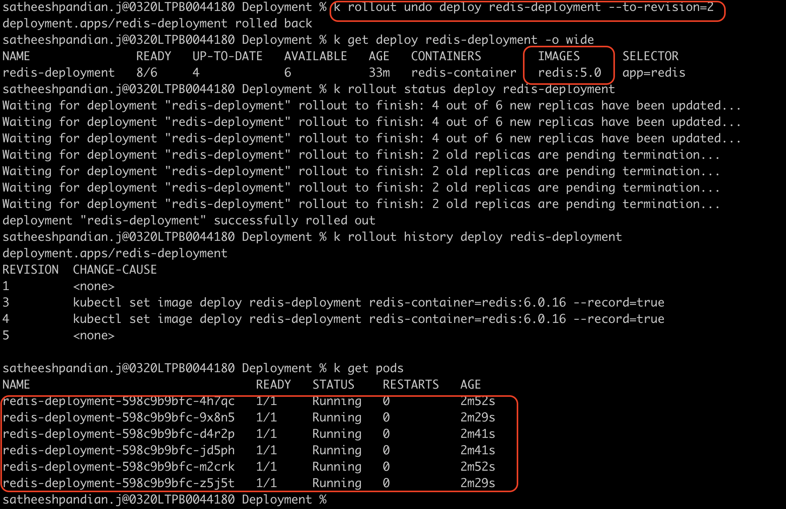

### Scaling the deployment

`kubectl scale deployment <deployment name> --replicas=<number of pods>`

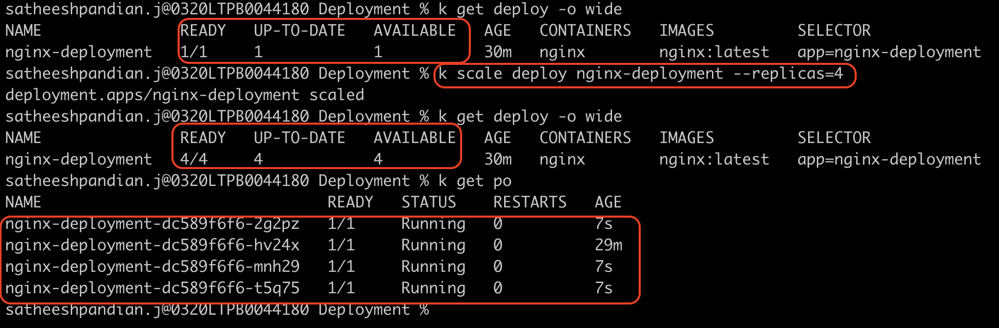

### Autoscaling the deployment based on CPU usage

`kubectl autoscale deployment <deployment name> --min=2 --max=6 --cpu-percent=<percentage number>`

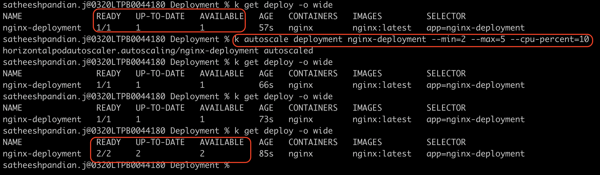

