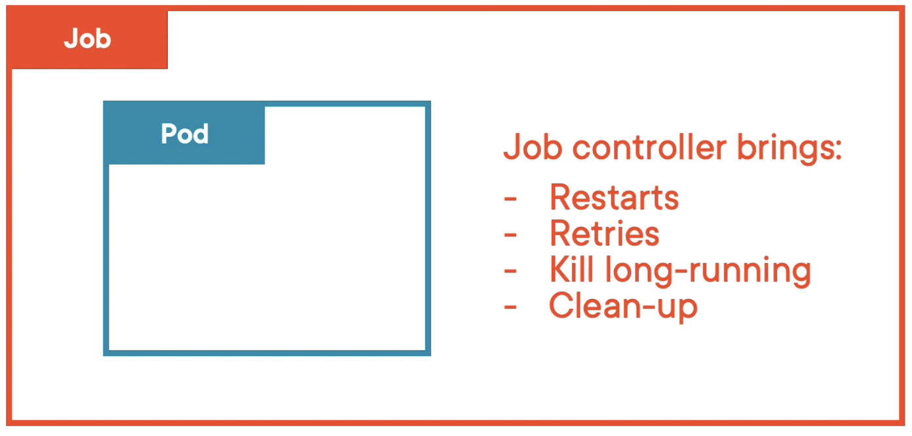
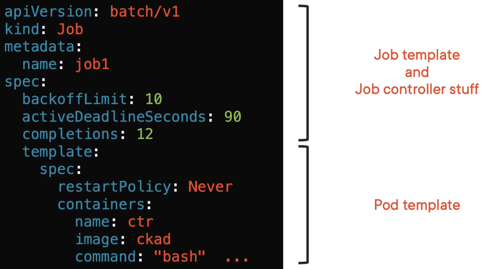
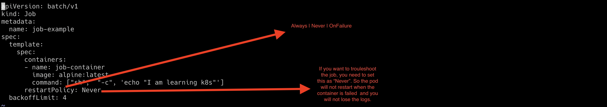
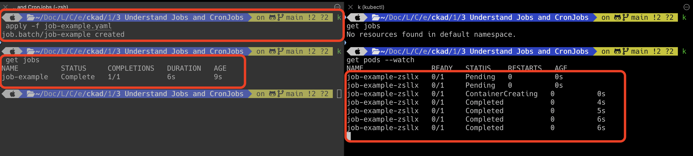
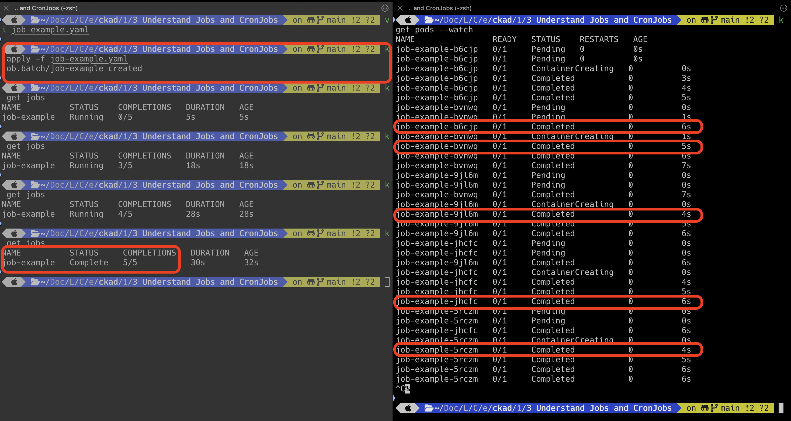
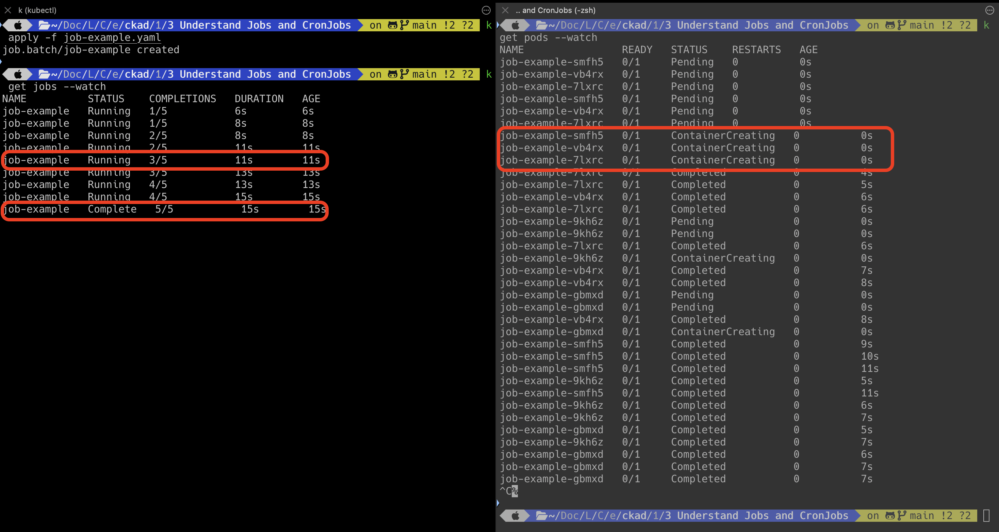
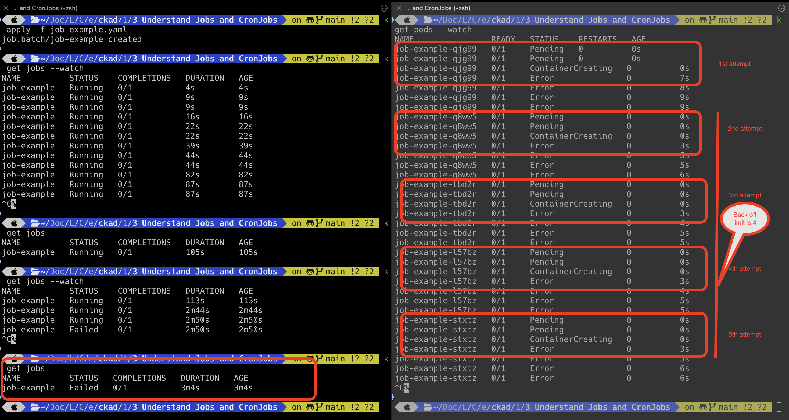
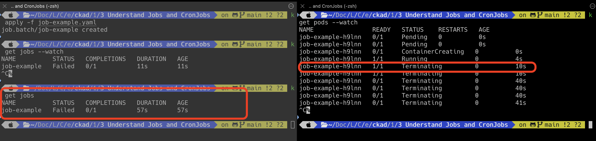

# Jobs


Jobs runs set number of pods to completion.
Jobs are managed by job controller, 
which is your kubernetes controller that observes things from control plane and makes sure everything runs as expected.

`Remember you cannot run the pods in parallel. But you can run the pods in parallel using jobs 
(you can define how many pods can run parallel).`



#### Jobs template



Job is responsible to create the pods and monitor them.
Pods are responsible for creating the container and ensure that it is running.
Container is responsible for running the application.

In short, Job creates the pod and watches them to successful completion and cleans them up and then a job completes.

`job.yaml`

```html
apiVersion: batch/v1
kind: Job
metadata:
  name: job-example
spec:
  template:
    spec:
      containers:
      - name: job-container
        image: alpine:latest
        command: ["sh",  "-c", 'echo "I am learning k8s"']
      restartPolicy: Never
  backoffLimit: 4
```

#### Restart Policy



There are three possible values
1. Always : The pod will be restarted automatically after the container is terminated. This is the default value.
2. Never : The pod will not be restarted automatically after the container is terminated.
3. OnFailure: The pod will not be restarted automatically only if the container is failed (terminated with non-zero exit code)

`Remember that if you want to troubleshoot, you need a logs and if you need a logs, you should not restart the pod even if the container is failed
So, keep restart policy is Never in case of troubleshooting`

#### Number of Pods to be run

By default, the job will create only one pod, and the job ends once the pod completes the task it is intended to be.



In case, if you want to run five pods, then you need to update the job manifest file with `completions`.
However, the pods will be created one after one.
It means the first pod will create and execute successfully.
Then only, second pod will create and so on.

`job.yaml`

```html
apiVersion: batch/v1
kind: Job
metadata:
  name: job-example
spec:
  completions: 5
  template:
    spec:
      containers:
      - name: job-container
        image: alpine:latest
        command: ["sh",  "-c", 'echo "I am learning k8s"']
      restartPolicy: Never
```


#### Parallel Execution
In case, if you want to run five pods and three pods should run in parallel, then you need to update the job manifest file 
with `completions` and `parallelism`.
This will create three pods immediately and execute them successfully.
Once any of the pods are completed successfully,
the next pod will be created immediately and job controller ensures that three pods are running in parallel.

```html
apiVersion: batch/v1
kind: Job
metadata:
  name: job-example
spec:
  completions: 5
  parallelism: 3
  template:
    spec:
      containers:
      - name: job-container
        image: alpine:latest
        command: ["sh",  "-c", 'echo "I am learning k8s"']
      restartPolicy: Never
```


`Remember that completions and parallelism default value is 1`

#### Number of Retries

Let us assume that your pod is failing for some reason. You want to retry to run the job for a specified number of times.
To do this, include `backofflimit` in the manifest file.

```html
apiVersion: batch/v1
kind: Job
metadata:
  name: job-example
spec:
  backoffLimit: 4
  template:
    spec:
      containers:
      - name: job-container
        image: busybox
        args: ["/bin/cat",  "/etc/os"]
      restartPolicy: Never
```



`Remember that backoffLimit always expecting sequential failure. For example, in the above case, 4 consecutive failures 
make the job as failed`

#### Terminate the pod after x seconds

Let us assume that your pod is running for a long time. You want to terminate the pod after sometime.
To do this, include `activeDeadlineSeconds` in the manifest file.

```html
apiVersion: batch/v1
kind: Job
metadata:
  name: job-example
spec:
  activeDeadlineSeconds: 10
  template:
    spec:
      containers:
      - name: job-container
        image: alpine:latest
        command: ["sh",  "-c", 'echo "I am learning k8s" && sleep 60']
      restartPolicy: Never
```


In the above snapshot, pod is terminated after 10 seconds as `activeDeadlineSeconds` is defined as 10.

