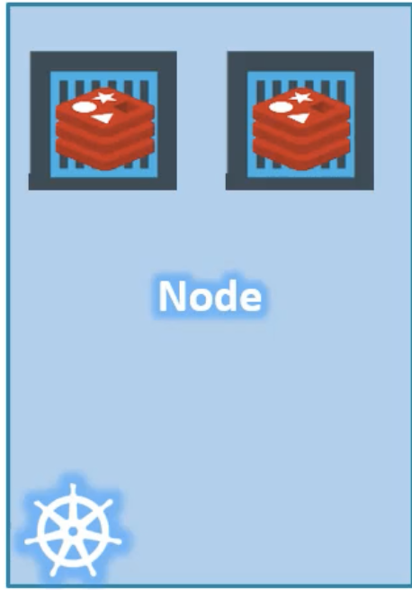
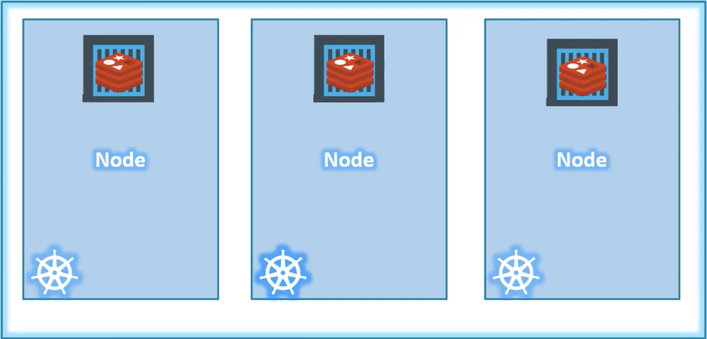
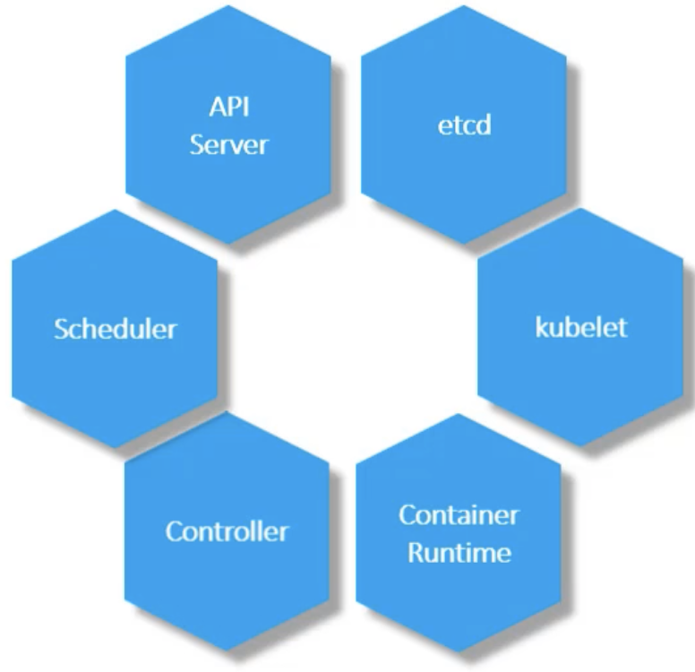
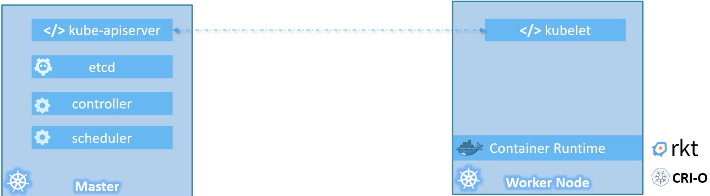

##Node
It is a <mark>physical or virtual machine where kubernetes installed. It is a worker machine
and this is where containers are launched by kubernetes. It is also called as minions.</mark>


Source: Kodekloud

In case if you have only one node in your infrastructure and for some reason, this node 
gets failed. This will lead to your application goes down. To avoid this, <mark>you need more than 
one node in your infrastructure.</mark>

##Cluster
It is a <mark>set of nodes grouped together. In case if one node is failed for some reason, you still 
have other nodes to serve the request. Hence, your application never goes down.</mark> This will also help
to share the load between the nodes.


Source: Kodekloud

Now the challenges are 
<ol>
    <li>Who can manage the cluster?</li>
    <li>Where the members of the cluster information store?</li>
    <li>How to monitor the nodes?</li>
    <li>If one node fails, how to change the workload to another node? Who will do this?</li>
</ol>

To answer all the above questions, Master is the one who will do all these activities.

##Master
<mark>Master is also a node where kubernetes installed and configured as Master.</mark> This will watch all the nodes in the cluster
and responsible for actual orchestration of containers on the worker nodes.

##K8s Components
When you are installing the kubernetes, it is automatically installed the following components


Source: Kodekloud

###API Server
It acts as front-end for the kubernetes. <mark>The users, management devices, command line interfaces will talk to API servers 
to interact with kubernetes.</mark>

###Etcd 
It is distributed and reliable key-value store used by kubernetes to store all the data to manage the cluster.
<mark>When you have multiple nodes, multiple masters in the cluster, all their information are stored in key-value format in a 
distributed manner.</mark> It is responsible for implementing the locks within the cluster to ensure that there are no conflicts 
between the masters.

###Scheduler
It is <mark>responsible to distribute work or containers across the multiple nodes. It searches for the newly created containers
and assign them to the nodes.</mark>

###Controller
It is the brain behind the orchestration. <mark>They are the one to notice and respond if the containers, nodes goes down.</mark> Controller
will take the decision to bring up the new containers/nodes/end points in such cases.

###Container Runtime
This is the underlying software that is<mark> used to run the container.</mark> It could be docker, rkt, crio.

###Kubelet
It is the agent that runs on each node in the cluster. It is <mark>responsible to ensure the containers are running as expected
on the nodes.</mark>

### How to serve as master or worker node
Worker node hosts the container. <mark>You need container runtime installed to run the containers. Kubelet agents are installed 
in worker node and responsible for interacting with master node. Kubelet will share the information with master node about 
health of worker node and also executed the instructions provided by master node.</mark>

<mark>Master node has API server. All the information shared by kubelet agent will be stored in key-value format in Etcd.
Master also have controller and scheduler.</mark>


Source: Kodekloud

###kubectl
It is a command line utility and generally called kube command line tool or kube control.
It is used to deploy and manage the application in kubernetes cluster.

```html
kubectl run <application_name>
```
The above command is<mark> used to deploy an application in k8s cluster.</mark>
Example:
```html
kubectl run hello-minikube
```
The below command is <mark>used to view the cluster information.</mark>
```html
kubectl cluster-info
```
The below command is <mark>used to list all the nodes part of the cluster.</mark>
```html
kubectl get nodes
```

