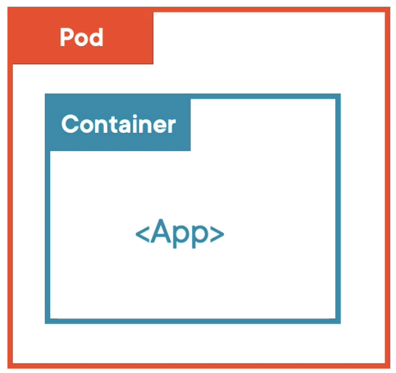
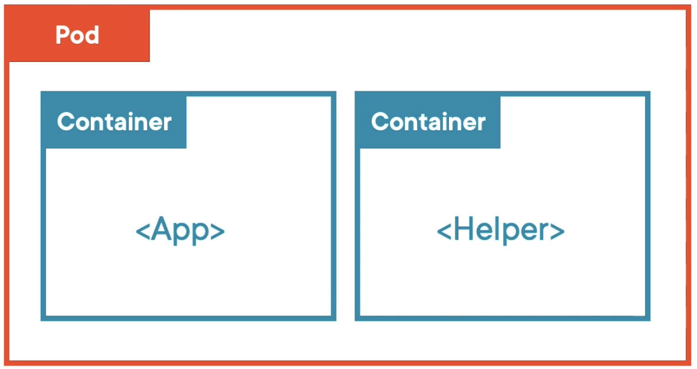
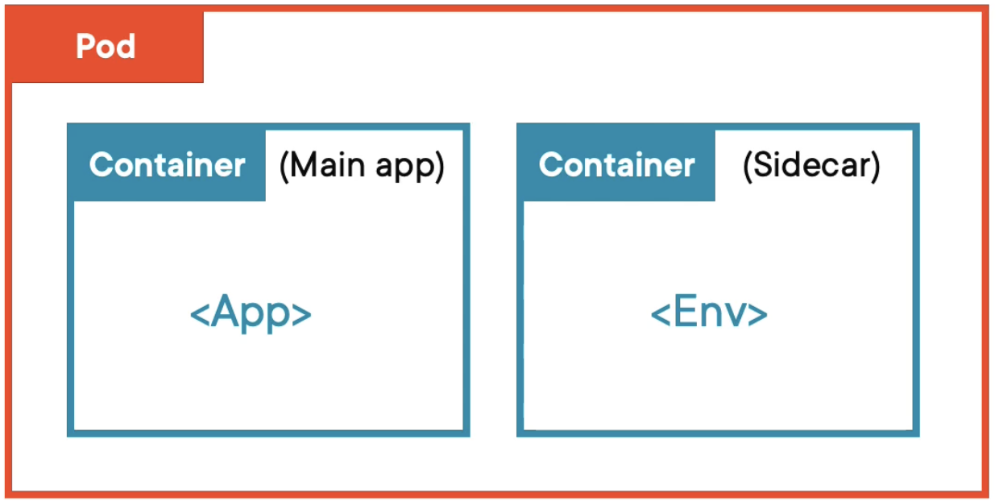
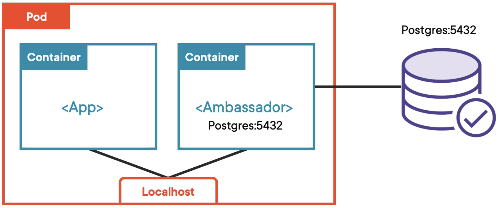
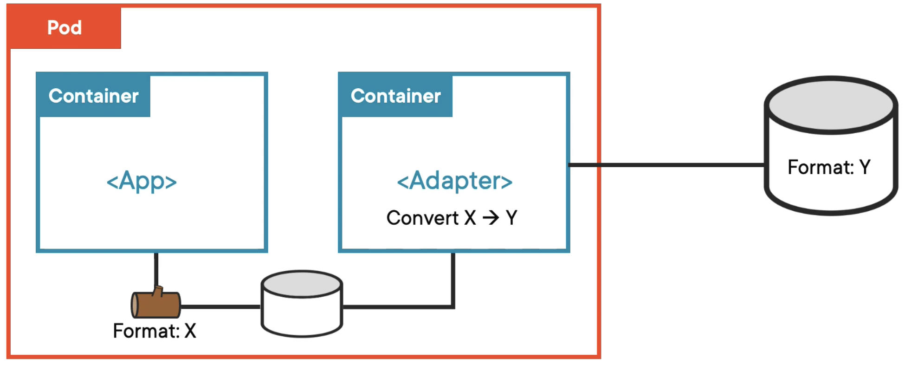
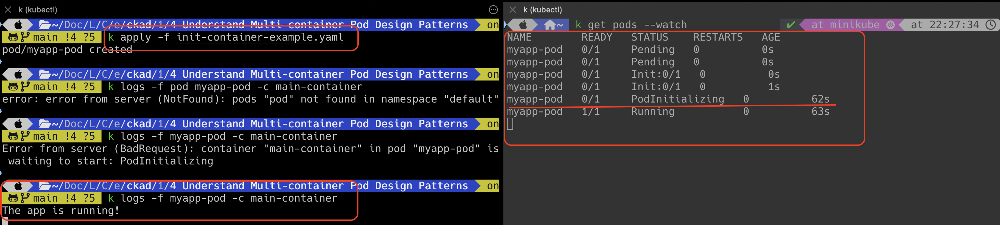
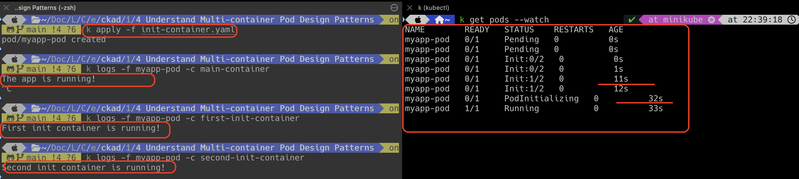

# Multi Containers

As you know, the simplest pod model is one container inside in the pod. 



However, a pod can host multiple containers inside it as well. This is known as multi container pod.



In the real world, multi container is used to separate the work between containers.
For example,
a pod has two containers inside it, 
and one pod can perform related to application features, 
and another pod can perform connecting the environment based on the connection strings.
This is called as separation of concerns which means every container does only one thing.



### Generic Patterns

Multi containers have three different patterns.

1. Ambassador
2. Adapter
3. Init Container

#### Ambassador Pattern

This is the generic multi container pattern. The containers inside in the pod are running together shoulder to shoulder.
When the pod dies, both containers also die.
They can share the same network, which means they can refer to each other as localhost, 
and they have access to the same storage volume.




#### Adapter Pattern

The containers inside in the pod are running alongside together.
App container storing the logs in the storage in a specific form.
Adapter container reads the logs and converts them to expected form and ships it to a centralized database.



`Remember that both patterns are generic sidecar models and there is no specific change in YAML file.`

#### Init Container

Init containers always starts first and completes its task. Until it gets completed, the app container will not start.
If there are many init containers in the pod, then they will execute one at a time in sequential order which they defined in the YAML file.
Until all the init containers complete successfully, the main container will wait.

Init container needs to be specified in the YAML file. 

`Remember init container runs only once.`


```html
apiVersion: v1
kind: Pod
metadata:
  name: myapp-pod
  labels:
    app.kubernetes.io/name: MyApp
spec:
  containers:
  - name: main-container
    image: busybox:1.28
    command: ['sh', '-c', 'echo The app is running! && sleep 30']
  initContainers:
  - name: init-container
    image: busybox:1.28
    command: ['sh', '-c', "sleep 60"]
```



In the above snapshot, the main app container starts after 60 seconds.
Until then, the main app container is in pending status.


```html
apiVersion: v1
kind: Pod
metadata:
  name: myapp-pod
spec:
  containers:
  — name: main-container
    image: busybox:1.28
    command: ['sh', '-c', 'echo The app is running! && sleep 3600']
  initContainers:
  - name: first-init-container
    image: busybox:1.28
    command: ['sh,' '-c,' 'echo First init container is running! && sleep 10']
  - name: second-init-container
    image: busybox:1.28
    command: ['sh,' '-c,' 'echo Second init container is running! && sleep 20']
```



In the above snapshot, init containers are executed sequentially in the order which they defined in the YAML file.


