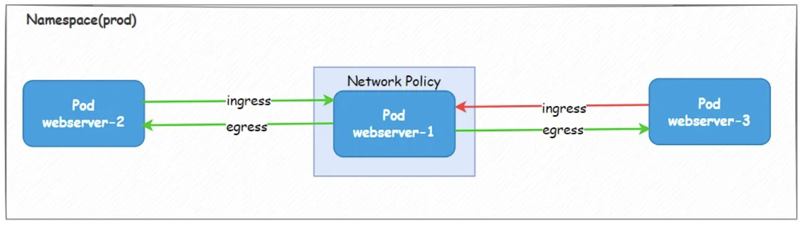
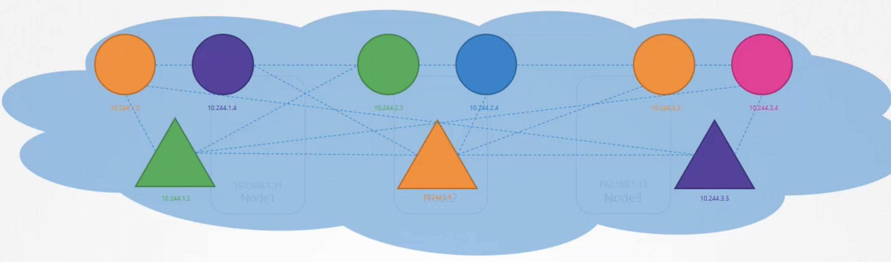
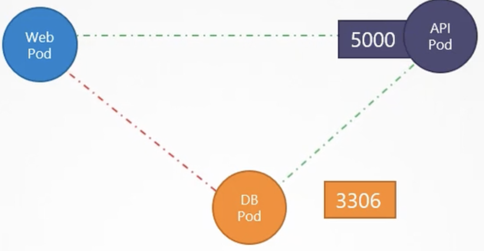
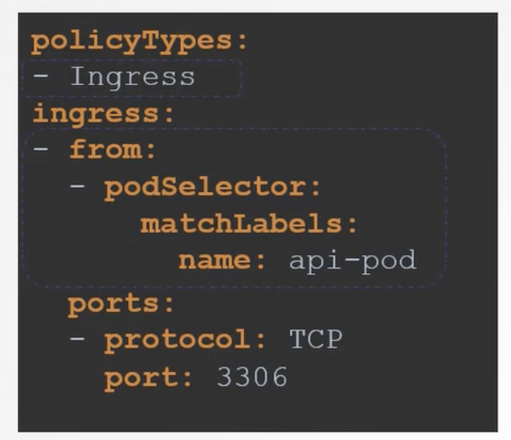
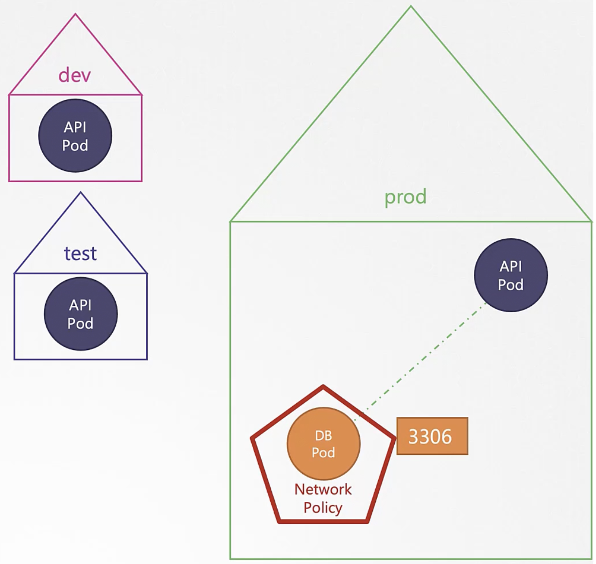

# Network Policy

Network policy is nothing but sets of rules defining which pod can to talk to which pod.
To understand this, we need to know what is traffic, ingress and egress.

| **Term** | **Description**                                                                    |
|----------|------------------------------------------------------------------------------------|
| Traffic  | Any request coming to the system and going out of the system is called as traffic. |
| Ingress  | Any request coming to the system is called as ingress.                             |
| Egress   | Any request going out of the system is called as egress.                           |


`Remember that ingress and egress are described based on the call originated. It means that if pod A talks to pod B, then ingress
and egress should considered for pod A because pod A is the source.`



In the above snapshot, if we are defining the network policy for webserver pod 1,
the request goes to webserver pod 2 from webserver pod 1 and the request comes to webserver pod 1 from webserver pod 3.
While defining the network policy for webserver pod 1,
egress to be considered for webserver pod 2 and ingress to be considered for webserver pod 3.

`Remember that there is no deny policy can be set to any pods. We can set only allow policy in k8s.`

#### Network Security

In kubernetes, by default network policy is `all allow`.
It means any pod can talk to any pod, any service in the cluster. 




Let us assume that there are three pods (Web, API ad DB) running in the node.
Web pod needs to talk only to API pod.
API pod needs to talk only to DB.
There should not be any communication between Web and DB pods.
In other words, DB pod should accept traffic only from API.



In this case, we need to create a network policy and attach it to DB Pod.
So, we need to create the network policy in DB pod's perspective.
In this network policy, DB can accept ingress traffic but not egress traffic.
So, we can add the pod selector which selects only API pod (Based on the label mentioned in API Pod) in the ingress section.



Only one rule is implemented in the below manifest file. 

`netpol.yaml`

```html
apiVersion: networking.k8s.io/v1
kind: NetworkPolicy
metadata:
  name: db-net-policy
spec:
  podSelector:
    matchLabels:
      role: db
  policyTypes:
  - Ingress
  ingress:
  - from:
    - podSelector:
        matchLabels:
          role: api # This label is mentioned in API pod
    ports:
    - protocol: TCP
      port: 3306
```

`Remember that network policy is implemented by network solution (Ex: Calico, Kube-router). 
All network solution will not support network policy (Ex: Flannel).`


### Developing Network Policy

1. Identify the pod in which we are implementing the network policy
2. Then find out the pod's labels and include them in the pod selector section.
3. Identify the type (ingress/egress) of network policy needs to be implemented in the selected pod.

`Remember that once you allow ingress traffic to the pod B from pod A, 
then it automatically allows egress as well from pod B to pod A`

1. Let us assume the type of network policy is ingress, then you need to find the pod where the call starts.
2. In any ingress type, there must be two sections (from and ports). 
Under from, we need to include the pod's label from where the call started
3. Under the ports section, we need to include the port in the identified pod for network policy.
4. In any egress type, there must be two sections (to and ports).
   Under to, we need to include the pod's label from where the call is going to.
5. Under the ports section, we need to include the port of the pod where the call is going to.

Let us assume that the pod selector label is available in the pods in different namespace like below.



Then, this network policy is applicable to all the namespaces.
It means the pod which has label `role:api` from any namespace can talk to db pod in the above manifest file.
So, if we want to restrict within a specific namespace, then we need to include namespace selector as well.


`netpol.yaml`

```html
apiVersion: networking.k8s.io/v1
kind: NetworkPolicy
metadata:
  name: db-net-policy
spec:
  podSelector:
    matchLabels:
      role: db
  policyTypes:
  - Ingress
  ingress:
  - from:
    - podSelector:
        matchLabels:
          role: api # This label is mentioned in API pod
      namespaceSelector:
        matchLabels:
          name: prod 
    ports:
    - protocol: TCP
      port: 3306
```

In the above manifest file, there are two ingress rules (pod selector and namespace selector) and the pod will be selected 
if both rules are satisfied. This is similar to `AND` in if condition.

```html
apiVersion: networking.k8s.io/v1
kind: NetworkPolicy
metadata:
  name: db-net-policy
spec:
  podSelector:
    matchLabels:
      role: db
  policyTypes:
  - Ingress
  ingress:
  - from:
    - podSelector:
        matchLabels:
          role: api # This label is mentioned in API pod
    - namespaceSelector:
        matchLabels:
          name: prod 
    ports:
    - protocol: TCP
      port: 3306
```

In the above manifest file, there are two ingress rules (pod selector and namespace selector) and the pod will be selected 
if any one of the rules is satisfied because there is `-` before the selectors (pod & namespace).
This is similar to `OR` in if condition.

Let us assume that there are some servers which are not part of the cluster
and still want to talk to DB pod for running backup activities.
If that is the case, we need to include the `ipBlock` range in the ingress rule.

```html
apiVersion: networking.k8s.io/v1
kind: NetworkPolicy
metadata:
  name: db-net-policy
spec:
  podSelector:
    matchLabels:
      role: db
  policyTypes:
  - Ingress
  ingress:
  - from:
    - podSelector:
        matchLabels:
          role: api # This label is mentioned in API pod
      namespaceSelector:
        matchLabels:
          name: prod 
    - ipBlock:
        cidr: 10.9.198.2/32
    ports:
    - protocol: TCP
      port: 3306
```

In the above manifest file, there are three ingress rules (pod selector and namespace selector and ipBlock).
In the first rule, there are two conditions and both conditions must meet to select the pod.
In the second rule, if any node from the ip block range, then it can connect to the DB pod. 


```html
apiVersion: networking.k8s.io/v1
kind: NetworkPolicy
metadata:
  name: db-net-policy
spec:
  podSelector:
    matchLabels:
      role: db
  policyTypes:
  - Ingress
  ingress:
  - from:
    - podSelector:
        matchLabels:
          role: api # This label is mentioned in API pod
      namespaceSelector:
        matchLabels:
          name: prod
    ports:
    - protocol: TCP
      port: 3306

  - from:
    - podSelector:
        matchLabels:
          role: web # This label is mentioned in API pod
      namespaceSelector:
        matchLabels:
          name: prod
    ports:
    - protocol: TCP
      port: 8080

```
Two different pods can talk to db pod based on the above ingress rule.