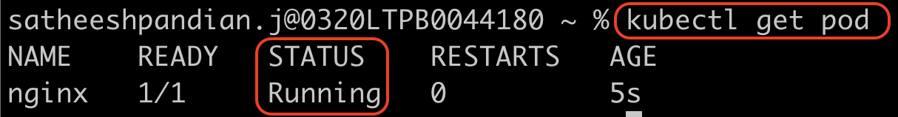
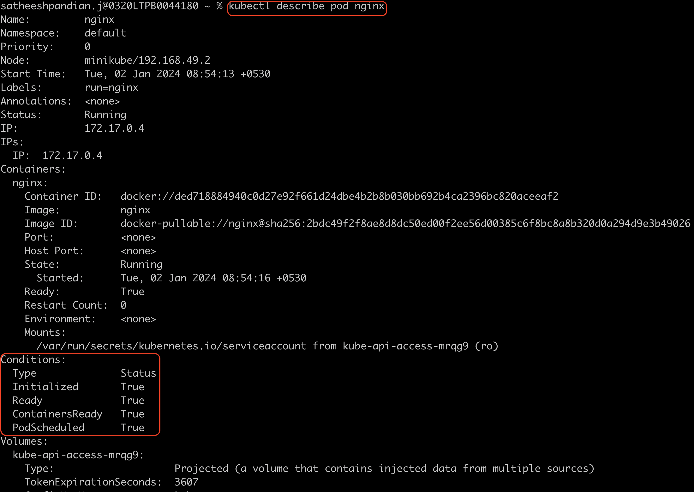

~~#Observability~~
###Readiness Probe
**Pod Status**

<mark>**Pending:**</mark>Pod has a status in its lifecycle. When a pod is created first, it is in pending state. When the pod is in pending state, 
scheduler check and find out where to place the pod (Which node). In case, if the scheduler is unable to find the node to place the pod
then the pod will be in pending state only until scheduler finds the node. If you want to find out the reason why the pod 
is in pending state, run the below command
```html
kubectl describe pod <pod name>
```
<mark>**Container Creating:**</mark>When the scheduler finds the node to place the pod, the pod status moves to container creating 
status. This is where the image has been pulled and the container starts. 

<mark>**Running:**</mark>Once the container starts, it goes to running state.
In case of multi-container pod, once all the containers start, then only it moves to running state. It will continue to be in
running state until the program inside container runs.

<mark>**Terminated:**</mark>Once the program completes successfully, it moves to terminated state.

To check the pod status, run the below command and check the status column
```html
kubectl get pods
```



`Remember the above command gives only high level information`

**Pod Conditions**

There are 4 different conditions.
1. Pod Scheduled

    `When the pod is scheduled on a node, this condition is set to TRUE`
2. Initialised

    `When the pod is initialised, this condition is set to TRUE`
3. Containers Ready

    `When the container is ready, this condition is set to TRUE. In case of multi-container, once all the containers are ready, then the condition is set to TRUE`
4. Ready

    `Finally the pod considers that it is ready`

To check the pod condition, run the below command and check the condition section
```html
kubectl describe pod <pod name>
```


Once the pod is in ready condition, it is ready to accept the user traffic. However, the application running inside the container
may or may not be ready to serve the user request (<mark>Sometimes server takes few minutes to warmup and during this time, if we run 
kubectl get pods command, the status show the pod is ready which is actually not yet ready</mark>). 

`By default, k8s assumes that the pod is ready to server user request when it moves to ready state`

A user access the application running inside the container through service. Service will send the user traffic to the pod 
once the pod is in ready status. But in the above case, the pod status is ready (But the server is still warming up and not ready)
and service start to sending the user request to pod, and it leads to request failure. To avoid this, we need to make sure when the pod
is in ready status, it is actually ready.

We need to check the application ready status via configuring probe. If it is web server, we can hit the API to make sure we are getting 
response. If it is DB server, then we make sure TCP socket is listening the port.

```html
apiVersion: v1 --------------------> Based on k8s object, you can update this
kind: Pod -------------------------> k8s object
metadata: -------------------------> Pod properties need to be updated under this
    name: my-pod ------------------> Pod name (mandatory)
    labels: -----------------------> used to group pods (optional)
        apps: sats
spec:  ----------------------------> container properties need to be updated under these
    containers: 
    -   image: nginx --------------> container image
        name: nginx-container -----> container name
        readinessProbe:------------> k8s check the ready status against it
            httpGet: --------------> HTTP option to check the probe (Option 1)
                path: /api/v1/ready -> API to check if the application is ready to accept the traffic
                port: 8080 --------> to hit API via this port
            initialDelayResponse: 10 ---> It will wait 10 seconds after the container starts (in ready status)
            periodSeconds: 20  ----> Every 20 seconds, probe test happens until it gets positive response
            failureThreshold: 100 -> It will attempt probe test for minimum 100 times until it gets positive response.
            tcpSocket: ------------> (Option 2) for DB server
                port: 3303 --------> to hit DB server via this port
            exec: -----------------> (Option 3) for simple script
                command: ----------> Command to execute the script
                - cat
                - file.txt
```

`Remember that by default, probe test can happen only 3 times. If you want to change that, you need to include failureThreshold: <number>`

Once the pod is in ready state, k8s will not immediately route the traffic. Instead, it performs a check to hit API mentioned,
and see if it gets positive response. If it gets positive response, then it will redirect the user traffic. If not, until it 
gets positive response, it will not route the traffic.

###Liveness Probe