# Docker Storage

When you install the docker in the system,
it is creating the directory `/var/lib/docker` and this is where docker stores all the data
(containers, images information) by default.

```html
/var/lib/docker
│── aufs
│── images
│── containers
│── volumes
```

Docker builds the image in a layered architecture using storage drivers (Aufs, device mapper, overlay, etc.). It means each line in Docker file creates the layer. 
Let's assume your docker file contains five lines.
Then, your image should have five layers and each layer will have changes from the previous layer.
Finally, the image is built and it is a read-only mode.
You cannot change any data within the image.
If you want to change any data in the image, you need to make the change in the docker file and rebuild the image.

When you create a container using the image built, container layer will create on top of all the layers. This container
layer is read-write mode.

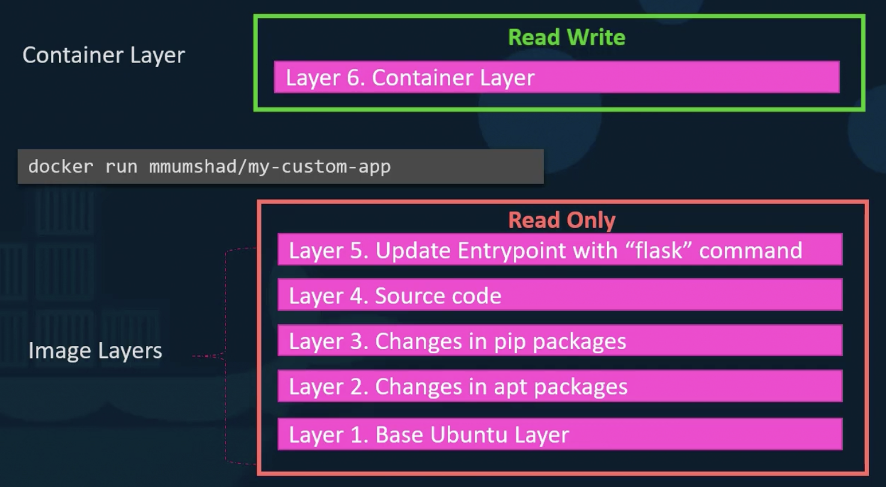

However, when the container dies, whatever data it creates will also die.
To avoid this, we create a volume and attach it to the container. 

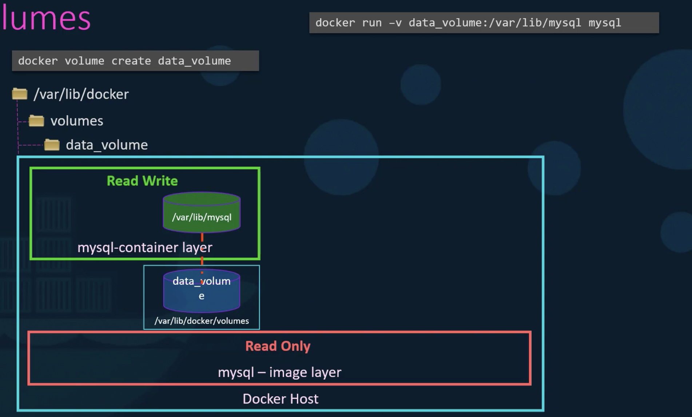

In case if the volume is not created, but attached to the container. Then, volume will be automatically created.

`Remember volumes are not handled by storage drives. It is handled by volume driver plugins.`

### Volumes in K8s

Volumes in k8s will be used to store the data permanently.
In the below example,
a random number is generated by the application running in a container
and wrote the generated number in the file inside the container (/opt/number.out).
This container is attached to the volume (data-volume) and mounted the path /opt to the volume.
It means whatever data is stored in /opt path will be written in the data-volume as well.
This volume (data-volume) is storing all the data in the /data directory in the host machine.
Once this pod dies, data in the path /opt also dies.
However, the data is still available in the path /data in data-volume.

```html
apiVersion: v1
kind: Pod
metadata:
  name: hostpath-example-linux
spec:
  containers:
  - name: example-container
    image: alpine
    command: 
    - sh
    - -c
    args: ["shuf -i 0-100 -n 1 >> /opt/number.out;"]
    volumeMounts:
    - mountPath: /opt # directory location on container
      name: data-volume
  volumes:
  - name: data-volume
    hostPath:
      path: /data # directory location on host
      type: Directory # this field is optional
```

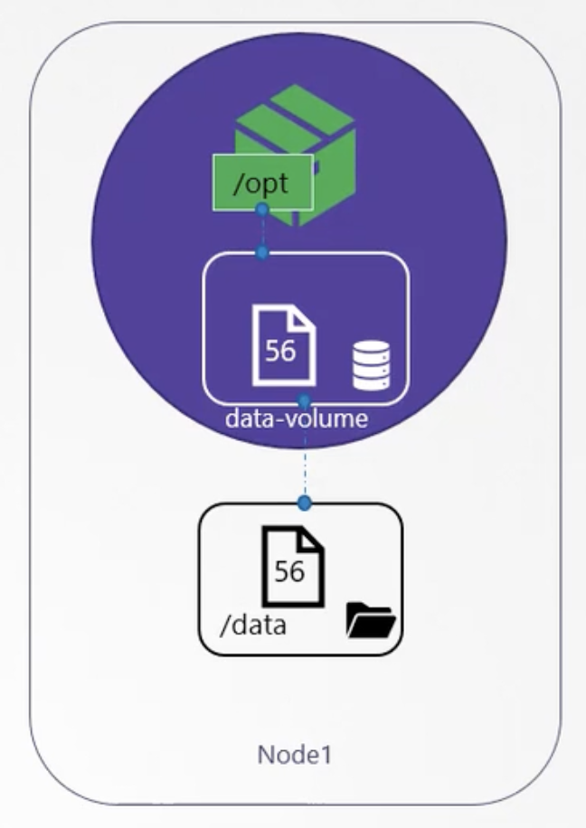

### Persistent Volume

**As volumes are available in k8s, why do we need persistent volume?**


To answer this question, we need to think about the real world production environment where too many pods are running.
If we start configuring the volume for each pod, then it is a tedious process and maintaining them is challenging.
To make it simple, persistent volume comes to the picture.
It is a cluster wide pool of storage volumes configured by admin.
Now user can deploy the application in the cluster and use the volumes in the pool using claims.

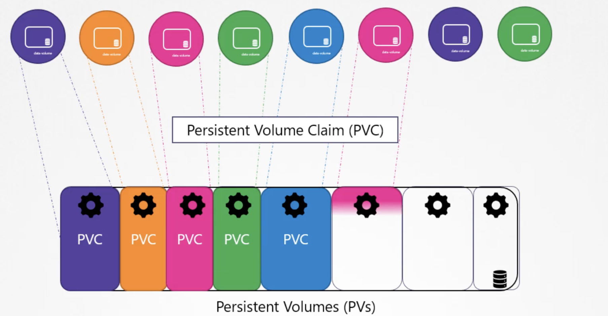

```html
apiVersion: v1
kind: PersistentVolume
metadata:
  name: pv0003
spec:
  volumeMode: Filesystem
  capacity:
    storage: 5Gi
  accessModes:
    - ReadWriteOnce
  hostPath:
    path: "/opt"
```

`Remember that if your cluster is on prem, then storage also should be in on prem. If cluster is on cloud, then storage also in cloud`

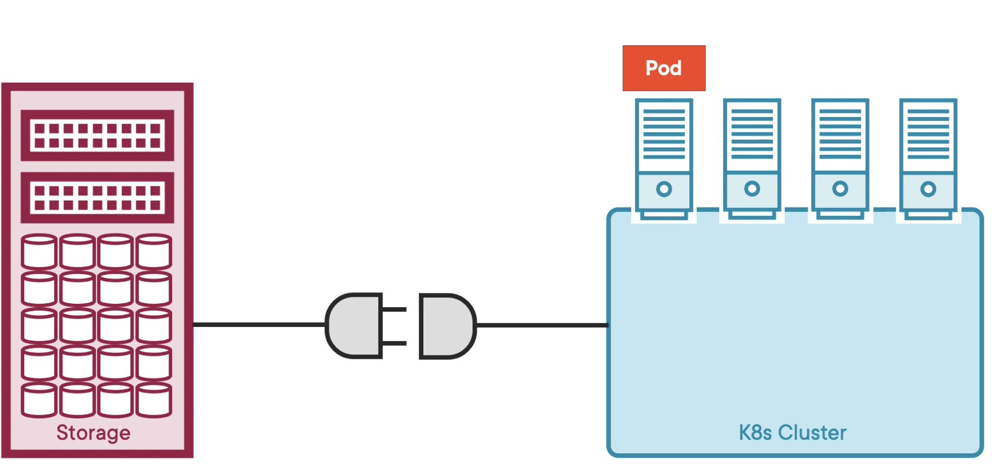

Storage drivers and plugin are the one that connects the cluster and storage shown in the above snapshot.

Overall end to end flow is below

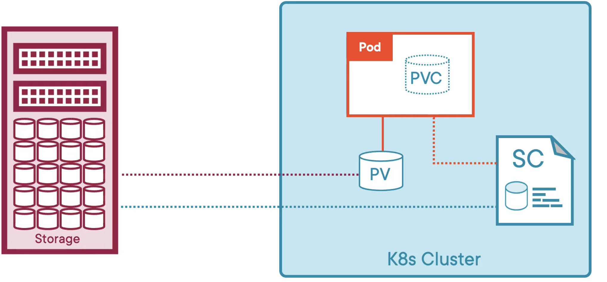


### Persistent Volume Claims

In kubernetes, PV and PVC are different objects. PV is created by admin and PVC is created by user to use the storage.

After PVC is created, PV is automatically bound with PVC based on the properties set on the volume.
It is a one-to-one relationship.
It means one PV is bound with one PVC.
Kubernetes will find the right PV that has enough capacity requested by PVC.
Once it is found,
PV and PVC will bind each other, 
and after that no other PVC can claim the same PV even if there is enough space left over.

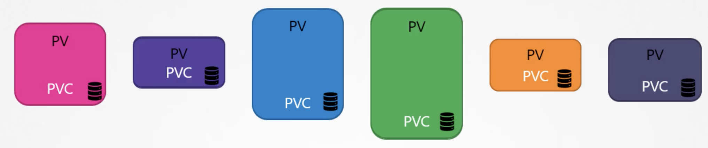

Let us assume it, there are 3 PV available in the cluster.
You are creating a PVC now.
So K8s will try to find the best fit for the PVC based on its properties.
In case of multiple matches, then K8s will find PV based on the labels mentioned in PVC manifest file.
If labels are not mentioned in the PVC manifest file, then K8s will find any one of those 3 PV.

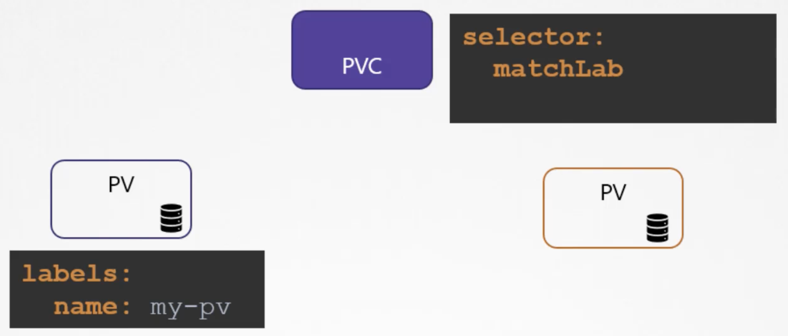

If there is no PV created or not available, then PVC will remain in the pending status until newer PV is available. 

Let us see an example.

`pv.yaml`

```html
apiVersion: v1
kind: PersistentVolume
metadata:
  name: my-pv
spec:
  persistentVolumeReclaimPolicy: Retain
  accessModes:
    - ReadWriteMany
  capacity:
    storage: 100Mi
  hostPath:
    path: /pv/log
```

```html
kind: PersistentVolumeClaim
apiVersion: v1
metadata:
  name: claim-log-1
spec:
  accessModes:
    - ReadWriteOnce
  resources:
    requests:
      storage: 50Mi
```
When we create both resources in k8s cluster, pvc is not bound with pv.
The reason for not bounding is the access mode difference between pv and pvc.

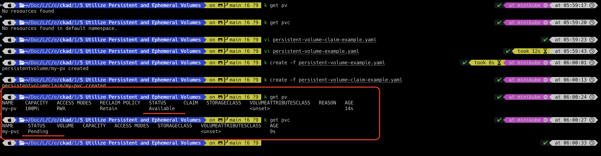

Now, if we update access mode to `ReadWriteMany`  in pvc, then it will bound with pv.

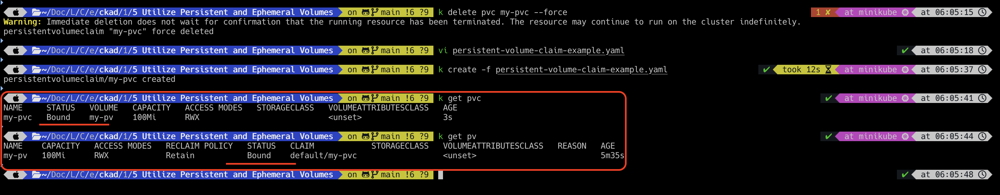

Let us create a pod to use the pvc.

```html
apiVersion: v1
kind: Pod
metadata:
  name: webapp
spec:
  containers:
  - name: event-simulator
    image: kodekloud/event-simulator
    env:
    - name: LOG_HANDLERS
      value: file
    volumeMounts:
    - mountPath: /log
      name: my-pv

  volumes:
  - name: my-pv
    persistentVolumeClaim:
        claimName: my-pvc
```
The Overall relations between pv, pvc and pod are shown in below

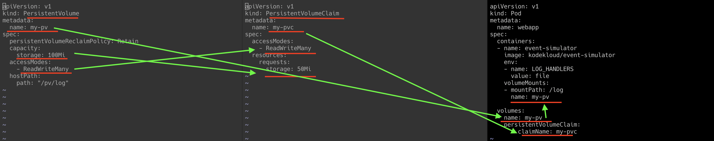

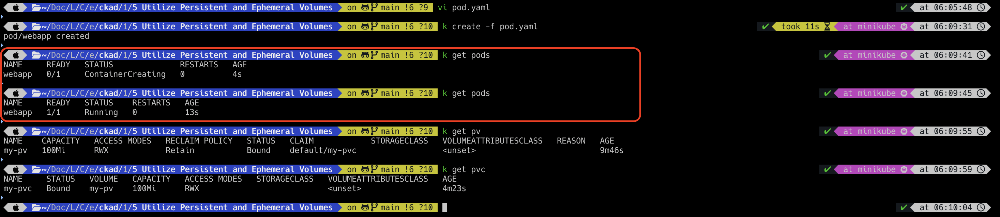

If we delete pvc, it will not delete it as it was used by pod.

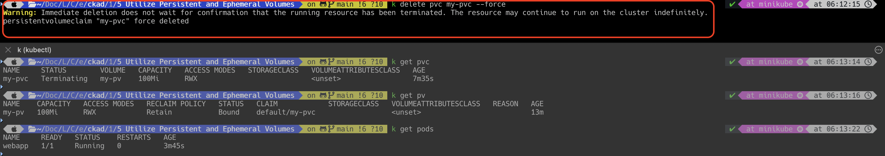

If you delete the pod, then pvc will be deleted.

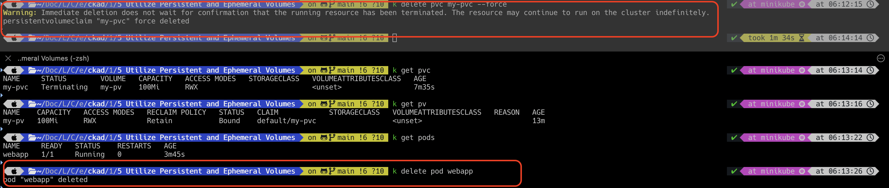

However, pv is still available as the claim policy is mentioned as `Retain`. 

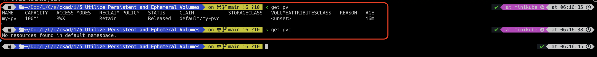

### Volume Claim Policy

| **Claim Policy** | **Description**                                                   |
|------------------|-------------------------------------------------------------------|
| Retain           | PV is not getting deleted. But PV cannot be used for other claims |
| Delete           | PV will be deleted once PVC is deleted                            |
| Recycle          | PV is not getting deleted. But PV can be used for other claims    |


### Storage Class

So far, whenever we need storage, we are creating the persistent volume manually and then use it in persistent volume claim.
This is known as static provisioning.
Before creating pv, we need to create a disk in the host machine or in the cloud.

However, it can be done during runtime as well.
To do so, we need storage class.
Storage class will create pv automatically when we are running the application which requires storage.
After creating pv, it will attach it with pvc when the claim is made.
This is known as dynamic provisioning.

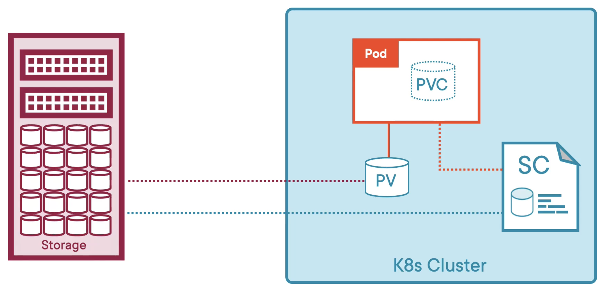

```html
apiVersion: storage.k8s.io/v1
kind: StorageClass
metadata:
  name: my-sc
    provisioner: kubernetes.io/no-provisioner
reclaimPolicy: Retain 
allowVolumeExpansion: true
volumeBindingMode: WaitForFirstConsumer
```

`volumeBindingMode` has two options.
1. WaitForFirstConsumer—This will wait for pod being created and consumed the pv via claims
2. Immediate—This will immediately create pv and will not wait for pod to be created.


