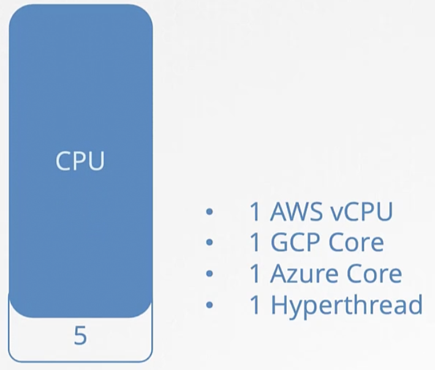
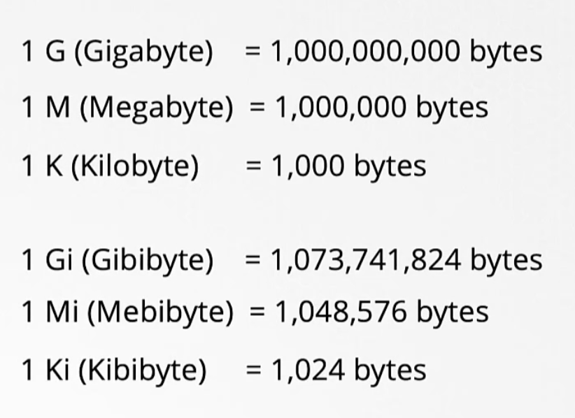
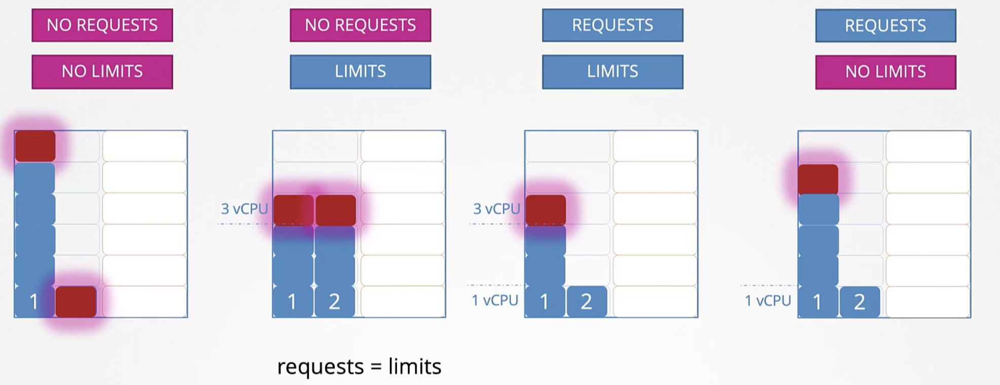
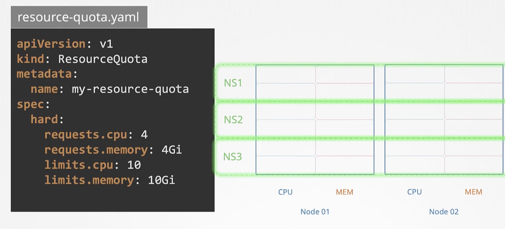

# Request Requirements


When we create the pod in the cluster,
kube-schedule decides where (in the node)
the pod should be placed based on the resource availability in the node and how much resources need for pod.
If the node doesn't have enough resources available,
then the pod will not be placed in the node and the pod will be in pending status.

### Requests (Estimated Resources Needed)

This is nothing but how much resources (CPU and memory) needed for a pod to run well.
This is a guaranteed amount of resources for a pod.
This is just an educated guess, and we cannot exactly tell how much resources it required.
But node should have more resources than what we are requesting for pod.

### Limits (Maximum Resources Needed)
This is nothing but how much resources (CPU and memory) go in case of more resources required for a pod to run well.
This is a maximum amount of resources allocated for a pod.

`request.yaml`

```html
apiVersion: v1
kind: Pod
metadata:
  name: frontend
spec:
  containers:
  - name: app
    image: images.my-company.example/app:v4
    resources:
      requests:
        memory: "64Mi"
        cpu: "250m"
      limits:
        memory: "128Mi"
        cpu: "500m"
```

1 cpu means 1 virtual cpu core. The value is from 0.1 to go any number. `0.1` means 100m (100 milli).



Similarly, memory values are below



If the pod goes beyond the limit mentioned, then the pods will be crashed.



`Remember that limits and requests are tied with pods (container).`

### Limit Range

This kubernetes object will ensure that the pod will get minimum resources by default in the specific namespace.

`limit-range.yaml`

```html
apiVersion: v1
kind: LimitRange
metadata:
  name: cpu-resource-constraint
spec:
  limits:
  - default: # this section defines default limits
      cpu: 500m
    defaultRequest: # this section defines default requests
      cpu: 500m
    max: # max define the limit range
      cpu: "1"
    min: # max define the request 
      cpu: 100m
    type: Container

```

### Resource Quota

Resource quota sets the limits and requests for namespace level.
You can decide how much resources required for a namespace and how many pods can run in the namespace, etc.



`resource-quota.yaml`

```html
apiVersion: v1
kind: ResourceQuota
metadata:
  name: mem-cpu-demo
spec:
  hard:
    requests.cpu: "1"
    requests.memory: 1Gi
    limits.cpu: "2"
    limits.memory: 2Gi
    pods: "10"
```

