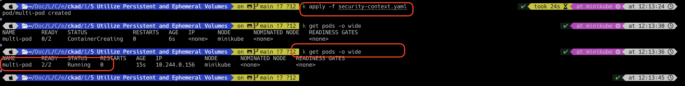

# Security Context

Security contexts provide additional privileges and access control settings.
You can configure the security context settings either the container level or the pod level.
If you configure it in the pod level,
then the security context setting is applicable to all the containers inside the pod.
If you configure it in the container level,
then the security context setting is applicable only to the container.
In case if you configure it in both the pod and container level,
then the security context setting is set in the container level has the high priority than the pod level.


### Security Context Options

<ol>
<li>UID/GUID setting - We can run the container or pod with a specific user id or group id</li>
<li>Privilege escalation - We can ensure that the container or pod is working as a root user or non-root user.</li>
<li>Filesystem setting - We can ensure that the container or pod has access to a certain file system.</li>
<li>Linux Capabilities - We can either add or drop linux capabilities to the pod or container.</li>
</ol>

`security-context.yaml`

```html
apiVersion: v1
kind: Pod
metadata:
  name: multi-pod
spec:
  securityContext:
    runAsUser: 1001
    runAsGroup: 1005
    fsGroup: 2000
  containers:
  -  image: ubuntu
     name: web
     command: ["sleep", "5000"]
     securityContext:
      runAsUser: 1002

  -  image: ubuntu
     name: sidecar
     command: ["sleep", "5000"]
```

In the above manifest file, container `web` will run as user `1002` whereas the container `sidecar` will run as user `1001`.
If we want to add or drop linux capabilities,
then we can add them in the manifest file either in the container level.

`Remember that capabilities supports only the container level and not the pod level`

`security-context.yaml`

```html
apiVersion: v1
kind: Pod
metadata:
  name: multi-pod
spec:
  securityContext:
    runAsUser: 1001
    runAsGroup: 1005
    fsGroup: 2000
    fsGroupChangePolicy: OnRootMismatch
  containers:
  -  image: ubuntu
     name: web
     command: ["sleep", "5000"]
     securityContext:
      runAsUser: 1002
      capabilities:
        add: ["NET_ADMIN"]
        drop: ["SYS_TIME", "MAC_ADMIN"]

  -  image: ubuntu
     name: sidecar
     command: ["sleep", "5000"]
     securityContext:
      runAsNonRoot: true
```




