#Services

Remember below points
- In k8s, every pod has its own IP address
- Containers within the pod communicates over the localhost

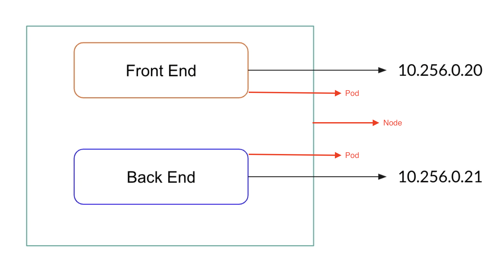

As both pods are in same node, Front end pod will access the backend pod using backend pod's IP. What happens if the backend 
pod was terminated due to some reasons? As you know k8s will recreate the backend pod in case of termination. However, when it
is recreated, the IP of the backend pod will change.

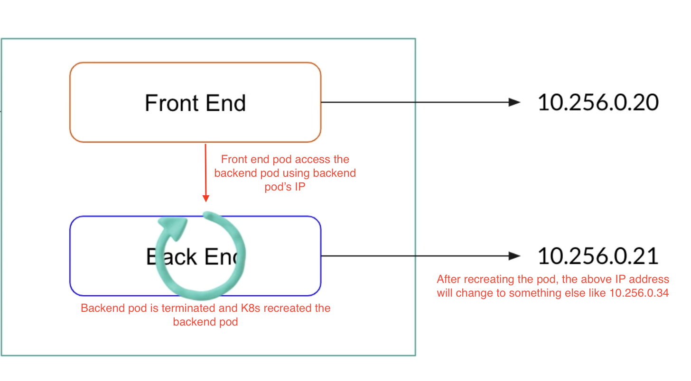

So, you need to update backend IP details in the frontend pod configuration everytime whenever backend pod restarts. Else, 
you will get 404 error.

In case of multiple backend pods need to be connected from front end pod, how do we configure front end pod?
Also, if we enable autoscaling based on load, backend pods will be created and destroyed based on load. In that case, how do we 
configure front end pod to access backend pods?

To answer above questions, the solution is service.

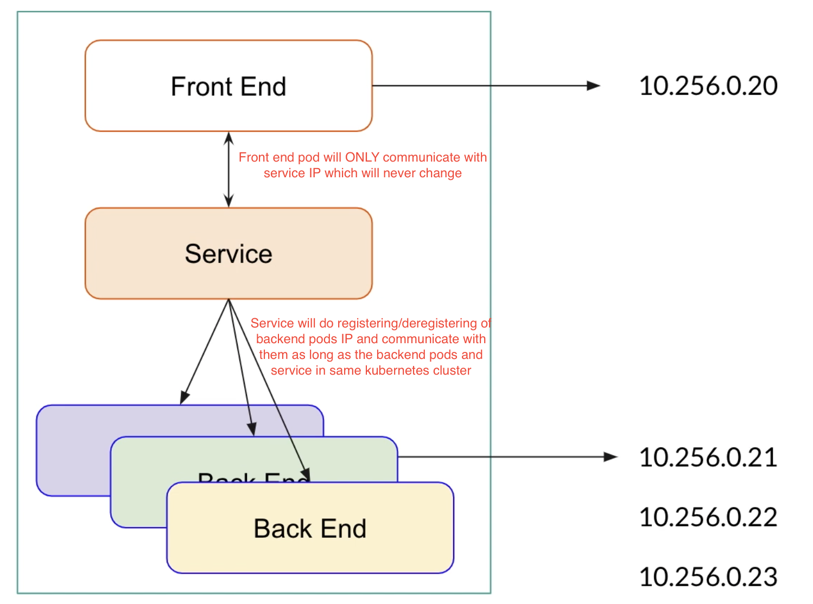

So
- Service provides single IP or DNS through which pods can be accessible.
- Services allow performing operations like load balancing and scaling.

```html
apiVersion: apps/v1
kind: Deployment
metadata:
  name: nginx-deployment-1.0
  labels:
    app: nginx-1.0
    env: prod
spec:
  replicas: 1
  selector:
    matchLabels:
      app: nginx-1.0
  template:
    metadata:
      labels:
        app: nginx-1.0
    spec:
      containers:
        - name: nginx
          image: nginx:1.19
          ports:
            - containerPort: 80
```
```html
apiVersion: apps/v1
kind: Deployment
metadata:
  name: nginx-deployment-1.1
  labels:
    app: nginx-1.1
    env: prod
spec:
  replicas: 3
  selector:
    matchLabels:
      app: nginx-1.1
  template:
    metadata:
      labels:
        app: nginx-1.1
    spec:
      containers:
        - name: nginx
          image: anshuldevops/magicalnginx:latest
          ports:
            - containerPort: 80
```
```html
apiVersion: v1
kind: Pod
metadata:
  name: access-pod
spec:
  containers:
    - name: access-pod-container
      image: ubuntu:latest
      command: ["sh", "-c", "sleep 3600"]
```

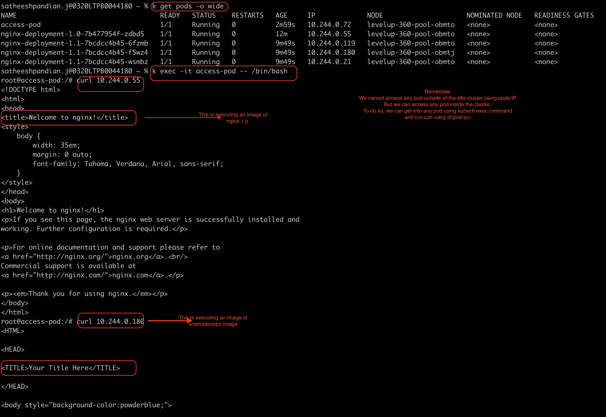

Remember
- We CANNOT access any pod outside the cluster
  - To access any pod, we need to get into another pod in the cluster and run the curl command like
   
     ```curl POD IP ADDRESS```

```html
apiVersion: v1
kind: Service
metadata:
  name: my-service
spec:
  ports:
    - protocol: TCP
      port: 8080       -----------> Listening Port (service is getting request port 8080 from frontend)
      targetPort: 80   -----------> Forwarding Port (service is connecting/redirecting pod's port 80 here and pod process the request)
```

We created a service now. However, our service doesn't know which pod it needs to connect. To find out which pod it needs to connect,
we can create end point.

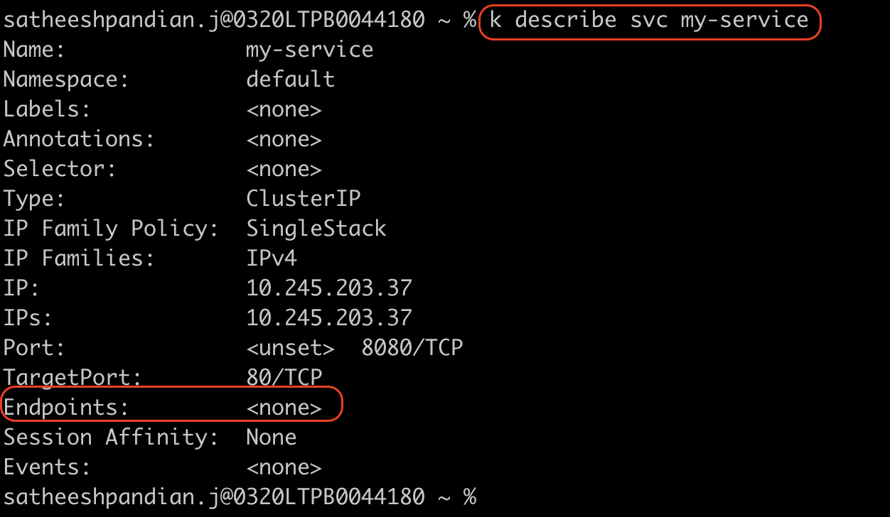

```html
apiVersion: v1
kind: Endpoints
metadata:
  name: my-service -----> This is how endpoint find which service it needs to connect
subsets:
  - addresses:
      - ip: 10.244.0.119 -----> POD 1 IP
      - ip: 10.244.0.180 -----> POD 2 IP
      - ip: 10.244.0.21  -----> POD 3 IP
    ports:
      - port: 80
```
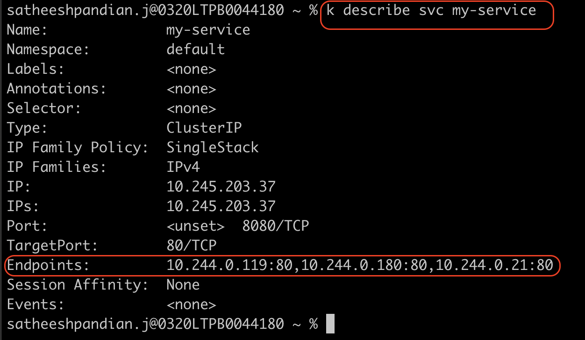

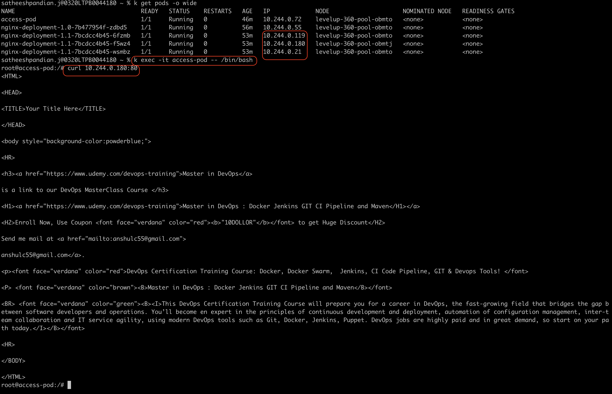


###Service Types

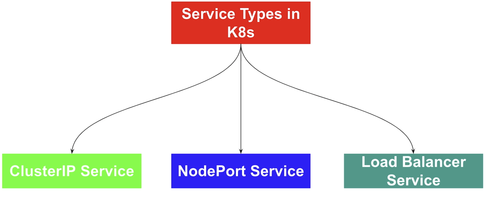

#### Cluster IP (Default type)
- When you create a cluster Ip type service, it can be access ONLY within the cluster. You CANNOT access outside cluster.
- In cluster IP service, internal ip address automatically assigned to the service. As it is an internal IP, outside traffic
will be unable to access this service.

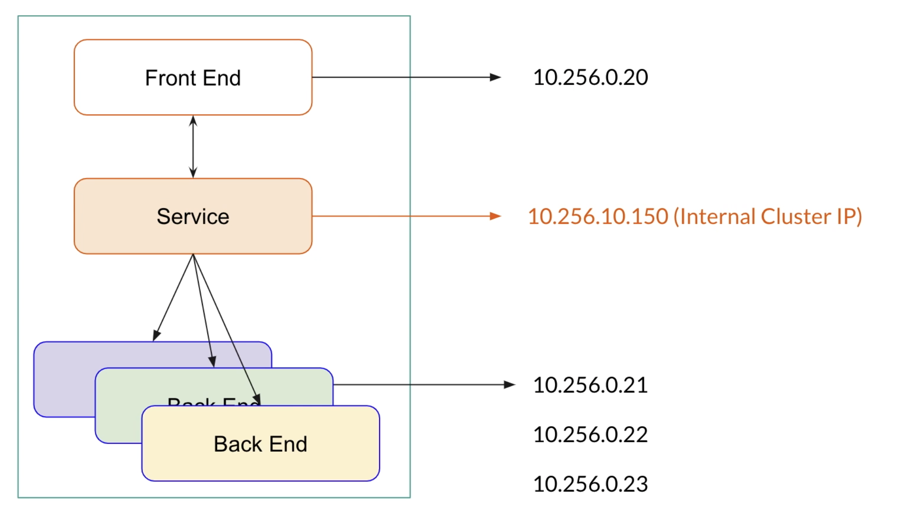

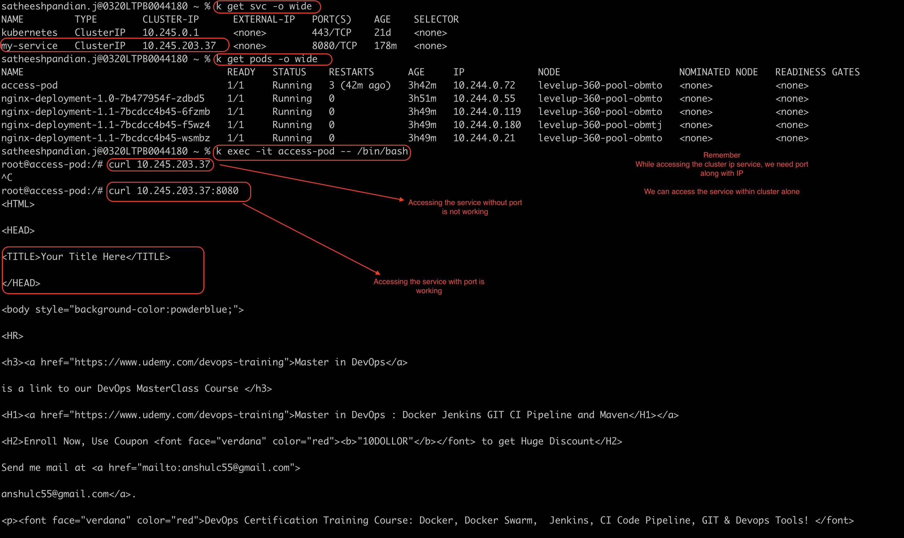

Remember, if you DON'T want to expose your pods to outside world, then use CLUSTER IP service.

#### NodePort
- When you create a node port type service, you have to specify the type property as "NodePort".
- When you create a node port type service, it can be accessed  outside cluster as well.
- Node port type service will create cluster IP type service automatically to access the pods within the cluster.
- Node port type service will open the port on the worker node. It exposes the service on each node's ip at a static port.
- User will be connected the service using <node ip>:<node port> from outside cluster.
- By default, k8s control plane allocate the port ranges from 30000 to 32767.

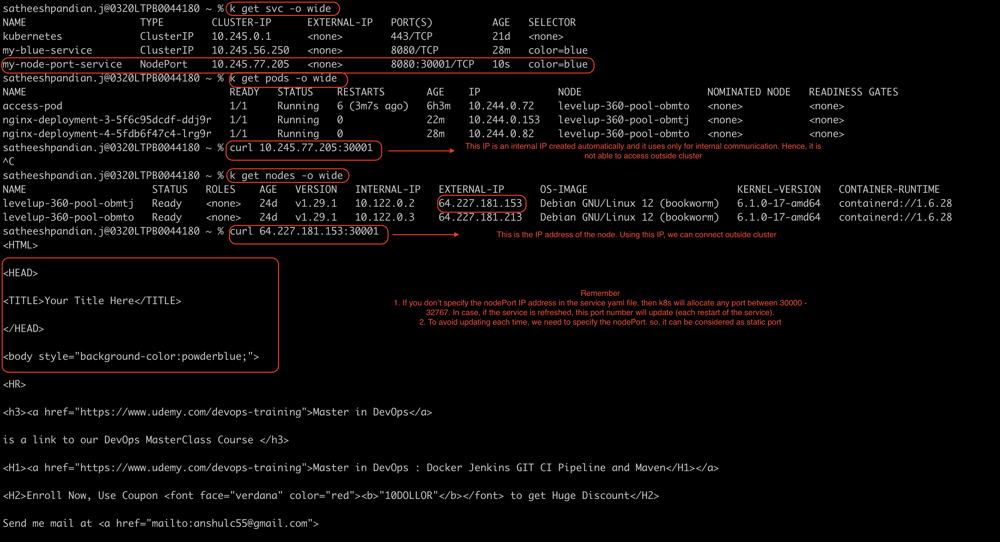

#### Load balancer
- Whenever you create a load balancer type service, k8s automatically create load balancer and attach it to the ports.
- It is quite expensive. To avoid more expenses, create single load balancer service and create multiple ingress and attach the ingress to the load balancer .

### Dynamic endpoints using selectors

Service can connect the pods using selectors. In this case, we don't need to create endpoints manually.

```html
apiVersion: apps/v1
kind: Deployment
metadata:
  name: nginx-deployment-3
  labels:
    app: nginx-3
spec:
  replicas: 1
  selector:
    matchLabels:
      color: blue
  template:
    metadata:
      labels:
        color: blue
    spec:
      containers:
        - name: nginx
          image: nginx:1.19
          ports:
            - containerPort: 80
```

```html
apiVersion: apps/v1
kind: Deployment
metadata:
  name: nginx-deployment-4
  labels:
    app: nginx-4
spec:
  replicas: 1
  selector:
    matchLabels:
      color: blue
  template:
    metadata:
      labels:
        color: blue
    spec:
      containers:
        - name: nginx
          image: anshuldevops/magicalnginx:latest
          ports:
            - containerPort: 80
```

```html
apiVersion: v1
kind: Service
metadata:
  name: my-blue-service
spec:
  selector:
    color: blue
  ports:
    - protocol: TCP
      port: 8080
      targetPort: 80
```

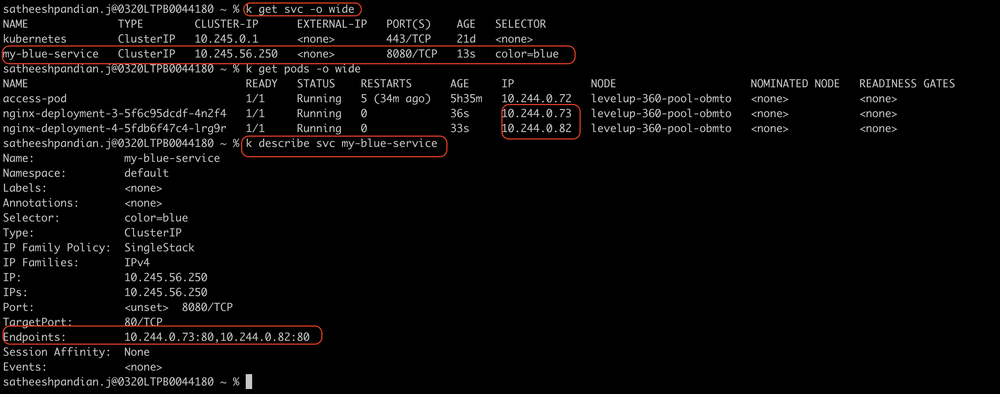

In the above case, we didn't create any end points for the services. However, it is picked the pod's ip address based on the selector.
If we are increasing the replicas of the pods, still service picks pod's ip address automatically.

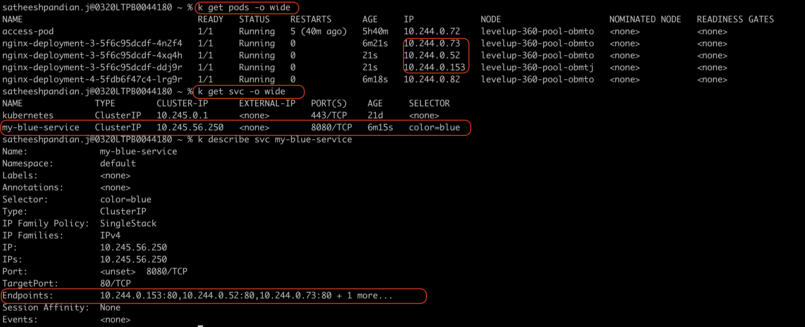


